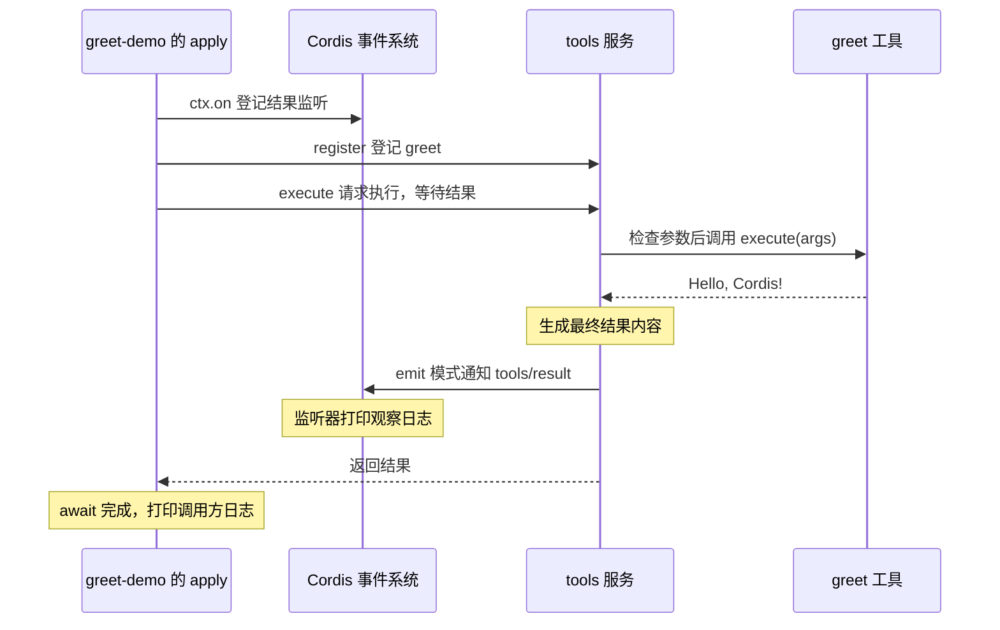

```mermaid
sequenceDiagram
    participant P as greet-demo 的 apply
    participant E as Cordis 事件系统
    participant T as tools 服务
    participant G as greet 工具
    P->>E: ctx.on 登记结果监听
    P->>T: register 登记 greet
    P->>T: execute 请求执行，等待结果
    T->>G: 检查参数后调用 execute(args)
    G-->>T: Hello, Cordis!
    Note over T: 生成最终结果内容
    T->>E: emit 模式通知 tools/result
    Note over E: 监听器打印观察日志
    T-->>P: 返回结果
    Note over P: await 完成，打印调用方日志
```
