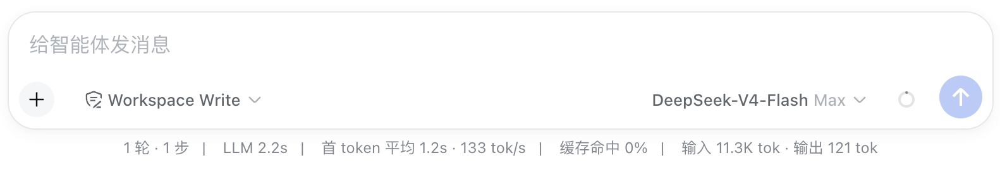
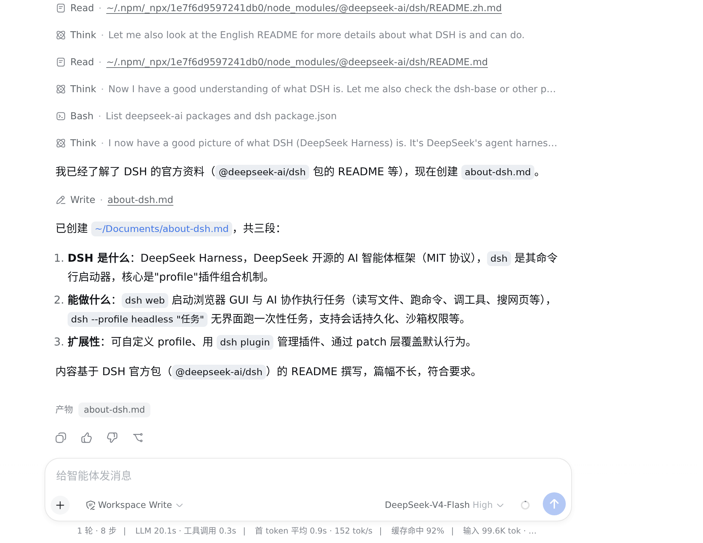
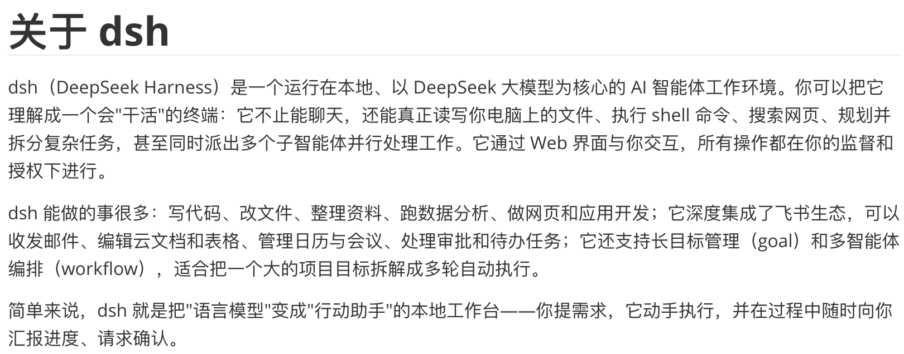
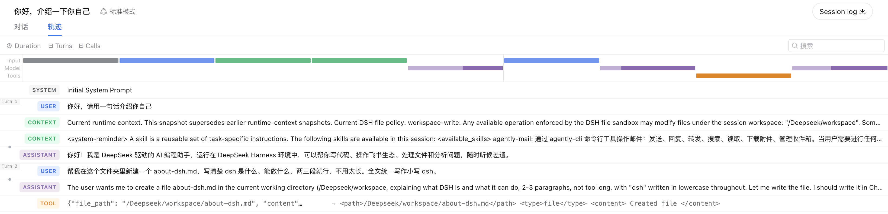

# 初识 dsh {#ch-1}

本章从一次完整的 dsh 使用过程开始。我们将先完成 dsh 的安装与 DeepSeek 模型配置，再让它在工作区中创建一个文件，并通过文件内容和执行轨迹查看这次任务实际发生了什么。

## 安装 dsh 并接入模型 {#sec-1-1}

### 准备 Node.js

dsh 基于 Node.js 运行，因此在启动之前，先确认本机的 Node.js 环境。打开终端，运行：

```
node -v
```

终端会输出当前安装的 Node.js 版本。dsh 支持 22.19 及以上的 22.x 版本，以及 24 或更高版本；23.x 版本不在支持范围内。

如果终端提示找不到 `node`，或者当前版本不符合要求，可以前往 [Node.js 官网](https://nodejs.org/)安装 LTS 版本。安装完成后重新打开终端，再运行一次 `node -v`，确认新的版本已经生效。

### 启动 dsh

Node.js 环境准备好后，就可以启动 dsh。在终端运行：

```
npx -y @deepseek-ai/dsh web
```

第一次运行时，`npx` 会从 npm 获取 dsh，因此可能需要等待片刻。启动成功后，终端会打印 dsh Web 界面的访问地址，通常类似于：

```
dsh web: http://127.0.0.1:3080
```

在浏览器中打开这个地址，即可进入 dsh 主界面。

### 接入 DeepSeek

dsh 启动后，还需要为它配置可调用的模型。本章使用 DeepSeek 作为模型提供方。

打开“设置”，进入“模型”页面并选择 DeepSeek，将从 DeepSeek 官方平台创建的 API 密钥填入对应位置，然后点击“保存”。

{width=68%}

保存后，页面不会继续显示密钥明文。到这里，dsh 已经完成了模型配置，但配置成功并不意味着模型一定能够正常调用：密钥是否有效、网络是否连通，还需要通过一次真实请求来确认。如果之后需要更换密钥，回到同一页面重新填写并保存即可。

### 完成第一次调用

在开始真正的任务之前，我们先发送一条简单消息，确认从 dsh 到 DeepSeek 的调用链路能够正常工作。

回到会话页面，点击“选择工作区”，选择一个允许 dsh 读写的文件夹。dsh 的文件操作都围绕工作区进行，因此确定工作区后，会话输入框才会启用。

本章选择 DeepSeek-V4-Flash，并将推理等级设置为 Max，然后发送：

> <span class="prompt-title">提示词内容：</span>
>
> 你好，请用一句话介绍你自己

稍等片刻，页面会显示模型返回的回复。回复上方还能看到“上下文注入”和“Think”等记录，它们反映了模型在生成最终回复之前接收到的上下文和推理过程。本章后面分析执行轨迹时，再具体查看这些信息。

{width=65%}

除了回复内容，输入框下方的状态栏还记录了这次调用的基本信息，包括当前访问模式、所用模型、推理等级、耗时和 token 用量等。

{width=70%}

此时，只要模型能够正常返回回复，就说明 dsh 已经可以通过当前配置访问 DeepSeek。若 API 密钥无效或网络连接失败，页面则会显示相应的错误信息。

## 让 dsh 完成第一个任务 {#sec-1-2}

刚才的一句话对话只能说明模型能够正常调用。接下来，我们让 dsh 真正操作一次工作区，看看它如何从一条自然语言指令出发完成文件任务。

在刚才的会话中发送：

> <span class="prompt-title">提示词内容：</span>
>
> 帮我在这个文件夹里新建一个 about-dsh.md，写清楚 dsh 是什么、能做什么，两三段就行，不用太长。全文统一写作小写 dsh。

这条指令明确了要创建的文件、需要包含的内容，以及篇幅和写法。收到任务后，dsh 调用 `Write` 工具，在当前工作区中创建 `about-dsh.md`。任务结束后，会话中会出现执行结果的摘要，页面底部的“产物”区域也会列出刚刚生成的文件。

{width=60%}

此时 dsh 已经报告任务完成，但这只是模型对执行结果的描述。文件是否真的创建成功、内容是否符合要求，还需要直接检查实际产物。

## 核对结果与执行轨迹 {#sec-1-3}

### 检查生成文件

点击“产物”区域中的 `about-dsh.md`，可以直接在页面中打开刚刚生成的文件。

对照最初的要求，可以看到文件名为 `about-dsh.md`，正文共三段，内容介绍了 dsh 是什么以及能够完成哪些工作；标题和正文中的 `dsh` 也都采用了小写形式。

{width=68%}

直接查看文件，可以确认最终结果是否符合要求。但如果想知道 dsh 在收到指令之后具体做了什么，还需要进一步查看这次任务的执行轨迹。

### 查看执行轨迹

回到会话顶部，切换到“轨迹”标签。轨迹页面按照执行顺序记录了一次会话中的主要事件，包括系统提示、用户输入、注入的上下文、模型输出以及工具调用。

{width=100%}

第一次接触轨迹时，不必逐行查看所有内容。对于刚才的文件任务，可以先找到 `Turn 2` 中的 `USER` 记录，确认任务从哪条用户指令开始；随后向下找到 `TOOL` 记录，就能看到 dsh 调用的 `Write` 工具，以及传入的参数和执行结果。

通过这种方式，可以把最终回复与实际执行过程对应起来。如果之后遇到文件内容与回复不一致、工具调用失败等问题，也可以沿着同样的顺序定位具体发生异常的步骤。

如果需要保留完整的执行记录，可以点击会话顶部的“Session log”导出日志。除此之外，dsh 还会将会话及其轨迹保存在 `$DSH_HOME/sessions/` 目录中。因此，再次启动 `dsh web` 时，原有会话仍会出现在对应的工作区中；只有更换 `DSH_HOME`，或者清理其中的会话数据后，这些历史记录才不会继续显示。
