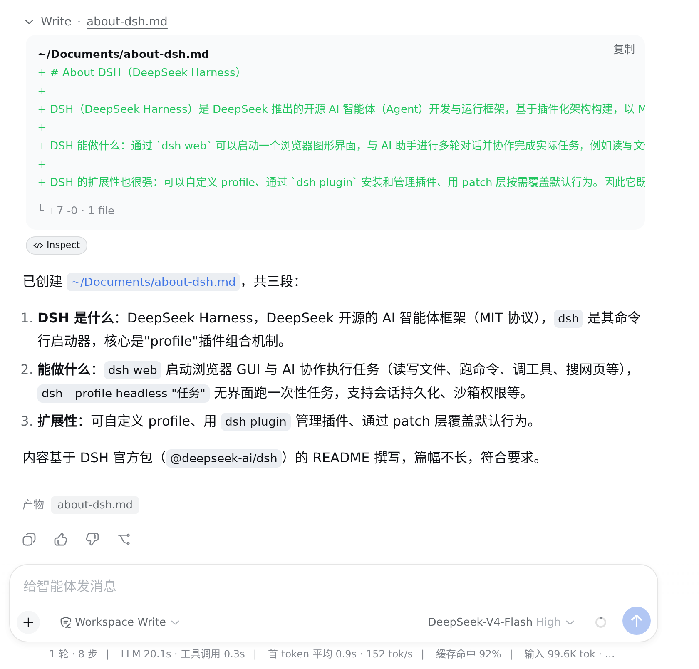

# 初识 dsh {#ch-1}

## 安装 dsh 并接入模型 {#sec-1-1}

这一节要做两件事，把 DSH 装到本机，再把模型接通。全程只需要一台装了 Node.js 的电脑和一个 DeepSeek 官方的 API 密钥；最容易卡住的地方是 Node.js 版本太旧，还有保存密钥之后没去验证模型是不是真的能回话，这两步下面会分别讲清楚。

### 准备 Node.js 环境

先确认 Node.js 装好了。打开终端运行 `node -v`。DSH 要求 22.19 或更高的 22.x 版本，或者 24 及以上版本，23.x 这种单数的过渡版本不满足要求。如果版本不够，或者提示命令不存在，就去 nodejs.org 下载官网首页默认推荐的 LTS 安装包，按提示装完。Node.js 的 LTS 版本号固定是双数，18、20、22、24 这些，版本也总是新过 22.19，装官网默认给的这个不会踩坑。装完重新打开一个终端窗口，再跑一次 `node -v`，确认能打印出版本号。

### 安装并启动 DSH

环境装好之后，在终端运行这一行命令。

```sh
npx -y @deepseek-ai/dsh web
```

第一次执行会先从 npm 下载 DSH，等它跑完，终端会打印出一行访问地址，形如 `dsh web: http://127.0.0.1:3080`。用浏览器打开这个地址，就进到了 DSH 的 Web 界面。

首次打开会先看到一条内测声明，说明 DSH 目前所处的开发阶段，点击“继续”就行。

{width=82%}

### 接入 DeepSeek 官方模型

因为还没有配置任何模型，点掉内测声明之后，DSH 会直接弹出一个添加密钥的对话框，把开始使用之前必须做的这一步摆到台面上。

{width=82%}

去 DeepSeek 官网（deepseek.com）申请一个 `sk-` 开头的 API 密钥，粘贴进输入框，点击“保存并继续”。密钥只在这一次输入的时候可见，存进去之后 DSH 不会再把它显示出来，界面上只剩一句“已配置过”的提示，后面的任何截图里也不会出现明文。保存成功后会回到主界面，这时候还没有选工作区，输入框是禁用状态。

想再确认一次，点击左下角“设置”，切到“模型”标签，DeepSeek 卡片旁边会出现一个绿点。

{width=84%}

这个绿点的意思是“这一项已经配置过密钥”，不是“密钥验证通过了”——存错了 DSH 在这一步也不会拦你。真正的验证要等下一步真的问模型一句话。点一下卡片右边的“编辑”，密钥输入框只会显示一行“已配置——输入新值可替换”，输入新值就能覆盖，已经存进去的那串明文不会再吐出来。

{width=84%}

### 确认模型真的能回话

密钥配置好，不代表这一路真的通了，还要让 DSH 真的调用一次模型，收到回复，才算验证完成。点击“选择工作区”，弹出的目录列表从主目录开始，随便选一个已有的文件夹，这里选的是 Documents，DSH 会把它设为当前会话的工作目录，输入框这才会被激活。

{width=78%}

在输入框里打一句“你好，请用一句话介绍你自己”，回车发送。

几秒钟后，DeepSeek-V4-Flash 会给出真实的回复。回复上方的“上下文注入”和“Think”是模型收到的系统提示词和它自己的思考过程，具体是什么、为什么会有这两行，第二部分讲 DSH 原理时再细说，这里只要知道回复是真实生成的就行。窗口最底部、输入框下方那行状态栏才是重点，这次对话转了几轮几步、模型算了多久、首个字出现要多久、每秒吐多少 token、消耗了多少输入和输出 token，都列在那一行里。这行数据就是请求真的打到了 DeepSeek 官方接口、模型真的算了一遍的证据，密钥存错或者网络没通，是走不到这一步的。

{width=86%}

看到这行回复和统计数据，就说明 DSH 已经装好，模型也接通了，默认可用的模型还有 `deepseek-v4-pro`。下一节让它去做一件有产出的任务。

## 交给 dsh 第一个任务 {#sec-1-2}

接着上一节选好的 Documents 工作区，这一节给 DSH 布置第一个真正的任务，不再是打招呼这种试探性的问题。判断它做没做到位，标准很直接，任务完成之后，工作区里要真的多出一个文件，内容也要对得上要求。

在输入框里打一句“帮我在这个文件夹里新建一个 about-dsh.md，写清楚 DSH 是什么、能做什么，两三段就行，不用太长”，回车发送。

DSH 收到任务后没有直接动笔。它先跑了一次 `pwd && ls -la`，确认自己站在哪个目录、目录里已经有什么；接着又去把 DSH 自己的 README 翻了一遍，把“DSH 是什么、能做什么”这件事核对清楚，才开始写文件。消息流里那一长串 Bash、Read、Think 就是这个过程，动笔之前它还专门说了一句“我已经了解了 DSH 的官方资料……现在创建 about-dsh.md”。一句话的任务，它拆成了八步。先看后动手，还是张口就来，这个区别下一节会用得上。文件写完，回复末尾挂着一个“产物”标签，标着这次任务生成的文件名。

{width=82%}

“产物 about-dsh.md”这个标签是 DSH 在说，这次任务确实新增了这个文件，不是聊天框里客套两句就算完事。它往里面具体写了什么、有没有动别的地方，下一节接着核对。

## 分析 dsh 的执行轨迹 {#sec-1-3}

光看聊天回复不够，DSH 到底做了什么，要去它实际执行的工具调用里核对。这一节接着上一节创建 `about-dsh.md` 的任务，看看怎么把这一步查清楚。

点击消息流里“Write · about-dsh.md”这一行，也就是页面下方提示的“点击消息流中的工具行查看详情”，会展开一份完整的差异记录，新建了这个文件，加了 7 行、改了 1 个文件，下面还附着实际写进去的全部内容。DSH 在聊天里说自己写了三段，这里可以逐字核对它是不是真写了三段，而不是只报个数字了事。

{width=68%}

打开这份差异能看到，DSH 确实写出了三段像样的文字，第一段说 DSH 是什么，第二段说能做什么，第三段说它的扩展性，跟它在聊天里报的摘要对得上。真实的文件内容是这样开头的。

```md
# About DSH（DeepSeek Harness）

DSH（DeepSeek Harness）是 DeepSeek 推出的开源 AI 智能体（Agent）开发与运行框架，基于插件化架构构建，以 MIT 协议发布。
```

上一节它跑去翻 README 这件事，价值在这里就看出来了：文里那句“以 MIT 协议发布”不是它自己编的，是刚才那几步真的读出来的。

更底层的记录在旁边的“轨迹”标签里，那是完整的原始执行日志，每一步用了哪个模型、花了多久、每次工具调用完整的参数和返回值都摊开在那里，排查问题的时候比对话界面直接得多。对话最上方还有一个“Session log”按钮，能把整段记录导出成文件，方便事后核对或者存档。

以后不管 DSH 做了什么任务，习惯性地展开一下它动过的工具调用，看看改动是不是真的对得上要求，比只读聊天回复靠谱得多。这个检查习惯，后面的实战章节会一直用到。
