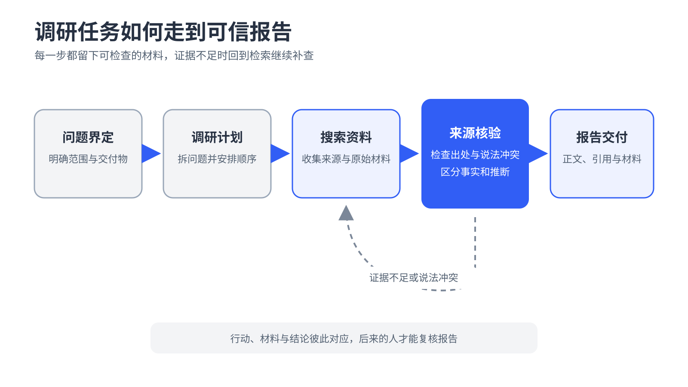
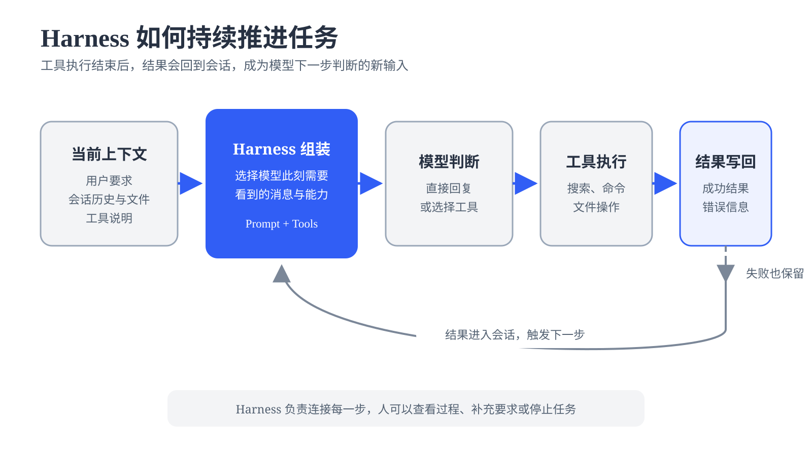
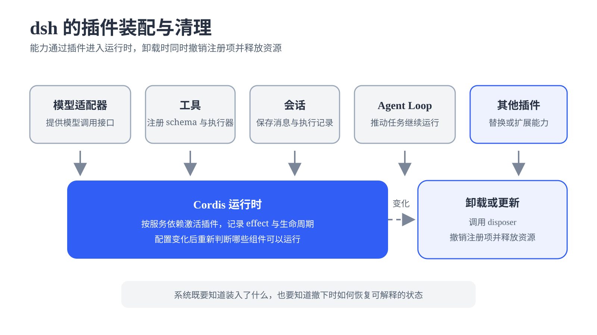
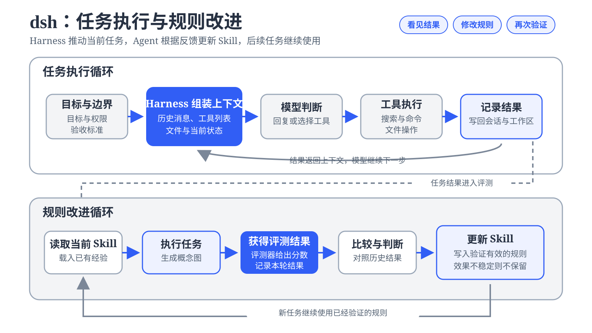

# 让 Agent“活”起来 {#ch-1}

## 从一份调研任务说起 {#sec-1-1}

假设你要让 AI 完成一份可信的深度调研报告。题目只有一句话，交付物却远不止一段回答。它得先弄清问题，列出计划，搜索和筛选资料，核对来源，再把材料与结论写进文件。中途发现关键证据不足，还要回头补查；两份资料说法冲突，要继续追到原始出处。等报告写完，引用和过程也得留得住，方便后来的人复核。

{width=92%}

直接向聊天模型提问，也能很快拿到一篇文字。真正用于工作的报告，还要回答另外几件事：它查过哪些来源，为什么相信其中一份，哪条结论只是推断，生成的文件放在哪里，后续追问能不能接着原来的材料往下做。问题一旦走到这里，单次问答就显得太短了。

大模型擅长理解要求、推理和生成内容。每次请求到来时，它只会处理系统交给它的消息、说明和工具。搜索网页、运行命令、读写文件、等待后台任务，这些动作都要由外部程序执行。动作结束后，结果还得重新送回模型，它才知道刚才那一步成功了没有。

于是，一项调研任务会形成一条很具体的行动链：模型先提出检索词，搜索工具返回网页；模型读取其中几篇，发现一项数字缺少原始出处；它换一组关键词，找到发布机构的报告，再把可信材料整理进工作区。写作时若发现某一节仍缺证据，它还能从当前进度退回检索。这里没有神秘的一跃，只有很多个前后相接的小判断。

这条行动链也改变了“完成”的含义。报告文件已经生成，引用链接可以打开，关键数字能在原始材料中找到，这些都是可以核对的结果。模型说“我完成了”只是一条消息，不能代替文件和证据。Harness 要把任务要求、工具结果和交付物放在同一段过程里，用户才有条件判断它究竟走到了哪一步。

**当模型围绕同一个目标反复判断，调用工具执行动作，再根据结果决定下一步时，这个工作单元通常称为智能体（Agent）**。负责组织整个过程的系统称为 Agent Harness，也就是智能体运行与组织系统。模型负责眼前的判断，Harness 把上下文、工具、文件和执行结果接起来，让任务不至于在一次模型调用结束时戛然而止。

这也是本书所说“活起来”的第一层含义。它不表示软件有了意识，也不表示模型突然无所不能。更准确的说法是，模型开始处在一个持续变化的工作环境里：它能看见行动留下的结果，能根据结果修正路线，也能把阶段性成果交给下一步继续使用。

模型在这套系统里仍然只负责一次次局部判断。它不会天然记住上周的任务，也不能凭一句提示词获得系统权限。连续性来自 Harness 对状态的保存和重建，行动能力来自已经接入的工具，边界则来自工作区、沙箱与审批。把这些责任分开，后面遇到问题时才知道该查模型、工具，还是运行环境。

## Harness 怎样让任务继续推进 {#sec-1-2}

一轮任务开始时，Harness 会组装模型此刻需要看到的内容。里面有用户要求、会话历史、系统说明，以及工具的名称、用途和参数格式。模型可以直接回答，也可以发出工具调用。Harness 校验这次调用，交给相应工具执行，再把成功结果或错误信息写回会话。模型读到新结果后，决定继续调用工具，还是结束这一轮。

{width=92%}

失败同样是结果。搜索没有命中，命令返回报错，文件路径写错，模型都应该收到明确反馈。它可以缩小关键词、改用另一个来源、修正命令，也可以承认现有条件不足，请人补充信息。Harness 不能保证每次判断正确，但它能把错误放回任务过程里，使下一步有机会纠正，而不是让失败悄悄消失。

长任务还需要一个会话之外的落脚处。 研究材料、代码和草稿可以保存在工作区，下一轮再读；会话日志记下用户消息、模型回复、工具调用与工具结果，界面或其他程序可以据此恢复进度。dsh 的轮次里，一次模型请求及其工具调用构成一个步骤，一轮可以包含多个步骤。只要工具结果又产生了待处理工作，Agent 就能继续向前。

dsh 把持久事实和运行中的状态分开记录。用户消息、模型回复、工具调用、工具结果与轮次边界会进入会话事件，重新打开页面后仍可回放。Agent 当前是空闲、执行中，还是正在领取一条追加消息，属于实时事件。前一类回答“发生过什么”，后一类帮助界面和扩展处理“现在正在做什么”。这种区分让恢复会话不必复活一份早已过期的运行状态。

会话很长时，Harness 也不能把全部历史原样塞给模型。它会从日志中派生本次请求需要的消息，必要时裁剪体积过大的工具结果，或者把较早内容压缩成摘要。原始事件仍留在记录中，模型眼前看到的上下文则控制在窗口之内。上下文管理若做得含糊，Agent 可能忘掉限制条件，或者把旧结果当成当前状态。第 14 章会用消息与事件把这一过程拆开来看。

这套记录还有一个实际用处：让过程可以检查。看到一份生成的报告时，用户能够回看 Agent 用过什么工具，文件发生过哪些变化，结论从哪里来。如果结果偏离要求，人可以在中途补一句限制，或者直接停下来调整方向。对于耗时较长的任务，这种可见性往往比一段措辞漂亮的最终回复更重要。

人仍然承担关键责任。目标和工作范围由人设定，敏感操作需要人授权，来源、文件与最终结果也要由人验收。沙箱、权限和审批能限制工具在哪些地方行动，却不能替人判断一封邮件该不该发、一项市场结论是否足以支持投入。**Harness 让 Agent 做得更多，也要让这些行动落在可以观察和控制的范围内。**

因此，好的 Harness 不能只追求任务跑得久。它还要让人看得见当前状态，能够在关键动作前停住，在方向变化时追加要求，并在必要时终止任务。持续执行只有和可观察、可介入放在一起，才适合进入真实工作。

## dsh 把能力放进插件 {#sec-1-3}

dsh（DeepSeek Harness）是一套在本地运行的开源 Agent Harness。接入模型并选择工作区后，用户可以让它调用工具、读写文件，也能从会话记录和执行轨迹中查看它实际做过什么。运行中的 dsh 由一棵插件树组成，具体装入哪些能力，由 profile、组合包和用户配置共同决定。

{width=92%}

**dsh 有一个很鲜明的设计选择：模型适配器、工具注册表、会话日志、沙箱和推动任务前进的 Agent Loop，都通过插件进入 Cordis 运行时。** 新的模型提供方可以接到统一接口后面，文件系统和进程执行可以换成另一种实现，工具与策略也能挂在已有流程上。连 Agent Loop 本身都没有被当成不可替换的特殊内核。

“一切皆插件”听起来很轻巧，卸载却很费心。一个工具插件加载后，可能注册了工具说明和事件监听器，启动了后台任务，还借用了另一个插件提供的文件系统服务。若更新时只删掉工具名称，监听器仍在响应，后台任务仍在运行，文件句柄也没有释放，系统很快就会积下一堆只有旧插件自己才懂的状态。

Cordis 为此把注册视为一种带清理动作的 effect。 插件挂上监听器、提示词片段、工具 schema 或服务提供方时，也要留下对应的 disposer。插件卸载或重新加载，运行时会触发这些清理动作。需要按特定次序释放的资源，可以放进同一个 effect 里处理。这样，插件作者必须在“加了什么”之外继续回答“撤掉时怎样收拾”。

依赖关系也由运行时管理。插件通过稳定的 `ctx.<key>` 使用服务，并声明自己依赖哪些 key。服务尚未就绪时，消费它的插件会等待；提供方离开后，依赖条件不再满足，相关组件随之停用。等服务再次可用，运行时再按依赖关系装配。开发者不用把每一种启动顺序写成手工脚本，组件也少了一部分彼此硬编码的牵连。

可以把文件系统能力当作一个具体例子。工具只面向稳定的 `ctx.fs` 接口读取和写入文件，本地文件系统、远程沙箱或受限实现都可以成为提供方。提供方换掉后，依赖这个接口的 Bash、编辑器与其他工具仍沿用原来的调用方式。能力的定义、实现和使用者共同形成一条 seam，也就是可替换能力的接缝。替换发生在接缝处，使用者不需要各自复制一套适配代码。

插件树则决定一次启动到底装入什么。profile 先选择组合包，用户配置再通过 patch 替换或插入条目。Web 界面和一次性 headless 运行器可以共享基础能力，又各自加载所需组件。调试时，开发者能够导出实际生效的配置树，沿着条目查清某项服务来自哪里。系统的结构因此有了可读的落点，不必靠猜测启动脚本的执行顺序。

**这两件事对应了 Cordis 所关心的两个方向。时间上的可组合性处理加载、更新与卸载，希望组件经历变化后不留下失控的副作用；空间上的可组合性处理同一时刻有哪些服务和消费者，以及它们怎样随依赖变化而启停。** 对 Agent 来说，这很要紧，因为它的工具、记忆、策略和执行方式都可能在运行中变化。系统若只会装，不会完整地卸，变化越频繁，状态越难解释。

边界也要说清。disposer 是否真的清理完整，仍然要由插件作者负责；已经发出的邮件、已经提交到外部系统的请求，无法靠卸载插件收回。共享可变状态和有顺序要求的中间件，也需要额外小心。Cordis 解决的是遵循组件约定后的装配、依赖与清理问题，恶意代码隔离仍要交给沙箱或独立进程。第 15 章会回到源码和示例，仔细拆解这些机制。

这也解释了为什么插件化和安全不能混为一谈。一个组件容易替换，只说明它的接入位置与生命周期比较清楚；它有没有越权访问文件、会不会把数据发往外部，还要看权限、实现和部署方式。书里涉及外部系统和敏感操作时，会把审批与结果检查单独写出来。

## Harness 如何自我进化 {#sec-1-4}

Agent 每走一步都会收到结果。工具可能返回报错，用户会指出偏差，评测器也可能给出一个分数。Harness 把这些信息写回会话，模型读到后才能决定下一步：重试当前操作、换一种做法，或者停下来请用户补充条件。

{width=92%}

这类修正先解决眼前的任务。命令路径写错了，改对以后可以继续；图片得分偏低，模型也能马上调整提示词。问题在于，这些办法往往只留在当前对话里。会话结束以后，新任务看不到当时的推理，也不会自动采用那次改法。

要让一次修正影响后续任务，Agent 需要把有效做法写进可复用的地方。简单的规则可以放进 Skill，工具或执行方式发生变化时，也可以调整配置和插件。dsh 的Cordis 会跟踪这些注册项及其依赖。修改效果不好时，系统知道要撤掉哪些内容；服务暂时不可用，依赖它的组件也会停下来等待。

规则写回去以前，先得证明它确实有用。图片可以比较评分，代码可以运行测试，调研报告则要检查来源和事实错误。前后两轮应当使用同一套标准，还要保留原来的结果作为基线。只看到一次高分就修改 Skill，很容易把偶然结果当成经验。

第 13 章会完整演示这个过程。dsh 先读取当前 Skill，生成一张宠物概念图，再根据评测结果修改其中的绘图要求。每轮结果和改动都会被记录。分数稳定提高，相关规则才写回 Skill；没有效果的改动会被丢弃。

实验结束后，我们还会新建一个会话，再生成一张图。新会话没有前面的聊天记录，只能读取已经保存的 Skill。若结果仍然改善，说明那次修改已经留了下来。若表现又回到原点，前一轮的提升多半依赖当时的上下文。

图中上半部分是当前任务：Harness 组装上下文，模型选择工具，执行结果回到会话。下半部分处理后续改进：Agent 读取 Skill，完成任务，比较评测结果，再决定是否修改 Skill。两部分使用同一份任务结果，但解决的问题不同，一个把眼前的任务做完，另一个检查这次经验值不值得保留。

可修改范围仍要提前限定。可以交给 Agent 编辑指定的 Skill，其他配置继续保持只读；新插件也要经过权限检查和人工审批。Cordis 能撤销插件注册，已经发出的邮件和外部请求无法自动收回。高风险动作仍应停在人手里。
