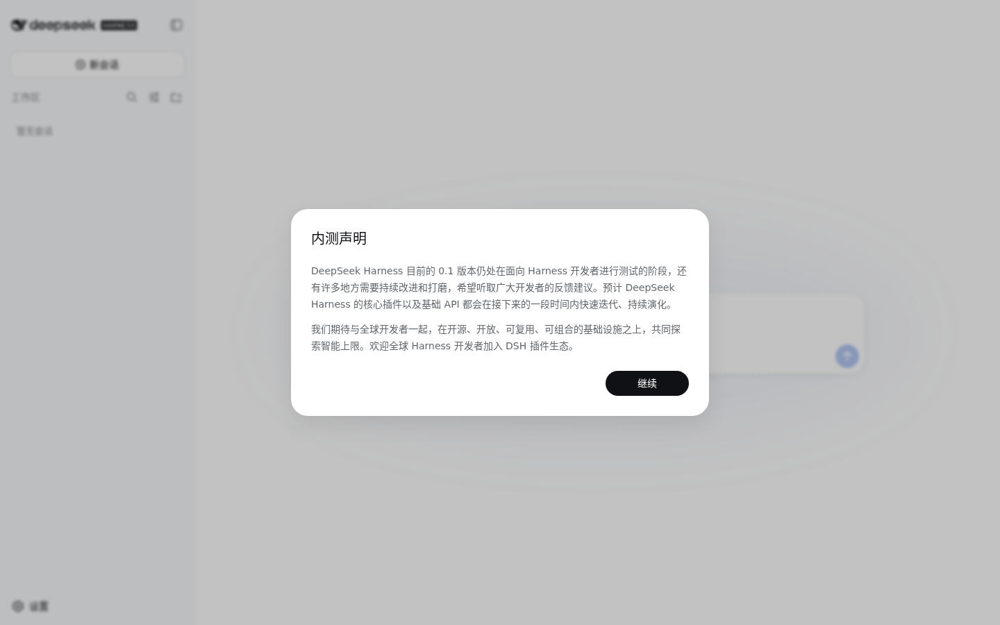
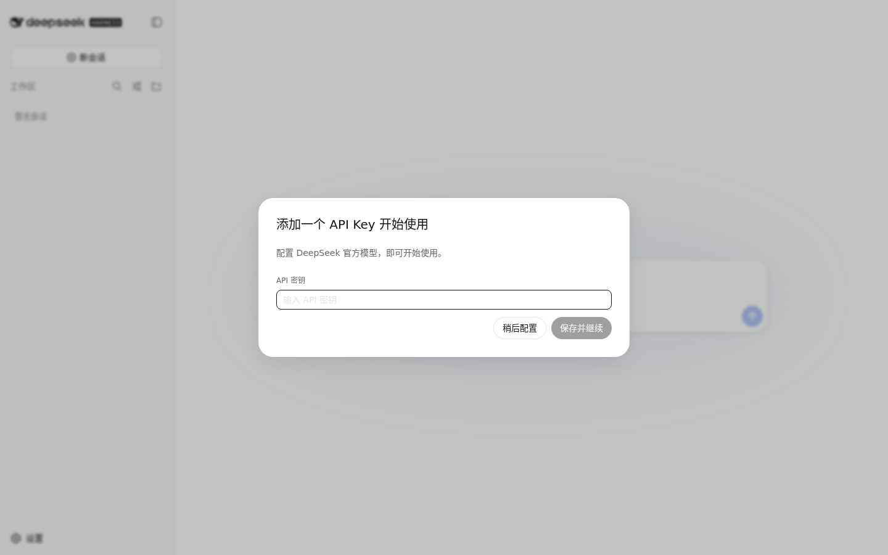
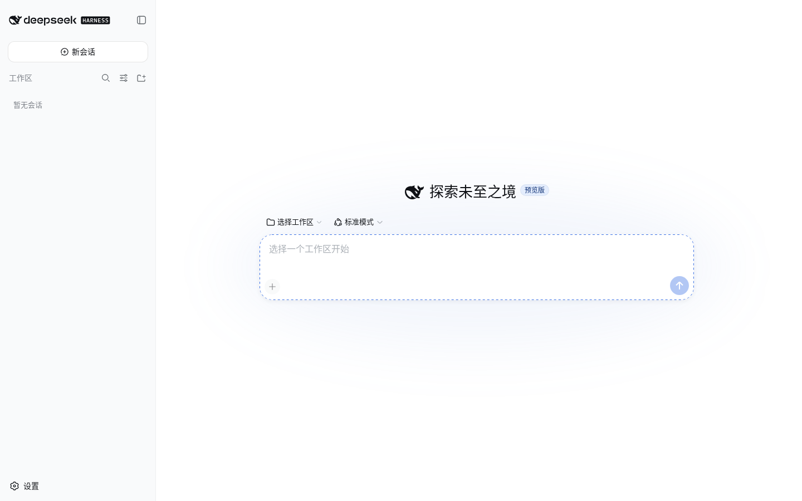
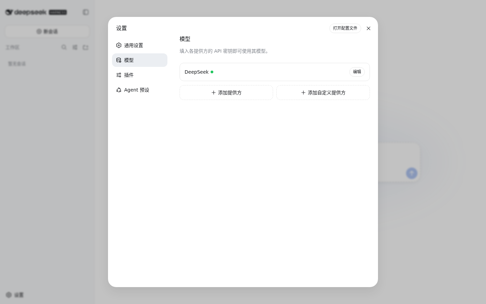
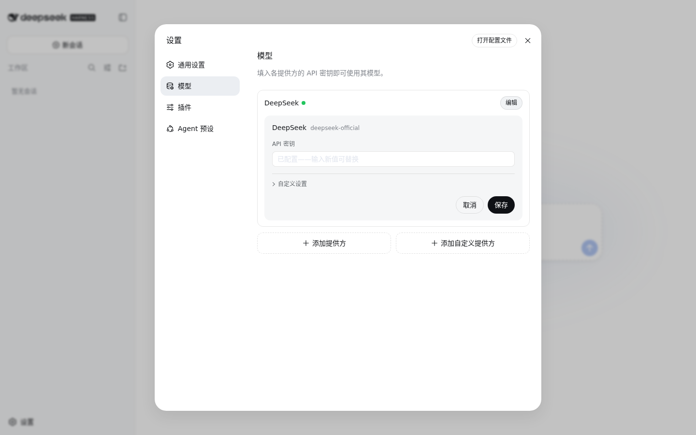

# 初识 DSH {#ch-1}

## 安装 DSH 并接入模型 {#sec-1-1}

本机已安装 Node.js。打开终端，运行：

```sh
npx -y @deepseek-ai/dsh web
```

首次运行会下载 DSH，完成后终端会输出访问地址：

```
dsh web: http://127.0.0.1:3080
```

用浏览器打开这个地址。

首次打开会看到内测声明，介绍 DSH 目前所处的开发阶段。点击“继续”。



继续后会自动弹出添加密钥的对话框——因为还没有配置任何模型，DSH 会在你能开始使用之前先要求接入一个。



去 DeepSeek 开放平台申请一个 API 密钥（`sk-` 开头），粘贴进输入框，点击“保存并继续”。

> 密钥只在这一次输入时可见，保存后 DSH 只会显示脱敏描述符，不会再明文展示。

保存成功后会回到主界面：



随时可以在设置里确认连接状态。点击左下角“设置” → “模型”，DeepSeek 卡片旁出现绿点，说明已经接入成功。



再次点开编辑，密钥输入框只会显示“已配置——输入新值可替换”，不会泄露已保存的密钥：



至此，DSH 已经安装完成并接入了 DeepSeek 官方模型（默认可用 `deepseek-v4-flash`、`deepseek-v4-pro`），可以进入下一节，交给它第一个任务。

## 交给 DSH 第一个任务 {#sec-1-2}

## 检查 DSH 做了什么 {#sec-1-3}
