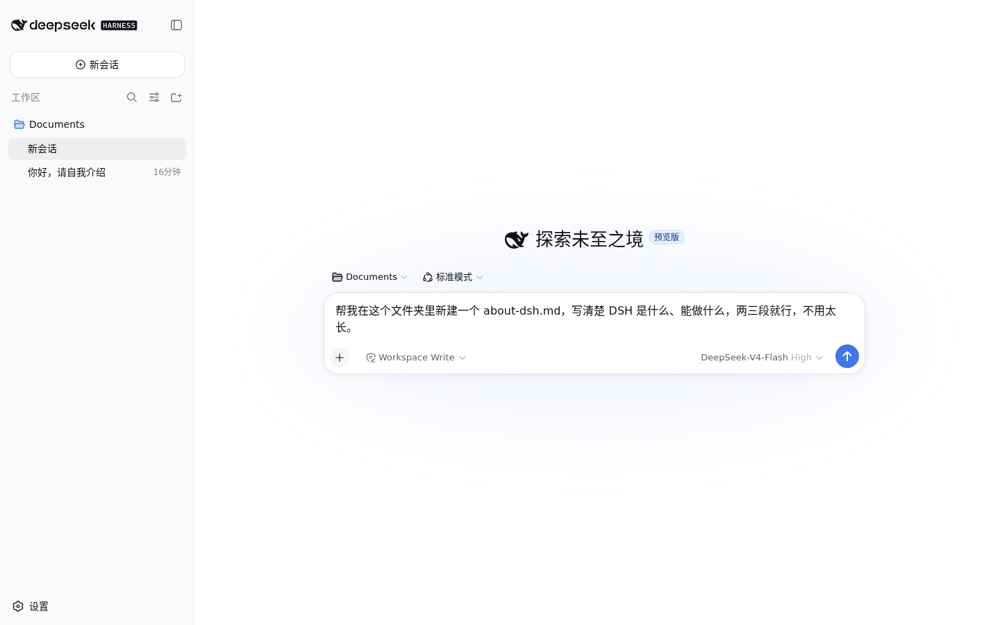

# 初识 DSH {#ch-1}

## 安装 DSH 并接入模型 {#sec-1-1}

这一节要做两件事，把 DSH 装到本机，再把模型接通。全程只需要一台装了 Node.js 的电脑和一个 DeepSeek 官方的 API 密钥；最容易卡住的地方是 Node.js 版本太旧，还有保存密钥之后没去验证模型是不是真的能回话，这两步下面会分别讲清楚。

### 准备 Node.js 环境

先确认 Node.js 装好了。打开终端运行 `node -v`；如果提示命令不存在，就去 nodejs.org 下载官网首页默认推荐的 LTS 安装包，按提示装完。DSH 要求 Node.js 22 或更新的版本，官网给的 LTS 版本号足够新，不用另外挑。装完重新打开一个终端窗口，再跑一次 `node -v`，确认能打印出版本号。

### 安装并启动 DSH

环境装好之后，在终端运行这一行命令。

```sh
npx -y @deepseek-ai/dsh web
```

第一次执行会先从 npm 下载 DSH，等它跑完，终端会打印出一行访问地址，形如 `dsh web: http://127.0.0.1:3080`。用浏览器打开这个地址，就进到了 DSH 的 Web 界面。

首次打开会先看到一条内测声明，说明 DSH 目前所处的开发阶段，点击“继续”就行。


### 接入 DeepSeek 官方模型

因为还没有配置任何模型，点掉内测声明之后，DSH 会直接弹出一个添加密钥的对话框，把开始使用之前必须做的这一步摆到台面上。


去 DeepSeek 开放平台申请一个 `sk-` 开头的 API 密钥，粘贴进输入框，点击“保存并继续”。密钥只在这一次输入的时候可见，保存之后 DSH 只会显示一个脱敏描述符，页面和后续的任何截图都不会再出现明文。保存成功后会回到主界面，这时候还没有选工作区，输入框是禁用状态。


想再确认一次连接状态，点击左下角“设置”，切到“模型”标签，DeepSeek 卡片旁边会出现一个绿点，说明密钥已经生效；再点一次“编辑”，密钥输入框只会显示一行提示，说明已经配置过，输入新值就能替换，不会把已保存的密钥吐出来。


### 确认模型真的能回话

密钥配置好，不代表这一路真的通了，还要让 DSH 真的调用一次模型，收到回复，才算验证完成。点击“选择工作区”，随便选一个已有的文件夹，比如“文档”，DSH 会把它设为当前会话的工作目录，输入框这才会被激活。


在输入框里打一句“你好，请用一句话介绍你自己”，回车发送。


几秒钟后，DeepSeek-V4-Flash 会给出真实的回复，对话下方还带一行统计，把这一轮用了多久、首个字出现要多久、每秒能吐多少 token、这次对话花了多少输入和输出 token 都列了出来。这行数据就是这次请求真的打到了 DeepSeek 官方接口、模型真的算了一遍的证据；要是密钥不对，或者网络没通，这一步会直接报错给你看，不会卡在转圈那里。


看到这行回复和统计数据，就说明 DSH 已经装好，模型也接通了，默认可用的模型还有 `deepseek-v4-pro`。下一节让它去做一件有产出的任务。

## 交给 DSH 第一个任务 {#sec-1-2}

接着上一节选好的 Documents 工作区，这一节给 DSH 布置第一个真正的任务，不再是打招呼这种试探性的问题。判断它做没做到位，标准很直接，任务完成之后，工作区里要真的多出一个文件，内容也要对得上要求。

在输入框里打一句“帮我在这个文件夹里新建一个 about-dsh.md，写清楚 DSH 是什么、能做什么，两三段就行，不用太长”，回车发送。



DSH 收到任务后没有直接动笔，先跑了一次 `pwd && ls -la`，确认自己站在哪个目录、目录里已经有什么，再动手创建文件。没看一眼就动手，还是先看后动手，这个区别下一节会用得上。几秒钟后 `about-dsh.md` 创建完成，回复末尾带着一个“产物”标签，标着这次任务生成的文件名。


“产物 about-dsh.md”这个标签是 DSH 在说，这次任务确实新增了这个文件，不是聊天框里客套两句就算完事。它往里面具体写了什么、有没有动别的地方，下一节接着核对。

## 检查 DSH 做了什么 {#sec-1-3}

光看聊天回复不够，DSH 到底做了什么，要去它实际执行的工具调用里核对。这一节接着上一节创建 `about-dsh.md` 的任务，看看怎么把这一步查清楚。

点击消息流里“Write · about-dsh.md”这一行，也就是页面下方提示的“点击消息流中的工具行查看详情”，会展开一份完整的差异记录，新建了这个文件，加了 7 行、改了 1 个文件，下面还附着实际写进去的全部内容。DSH 在聊天里说自己写了三段，这里可以逐字核对它是不是真写了三段，而不是只报个数字了事。


打开这份差异能看到，DSH 确实写出了三段像样的文字，第一段说 DSH 是什么，第二段说能做什么，第三段说设计上的取舍，跟它在聊天里报的摘要对得上。真实的文件内容大致是这样开头的。

```md
# 关于 DSH

DSH（DeepSeek Harness）是一个智能体（Agent）运行平台，让 AI 助手能够在你的电脑上真正“动手干活”：读写文件、执行命令、搜索网络信息，并通过 Web 界面与你实时交互。
```

更底层的记录在旁边的“轨迹”标签里，那是完整的原始执行日志，每一步用了哪个模型、花了多久、每次工具调用完整的参数和返回值都摊开在那里，排查问题的时候比对话界面直接得多。对话最上方还有一个“Session log”按钮，能把整段记录导出成文件，方便事后核对或者存档。

以后不管 DSH 做了什么任务，习惯性地展开一下它动过的工具调用，看看改动是不是真的对得上要求，比只读聊天回复靠谱得多。这个检查习惯，后面的实战章节会一直用到。
