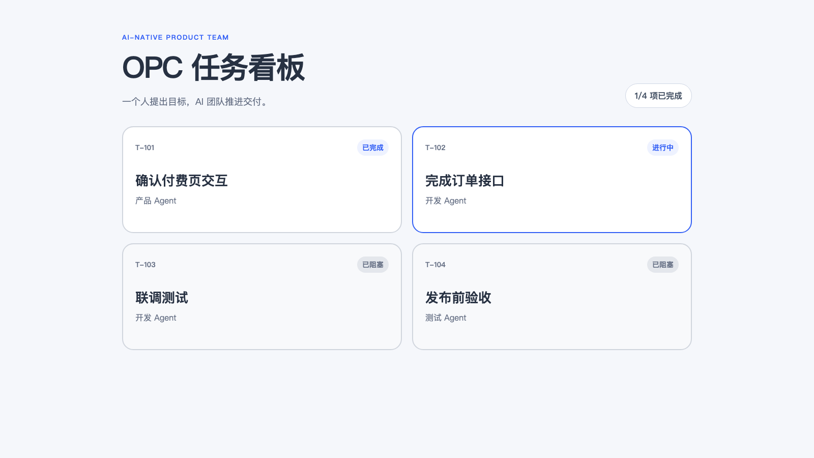
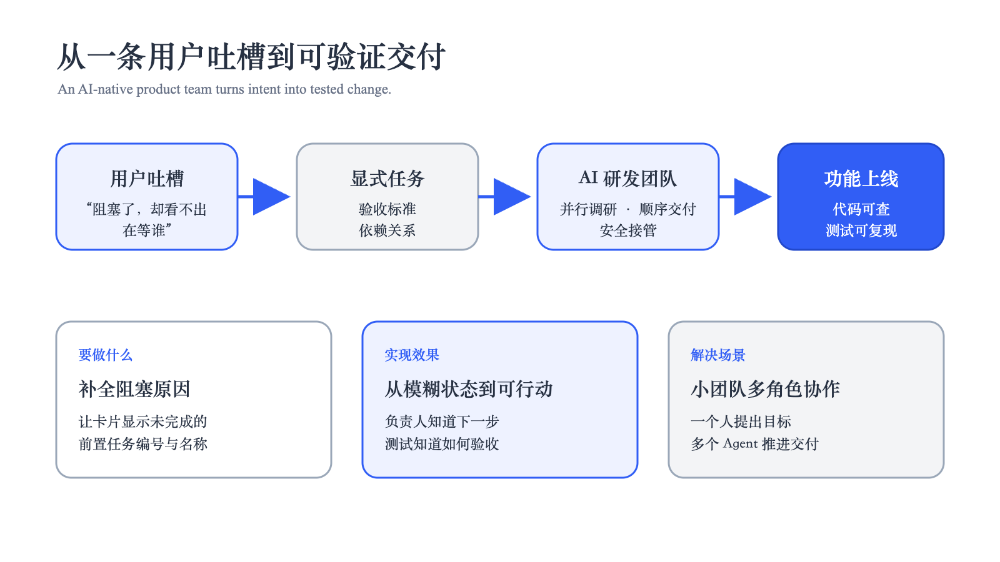
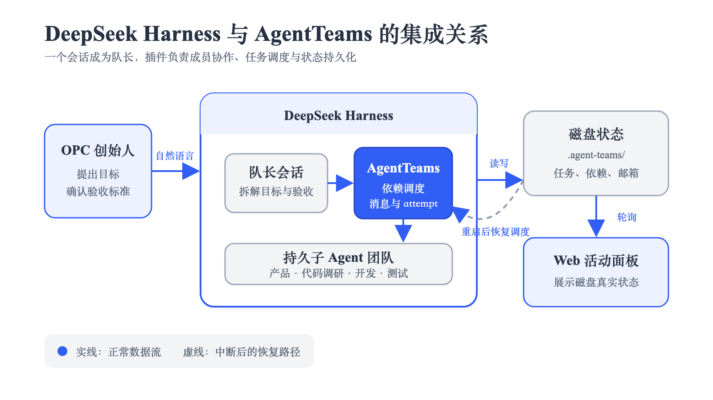
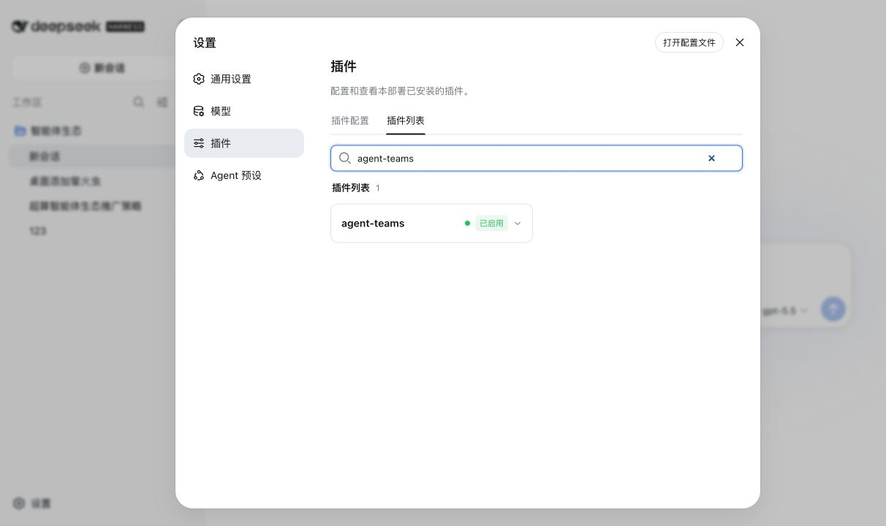
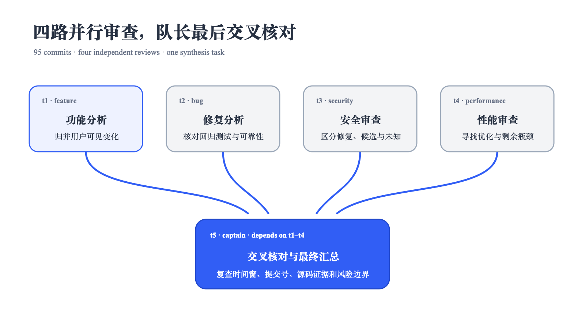
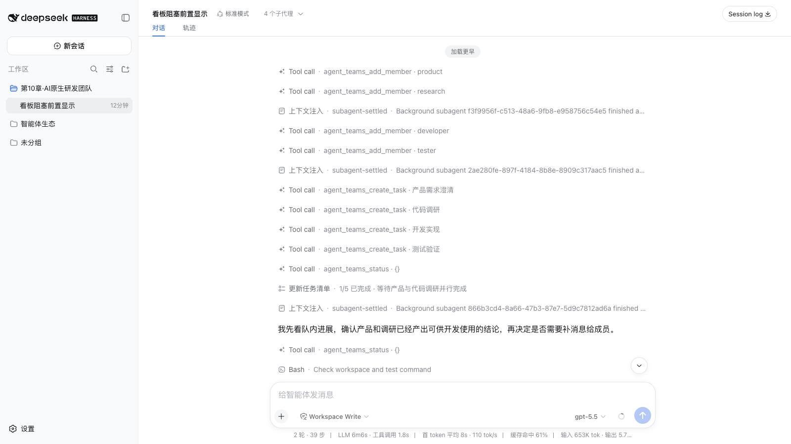
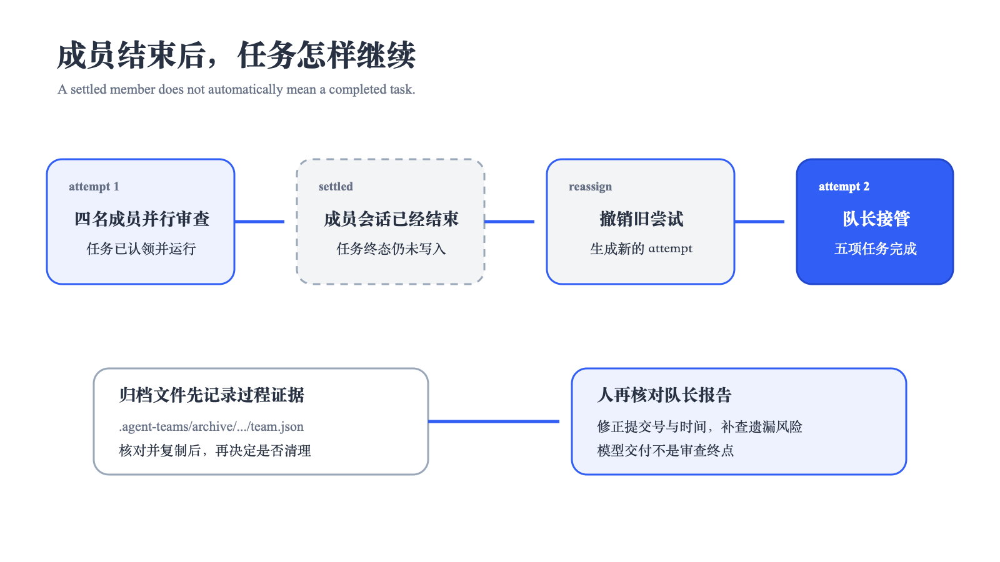
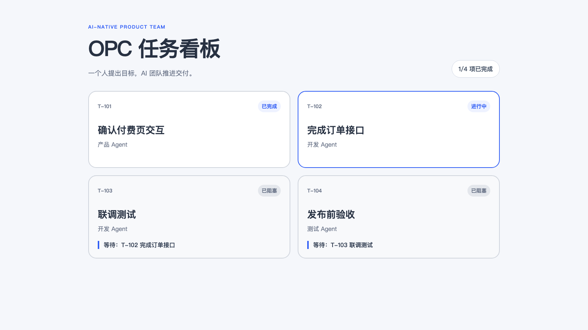

# 用 dsh 构建 opc {#ch-10}

## 从一条用户吐槽开始 {#sec-10-1}

本章使用一个可以实际运行的虚构场景。你独立经营“AI 简历诊所”，准备上线付费版简历报告。公司里只有你一个人，产品 Agent 负责梳理付费流程，开发 Agent 编写代码，测试 Agent 检查上线条件。你做了一块简单的“OPC 任务看板”，每天打开它确认工作进展。

付费功能已经拆成四项任务。产品 Agent 完成了 `T-101 确认付费页交互`，开发 Agent 还在处理 `T-102 完成订单接口`。后面的 `T-103 联调测试` 与 `T-104 发布前验收` 都显示“已阻塞”。你点开看板，原本只想知道该找哪位 Agent，页面却给出一句没有下文的提示。

> “我知道任务被堵住了。问题是堵在哪儿？总不能把产品、开发、测试三个 Agent 都叫醒问一遍吧？”

卡片只显示自己的任务编号、名称、负责人和状态，没有显示它依赖哪些任务。`T-103` 的负责人虽然是开发 Agent，阻塞来源仍可能是产品交互没有确认，也可能是订单接口还没写完。只看页面，你无法判断该等待、催办，还是让测试 Agent 提前开始。

项目数据中已经保存了答案。`T-103` 同时依赖 `T-101` 与 `T-102`。前者已经完成，后者仍在进行，因此当前只需等待 `T-102`。改造后的卡片会直接显示 `等待：T-102 完成订单接口`。你可以继续让开发 Agent 处理订单接口，产品 Agent 无需重复解释需求，测试 Agent 也不用提前接手半成品。

这块看板原本就是为了省掉逐个询问，现在却只把“到处问人”换成了“到处问 Agent”。本章要修掉的就是这个有点尴尬的小问题。



起始项目位于 `demo/chapter10/starter/`。在仓库根目录运行下面的命令，可以先看到问题对应的测试结果：

```bash
cd demo/chapter10/starter
npm test
```

现有两项测试中，一项通过，一项失败。失败用例要求程序找出尚未完成的前置任务，`getBlockingTasks()` 返回的却是空数组。这说明看板已经保存依赖关系，缺的是计算和展示阻塞原因的功能。

### 把一句吐槽写成可验收的需求

这里先消除“在等谁”的歧义。本次功能显示尚未完成的前置任务编号和名称。用户找到对应卡片后，可以继续查看该任务的负责人。本次改动不把负责人重复显示在阻塞卡片上。

页面已有四条任务数据。开发前先为每一张卡片写出预期结果。

| 任务 | 当前状态 | 前置任务 | 改造后的卡片内容 |
|---|---|---|---|
| `T-101 确认付费页交互` | `completed` | 无 | 不显示等待信息 |
| `T-102 完成订单接口` | `in_progress` | 无 | 不显示等待信息 |
| `T-103 联调测试` | `blocked` | `T-101`、`T-102` | 显示 `等待：T-102 完成订单接口` |
| `T-104 发布前验收` | `blocked` | `T-103` | 显示 `等待：T-103 联调测试` |

`T-103` 的依赖中虽然包含 `T-101`，但它已经完成，所以不应出现在等待信息里。`T-102` 仍在进行，页面需要保留它的编号和名称。多个未完成依赖按原有 `dependencies` 顺序显示，并用顿号分隔。

需求边界也一并确定下来。

- 触发条件只看当前任务的 `status`。只有 `blocked` 任务显示等待信息。

- 阻塞原因只来自当前任务的 `dependencies`。程序按编号找到前置任务，再排除 `completed` 项。

- 等待信息放在负责人下方，文字格式固定为 `等待：任务编号 任务名称`。

- 保留现有任务数据、状态标签和完成数量，不增加依赖，也不改看板的其他样式。

验收时需要通过三项自动化测试。第一项确认只返回未完成的前置任务，第二项确认无依赖任务返回空数组，第三项确认非阻塞任务不显示等待信息。页面还要与上表中的 `T-103`、`T-104` 两项预期一致。

本章会把这份需求交给一个临时 AI 研发团队处理。经营者给出目标、范围和验收结果，产品、代码调研、开发与测试 Agent 分别承担执行工作。



本章所说的 OPC 由一个人承担经营责任。这个人决定反馈值不值得做、这次改到什么程度，并在最后确认是否发布。产品分析、代码定位和测试等执行工作可以交给不同 Agent。人的角色更接近创始人兼队长，他把精力留给目标、边界和最终判断。

这也是 AI Native 组织在小型业务里的一个具体形态。团队围绕当前目标临时组成，任务完成后即可解散。角色之间用交付物和依赖关系协作，经营者随时能够看到谁在工作、谁在等待，以及下一项任务由什么条件解锁。

## 在 dsh 中组建 AI 研发团队 {#sec-10-2}

在这个案例里，dsh 与 [`dsh-agent-teams`](https://github.com/NanmiCoder/dsh-agent-teams) 分别承担不同工作。

| 参与者或工具 | 承担的责任 | 在本章中的动作 |
|---|---|---|
| OPC 经营者 | 确认问题、限定改动范围、决定是否接受结果 | 提出目标，不增加依赖，要求测试通过 |
| dsh | 提供工作区、模型会话和工具执行环境 | 让队长与成员读取并修改当前项目 |
| `dsh-agent-teams` | 组织成员、任务依赖、消息和持久状态 | 创建四个角色，调度就绪任务，记录执行结果 |

当前 dsh 会话担任队长。插件创建可继续执行的子 Agent，把任务状态写入工作区的 `.agent-teams/` 目录，并调度依赖已经满足的任务。经营者仍然只面对一个队长会话，无需分别追问四个角色。



先把插件安装到 Web profile：

```bash
dsh plugin --profile web add @nanmicoder/dsh-agent-teams
dsh --profile web --dump-config
dsh web
```

进入“设置 → 插件”，确认 `agent-teams` 已挂载并启用。安装或升级插件后，重启 dsh，再刷新 Web 页面。



接着点击“添加工作区”，选择 `demo/chapter10/starter/`，新建会话并发送下面的提示词：

```text
我一个人经营“AI 简历诊所”，正在上线付费版简历报告。我用这块
任务看板管理产品、开发和测试 Agent。现在两张卡片只显示“已阻塞”，
看不出它们正在等待哪个前置任务。

请使用 AgentTeams 完成下面的功能。

现有数据
- T-101 确认付费页交互，状态 completed，无前置任务
- T-102 完成订单接口，状态 in_progress，无前置任务
- T-103 联调测试，状态 blocked，依赖 T-101 和 T-102
- T-104 发布前验收，状态 blocked，依赖 T-103

预期结果
- T-101 和 T-102 不显示等待信息
- T-103 显示“等待：T-102 完成订单接口”
- T-104 显示“等待：T-103 联调测试”

显示规则
- 只有 blocked 任务显示等待信息
- 只显示状态不是 completed 的前置任务
- 每项使用“任务编号 任务名称”格式，多个任务按 dependencies 顺序用顿号分隔
- 等待信息放在负责人下方

改动边界
- 保留现有任务数据、状态标签、负责人和完成数量
- 不增加依赖，不改其他页面样式，所有操作仅限当前工作区

请组建产品、代码调研、开发和测试四个成员。产品与代码调研并行，
开发同时依赖二者，测试依赖开发。产品成员先检查需求是否仍有歧义，
代码调研成员定位实现与测试入口。完成后运行 npm test，确认三项测试
全部通过，并由队长汇总修改文件、页面结果、测试结果和任务依赖。
```

这段提示词给出了完整输入和逐项输出，也写清了不用修改的部分。产品 Agent 负责检查遗漏，代码调研 Agent 决定涉及哪些文件，开发成员不需要猜测“已完成的前置任务是否还要显示”。队长会把这些要求转换成成员、任务和依赖。

## 把需求拆成带依赖的任务 {#sec-10-3}

本次运行创建了四个角色。产品 Agent 先把吐槽变成可测试的行为，代码调研 Agent 负责找到数据结构和测试入口。两份结论齐备后，开发 Agent 才能写代码，最后由测试 Agent 独立验证。

| 任务 | 负责人 | 依赖 | 交付物 |
|---|---|---|---|
| `t1` 产品需求澄清 | 产品 Agent | 无 | 逐项验收表和改动边界 |
| `t2` 代码调研 | 代码调研 Agent | 无 | 相关文件与测试入口 |
| `t3` 开发实现 | 开发 Agent | `t1`、`t2` | 功能代码和新增测试 |
| `t4` 测试验证 | 测试 Agent | `t3` | 可重复的测试结论 |



`t1` 与 `t2` 没有前置依赖，可以立即并行。`t3` 已经建好，仍要等两项都完成。`t4` 又要等 `t3`。插件只会把依赖已经满足的任务交给空闲成员，因此开发不会在验收标准尚未确定时提前修改，测试也不会拿半成品开始验收。

这张依赖图就是一个小型 AI Native 组织的工作约定。产品 Agent 不需要管理开发 Agent，测试 Agent 也不需要反复询问代码是否写完。每个角色交付自己的结果，任务状态决定下一步由谁开始。经营者查看队长汇总和依赖图，就能掌握整个团队。

运行中的权威状态保存在下面的位置：

```text
.agent-teams/blocked-card-deps/team.json
```

团队结束后，记录会进入归档目录：

```text
.agent-teams/archive/blocked-card-deps/team.json
```

Web 面板读取这些磁盘状态。即使会话变长或 dsh 重启，成员、负责人和任务依赖仍有记录可查。

## 让团队协作完成功能 {#sec-10-4}

队长先调用 `agent_teams_add_member` 创建产品、代码调研、开发和测试成员，随后调用 `agent_teams_create_task` 建立任务与依赖。Web 页面会持续显示成员活动和任务进度。



产品 Agent 对照四条现有任务检查需求。提示只出现在 `blocked` 任务上，已经完成的依赖应被排除，剩余依赖同时显示编号和名称。存在多个未完成依赖时，页面沿用 `dependencies` 中的顺序。这样一来，`T-103` 只显示仍在进行的 `T-102`，不会再把已经完成的 `T-101` 列出来。

代码调研 Agent 随后给出三个明确入口。

- `logic.js` 负责找出仍在阻塞当前任务的前置任务。

- `app.js` 负责把等待原因渲染到卡片上。

- `logic.test.js` 使用 Node 内置测试验证筛选逻辑。

两项前置任务完成后，`t3` 自动进入可认领状态。开发 Agent 在 `logic.js` 中实现 `getBlockingTasks()`，先检查当前卡片是否处于阻塞状态，再按依赖编号找到任务，最后排除状态为 `completed` 的项目。`app.js` 把返回结果显示为“`T-102 完成订单接口`”。开发成员还补了一项测试，确保非阻塞卡片不会显示等待信息。

这个过程让经营者看到了每个角色的实际产出。产品结论约束实现范围，代码调研减少无关文件探索，开发提交小幅修改，测试用例为最终验收提供依据。任何一项结论不合适，队长都能把反馈发回对应成员，无需让整支团队从头开始。

## 中断任务并检查最终交付 {#sec-10-5}

本次运行还出现了一次中断。开发成员已经认领 `t3`，代码却没有及时写入工作区。经营者此时能够从活动面板看见任务仍停在开发环节，也能确认下游测试正在等待 `t3`。

队长先调用 `agent_teams_reassign_task` 撤销旧尝试，等待旧成员停止，再由队长接管。直接并发修改会让旧成员与新执行者同时写文件，重新分配可以先切断旧尝试的更新权限。

归档状态记录了这次变化：

```json
{
  "id": "t3",
  "status": "completed",
  "dependencies": ["t1", "t2"],
  "attempt": 2,
  "assignee": "captain"
}
```

旧尝试失效以后，第二次尝试拥有最终写入权。相同机制也会处理进程重启后的开放任务，插件从磁盘恢复状态，并用新的尝试继续调度。



开发任务完成后，测试任务才进入就绪状态。本章保存的完成项目位于 `demo/chapter10/result/`，可以在仓库根目录复查：

```bash
cd demo/chapter10/result
npm test
```

测试结果为 3 项通过，0 项失败。页面上的 `T-103` 会显示“等待 T-102 完成订单接口”，`T-104` 会显示“等待 T-103 联调测试”。用户看到卡片就能找到当前阻塞源。



经营者最后检查页面、测试结果和团队归档，随后决定是否发布。这次交付中，人完成了问题取舍与最终验收，AI 团队完成了需求整理和代码修改，并留下可追踪的任务记录。OPC 因而获得了一套清楚的协作方式，一个人可以管理多个角色，同时保留对产品结果的控制。

### 这套方式还能处理哪些工作

同样的组织方式可以继续用于独立产品的日常迭代。收到支付失败的反馈时，可以让一个 Agent 复现问题，另一个检查支付接口与日志，修复任务等待调查结论，回归测试再等待修复完成。经营者负责判断退款、补偿和发布时间，技术调查与验证交给团队。

内容型业务也能使用这套方法。一份行业报告可以先并行收集资料和核验数据，写作任务等待两边完成，发布前再安排事实检查。任务依赖让经营者知道稿件为什么还不能发布，也能在某条材料失效时只重做受影响的部分。

它更适合目标清楚、产出可以检查的工作。涉及付款、删除数据、对外发布等不可逆动作时，经营者仍应保留确认步骤。AI Native 组织能扩展一个人的执行能力，经营责任仍然落在这个人身上。
