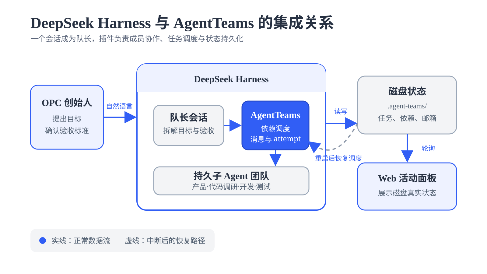
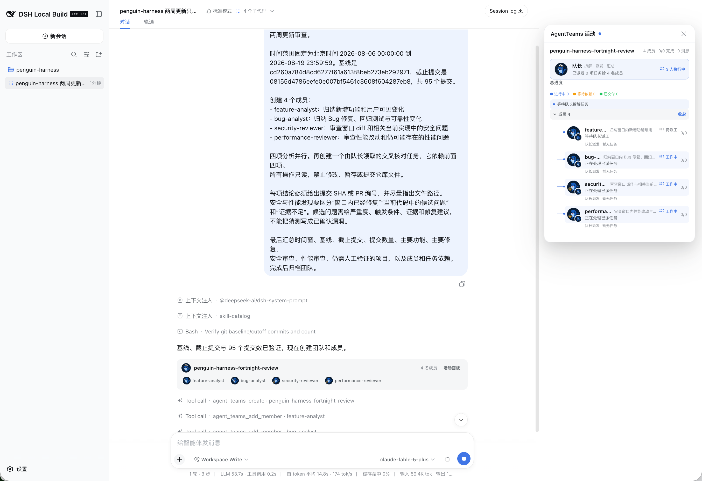
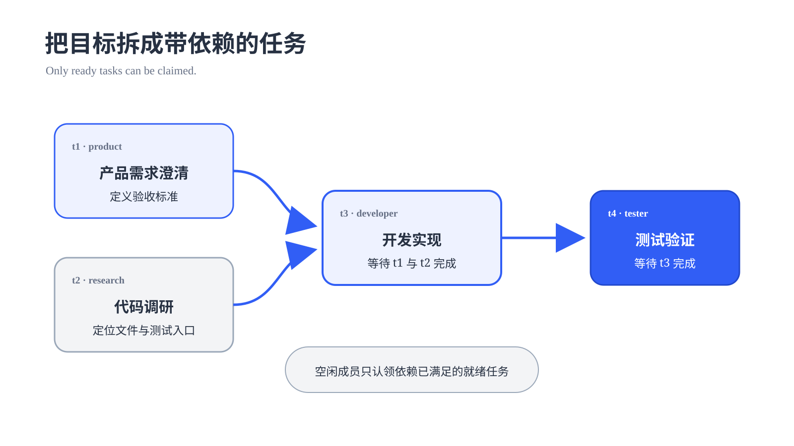
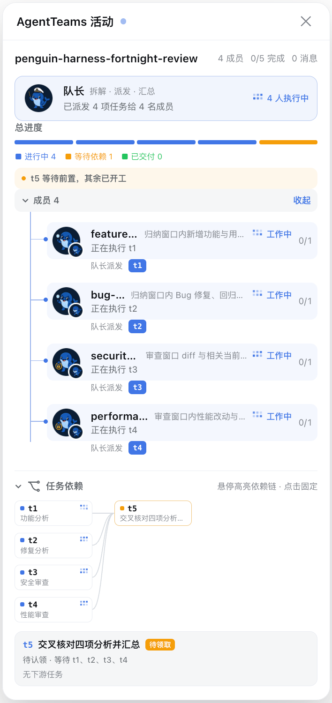
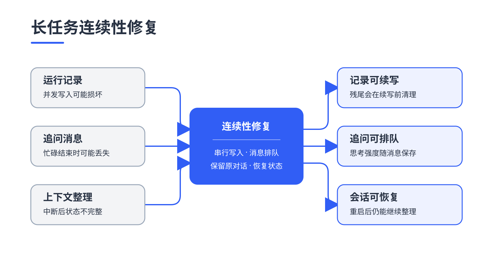
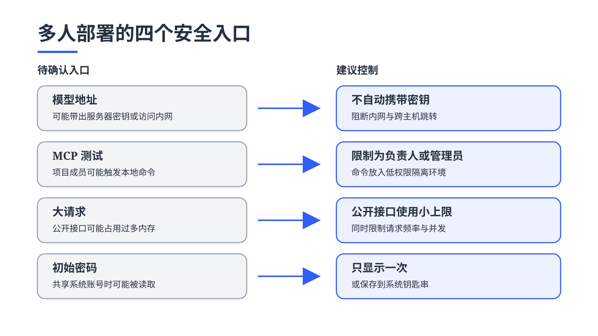
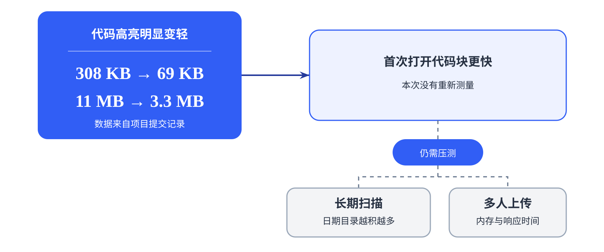
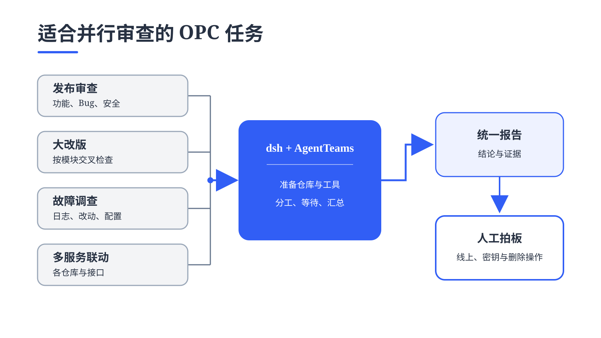

# 用 dsh 和 AgentTeams 组建 OPC 代码审查团队 {#ch-10}

当项目迭代越来越快，一个人很难同时把功能、Bug、安全和性能都审查清楚。本章用一次真实的开源仓库更新审查，演示如何借助 dsh 和 AgentTeams 临时组建多 Agent 团队：让不同成员并行检查同一段 Git 历史，再通过任务依赖把结果交回主会话统一核对，最终形成一份可追溯的升级决策报告。

## 一个人的公司，怎么审查两周 95 个提交 {#sec-10-1}

OPC 是 One Person Company 的缩写，也就是一人公司。创始人既要选产品方向，也要处理开发、测试和发布。产品依赖的开源项目快速迭代时，他还得判断上游版本要不要跟进、什么时候升级，以及升级会给现有业务带来什么影响。

本章把这项工作落到一次真实的仓库审查上。审查对象是开源项目 [`Prism-Shadow/penguin-harness`](https://github.com/Prism-Shadow/penguin-harness)。它是一套开源的 Agent 构建工具，可以装在个人电脑或服务器上。使用者可以给 Agent 选择模型和工具，也能查看每次运行做了什么、效果怎么样。项目主要使用 TypeScript 开发，采用 Apache-2.0 许可证。

2026 年 8 月 19 日，该项目的主分支刚经历一轮密集更新。过去两周共有 95 个提交，涉及 771 个文件。对于使用这套项目构建产品的 OPC，提交数量给出审查范围，下面四个经营和技术问题决定最终报告的内容。

- 哪些新功能值得接入自己的产品，或者写进下一次发布说明？

- 哪些 Bug 会影响当前服务，是否需要尽快升级？

- 新代码有没有带来密钥、权限或部署方面的安全风险？

- 性能变化会不会影响页面体验和服务器资源，还有哪些位置需要压测？

这四个问题原本分别落在产品、测试、安全和性能岗位上。OPC 没有常驻的完整研发团队，创始人自己逐项检查，注意力会在数百个文件之间来回切换。想知道新功能，要去找用户能看到的入口；想确认 Bug 修好了，还得继续翻测试。安全问题藏在权限和外部请求里，性能变化则要回到页面加载和服务器资源消耗上看。

这里用 dsh 和 [`NanmiCoder/dsh-agent-teams`](https://github.com/NanmiCoder/dsh-agent-teams) 临时组建一支审查团队。四名 Agent 分头读取同一段 Git 历史，OPC 创始人所在的主会话担任队长，负责划定范围、检查证据和收回结果。最后要回答一件很实际的事：这个版本值不值得升级，升级前还要补做哪些检查。

审查对象和时间边界固定如下。

| 项目 | 值 |
|---|---|
| 目标仓库 | [`Prism-Shadow/penguin-harness`](https://github.com/Prism-Shadow/penguin-harness) |
| 时间范围 | 北京时间 2026-08-06 00:00 至 2026-08-19 23:59 |
| 基线提交 | `cd260a784d8cd6277f61a613f8beb273eb292971` |
| 截止提交 | `08155d4786eefe0e007bf5461c3608f604287eb8` |
| 变更规模 | 95 个提交，771 个文件，新增 56,673 行，删除 4,251 行 |

先把仓库克隆到单独目录，再用 Git 复核范围。后面的 Agent 都只读这份 checkout。

```bash
git clone https://github.com/Prism-Shadow/penguin-harness.git
cd penguin-harness

review_base=$(git rev-list -1 \
  --before='2026-08-06T00:00:00+08:00' main)
review_head=08155d4786eefe0e007bf5461c3608f604287eb8

git rev-list --count "$review_base..$review_head"
git diff --shortstat "$review_base..$review_head"
```

两条核对命令应分别返回 95 和上表中的文件、行数统计。以后复做这个案例时，仍要使用固定的截止提交。主分支会继续变化，直接审查最新 `main` 得到的已经是另一份报告。

交付要求也提前写清楚：报告按功能、Bug、安全和性能分类；每条重要结论都能找到对应的提交、PR 或源码；看到的风险和实际验证过的结果分开写。

## 让四名 Agent 分头检查 {#sec-10-2}

dsh 是这支临时团队的工作台，负责打开仓库、运行模型和调用工具。AgentTeams 在上面加了一块团队看板，用来安排成员、分配任务、设置先后关系和保存进度。OPC 创始人使用的主会话担任队长，其余成员在各自会话里工作。

{.book-technical-figure width=72%}

先安装插件并检查配置。安装或升级后要重启 dsh，已经打开的进程不会自动加载新版本。本次执行使用 headless 模式，也就是先在命令行里运行，不必一直开着浏览器。任务结束后，再到 Web 界面查看保存下来的团队记录。

```bash
dsh plugin --profile headless add @nanmicoder/dsh-agent-teams
dsh --profile headless --dump-config
dsh --profile headless "<任务说明>"
dsh web
```

在固定版本的仓库目录中发送下面的任务说明。运行结束后，把同一目录加入 Web 工作区，就能看到归档的成员、任务和先后关系。日期、提交号、成员职责和只读要求都写进提示词，四名成员就不会各查各的时间范围。

> <span class="prompt-title">提示词内容：</span>
>
> 请使用 AgentTeams 对当前 penguin-harness 仓库做一次只读的最近两周更新审查。
>
> 时间范围固定为北京时间 2026-08-06 00:00:00 到
> 2026-08-19 23:59:59。基线是
> cd260a784d8cd6277f61a613f8beb273eb292971，截止提交是
> 08155d4786eefe0e007bf5461c3608f604287eb8，共 95 个提交。
>
> 创建 4 个成员：
> - feature-analyst：归纳新增功能和用户可见变化
> - bug-analyst：归纳 Bug 修复、回归测试与可靠性变化
> - security-reviewer：审查窗口 diff 和相关当前实现中的安全问题
> - performance-reviewer：审查性能改动和仍可能存在的性能问题
>
> 四项分析并行。再创建一个由队长领取的交叉核对任务，它依赖前面四项。
> 所有操作只读，禁止修改、暂存或提交仓库文件。
>
> 每项结论必须给出提交 SHA 或 PR 编号，并尽量指出文件路径。
> 安全与性能发现要区分“窗口内已经修复”“当前代码中的候选问题”
> 和“证据不足”。候选问题需给严重度、触发条件、证据和修复建议，
> 不能把猜测写成已确认漏洞。
>
> 最后汇总时间窗、基线、截止提交、提交数量、主要功能、主要修复、
> 安全审查、性能审查、仍需人工验证的项目，以及成员和任务依赖。
> 完成后归档团队。

这份提示词也保存在 [`repository-review-prompt.md`](assets/chapter10/repository-review-prompt.md)，可以直接复制使用。

队长创建团队后，依次添加四名成员并发送任务。会话顶部会出现“4 个子代理”，右侧的 AgentTeams 面板则像一张实时值班表，谁在做什么、完成了多少都能直接看到。归档记录中保留了这 4 名成员。

{width=54%}

四名成员的工作重点也有意错开。

| 成员 | 先看什么 | 交付要求 |
|---|---|---|
| `feature-analyst` | 合并提交、变更日志、Web 与 CLI 入口 | 按用户能力归并，不逐条抄提交标题 |
| `bug-analyst` | `fix` 提交、问题描述、测试文件 | 说明故障表现、修复方式和回归证据 |
| `security-reviewer` | 权限检查、外部请求、进程启动、敏感数据 | 区分已修复项、候选风险和证据不足 |
| `performance-reviewer` | 页面加载、服务器资源消耗、已有测速记录 | 分开记录现成数据和仍需亲自测试的判断 |

## 用任务依赖把结果收回来 {#sec-10-3}

四项审查都读取同一段 Git 历史，互相不用等待，可以同时开工。最后的汇总必须等四份材料到齐，所以再单独安排一项收尾任务。

| 任务 | 初始负责人 | 依赖 | 交付物 |
|---|---|---|---|
| `t1` 功能分析 | `feature-analyst` | 无 | 按主题归并的功能清单 |
| `t2` 修复分析 | `bug-analyst` | 无 | Bug、可靠性改动与测试证据 |
| `t3` 安全审查 | `security-reviewer` | 无 | 已修复项、候选问题与未知项 |
| `t4` 性能审查 | `performance-reviewer` | 无 | 已优化项、候选瓶颈与实测建议 |
| `t5` 交叉核对 | 队长 | `t1`、`t2`、`t3`、`t4` | 一份可复查的最终报告 |

{.book-technical-figure width=72%}

`t1` 到 `t4` 没有相互依赖，四条连线共同汇入 `t5`；只有四项都完成，队长交叉核对才具备完整输入。

{.book-portrait-screenshot width=34%}

这组先后关系解决了一个常见问题：队长不会只拿到几条线索就急着写结论，四名成员也不用排队。安全 Agent 继续检查权限时，功能 Agent 可以同时整理新能力。四份报告全部到齐，`t5` 才开始汇总。

运行状态保存在：

```text
.agent-teams/opc-repo-review-rerun/team.json
```

团队归档后，记录进入：

```text
.agent-teams/archive/opc-repo-review-rerun/team.json
```

`team.json` 记录每项任务做到哪一步、交给了谁，以及已经尝试过几次。其中的 `attempt` 可以理解为任务的执行轮次。

`t4` 完成后，`t5` 的四项依赖全部满足。

成员头像变灰，不代表它负责的任务已经交付。队长要看任务记录，确认结果已经写入并且状态变成完成。

执行额外清理前，可以直接读取归档。

```bash
node -e '
const fs = require("fs");
const p = ".agent-teams/archive/opc-repo-review-rerun/team.json";
const team = JSON.parse(fs.readFileSync(p, "utf8"));
for (const task of team.tasks) {
  console.log(task.id, task.status, task.assignee, task.attempt,
    task.dependencies.join(","));
}
'
```

归档中五项任务都是 `completed`。`t1`、`t2`、`t3` 一次完成，`t4` 和 `t5` 执行了两次。仓库里只多出 AgentTeams 自己的 `.agent-teams/` 记录目录，业务代码没有被修改或提交。需要保留审查过程时，可以复制归档文件；不需要时再清理这个目录。

## 一轮审查得到了什么 {#sec-10-4}

四路审查完成后，维护者不用再逐条翻看 95 个提交。新功能、Bug 修复、安全风险和性能变化已经分开整理，需要查细节时再回到审查记录继续核对。

### 新增功能

| 主题 | 主要变化 |
|---|---|
| Agent 记忆 | Agent 可以记住用户或当前项目里的长期信息；还可以决定哪些资料自动带入对话，并单独调整子 Agent 的思考强度 |
| 连接外部工具 | 可以连接本地程序和远程服务，并在网页里完成配置和试连 |
| 会话工作台 | 可以先开草稿、查看后台任务、找回发过的消息、复制一条会话分支，也能拖入附件并限制上传大小 |
| 模型选择 | 新增 MiniMax M3；自定义模型可以自动识别接口类型和图片能力，常用模型还能单独开启快速模式或更高思考强度 |
| 桌面体验 | 增加系统通知、自动更新、内置命令行和下载源测速，个人电脑上的安装和升级更省事 |
| 网络与账号恢复 | 处在公司代理网络中也能配置连接；忘记管理员密码时，可以在服务器上离线重置 |

从 OPC 的角度看，最值得关注的是三件事：Agent 开始有长期记忆，可以接入更多外部工具，桌面版也更接近日常可用的软件。

### Bug 修复

这批修复都在帮 Agent 把长任务做完：记录写得住，追问接得上，中断以后还能继续。

{.book-technical-figure width=72%}

另外，旧日期里的新记录不再漏掉，小上下文模型会更早整理对话，服务重启后也能恢复手动整理。维护者已经补上相关回归测试；本次只确认测试已经写入，没有运行全套测试。

### 安全审查

这轮更新堵住了两个容易被忽略的安全口子。一是升级存在已知风险的底层组件；二是收紧热更新功能，只有管理员通过安全连接或在服务器本机操作时才能使用，同时不再把访问凭证写入磁盘。

只看代码，团队还发现了四个需要继续确认的入口。

{.book-technical-figure width=72%}

模型地址和 MCP 权限应当先处理。新地址不能自动带上服务器密钥，也要阻断内网和跨主机跳转；本地 MCP 测试只交给负责人或管理员，并放进低权限隔离环境。登录等公开接口要用更小的请求上限，初始密码则只显示一次或存进钥匙串。

这些是只读代码审查发现的风险线索。本次没有发起攻击测试，也没有证据表明已经有人利用；MCP 和初始密码的风险，还取决于项目成员是否被视为这台机器的可信使用者。

### 性能审查

网页中的代码高亮明显变轻。项目提交记录中的测量显示，首次打开代码块要下载的数据从约 308 KB 降到 69 KB，整个网页程序也从约 11 MB 缩到 3.3 MB。本次没有重新测量。

{.book-technical-figure width=72%}

还要压测两处：长期运行后扫描日期目录的耗时，以及多人同时上传大附件时的内存和响应时间。

### 人工复核后的结果

队长在 `t5` 中重新核对日期、审查范围、相关改动和测试依据，交付前又做了一次只读检查。

```bash
git status --short
git rev-list --count \
  cd260a784d8cd6277f61a613f8beb273eb292971..\
08155d4786eefe0e007bf5461c3608f604287eb8
```

结果仍是 95 个提交，业务代码没有变化。完整测试、性能压测、安装包签名和攻击性安全测试，要在专门环境中继续做。

## OPC 还可以怎样使用这支团队 {#sec-10-5}

能分头查、最后又要合成一份结论的任务，最适合这套组合。dsh 为成员准备仓库和工具，AgentTeams 负责分工、等待和汇总。

{.book-technical-figure width=72%}

发布审查、大改版、线上故障和多服务联动最典型，组件升级与上线测试也适用。查资料、读源码和运行测试可以同时做；修改同一份文件时，交给一个成员收尾。

只改一个文件，直接用一个 Agent 更快。必须一步接一步的任务也不用组队。涉及线上系统、密钥、数据删除和安全结论时，最后仍由人审批。
