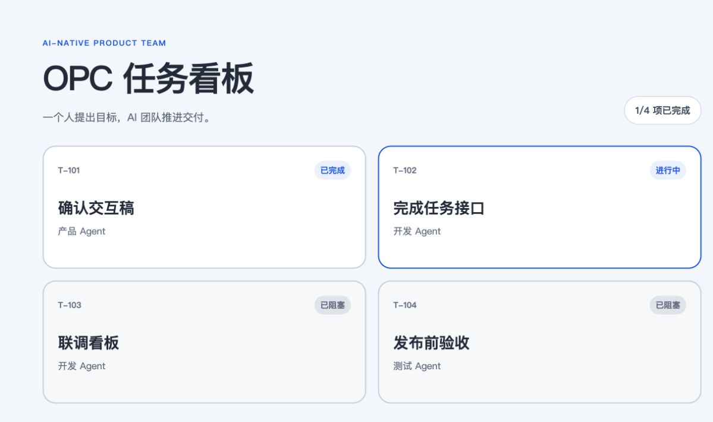
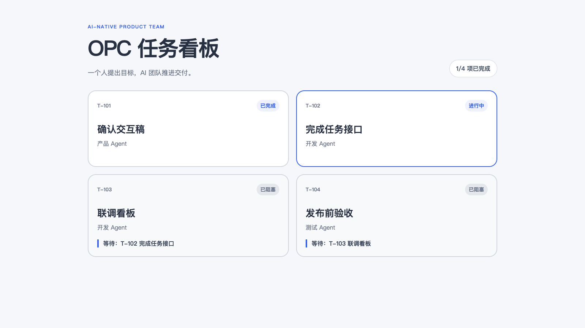

# 用 dsh 构建 opc {#ch-10}

## 从一条用户吐槽开始 {#sec-10-1}

OPC（One Person Company）并不是一个人包办所有工作，而是一个人负责目标与最终判断，让多个 Agent 承担角色化执行。本章用一个很小但完整的需求走通这条链路：

> “任务已经阻塞了，但我看不出它到底在等谁。”

起始项目位于 `demo/chapter10/starter/`。页面会标记“已阻塞”，却不会显示仍未完成的前置任务。



目标也很明确：只改当前项目，不增加依赖；阻塞卡片显示前置任务编号和名称；最后用自动化测试验收。


这类需求适合用多 Agent，不是因为代码复杂，而是因为它同时需要需求澄清、代码定位、实现和验证。真正需要协调的是**先做什么、谁可以并行、谁必须等待**。

## 在 dsh 中组建 AI 研发团队 {#sec-10-2}

本章使用 [`dsh-agent-teams`](https://github.com/NanmiCoder/dsh-agent-teams)。当前 DSH 会话充当队长，插件负责创建可继续执行的子代理、保存团队状态、调度就绪任务，并把状态写入工作区的 `.agent-teams/` 目录。


先把插件安装到 Web profile：

```bash
dsh plugin --profile web add @nanmicoder/dsh-agent-teams
dsh --profile web --dump-config
dsh web
```

进入“设置 → 插件”，确认 `agent-teams` 已挂载、已启用。安装或升级插件后应重启 DSH，再刷新 Web 页面。


接着点击“添加工作区”，选择 `demo/chapter10/starter/`，新建会话，并发送下面这段提示词：

```text
使用 AgentTeams 完成这个小功能：让任务看板的“已阻塞”卡片显示
它仍在等待的前置任务编号和名称。

请组建产品、代码调研、开发、测试四个成员；产品与代码调研并行，
开发同时依赖二者，测试依赖开发。所有操作仅限当前工作区，
不增加依赖。完成后运行 npm test，并由队长汇总修改文件、
测试结果和任务依赖。
```

提示词只规定目标、角色、依赖和验收，不为每个成员逐条编排工具调用。队长负责把这些约束转成团队与任务。

## 把需求拆成带依赖的任务 {#sec-10-3}

本次运行创建了四个成员和四个任务：

| 任务 | 负责人 | 依赖 | 产出 |
|---|---|---|---|
| `t1` 产品需求澄清 | 产品 Agent | 无 | 验收标准 |
| `t2` 代码调研 | 代码调研 Agent | 无 | 文件与测试入口 |
| `t3` 开发实现 | 开发 Agent | `t1`、`t2` | 代码与测试 |
| `t4` 测试验证 | 测试 Agent | `t3` | 测试结论 |


`t1` 与 `t2` 没有前置依赖，因此立即并行。`t3` 虽然已经创建，但必须等两项都完成；`t4` 又必须等待 `t3`。这正是显式依赖的价值：Agent 不需要靠聊天记录猜测“现在轮到谁”。

运行中的权威状态保存在：

```text
.agent-teams/blocked-card-deps/team.json
```

团队结束后，记录进入：

```text
.agent-teams/archive/blocked-card-deps/team.json
```

Web 面板读取的也是这些磁盘状态，而不是单独维护一份容易失真的内存副本。

## 让团队协作完成功能 {#sec-10-4}

队长先调用 `agent_teams_add_member` 创建四个成员，再调用 `agent_teams_create_task` 建立任务与依赖。图中是本次真实运行记录。


产品 Agent 给出的关键验收点是：只对 `blocked` 任务显示提示；只列出尚未完成的前置任务；同时显示编号和名称。代码调研 Agent 则定位到：

- `logic.js`：计算仍在阻塞当前任务的前置任务；
- `app.js`：渲染“等待”提示；
- `logic.test.js`：使用 Node 内置测试验证逻辑。

两份结果完成后，`t3` 自动变为就绪任务。最终实现保持很小：`getBlockingTasks()` 过滤已完成依赖，页面把结果渲染成“`T-102 完成任务接口`”。

这里最重要的不是四个 Agent 说了什么，而是交付边界始终清晰：产品定义验收，调研定位入口，开发修改代码，测试给出可重复的结论。

## 中断任务并检查最终交付 {#sec-10-5}

本次运行还出现了一个很有价值的现场：开发成员已经认领 `t3`，但没有及时落下代码。队长没有直接并发修改，而是先执行重新分配，停止旧成员，再以新尝试接管任务。

归档状态记录为：

```json
{
  "id": "t3",
  "status": "completed",
  "dependencies": ["t1", "t2"],
  "attempt": 2,
  "assignee": "captain"
}
```

这说明旧尝试已经失效，最终写入属于第二次尝试。相同机制也用于进程重启后的冷恢复：插件会从磁盘检查仍然开放的任务，并用新的尝试继续，而不是让旧执行者和新执行者同时写入。


开发完成后，测试任务才进入就绪状态。本次实际执行：

```bash
cd demo/chapter10/result
npm test
```

结果为 3 个测试全部通过，0 个失败。完成项目位于 `demo/chapter10/result/`。



最后检查三件事即可收尾：页面效果符合验收标准；`npm test` 通过；`.agent-teams/archive/` 中保留了成员、依赖、负责人和尝试次数。至此，一条用户吐槽已经变成一次可追踪、可恢复、可验证的 AI 原生研发交付。
