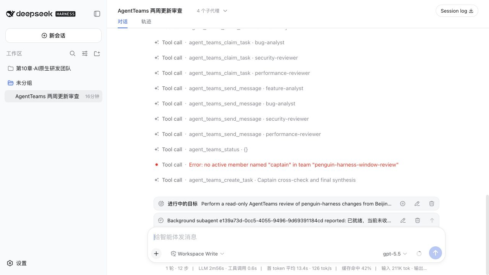

# 用 dsh 和 AgentTeams 组建 OPC 代码审查团队 {#ch-10}

## 一个人的公司，怎么审查两周 95 个提交 {#sec-10-1}

OPC 是 One Person Company 的缩写，也就是一个人公司。创始人既要选产品方向，也要处理开发、测试和发布。产品依赖的开源项目快速迭代时，他还得判断上游版本要不要跟进、什么时候升级，以及升级会给现有业务带来什么影响。

本章把这项工作落到一次真实的仓库审查上。2026 年 8 月 19 日，`Prism-Shadow/penguin-harness` 的主分支刚经历一轮密集更新。过去两周共有 95 个提交，涉及 771 个文件。对于使用这套项目构建产品的 OPC，提交数量给出审查范围，下面四个经营和技术问题决定最终报告的内容。

- 哪些新功能值得接入自己的产品，或者写进下一次发布说明？

- 哪些 Bug 会影响当前服务，是否需要尽快升级？

- 新代码有没有带来密钥、权限或部署方面的安全风险？

- 性能变化会不会影响页面体验和服务器资源，还有哪些位置需要压测？

这四个问题原本分别落在产品、测试、安全和性能岗位上。OPC 没有常驻的完整研发团队，创始人自己逐项检查，注意力会在数百个文件之间来回切换。功能分析要看合并记录、变更日志和产品入口；Bug 分析还要追到测试；安全审查关注权限、输入和外部请求；性能审查则要检查热路径、资源上限和已有测量。

这里用 dsh 和 [`NanmiCoder/dsh-agent-teams`](https://github.com/NanmiCoder/dsh-agent-teams) 临时组建一支审查团队。四名 Agent 分头读取同一段 Git 历史，OPC 创始人所在的主会话担任队长，负责限定范围、检查证据和决定哪些结论可以进入最终报告。最终交付是一份升级决策材料，包含新增能力、相关修复、候选风险和需要补做的验证。

审查对象和时间边界固定如下。

| 项目 | 值 |
|---|---|
| 目标仓库 | [`Prism-Shadow/penguin-harness`](https://github.com/Prism-Shadow/penguin-harness) |
| 时间范围 | 北京时间 2026-08-06 00:00 至 2026-08-19 23:59 |
| 基线提交 | `cd260a784d8cd6277f61a613f8beb273eb292971` |
| 截止提交 | `08155d4786eefe0e007bf5461c3608f604287eb8` |
| 变更规模 | 95 个提交，771 个文件，新增 56,673 行，删除 4,251 行 |

先把仓库克隆到单独目录，再用 Git 复核范围。后面的 Agent 都只读这份 checkout。

```bash
git clone https://github.com/Prism-Shadow/penguin-harness.git
cd penguin-harness

review_base=$(git rev-list -1 \
  --before='2026-08-06T00:00:00+08:00' main)
review_head=08155d4786eefe0e007bf5461c3608f604287eb8

git rev-list --count "$review_base..$review_head"
git diff --shortstat "$review_base..$review_head"
```

两条核对命令应分别返回 95 和上表中的文件、行数统计。以后复做这个案例时，仍要使用固定的截止提交。主分支会继续变化，直接审查最新 `main` 得到的已经是另一份报告。

本次要得到的结果也提前写清楚：一份按功能、Bug、安全和性能分类的报告；每条重要结论都能回到提交、PR 或源码；静态观察与已经验证的事实分开记录。

## 让四名 Agent 分头检查 {#sec-10-2}

dsh 提供工作区、会话、模型、工具和权限控制。AgentTeams 插件在这套运行环境上增加成员、任务、依赖、消息和持久化状态。OPC 创始人使用的 dsh 会话担任队长，其余成员在各自会话里工作。

{width=92%}

先安装插件并检查组合配置。安装或升级后要重启 dsh，已经运行的 Web 进程不会自动加载新版本。

```bash
dsh plugin --profile web add @nanmicoder/dsh-agent-teams
dsh --profile web --dump-config
dsh web
```

在 Web 中添加 `penguin-harness` 工作区，新建会话，然后发送下面的任务说明。日期、提交号、成员职责和权限边界都写进提示词，可以防止成员各自选择范围。

```text
请使用 AgentTeams 对当前 penguin-harness 仓库做一次只读的最近两周更新审查。

时间范围固定为北京时间 2026-08-06 00:00:00 到
2026-08-19 23:59:59。基线是
cd260a784d8cd6277f61a613f8beb273eb292971，截止提交是
08155d4786eefe0e007bf5461c3608f604287eb8，共 95 个提交。

创建 4 个成员：
- feature-analyst：归纳新增功能和用户可见变化
- bug-analyst：归纳 Bug 修复、回归测试与可靠性变化
- security-reviewer：审查窗口 diff 和相关当前实现中的安全问题
- performance-reviewer：审查性能改动和仍可能存在的性能问题

四项分析并行。再创建一个由队长领取的交叉核对任务，它依赖前面四项。
所有操作只读，禁止修改、暂存或提交仓库文件。

每项结论必须给出提交 SHA 或 PR 编号，并尽量指出文件路径。
安全与性能发现要区分“窗口内已经修复”“当前代码中的候选问题”
和“证据不足”。候选问题需给严重度、触发条件、证据和修复建议，
不能把猜测写成已确认漏洞。

最后汇总时间窗、基线、截止提交、提交数量、主要功能、主要修复、
安全审查、性能审查、仍需人工验证的项目，以及成员和任务依赖。
完成后归档团队。
```

队长创建团队后，依次添加四名成员并发送任务。会话顶部会显示“4 个子代理”，消息流中可以看到成员认领任务和返回进度。

{width=88%}

截图中保留了一次真实错误。队长把 `captain` 当成普通成员名传给任务接口，插件返回 `no active member named "captain"`。队长任务不需要填写成员名，等依赖满足后由当前会话领取即可。

四名成员的工作重点也有意错开。

| 成员 | 先看什么 | 交付要求 |
|---|---|---|
| `feature-analyst` | 合并提交、变更日志、Web 与 CLI 入口 | 按用户能力归并，不逐条抄提交标题 |
| `bug-analyst` | `fix` 提交、问题描述、测试文件 | 说明故障表现、修复方式和回归证据 |
| `security-reviewer` | 权限检查、外部请求、进程启动、敏感数据 | 区分已修复项、候选风险和证据不足 |
| `performance-reviewer` | 热路径、资源限制、构建产物、测量记录 | 分开记录已有数据与仍需实测的判断 |

## 用任务依赖把结果收回来 {#sec-10-3}

四项审查读取同一段 Git 历史，彼此没有前置依赖，可以同时运行。最终汇总需要等四份材料齐备，因此单独设置一项依赖任务。

| 任务 | 初始负责人 | 依赖 | 交付物 |
|---|---|---|---|
| `t1` 功能分析 | `feature-analyst` | 无 | 按主题归并的功能清单 |
| `t2` 修复分析 | `bug-analyst` | 无 | Bug、可靠性改动与测试证据 |
| `t3` 安全审查 | `security-reviewer` | 无 | 已修复项、候选问题与未知项 |
| `t4` 性能审查 | `performance-reviewer` | 无 | 已优化项、候选瓶颈与实测建议 |
| `t5` 交叉核对 | 队长 | `t1`、`t2`、`t3`、`t4` | 一份可复查的最终报告 |

{width=92%}

依赖在这里有两个作用。队长不会在某个成员刚返回几条线索时提前总结；成员也不需要互相等待。安全 Agent 可以继续追调用链，功能 Agent 同时整理产品入口，最终都汇入 `t5`。

运行状态保存在：

```text
.agent-teams/penguin-harness-window-review/team.json
```

团队归档后，记录进入：

```text
.agent-teams/archive/penguin-harness-window-review/team.json
```

`team.json` 记录任务状态、负责人、依赖和 `attempt`。这次运行中，四名成员的会话陆续结束，但部分任务没有写入最终状态，磁盘上仍显示 `claimed` 或 `in_progress`。队长撤销旧尝试，接管四项任务，并生成新的 attempt。

{width=92%}

归档文件最后记录 `t1` 到 `t4` 的负责人为 `captain`，`attempt` 从 1 变成 2。依赖解锁后，队长又在第二次尝试中完成 `t5`。这说明成员会话结束和任务完成是两个状态，队长要以任务记录为准。

执行额外清理前，可以直接读取归档。

```bash
node -e '
const fs = require("fs");
const p = ".agent-teams/archive/penguin-harness-window-review/team.json";
const team = JSON.parse(fs.readFileSync(p, "utf8"));
for (const task of team.tasks) {
  console.log(task.id, task.status, task.assignee, task.attempt,
    task.dependencies.join(","));
}
'
```

本次清理前读到的五项任务都是 `completed`，`t1` 到 `t4` 的 `attempt` 为 2。队长随后删除了本地 `.agent-teams` 状态目录。如果团队记录需要进入项目审计材料，应先复制归档文件，再清理工作区。

## 一轮审查得到了什么 {#sec-10-4}

四路审查完成后，95 个提交被整理为六组功能变化、六类关键修复、四项安全候选和三条性能结论。报告没有停在提交标题，还给出了 PR、源码路径和测试文件，维护者可以继续复查。

### 新增功能

| 主题 | 主要变化 | 证据 |
|---|---|---|
| Agent 长期状态 | 新增用户级和工作区级 Memory；Skills、Vault、Schedules 增加提示词注入开关；`run_subagent` 可以指定思考等级 | `13838e4` / #144，`4f06781` / #257，`32c1717` / #323 |
| 外部工具 | 正式接入 MCP Server，支持 stdio、Streamable HTTP 和 SSE，Web 中可以配置和测试连接 | `c12c675` / #242 |
| 会话工作台 | 增加草稿会话、后台进程列表、消息召回、Session fork、拖放附件和可配置上传上限 | `25c5e95` / #241，`e16e955` / #321，`e5594d6` / #297，`e661e66` / #319，`0cfc882` / #350 |
| 模型能力 | 更新模型目录，加入 MiniMax M3；自定义模型可探测协议与视觉能力；加入按模型快速模式和更高思考档 | `185ff8b` / #167，`e19c80f` / #324，`35feb6d` / #326，`a95c06e` / #334 |
| 桌面与更新 | 补齐桌面通知、单用户模式、内置 CLI、原生自动更新、Harness 热更新和下载源测速 | `082ab08` / #226，`740e101` / #193，`3ca7ce5` / #298，`e6c30f6` / #299 |
| 网络与恢复 | 管理员可使用系统代理或显式 HTTP、SOCKS 代理；新增离线管理员密码重置 | `91f3292` / #225，`0cc0bd1` / #233，`e709e7c` / #315 |

这张表把密集更新收敛为几条产品主线。维护者想继续研究 MCP，可以从 `packages/core/src/environment/mcp/` 和 `packages/web/src/features/agents/mcp-servers-section.tsx` 进入；关注会话连续性，则可以查看 `packages/core/src/engine/context-engine.ts` 与 `packages/core/src/trace/`。

### Bug 修复

修复集中在会话数据和长任务连续性上。

| 问题 | 修复结果 | 证据与测试 |
|---|---|---|
| Trace 并发写入可能互相撕裂 | append 串行化，每条 JSONL 记录使用单次底层写入，崩溃留下的残尾会在续写前修复 | `4a899a2` / #234，`3b493df` / #249；`packages/core/test/trace.test.ts` |
| 跟进消息撞上 steering 结束竞态 | 消息改走排队路径，发送时的 thinking level 也随消息保存 | `ce44efb` / #227，`a41034c` / #246，`665657d` / #337；`reloaded-followup.spec.mjs` |
| 压缩中断后消息消失或工具配对错误 | 恢复时补齐失败终态，丢弃半成品摘要，保留原上下文 | `207b2bf` / #329；`compaction.test.ts`、`messages-page.test.ts` |
| 压缩轮转后的 Trace 分片漏索引 | 索引门禁检查所有已知日期目录 | `9c88a84` / #271；`packages/server/test/trace-index.test.ts` |
| 小上下文模型首轮请求可能直接超窗 | 输出上限和压缩阈值按模型窗口推导，重试时间也延长 | `864261e` / #235；`context-limits.test.ts`、`llm.test.ts` |
| 服务重启后手动压缩被误判为空 | 从 Trace 恢复状态并在需要时重新建立引擎 | `7e0e0ef` / #342；`resume.test.ts`、`session-manager.test.ts` |

表中的“测试证据”表示相关提交增加或修改了这些测试文件。本次团队运行没有执行全仓测试，因此报告只能确认测试代码存在，不能声称这些测试已经通过。

### 安全审查

窗口内有两项明确的安全改进。`abb4ca9` / #264 把 `@hono/node-server` 和 `nanoid` 提升到修复版本；`3ca7ce5` / #298 给热更新入口增加管理员会话、HTTPS 或环回地址限制，并停止把 Bearer token 写入同一用户可读的磁盘文件。

静态审查还发现四项候选问题。它们需要维护者确认部署方式和信任边界，本次没有做攻击性复现。

| 严重度 | 候选问题 | 触发条件与证据 | 建议 |
|---|---|---|---|
| 高 | 模型协议探测可能把服务端环境密钥发往调用者指定的 URL，同时形成 SSRF | Project owner 调用 `/models/detect`，不显式提供 key；`protocol-detect.ts` 会读取 `OPENAI_API_KEY` 或 `ANTHROPIC_API_KEY`，请求默认跟随重定向。见 `e19c80f` / #324 | 未保存的新地址只做匿名探测，或只使用本次显式提交的 key；限制内网地址与跨主机重定向 |
| 高，取决于信任模型 | Project member 可以通过 MCP 测试让服务器启动请求中指定的 stdio 命令，HTTP/SSE 分支还可访问内网 | `/config/mcp-test` 使用 owner-or-member 鉴权，随后由 MCP SDK 在服务器用户下 spawn。见 `c12c675` / #242，`agent-config.ts`、`mcp/provider.ts` | stdio MCP 的配置和测试改为 owner 或管理员权限；多用户部署默认关闭，或放进低权限沙箱 |
| 中 | 大请求上限在认证前应用，公开登录接口也可能接收接近附件上限的 JSON | `0cfc882` / #350；`app.ts` 与 `attachment-limits.ts` 显示请求体会整体缓冲和解析 | 给认证入口设置独立的小上限，把大上限限定到附件路由，并增加并发和速率限制 |
| 中，取决于部署方式 | 初始管理员密码以 `0600` 明文文件保存，但 Agent 子进程与服务器使用同一系统用户，还会继承 `PENGUIN_HOME` | 初始密码尚未更改时，能执行命令的 Agent 或 Skill 可能读取文件。见 `25c5e95` / #241，`initial-password.ts`、`command/session-manager.ts` | 改成一次性显示、系统钥匙串或仅离线重置；多用户部署还应让 Agent 子进程降权或进入沙箱 |

表里的严重度描述潜在影响，不表示仓库已经确认漏洞，也不表示有人利用过这些路径。单用户部署可能把 Project owner 视为主机管理员，多用户部署则需要更严格的权限和进程隔离。

### 性能审查

`337c6f8` / #300 把 Web 代码高亮换成轻量实现。变更记录中的测量显示，首个代码块相关 gzip 负载从约 308 KB 降到 69 KB，整个 Web 产物从约 11 MB、304 个 chunk 降到 3.3 MB、29 个 chunk。本次没有重新运行 bundle analyzer，这组数字应归属于该提交记录。

`9c88a84` / #271 减少了 Trace 索引热路径上的目录扫描，但当前实现仍要遍历所有已知日期目录。长寿命 Agent 每天增加一个目录，`stat` 次数会随日期增长。可以让 Writer 在轮转时主动登记新 shard，再把全目录 reconcile 留作兜底。

附件路径也需要实测。默认单文件 100 MB、单次合计 120 MB，管理员还能继续调高。base64、原始请求字符串、JSON 解析结果和解码后的 Buffer 会在一段时间内同时占用内存。并发上传测试应记录 RSS、GC 和响应时间，再决定是否改成流式 multipart。

### 人工复核后的结果

队长报告仍然出现了截断和遗漏。UTC 起点、HEAD SHA、若干路径与提交号需要回到 Git 修正；安全部分最初只报了大附件资源风险，漏掉另外三项候选。最终交付前又执行了一次只读核对。

```bash
git status --short
git rev-list --count \
  cd260a784d8cd6277f61a613f8beb273eb292971..\
08155d4786eefe0e007bf5461c3608f604287eb8
```

工作区保持干净，提交数仍为 95。最后得到的是一份可继续验证的审查报告，范围和证据能够复查。全量测试、性能压测、发布签名验证和攻击性安全测试仍需在合适的环境中单独进行。

## OPC 还可以怎样使用这支团队 {#sec-10-5}

这个组合适合一类有共同特征的任务：材料较多，可以按视角或模块拆开；各成员大部分时间能够独立工作；最后需要一个依赖前置结果的汇总或决策。dsh 负责给成员提供真实工作区和工具，AgentTeams 负责保存分工、依赖和接管状态。

| 场景 | 可以怎样分工 | 最终汇总 |
|---|---|---|
| 版本发布审查 | 功能、Bug、兼容性、安全、文档分别检查 | 发布说明、阻断项和回滚建议 |
| 大型 PR 或架构改造 | 按模块分成员，再安排测试与安全成员交叉检查 | 带文件证据的 Review 结论 |
| 线上故障调查 | 日志时间线、相关提交、运行配置和数据影响分别排查 | 根因、影响范围与修复清单 |
| 依赖升级与技术迁移 | 盘点调用点、兼容变化、测试缺口和文档修改 | 迁移步骤、风险与验收结果 |
| 测试计划与质量审计 | 前端、接口、数据、权限和异常恢复分别设计用例 | 去重后的测试矩阵与优先级 |
| 多仓库联动分析 | 每个服务或仓库由一名成员负责，另设接口契约审查 | 跨仓变更图和发布顺序 |

成员不一定都要写代码。研究、测试、源码阅读和运行验证可以并行，最终再由一个成员修改文件。这样能减少多人同时编辑同一位置造成的冲突。

很小的任务不值得组队。一个文件里的明确改动，直接交给一个 Agent 更快。强顺序任务也很难从并行中获益，例如后一步必须等待前一步生成代码才能开始。涉及生产变更、密钥、数据删除和安全结论时，还要保留人工审批与复核，任务完成状态不能替代责任判断。

给 AgentTeams 设计任务时，可以先检查四件事：目标范围是否固定，成员的材料是否能够分开，交付物能否验收，最后由谁收敛结论。四件事都写清楚，dsh 与 AgentTeams 才能把并行工作变成可检查的结果。

### 材料来源

- [`NanmiCoder/dsh-agent-teams`](https://github.com/NanmiCoder/dsh-agent-teams)
- [`Prism-Shadow/penguin-harness`](https://github.com/Prism-Shadow/penguin-harness)
- [`penguin-harness` PR #241：草稿会话与初始管理员凭证](https://github.com/Prism-Shadow/penguin-harness/pull/241)
- [`penguin-harness` PR #242：MCP Server 支持](https://github.com/Prism-Shadow/penguin-harness/pull/242)
- [`penguin-harness` PR #300：轻量代码高亮](https://github.com/Prism-Shadow/penguin-harness/pull/300)
- [`penguin-harness` PR #324：模型协议与视觉能力探测](https://github.com/Prism-Shadow/penguin-harness/pull/324)
- [`penguin-harness` PR #350：可配置附件限制](https://github.com/Prism-Shadow/penguin-harness/pull/350)
