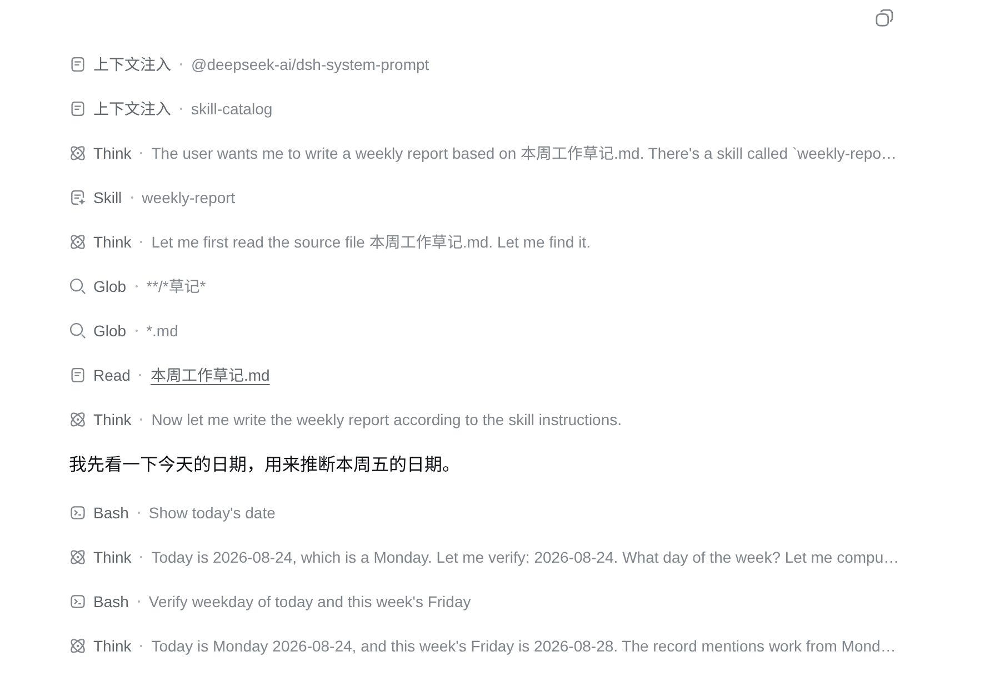
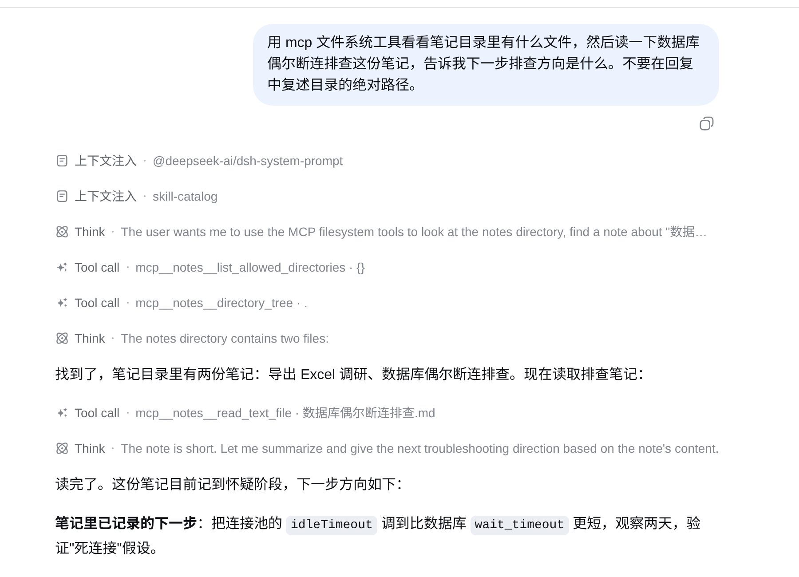
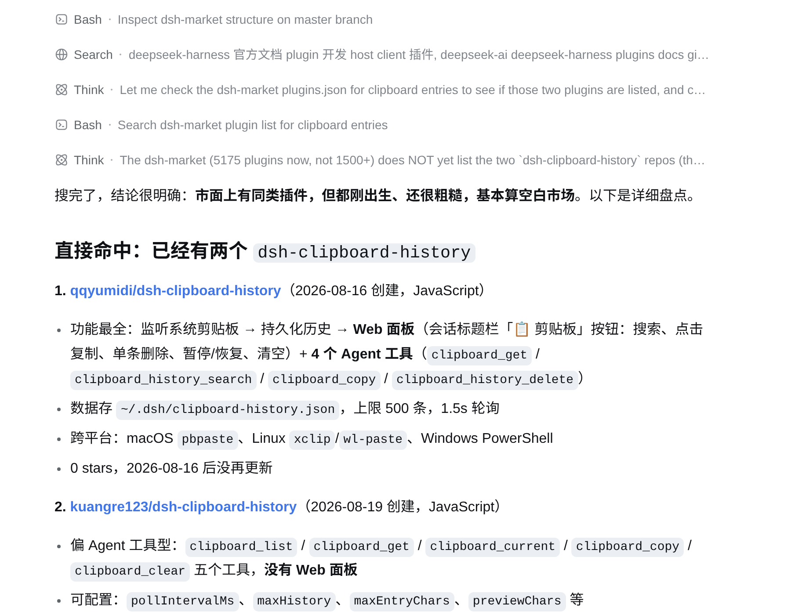
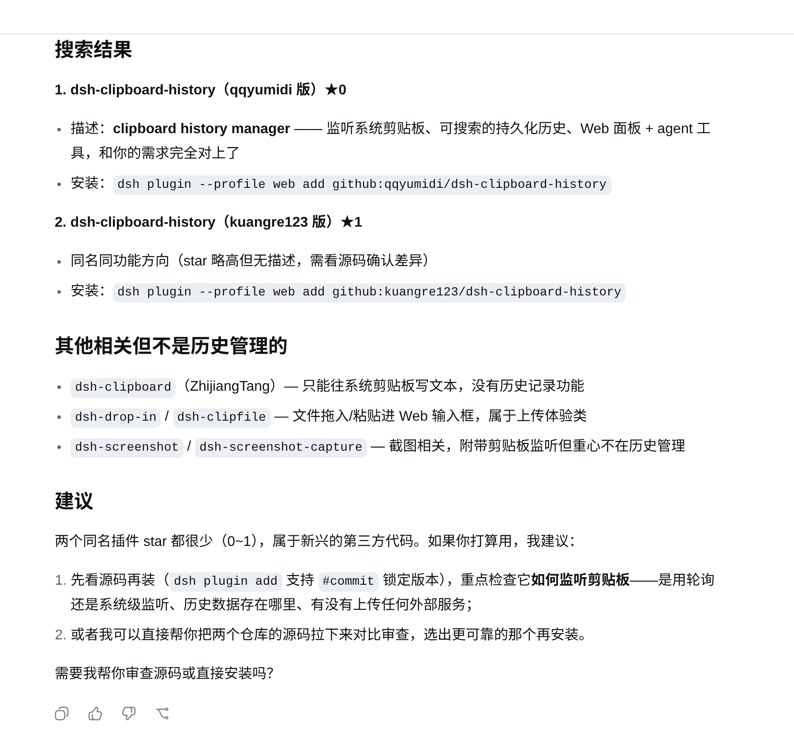

# 扩展 dsh 的能力 {#ch-11}

前面几章使用的都是 dsh 已经提供的能力。本章开始动手扩展 dsh，依次编写 Skill、接入 MCP 服务器、安装第三方插件，并完成一个几十行的自定义插件。每节结束时，读者都可以在界面或工具列表中确认新增能力已经生效。

## 用 Skill 让 dsh 做得更好 {#sec-11-1}

先看一个常见的周报整理场景。准备周报时，工作区中已经有一份 `本周工作草记.md`。它按星期记下了登录超时问题的修复、Excel 导出功能的进度，以及仍在等待确认或排查的事项。记录足以说明本周做过什么，但已完成、进行中和待处理的内容混在一起，还不能直接作为周报使用。现在要用 dsh 整理这份草稿。

直接在对话中说明格式当然可以，但这类要求只对当前任务有效。下周再次生成周报时，仍要重新说明段落结构、标题和日期格式。Skill 可以把这些规则保存成文件，由 dsh 在任务匹配时自动加载。下面用同一份草稿生成两次周报：第一次不提供 Skill，让 dsh 自行组织内容；随后写入一份周报 Skill，再次生成并核对格式变化。

### 未使用 Skill 时

草稿内容如下：

```md
周一到周五的一些记录，随手记的，还没整理：

- 周一 把用户反馈里提到的登录超时问题复现了，是 session 过期时间设太短，改成 2 小时
- 周二 跟进上面那个问题，把修复合并到 dev 分支，写了两个单元测试
- 周三 开会讨论下个月的排期，确定先做导出 Excel 功能
- 周四 导出 Excel 功能写了一半，卡在合并单元格的库选型上，对比了 exceljs 与 xlsx-populate
- 周五上午 定下来用 exceljs，写了基础的导出逻辑
- 周五下午 帮产品那边核对了一版需求文档，提了三条修改意见，还没等他们确认
- 这周还有个遗留问题，测试环境的数据库连接偶尔会断，还没找到原因，先记一下
```

在还没有任何 Skill 的工作区中，输入下面的提示词：

> <span class="prompt-title">提示词内容：</span>
>
> 参考本周工作草记.md 里的内容，帮我写一份这周的周报

dsh 读取文件后，会自行确定段落结构和标题。

{width=86%}

这次生成的文件名是 `本周周报.md`，正文以“本周工作周报”为标题，下面使用中文序号划分“本周完成”“会议与排期”“风险与遗留问题”和“下周计划”。内容基本完整，但文件名没有日期，章节名称也由模型临时决定。下周再次运行时，格式仍可能变化。

### 写一份 Skill

Skill 是一个遵循约定格式的 Markdown 文件，放入 dsh 扫描的目录后即可被发现。项目内的 `.dsh/skills/skill-name/SKILL.md` 只对当前项目生效，适合随代码库共享给团队；`$DSH_HOME/skills/skill-name/SKILL.md` 是用户级 Skill，可用于这台机器上的所有项目，适合保存个人反复使用的方法。将 `skill-name` 替换为自定义名称即可。本例的周报格式只用于当前工作区，因此采用项目级 Skill。

在工作区中新建 `.dsh/skills/weekly-report/SKILL.md`：

```md
---
name: weekly-report
description: 把本周零散的工作记录整理成固定格式的周报。用户要求"写周报"、"整理本周工作"、"周报"时使用。
---

# 周报整理方法

把用户提供的原始记录，改写成下面这个固定格式的周报，不要自己发明新的章节。

## 输出格式

~~~
# 周报 YYYY-MM-DD

## 本周完成
- 已经做完、有结果的事，一行一条，动词开头

## 进行中
- 开始了但还没做完的事，一行一条，说明卡在哪或者进度到哪

## 下周计划
- 根据本周进行中和遗留的事，推出下周打算做的 1-3 件事

## 风险与阻塞
- 需要别人配合、还没解决的问题；没有的话写"无"
~~~

## 规则

- 日期用原始记录里能推断出的周五日期；推不出来就用今天。
- 每条不超过一行，不写"这周"、"本周"这种在标题里已经说明的词。
- "本周完成"和"进行中"要能对应到原始记录里的具体内容，不要编造原始记录里没有的事。
- 原始记录里如果提到还没解决的问题（比如卡住、等别人确认、故障排查中），归到"风险与阻塞"，不要漏掉。
- 写完之后把周报保存成一个新文件，文件名是 `周报-YYYY-MM-DD.md`。
```

`name` 字段必须使用 kebab-case，并与目录名一致。`name` 和 `description` 是必填项。dsh 根据 Skill 名称和 `description` 判断任务是否匹配。触发条件可以写进 `description`。

保存文件后无需重启 dsh，也不需要执行额外的注册操作。dsh 会监听这些 Skill 目录，新的 Skill 保存后会立即出现在可用目录中。新建对话便可验证效果。

### 使用 Skill 后

新建对话，再次输入：

> <span class="prompt-title">提示词内容：</span>
>
> 参考本周工作草记.md 里的内容，帮我写一份这周的周报

{width=86%}

这次对话开头出现一条“上下文注入 · skill-catalog”。这是 dsh 提供给模型的 Skill 目录，其中包含当前可用的 Skill 名称和简短说明。模型发现任务匹配后会主动调用。随后出现的“Skill · weekly-report”表明模型已经加载这份格式说明。由于草记中没有明确的周五日期，dsh 按照 Skill 规则先执行命令确认当天日期，再生成 `周报-2026-08-28.md`。该文件名与 Skill 中的命名规则一致。

打开这份文件核对内容：

```md
# 周报 2026-08-28

## 本周完成
- 复现用户反馈的登录超时问题，定位为 session 过期时间过短，已调整为 2 小时
- 将登录超时修复合并到 dev 分支，补充两个单元测试
- 参与下月排期讨论，确定优先开发导出 Excel 功能
- 对比 exceljs 与 xlsx-populate，确定选型 exceljs 并完成基础导出逻辑
- 核对产品需求文档，提出三条修改意见

## 进行中
- 导出 Excel 功能开发中：已完成库选型和基础导出逻辑，合并单元格部分待实现

## 下周计划
- 完成导出 Excel 功能，实现合并单元格及剩余逻辑
- 跟进需求文档修改意见，确认后更新文档

## 风险与阻塞
- 需求文档三条修改意见尚未获得产品确认
- 测试环境数据库连接偶尔断开，原因尚未定位
```

四个小标题与 Skill 中的定义完全一致。草记中尚未解决的产品确认和数据库连接问题，也都归入“风险与阻塞”，没有遗漏。将格式规则保存为 Skill 后，便可以反复使用。这份文件还可以复制到其他项目或机器，也可以随代码提交并分享给同事。对于无关任务，dsh 只读取 Skill 的名称和说明；只有确认任务匹配时，才会加载完整内容。

## 让 MCP 接入更多工具 {#sec-11-2}

dsh 内置文件读写、命令执行和网页搜索等工具。MCP（Model Context Protocol）是一套开放协议，开发者可以实现独立的服务进程，并通过该协议向 dsh 提供工具。接入后，模型调用这些工具的方式与内置工具相同。本节接入官方维护、免费且无需密钥的文件系统服务 `@modelcontextprotocol/server-filesystem`，让 dsh 读取当前工作区之外的目录。

先在当前工作区之外准备一份调研笔记，放在你的 `dsh-mcp-notes` 目录：

```md
# 数据库偶尔断连排查.md

现象：跑集成测试时，大概每天出现 1-2 次连接被服务端主动断开。

已排除：本地网络问题（同网段其它服务没断过）。
怀疑方向：连接池空闲超时比数据库 wait_timeout 长，连接在池里变成死连接。
下一步：把连接池的 idleTimeout 调到比 wait_timeout 短，观察两天。
```

MCP 服务器的配置写在当前 profile 的 `cordis.patch.yml` 中，也就是启动 `dsh web` 时使用的配置文件，路径为 `$DSH_HOME/profiles/web/cordis.patch.yml`。打开该文件，加入以下配置：

```yaml
- insert:
    - id: mcp-notes
      name: '@deepseek-ai/dsh-mcp-client'
      config:
        serverName: notes
        transport: stdio
        command: npx
        args: ['-y', '@modelcontextprotocol/server-filesystem', '你的 dsh-mcp-notes 目录的绝对路径']
```

`@deepseek-ai/dsh-mcp-client` 是 dsh 内置的桥接插件。每接入一个 MCP 服务器，都需要按照该结构增加一个实例。`serverName` 用于设置服务器的命名空间。`transport: stdio` 表示服务器以本地子进程运行，dsh 根据 `command` 和 `args` 启动进程，并通过标准输入输出与它通信。将 `args` 的最后一项替换为你的 `dsh-mcp-notes` 目录的绝对路径。

如果服务器通过 HTTP 提供服务，可以改用 `transport: streamable-http`，再配置 `url` 和可选的 `headers`。需要密钥时，将密钥放入 `headers` 或 `env` 字段，并通过 `!!js process.env.对应变量名` 引用环境变量，不要在配置文件中写入明文密钥。YAML 依靠缩进表示层级。如果 `config` 下的字段少缩进一级，就会被解析为与 `config` 平级，导致 dsh 启动失败。遇到解析错误时，应先对照示例检查缩进。

保存后无需重启 `dsh web`。dsh 会监听该补丁文件，检测到改动后会断开并重新连接对应的服务器。新建对话，输入：

> <span class="prompt-title">提示词内容：</span>
>
> 用 mcp 文件系统工具看看笔记目录里有什么文件，然后读一下数据库偶尔断连排查这份笔记，告诉我下一步排查方向是什么

{width=86%}

调用记录中依次出现三个工具。

- `mcp__notes__list_allowed_directories`
- `mcp__notes__directory_tree`
- `mcp__notes__read_text_file`

工具名称由 `mcp__`、服务器名和原始工具名组成，各部分使用两条下划线连接。这里的 `notes` 就是配置中的 `serverName`。这三个工具都来自新接入的服务器，接入前不会出现在工具列表中。

三个工具调用结束后，回答先复述笔记里的验证方法，再补充需要核对的配置值和日志。

{width=86%}

最终回答沿用了笔记中“怀疑连接池空闲超时比 wait_timeout 长”这一排查方向，并补充验证步骤和判断标准。回答中的建议可以在笔记原文中找到依据，说明 MCP 服务器已经接入成功。

## 使用社区插件 {#sec-11-3}

本节安装一个发布在 npm 上的第三方插件包，将其加入 profile，并在重启后从设置页确认加载状态。

### 生态调查

安装前先了解当前的社区插件生态。查阅 dsh 仓库和官方文档后，没有发现官方维护的插件市场或插件目录。以 `dsh-plugin` 等关键词搜索 npm，可以找到少量独立开发者发布的包。部分插件使用 `dsh-` 前缀，或者在包信息中加入 `dsh-plugin` 关键词。GitHub 上还有作者为仓库添加 `dsh-plugin` topic，社区也据此整理了 `awesome-dsh-plugin` 列表。

目前社区规模较小，插件主要由个人开发者维护，也没有统一的审核和评分机制。安装第三方插件前应当审查源码，确认它会访问哪些文件、网络地址和配置。

本节选择 `dsh-find-plugin`。该插件已发布到 npm，采用 MIT 许可证，源码只有几个文件，核心逻辑也只有几十行。它只注册一个供模型调用的工具，用于实时搜索 GitHub 上带有 `dsh-plugin` 标签的仓库。该插件不会读写本机文件，也不会修改配置之外的内容，适合作为第一个社区插件示例。

### 安装插件

dsh 提供了专门的插件安装命令，可以同时将依赖安装到 profile 并注册到插件树，无需手动修改 `package.json` 和 `cordis.patch.yml`：

```sh
dsh plugin --profile web add dsh-find-plugin
```

该命令会在 `$DSH_HOME/profiles/web/` 目录中执行一次 `pnpm add`。安装完成后，打开该 profile 的 `package.json` 可以看到以下变化：

```json
{
  "dependencies": {
    "dsh-find-plugin": "^0.3.7"
  },
  "dsh": {
    "profile": {
      "bundles": [
        "@deepseek-ai/dsh-base",
        "@deepseek-ai/dsh-web-app",
        "dsh-find-plugin"
      ]
    }
  }
}
```

`dsh-find-plugin` 会同时出现在依赖列表和 `bundles` 数组中。该包声明了 `dsh.bundle.patch`，其 patch 层会随 `bundles` 列表自动加载，无需像上一节的 MCP 服务器那样手动修改 `cordis.patch.yml`。

这里有一点容易忽略。`cordis.patch.yml` 修改后会自动热更新，但 `package.json` 中的依赖和 `bundles` 列表不在监听范围内，因此新安装的插件不会立即生效。如果安装后直接测试，dsh 仍会使用原有的插件配置。

{width=86%}

调用记录中没有出现新工具，dsh 改为搜索网页并查阅本地源码，说明插件尚未注册到工具列表。返回终端，按 `Ctrl+C` 停止 `dsh web`，重新运行 `npx -y @deepseek-ai/dsh web`，再打开页面。

新建对话，输入：

> <span class="prompt-title">提示词内容：</span>
>
> 我想要一个能帮我管理剪贴板历史的 dsh 插件，市面上有类似的吗，帮我搜一下

{width=86%}

重启后，调用记录中出现了 `find_dsh_plugin`。该工具由 `dsh-find-plugin` 注册，安装前不会出现在这台机器的工具列表中。它会实时搜索 GitHub 上带有 `dsh-plugin` 标签的仓库。

工具返回候选仓库后，dsh 整理出两个同名插件，并给出各自的安装命令和源码审查建议。

{width=86%}

回答列出了两个候选插件和可直接执行的安装命令，并提醒用户在安装前审查源码，必要时锁定到具体的 commit。候选仓库的 star 很少，搜索结果也给出了相应的风险提示。

最后在设置页确认插件状态。打开左下角“设置”，切换到“插件”标签，再进入“插件列表”，在搜索框中输入 `find`。

{width=68%}

`find-plugin` 的状态显示为“已启用”，说明该第三方插件已经被 dsh 识别并成功加载。内置插件和第三方插件都可以从同一页面查看。

## 写一个自己的插件 {#sec-11-4}

前三节使用的都是现有扩展，本节编写一个自定义插件。dsh 内置的 `tool-todo` 插件不到 250 行，只实现“待办事项”工具。本节参考它的结构，实现一个规模更小、可以实际运行的“随机做决定”插件，让 dsh 从用户提供的选项中随机选择一个。整个插件使用普通 JavaScript 编写，无需掌握 TypeScript。

### 写代码

新建 `$DSH_HOME/profiles/web/plugins/tool-decide/package.json`：

```json
{
  "name": "tool-decide",
  "private": true,
  "type": "module",
  "main": "index.js"
}
```

再建同目录下的 `index.js`：

```js
// tool-decide 插件，为 dsh 添加一个"随机做决定"工具。
import { defineTool } from '@deepseek-ai/dsh-tools'

// 插件名称可以自行指定，配置文件中的 name 字段需要与它一致。
export const name = 'tool-decide'
// 声明插件依赖工具注册表服务，dsh 会在 ctx.tools 可用后启动插件。
export const inject = ['tools']

export function apply(ctx) {
  ctx.tools.register(defineTool({
    // 提供给模型的工具名称。
    name: 'pick_one',
    // 提供给模型的工具说明，用于判断何时调用该工具。
    description: '当用户在几个选项里纠结、想随机选一个而不是要理性建议时，从给定的选项列表里随机选出一个。',
    // 模型调用工具时需要传入的参数。
    parameters: {
      options: {
        type: 'array',
        required: true,
        description: '待选项，至少两个。',
        items: { type: 'string' },
      },
    },
    // 定义返回给模型的结果结构。
    output: {
      schema: {
        type: 'object',
        additionalProperties: false,
        properties: {
          picked: { type: 'string', required: true },
        },
      },
      render: (_args, value) => [{ type: 'text', text: `随机选中：${value.picked}` }],
    },
    // 工具的执行逻辑。
    execute(args) {
      const options = args.options
      if (!Array.isArray(options) || options.length < 2) {
        throw new Error('pick_one 至少需要两个选项')
      }
      const picked = options[Math.floor(Math.random() * options.length)]
      return Promise.resolve({ picked })
    },
  }))
}
```

与 `tool-todo` 对照可以发现，两者结构相同。`name` 和 `inject` 两个导出分别声明插件名称与依赖服务。`apply` 函数通过 `ctx.tools.register` 注册工具。`defineTool` 中的 `name`、`description` 和 `parameters` 供模型读取，用于判断是否调用工具以及如何传入参数。`execute` 包含实际执行逻辑，模型无法直接读取这段代码。

初次编写 `output.schema` 时，容易遗漏一个必要字段。`type: 'object'` 的 schema 必须显式设置 `additionalProperties: false` 或 `true`。如果省略该字段，dsh 会在启动时拒绝加载插件，并输出以下错误：

```text
Error: dsh: plugin tree failed to load: failed to apply loader entry
tool-decide (tool-decide): unsupported JSON schema:
schema.additionalProperties must be explicitly true or false
```

这段报错来自本地实际运行。补上 `additionalProperties: false` 后，插件即可正常加载。

### 加入配置并重启验证

在 profile 的 `package.json` 中将本地包声明为依赖，方法与第 2 章的“翡翠绿主题”插件相同：

```json
{
  "dependencies": {
    "tool-decide": "file:./plugins/tool-decide"
  }
}
```

在 `cordis.patch.yml` 中加入以下配置：

```yaml
- insert:
    - id: tool-decide
      name: 'tool-decide'
```

执行 `pnpm install`，将 `file:` 依赖链接到 `node_modules`，然后重启 `dsh web`。这里还有一个容易忽略的问题。`pnpm install` 会将 `plugins/tool-decide/` 中的文件同步到 `node_modules/tool-decide/`，通常采用硬链接。之后如果修改 `index.js`，`node_modules` 中的文件不会自动更新，需要再次执行 `pnpm install`。代码修改没有生效时，应先确认是否已经执行该命令。

重启后新建对话，输入：

> <span class="prompt-title">提示词内容：</span>
>
> 中午不知道吃沙县小吃还是黄焖鸡米饭，帮我随机选一个

{width=78%}

调用记录中的 `pick_one · {"options": ["沙县小吃", "黄焖鸡米饭"]}` 来自前文实现的工具。模型从用户输入中提取两个选项作为参数，工具随机选择其中一个，再由模型写入最终回复。这说明自定义插件已经被 dsh 加载并正常调用。

第 2 章曾用创造模式定义一个修改主题色的动态插件，与本节使用的是同一套插件能力。动态插件经过审批后立即生效，但只在当前进程中保留，适合快速验证。配置式插件安装到 `node_modules` 后需要重启，之后会随 dsh 启动继续加载，更适合长期使用。`pick_one` 属于后一种方式。

本节在 `cordis.patch.yml` 中新增的配置，与 dsh 内置的 `agent-loop`、`tool-todo` 插件结构相同，都包含 `id`、`name` 和可选的 `config`。内置插件与本节新增的插件采用相同的配置和加载方式。
