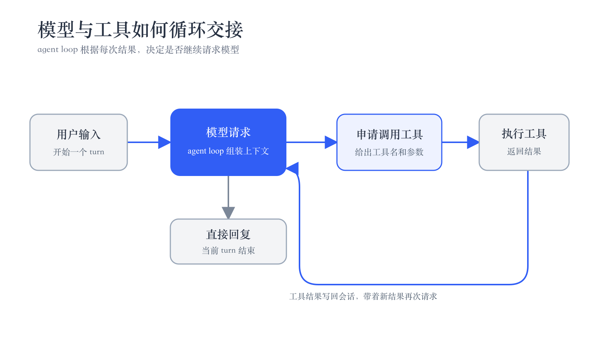
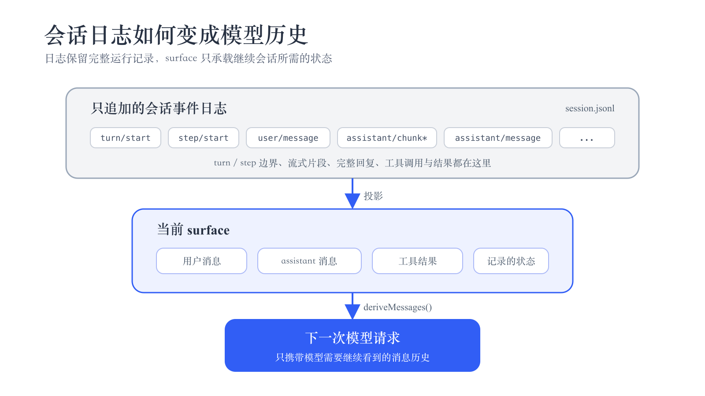
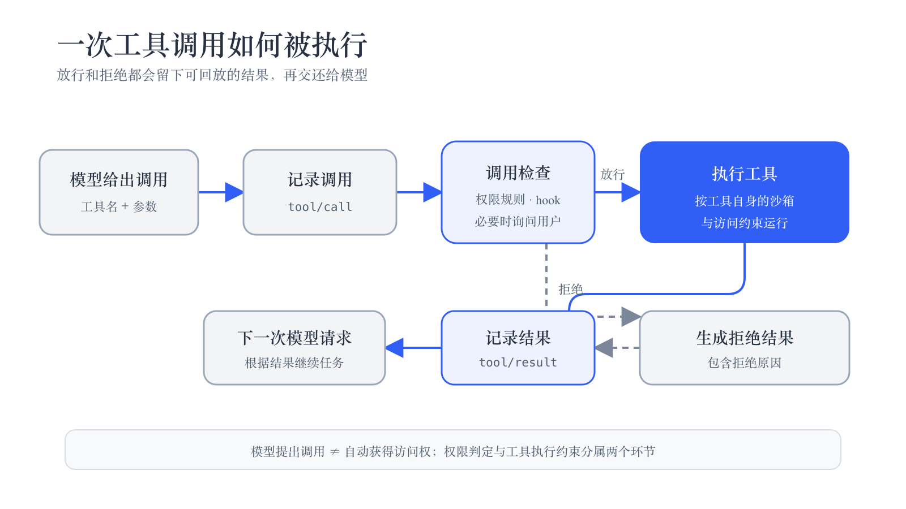
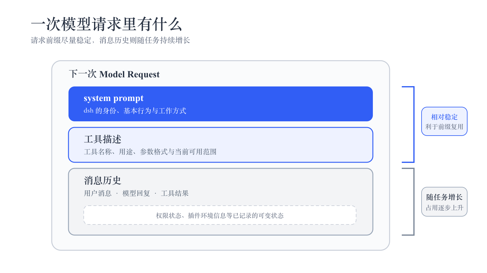
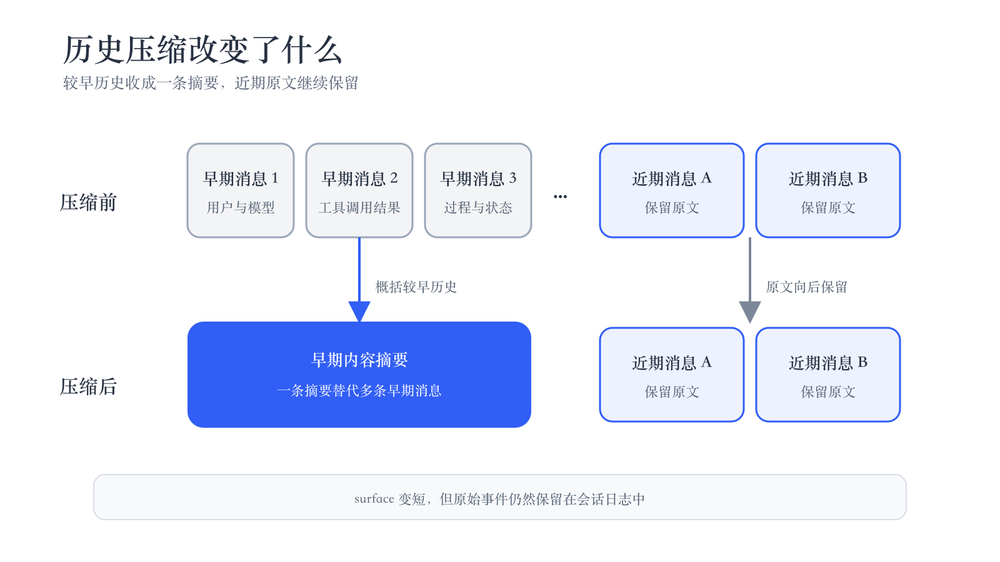

# Harness 的工作原理 {#ch-11}

前几章已经用 dsh 完成了文件操作、多 Agent 协作等任务。本章把视角从操作界面转向内部过程，看看 dsh 怎样完成一次任务：模型如何在 Agent Loop 中反复调用工具，会话怎样被记录和恢复，工具调用如何经过权限检查，越来越长的上下文又怎样被控制在模型窗口以内。弄清这些机制后，再看界面上的轮次、步骤、Session log、token 和上下文占用，就容易理解它们分别在记录什么。

## 从聊天助手到 Harness {#sec-11-1}

回看我们在第 1 章向 dsh 打招呼时，模型直接回了一句话，状态栏显示“1 轮 · 1 步”。后来我们又让 dsh 新建 `about-dsh.md`，消息流里则多出一张 Write 工具卡片。文件写好以后，dsh 才给出回复。

把这些执行过程串起来的运行框架，就是 Harness。它维护任务状态、组装模型请求、执行工具，并根据执行结果继续推动模型，直到任务结束。

在 dsh 的工作流程里，模型负责判断下一步，Agent Loop 负责把任务往前推。每一步开始时，Agent Loop 根据当前会话组装模型请求。模型可以直接回复，也可以申请调用工具。工具执行完成后，结果被写回会话，Agent Loop 再次请求模型。这个过程不断重复，直到模型给出最终回复。下图展示了这套循环。

{.book-technical-figure width=72%}

turn 和 step 记录的是两个不同层次。一个**轮次**（turn）对应 dsh 对一条用户消息的完整处理：用户发出消息时开始，任务结束时结束。一个**步骤**（step）对应其中的一次模型请求，以及这次请求可能触发的工具调用。因此，一个 turn 通常包含一个或多个 step。

第 1 章那次“你好”只请求了一次模型，也没有调用工具，所以显示“1 轮 · 1 步”。如果用户要求整理文件，仍然只算一个 turn，但模型可能先查看目录，再读取文件，最后修改文件。每次根据新的工具结果重新请求模型，都会产生新的 step，因此界面可能显示“1 轮 · 多步”。

多 Agent 任务也服从同样的结构。第 3 章用过的多 Agent 调研，在主 Agent 看来可以表现为一次工具调用；工具内部再运行自己的 agent loop，完成任务后把最终结果返回给主 Agent。

> **深入一点。** turn 和 step 的边界并不完全重合。用户消息进入处理流程后，dsh 会先记录 `turn/start`；正式请求模型时才产生 `step/start`。如果插件在 `agent/pre-step` 阶段终止任务，这次处理仍然有 turn，但没有 step。界面的“轮”采用更接近实际模型执行的统计口径，只统计至少完成过一个 step 的 turn。
>
> 一旦一步已经开始，结束时就会写入 `step/end`，即使中途失败或被取消。因此，界面的步数应当按照 `step/end` 统计，而不是按照聊天界面中可见的消息或工具卡片统计。

**亲手验证。** 给 dsh 一个需要读取并修改文件的任务。任务结束后打开 Session log，比较界面显示的步数与日志中 `step/end` 的数量。两者应当一致；不要按照聊天气泡或工具卡片计数，因为失败或取消的步骤也可能被记录。

## 消息与会话 {#sec-11-2}

完成一次任务后，即使退出 dsh，过一会儿再打开同一个会话，前面的消息仍然能够恢复。这是因为任务进行过程中，dsh 会持续把用户消息、模型输出、工具调用等内容写入会话日志。重新打开会话时，它再从这份日志恢复之前的状态，不需要用户另外执行“保存”。

要查看这些原始记录，可以点击右上角的“Session log”。下载并解压 ZIP 归档后，先看顶层的 `session.jsonl`。子 Agent 的日志位于 `subagents/<id>/`，会话引用过的图片位于 `media/`。磁盘上的日志默认使用 zstd 压缩；导出的 `session.jsonl` 已经解码，可以直接用文本编辑器打开。

`session.jsonl` 的每一行都是一条事件。一个轮次由 `turn/start` 和 `turn/end` 划定，其中可能包含一个或多个步骤，每个步骤又有 `step/start` 和 `step/end`。用户消息记录为 `user/message`；模型流式生成时会连续产生 `assistant/chunk`，完成后再用 `assistant/message` 保存完整回复；工具调用则对应 `tool/call` 和 `tool/result`。

这些事件把一次任务的完整运行过程都留了下来，但下一次请求模型时，dsh 并不会把整份日志原样塞进上下文。例如 `turn/start`、`step/end` 和流式生成产生的 `assistant/chunk` 都是运行记录，本身没有必要再次交给模型。

dsh 会先从日志中整理出一份供会话继续使用的消息视图，这就是 **surface**。它主要包含用户消息、模型的完整回复和工具结果，也可以包含 dsh 或插件注入并记录的运行状态。随后，`deriveMessages()` 再根据这些内容构造下一次模型请求中的消息历史。

下图展示了这两个层次之间的关系。

{.book-technical-figure width=72%}

会话继续时，新内容会通过 `append` 加入 surface。surface 也可以通过 `replace` 更新已有内容，例如后面会看到的历史压缩。无论哪种操作，原始事件仍然保留在会话日志中，因此 surface 的变化不会破坏完整的运行记录。

这也解释了 dsh 会话机制中的一条重要规则：**模型能够看到的内容，应当已经被记录下来。** 只有这样，进程退出后重新恢复会话时，dsh 才能重新构造模型此前看到的历史，而不是依赖只存在于内存中的临时状态。

> **深入一点。** surface 最终会被整理成带有 `role` 和内容的模型消息。`role` 包括 `system`、`user` 和 `assistant`，内容可以由文本、图片、工具调用等不同类型的块组成。工具结果也使用 `user` role，但内容是 `tool-result` 块，并带有对应工具调用的 `callId`，因此 dsh 和模型能够把它与普通的用户输入区分开来。
>
> 会话在异常退出后也可以继续恢复。重新加载时，dsh 会保留已经完整写入日志的事件。如果存在没有返回结果的工具调用，会补上一条表示中断的 `tool/result`；尚未结束的步骤和轮次也会分别补上 `step/end` 和 `turn/end {interrupted}`。如果日志最后只有一条写到一半的记录，这条不完整事件会被丢弃。

**亲手验证。** 打开一个做过文件操作的会话，点击“Session log”并解压下载的 ZIP。在根目录的 `session.jsonl` 中搜索 `tool/call`，记下其中的 `callId`，再查找对应的 `tool/result`。两条记录应当使用相同的 `callId`，从而把一次工具调用和它的执行结果对应起来。

## 工具调用与结果返回 {#sec-11-3}

模型需要使用工具时，会在回复中给出工具名和一组参数。每次模型请求都会附上当前可用的工具表，其中写明名称、用途和参数格式。模型据此决定是否调用工具，以及传入什么参数。

收到调用后，dsh 会先把它写入日志，再经过权限规则和 hook 检查。检查可能直接放行，也可能拒绝调用，或者要求用户确认。通过检查以后，工具才会按照自己的执行环境和权限约束运行。

工具运行成功、失败或被拒绝，dsh 都会把相应结果写入会话日志。下一次请求时，这条结果会进入消息历史。模型可以据此继续任务，也可以在调用被拒绝后读取原因，调整后续行动。下图展示了这条完整路径。

{.book-technical-figure width=72%}

不同工具还会受到各自的执行约束。文件和 Shell 工具会应用相应的沙箱与访问规则，其他工具则按照各自定义的权限运行。也就是说，模型提出工具调用，并不意味着它自动获得了工具能够触及的全部资源。

输入框旁的权限模式可以直接观察这种限制。例如，在 **Workspace Write** 下，文件工具可以修改当前工作区和指定的临时目录；如果操作需要访问其他位置，dsh 会先询问用户。切换到 **Read Only** 后，同样的写文件请求会被拒绝。拒绝本身仍然会形成工具结果并返回给模型，因此不会打断前面介绍的 agent loop。

> **深入一点。** 模型一次回复中也可能提出多个工具调用。dsh 默认依次执行；只有工具明确允许本次调用并发时，相关调用才会同时运行。
>
> dsh 还会检查模型是否反复提交完全相同的工具调用。如果同一个工具以相同参数连续出现，在第 3、5、8 次时，dsh 会在后续模型请求中加入提醒，让模型重新判断是否有必要继续。这个提醒不会直接取消调用，工具仍然需要经过正常的权限检查和执行流程。

**亲手验证。** 先在 Workspace Write 下让 dsh 新建一个文件，再打开 Session log。对应记录中应先出现 `tool/call`，随后出现带有相同 `callId` 的 `tool/result`。然后切换到 Read Only，再次请求写文件。第二次调用同样会留下 `tool/result`，但其中记录的是写入被拒绝的结果。

## 上下文管理 {#sec-11-4}

任务越长，模型需要回看的内容通常越多。系统说明、工具描述、之前的消息和刚刚得到的工具结果都会占用上下文窗口，而模型能够接收的上下文长度有限。因此，dsh 不仅要决定每次请求向模型提供哪些内容，还要在历史不断增长时控制它的长度。

### 一次请求包含什么

一次模型请求可以先看成三个主要部分：**system prompt、工具描述和消息历史**。

system prompt 位于最前面，用来说明 dsh 的身份、基本行为和工作方式。工具描述告诉模型当前有哪些工具可用，以及每个工具的用途和参数格式。消息历史则来自上一节介绍的 surface，包含用户消息、模型回复、工具结果等已经记录的内容。

运行过程中还会出现一些会变化的状态，例如当前权限模式或插件补充的环境信息。按照上一节“模型可见即已记录”的原则，这些状态不会只在请求模型时临时拼进去，而是先作为带来源的消息记录下来，再通过 surface 进入后续请求。状态没有变化时，也不需要在每一步重复加入相同内容。

下图展示了这些内容在一次模型请求中的关系。

{.book-technical-figure width=72%}

### 如何统计 token 数

模型能够接收的上下文长度有限，服务商返回的实际 token 用量却要等请求完成后才能得到。发送请求前，dsh 还不知道内容是否已经接近上限，所以会先估算 system prompt、工具描述和消息历史占用的 token 数。空间不足时，需要先缩短历史。

对于文本块，dsh 使用下面的公式快速估算：

$$
t(\text{文本})=
\left\lceil
\dfrac{\text{字符数}}{4}
\right\rceil+4
$$

也就是每 4 个字符粗略折算成 1 个 token，再加上 4 个 token 的块开销。工具调用还会分别估算工具名和 JSON 参数，工具结果则估算其中包含的内容块；每条消息的 `role` 等结构信息也会产生额外开销。

这个公式给出的只是请求前的近似估计，并不等同于模型实际使用的 tokenizer。对于中文、JSON Schema 等内容，估算值和实际值可能有较大差异。请求成功后，dsh 会记录服务商返回的实际 token 用量。后续请求再以这个数字为基准，只估算新增或被替换的部分，从而减少误差。

这里还要区分界面上的两类数字。

**聊天统计行**记录已经发生的模型请求，并把各步的 token 用量累计起来。一个任务如果经过五个 step，就会累计五次模型请求产生的输入、输出和缓存用量。因此，这个数字会随着任务执行不断增加。

**上下文占用面板**关注的则是下一次准备发送给模型的内容。它估算当前 system prompt、工具描述和消息历史一共占据多少上下文，用来判断模型窗口还剩多少空间。

因此，两处数字回答的是不同问题：

- 统计行：到目前为止一共用了多少 token；
- 上下文占用：下一次请求将占用多少上下文。

前者是累计用量，后者是当前请求的大小，两者通常不会相等。

### 如何计算缓存命中率

除了普通输入 token，模型服务商还可能提供**前缀缓存**。如果后续请求与已经缓存的请求共享一段相同前缀，服务商就可能复用这部分计算。

统计行中的缓存命中率按照下面的方式计算：

$$
\text{命中率}=
\dfrac{\text{缓存读取 token 数}}
{\text{未缓存输入 token 数}
+\text{缓存读取 token 数}
+\text{缓存写入 token 数}}
$$

这里的缓存属于模型服务商，与上一节介绍的 dsh 会话日志是两套不同的机制。会话日志解决的是“怎样记录和恢复任务”，前缀缓存解决的是“相同的模型输入怎样减少重复计算”。

前面展示的请求结构正好有利于这种缓存。system prompt 和工具描述通常比较稳定，消息历史也主要随着任务推进向后增长，因此连续请求往往共享很长的开头。一个前缀第一次出现时通常还没有可复用的缓存，因此命中率可能为 0%；后续请求继续沿用这段前缀时，就可能产生更多缓存读取。

统计行显示的是整个任务执行至今的累计命中率，因此其中也包含第一次建立缓存时产生的成本。切换模型、改变可用工具，或者压缩并替换较早的消息历史，都可能改变请求前缀，使之后的缓存命中率下降。

### 上下文过长时的处理

把模型的上下文窗口记为 $W$。本章所用版本将 DeepSeek-V4-Flash 和 DeepSeek-V4-Pro 的上下文窗口登记为 1,000,000 token，也就是说，一次请求中的 system prompt、工具描述、消息历史和预留输出空间都必须受到这个窗口限制。“最大输出”则是另一项限制，它只约束模型一次最多生成多少 token。

当上下文不断增长时，dsh 不会立刻摘要整个会话，而是按照从局部到整体的顺序逐步缩短内容。

第一层是 **spill**。如果某次工具调用返回了特别大的文本，dsh 会把完整内容保存到 spill（溢出）文件，只在后续上下文中保留部分开头、结尾以及取回完整内容的方法。这样，一次异常大的命令输出不会直接占满模型窗口。

第二层是**裁剪较早的大型工具结果**。随着会话继续增长，dsh 会优先缩短历史中体积较大的旧工具输出，只留下其中较有代表性的开头和结尾。近期消息和普通对话尽量保持不变。

如果这样仍然无法腾出足够空间，才进入第三层：**历史摘要**。dsh 让模型概括一段较早的消息，用一条摘要替代这些内容，同时保留较近期的消息原文。下图用一个简化的例子表示这种变化。

{.book-technical-figure width=72%}

这三层处理都只改变模型后续看到的内容，不会删除会话日志中的原始记录。spill 文件仍保存完整工具输出，已经写入的 `tool/result` 和旧消息也仍然存在。因此，上下文变短并不意味着会话历史本身被删除。

**本版本默认值。** 下面的阈值可以由 profile 或模型策略调整。

| **设置**             | **默认值**                                                |
| -------------------- | --------------------------------------------------------- |
| 工具结果 spill       | 文本超过 50,000 个 UTF-8 字节                             |
| 较早工具结果裁剪     | 文本超过 8192 个 Unicode 码点；保留前 4096 个和后 1024 个 |
| 历史摘要触发         | 上下文占用达到约 $0.8W$                                   |
| 摘要后保留的近期原文 | 约 $0.16W$                                                |

除了自动处理，用户也可以主动压缩历史。在一个已经积累较多消息的会话中执行 `/compact`，dsh 会尝试把可压缩的较早历史整理成摘要。压缩完成后，界面会显示本次处理了多少条历史；下一次模型请求中的上下文占用也会相应下降。

这种摘要会改变模型请求的较早前缀，因此上一节介绍的前缀缓存也可能受到影响：可复用的相同前缀变短后，缓存命中率可能暂时下降。

> **深入一点。** 自动压缩会在下一次模型请求之前，根据估算出的上下文占用判断是否需要执行。由于这里使用的是估算值，它和服务商实际使用的 tokenizer 并不完全一致。因此，即使估算值尚未达到阈值，服务商仍可能返回“上下文过长”的错误。
>
> 遇到这种情况，dsh 会在当前 step 中再次尝试压缩。如果压缩确实缩短了上下文，就使用新的历史重新请求模型，而不会重新开始 turn 或 step；如果仍然无法释放足够空间，原来的错误才会返回。

**亲手验证。** 找一个历史较长的 Web 会话，在输入框中执行 `/compact`。压缩成功后导出 Session log，搜索 `compaction/start`、`compaction/summary` 和 `compaction/end`，查看这次压缩的完整记录。再观察上下文占用面板，预计用量应当下降。

如果界面提示 `No compactable history yet.`，说明当前还没有足够的旧历史可供压缩。继续对话一段时间后再试。

回看本章，一次 dsh 任务并不是模型单独完成的。Harness 用 agent loop 推动模型和工具反复交接，用会话日志保存执行过程，用权限机制约束工具行为，再通过 surface、token 估算和历史压缩控制模型实际看到的上下文。界面上的轮次、步骤、Session log、token 和上下文占用，正是这套运行机制在用户侧留下的不同视图。
