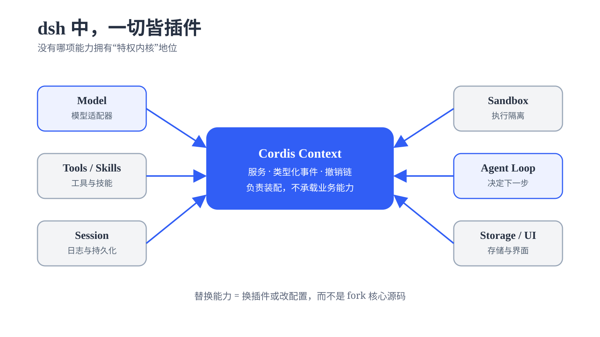

# dsh 的核心：Cordis {#ch-12}

上一章沿着一次任务的执行过程，介绍了模型、工具、会话和 Agent Loop 怎样配合完成任务。在 dsh 中，这些能力由不同插件提供，Cordis 负责组织这些插件的运行。

本章从 Cordis 本身讲起，先用小示例看清插件的生命周期、依赖和通信，再回到 dsh 的配置与工具调用过程。

## 认识 Cordis {#sec-12-1}

Cordis 是一个用于组织 TypeScript 插件的运行时框架。它根据配置加载插件，为插件提供共享的运行上下文，并管理每个插件实例从启动到退出的状态。当配置或依赖发生变化时，Cordis 还可以只更新受到影响的插件。

Cordis 自己不提供模型、工具或会话等业务能力。它提供插件加载、生命周期、依赖和事件通信等运行规则，让这些能力可以由独立插件实现，再在同一个程序中协作。

下面几个概念会贯穿本章。这里先了解它们各自代表什么，后面再结合插件代码逐步展开。

| 概念    | 这里先这样理解                                 |
| ------- | ---------------------------------------------- |
| Context  | 插件运行时使用的上下文，也是访问其他能力的入口 |
| Plugin   | 可以被 Cordis 加载的一段功能定义               |
| Fiber    | Plugin 一次挂载所产生的运行实例                |
| Loader   | 根据配置加载、更新和卸载插件                   |
| Service  | 一个插件向其他插件提供的能力                   |
| Event    | 插件之间发送通知或介入运行过程的机制           |
| Effect   | 与 Fiber 生命周期绑定、停止时需要清理的副作用  |

其中最需要先分清的是 Plugin 和 Fiber：

```text
Plugin          挂载          Fiber
代码定义  ───────────────►  一次运行实例
```

同一个 Plugin 可以被多次挂载，每次挂载都会产生一个 Fiber。Plugin 是可以反复使用的代码定义，Fiber 则记录其中一次运行的状态、依赖和清理操作。这个 Fiber 后续可能因为依赖变化而卸载、等待、重新激活，但仍是同一个运行实例。

接下来从一个最小插件开始，逐步观察表中的机制怎样工作。等这些概念建立起来后，再把它们放回 dsh 的完整配置中。

## 插件如何加载和卸载 {#sec-12-2}

完整的 dsh 一次会加载许多插件，不容易看清其中一个插件从加载到退出经历了什么。本节先把环境缩到最小，只运行本书配套示例中的一个 `hello` 插件。借助这个例子，可以单独观察 Loader 怎样读取配置、Plugin 怎样产生 Fiber，以及 Fiber 停止时怎样清理自己注册的资源。

### 从 Plugin 到 Fiber

先看一个最简单的插件 `hello.js`：

```js
export const name = 'hello'

export function apply(ctx) {
  console.log('hello from my first plugin')
}
```

这里的 `apply()` 是插件被加载时执行的入口。`ctx` 则是 Cordis 为这次插件运行提供的 `Context`，后面插件访问服务、监听事件和注册清理逻辑都要通过它完成。

同一目录再创建 `cordis.yml`：

```yaml
- name: './hello.js'
```

这份配置只有一个插件项，表示本次只需要加载 `hello` 插件。相比完整的 dsh 配置，我们可以把 Loader 的行为集中在这一项上。

打开 `demo/chapter12-cordis/12-2-lifecycle`，先安装依赖，再运行示例：

```bash
pnpm install
pnpm exec cordis
```

终端会输出：

```text
hello from my first plugin
```

这行输出说明 `hello` 插件已经被加载，`apply()` 也已经执行。

整个过程可以整理为下面这条路径：

```text
cordis.yml
    │ 选择插件
    ▼
  Loader
    │ 导入并挂载
    ▼
  Plugin
    │ 产生运行实例
    ▼
  Fiber
    │ 执行入口函数
    ▼
apply(ctx)
    │
    ▼
终端输出
```

这里先记住一条主线：**配置选择 Plugin，挂载产生 Fiber，`apply(ctx)` 在这个运行实例中执行。** 同一个 Plugin 可以被多次挂载，每次都会产生自己的 Fiber。

### 用 config 为插件传入参数

前面的 `hello` 插件没有参数，因此每次运行都会输出同一句话。实际插件往往需要根据当前环境改变行为，例如使用不同的问候语、连接地址或超时时间。Cordis 允许在 `cordis.yml` 的插件条目中写入 `config`，为这一次挂载提供运行参数。

`name` 决定加载哪个 Plugin，`config` 决定这个 Plugin 本次怎样运行。Loader 挂载插件时，会把处理后的 `config` 作为第二个参数传给 `apply(ctx, config)`。因此，同一个 Plugin 可以用不同的 `config` 多次挂载，每个 Fiber 都保留自己的配置。

Cordis 公开的插件入口只有 `ctx` 和 `config` 两个参数。配置条目中的 `id`、`name`、`disabled` 和 `inject` 由 Loader 与运行时负责处理，不会成为 `apply()` 的第三个参数。插件需要的服务和当前 Fiber 等运行信息，都从 `ctx` 中取得。

插件还可以导出一个名为 `Config` 的 Schema。Cordis 会先用它校验配置并补全默认值，通过后才会调用 `apply()`。

```typescript
import type { Context } from '@deepseek-ai/cordis'
import Schema from '@deepseek-ai/schemastery'

export interface Config {
  greeting: string
  targets: string[]
}

export const Config: Schema<Config> = Schema.object({
  greeting: Schema.string().default('Hello'),
  targets: Schema.array(String).default(['world']),
})

export function apply(_ctx: Context, config: Config) {
  for (const target of config.targets) {
    console.log(`${config.greeting}, ${target}!`)
  }
}
```

代码中出现了两个同名的 `Config`，它们在不同阶段工作。

| 写法                          | 工作阶段           | 作用                                               |
| ----------------------------- | ------------------ | -------------------------------------------------- |
| `interface Config`            | 编写和编译代码时   | 告诉 TypeScript，`config` 应该有哪些字段和类型     |
| `export const Config = ...`   | 插件加载时         | 让 Cordis 检查 YAML 中的实际数据，并补上默认值     |

TypeScript 允许类型和运行时变量使用同一个名称。`interface Config` 只供编译器和编辑器检查代码，编译后不会保留，也不会负责接收 YAML 数据。`const Config` 是运行时真实存在的 Schema，Cordis 会在执行 `apply()` 前读取它。

```text
cordis.yml 中的原始 config
          │
          ▼
const Config 校验数据并补默认值
          │
          ▼
作为第二个参数传入 apply(ctx, config)

interface Config ──► 在编写代码时检查 config 的用法
```

例如，如果只配置 `targets`：

```yaml
- name: './config-demo.ts'
  config:
    targets: ['alpha', 'beta']
```

这个插件启动时会得到：

```text
Hello, alpha!
Hello, beta!
```

配置中没有提供 `greeting`，运行时的 Schema 因此补上默认值 `Hello`。等到 `apply(ctx, config)` 被调用时，第二个参数已经是校验并补全后的 `{ greeting: 'Hello', targets: ['alpha', 'beta'] }`，插件可以直接使用它。

如果把 `targets` 错写成字符串：

```yaml
config:
  targets: 'not-an-array'
```

这份配置不符合 Schema 对 `targets` 的约束，因此会在 `apply()` 执行之前校验失败。对应 Fiber 进入 `FAILED`，`apply()` 不会被调用。这样，错误配置会停在插件入口之外，不会作为不符合约定的数据继续进入插件逻辑。

### 让资源跟随 Fiber 清理

插件开始运行后，还可能创建定时器、连接或文件监视器。这些资源如果比插件活得更久，就可能在插件卸载后继续运行，因此也需要跟随对应的 Fiber 一起清理。

Cordis 把这类需要随 Fiber 撤销的操作表示为 **Effect**。对于 Cordis 本身不知道怎样释放的资源，可以用 `ctx.effect()` 在创建资源的同时返回一个清理函数，说明卸载时怎样处理它：

这个清理函数在 Cordis 中称为 **disposer**，也就是“资源释放函数”。它不接收参数，执行后应撤销 Effect 创建的资源。创建定时器时，disposer 负责停止定时器，打开连接时，disposer 负责关闭连接。Cordis 不需要理解资源本身，只需要保存并在适当的时候调用对应的 disposer。

```typescript
const stopHeartbeat = ctx.effect(() => {
  // Effect 主体：创建资源
  const timer = setInterval(() => console.log('tick'), 200)

  // 资源 disposer：释放上面创建的资源
  return () => {
    clearInterval(timer)
    console.log('heartbeat cleaned up')
  }
})
```

传给 `ctx.effect()` 的函数称为 Effect 主体，它会立即执行，因此定时器在插件加载时开始工作。Effect 主体返回的函数负责释放定时器，可以把它称为“资源 disposer”。Cordis 会把这个 disposer 收集到整项 Effect 中。

`ctx.effect()` 自身还会返回另一个 disposer，上例将它保存为 `stopHeartbeat`。为便于区分，可以把它称为“Effect disposer”。它代表整项 Effect，调用它会执行这项 Effect 收集的资源 disposer，从而提前停止定时器：

```typescript
await stopHeartbeat()
```

多数情况下不需要主动调用 `stopHeartbeat()`。Effect disposer 已经挂在当前 Fiber 上，Fiber 卸载时会自动调用它，再由它执行内部的资源 disposer。提前调用与 Fiber 自动卸载，哪个先发生就由哪个完成清理，同一个 Effect 不会被重复释放。

```text
ctx.effect(Effect 主体)
          │ 立即执行
          ▼
       创建资源
          │ 返回
          ▼
     资源 disposer
          │ 由 Effect 收集
          ▼
     Effect disposer
       │          │
       │          └── 主动调用，提前清理
       │
       └───────────── Fiber 卸载时自动调用
                    │
                    ▼
              执行资源 disposer
```

下面把这段逻辑放进一个名为 `heartbeat` 的函数插件，再由外层插件的 `apply()` 挂载它。这个外层插件充当实验控制器，在 700 毫秒后主动卸载 `heartbeat`，以便观察 disposer 是否随 Fiber 卸载而执行。Cordis 可以直接把函数作为插件，`ctx.plugin(heartbeat)` 会调用这个函数，并返回本次挂载对应的 Fiber：

```typescript
import type { Context } from '@deepseek-ai/cordis'

function heartbeat(ctx: Context) {
  console.log('heartbeat plugin loading')

  ctx.effect(() => {
    const timer = setInterval(() => console.log('tick'), 200)

    return () => {
      clearInterval(timer)
      console.log('heartbeat cleaned up')
    }
  })
}

export function apply(ctx: Context) {
  const fiber = ctx.plugin(heartbeat)

  ctx.effect(() => {
    const timer = setTimeout(async () => {
      await fiber.dispose()
      console.log('disposed')
    }, 700)

    return () => clearTimeout(timer)
  })
}
```

`setTimeout` 让实验在 700 毫秒后卸载 `heartbeat`。它也被放进 `ctx.effect()`，因此会随父 Fiber 一起清理。

这段逻辑运行后，终端会显示：

```text
heartbeat plugin loading
tick
tick
tick
heartbeat cleaned up
disposed
```

`fiber.dispose()` 开始卸载 `heartbeat`。Cordis 会运行这个 Fiber 持有的 disposer，等包括异步清理在内的工作全部完成后，`dispose()` 才会结束。

Fiber 的主要状态包括：

```text
PENDING → LOADING → ACTIVE → UNLOADING → DISPOSED
                 ↘ FAILED
```

`LOADING` 表示插件正在加载，`ACTIVE` 表示已经正常运行，卸载时进入 `UNLOADING`，所有 disposer 执行完成后成为 `DISPOSED`。配置校验或插件启动过程抛出异常时，则进入 `FAILED`。`PENDING` 与 Service 依赖有关，留到下一节解释。

通过 `ctx` 调用具备生命周期管理能力的注册 API 时，对应操作会作为 Effect 自动关联到当前 Fiber。例如，`ctx.on()` 注册的监听器、`ctx.plugin()` 挂载的子插件和 Service 注册都会随 Fiber 清理，dsh 中的 `ctx.tools.register()` 也采用相同机制。对于定时器、外部连接、文件监视器等 Cordis 不知道如何释放的资源，插件需要用 `ctx.effect()` 显式提供 disposer。

## 插件如何依赖、通信和更新 {#sec-12-3}

前面只看了一个插件从加载到卸载的生命周期。真实的 dsh 中，插件很少完全独立运行：工具插件可能要使用工具运行时，Agent Loop 需要模型、会话等服务，其他插件还可能监听某个过程，或者在其中插入自己的处理逻辑。

Cordis 主要用两套机制处理这些关系：

```text
需要长期使用另一项能力
         │
         ▼
  Service + inject

某件事发生时需要通知、观察或介入
         │
         ▼
       Event
```

**Service** 是插件向运行时提供的一项可复用能力，其他插件可以通过 `Context` 访问它。**inject** 用来声明当前插件运行所依赖的 Service，并让 Cordis 在依赖尚未满足时暂缓启动。

**Event** 则面向某一次发生的过程。插件不需要直接依赖事件的发送方，只要监听相应事件，就可以在事件发生时得到通知，或者在允许的情况下介入处理。

这两种关系还会影响插件更新：Service 出现、消失或被替换时，依赖它的 Fiber 可能需要重新计算运行状态，事件监听则会随着所属 Fiber 一起注册和撤销。后面分别来看这两种机制。

### 用 Service 和 `inject` 建立依赖

如果写过 Python，可以用 `import` 先做一个类比。`consumer.py` 需要使用 `greeter.py` 中的函数时，可以导入整个模块：

`greeter.py`：

```python
def greet(who):
    return f"Hello, {who}!"
```

`consumer.py`：

```python
import greeter

print(greeter.greet("Cordis"))
```

执行 `consumer.py` 时，Python 根据模块名找到并加载 `greeter.py`。如果找不到 `greeter`，导入会立即报错。

Cordis 处理的是运行中的插件关系。消费方用 `inject` 声明自己需要一项具名 Service，Cordis 运行时根据这项 Service 是否可用决定何时启动消费方。消费方不需要知道提供方来自哪个文件或 npm 包，也不需要在代码里导入那个提供方。

| Python `import`            | Cordis `inject`                               |
| -------------------------- | --------------------------------------------- |
| 按模块名查找并加载代码     | 按 Service 名称等待能力                       |
| 找不到模块时抛出导入错误   | Service 不可用时，消费方 Fiber 保持 `PENDING` |
| 不管理模块间生命周期       | 提供方消失时清理消费方并使其进入 `PENDING`，恢复后重新加载 |

这个对照只用来帮助理解依赖关系，不能把 `inject` 当成另一种 `import`。`import` 解决“代码从哪里来”，`inject` 解决“运行时有没有这项能力”。插件代码仍由 Loader 根据配置加载，`inject` 只负责把 Service 的可用状态与消费方 Fiber 的生命周期联系起来。

如果配置中只写了 `consumer.ts`，`inject = ['greeter']` 不会自动加载 `greeter.ts`，消费方只会留在 `PENDING`。提供方仍然需要出现在配置树中，或者由其他插件通过 `ctx.plugin()` 挂载。

Service 是插件向其他插件提供的一项具名能力，并通过 `Context` 暴露。例如，可以定义一个名为 `greeter` 的服务：

```typescript
import { Service, type Context } from '@deepseek-ai/cordis'

declare module '@deepseek-ai/cordis' {
  interface Context {
    greeter: GreeterService
  }
}

export class GreeterService extends Service {
  constructor(ctx: Context) {
    super(ctx, 'greeter')
  }

  greet(who: string) {
    return `Hello, ${who}!`
  }
}

export const name = 'greeter'

export function apply(ctx: Context) {
  ctx.plugin(GreeterService)
}
```

这段代码分别处理编译时的类型检查和运行时的服务注册。

`declare module` 只告诉 TypeScript：`Context` 上存在一个 `ctx.greeter`，它不负责运行时注册。

创建 `GreeterService` 时，`super(ctx, 'greeter')` 把当前实例注册为名为 `greeter` 的 Service。`ctx.plugin(GreeterService)` 则负责把这个 Service 类作为子插件挂载。

另一个插件需要使用这项能力时，可以声明：

```typescript
import type { Context } from '@deepseek-ai/cordis'

export const name = 'consumer'
export const inject = ['greeter']

export function apply(ctx: Context) {
  console.log(ctx.greeter.greet('world'))
}
```

`inject = ['greeter']` 声明：这个插件只有在 `greeter` Service 可用时才能运行。因此进入 `apply()` 时，Cordis 已经保证 `ctx.greeter` 就绪。

在 `cordis.yml` 中组合两个插件：

```yaml
- name: './greeter.ts'
- name: './consumer.ts'
```

本书配套目录 `demo/chapter12-cordis/12-3-relations` 已经准备好对应文件。默认 `cordis.yml` 加载 `greeter.js` 和 `consumer.js`，进入该目录后运行：

```bash
pnpm install
pnpm exec cordis
```

运行后会看到：

```text
Hello, world!
```

`inject` 把 Service 是否可用变成消费方 Fiber 的运行条件，`cordis.yml` 中的书写顺序不决定插件何时开始运行。如果 `consumer` 准备启动时 `greeter` 尚不可用，它会停在 `PENDING`，等 `greeter` 出现后，再继续进入 `LOADING`，执行 `apply()`，成功后成为 `ACTIVE`。

```text
greeter 不可用
      │
      ▼
consumer: PENDING
      │
      │ greeter 出现
      ▼
consumer: LOADING → ACTIVE
```

消费方依赖的是 Service 的能力约定，具体实现可以由不同插件提供。只要新的提供方保持接口兼容，消费方就不需要修改。

dsh 因此可以在本机、沙箱和远程实现之间替换能力提供方，上层插件仍然调用同一个 Service 名称。

### 依赖变化时重新加载

如果一个 Service 的提供方消失，消费方 Fiber 会先从 `ACTIVE` 进入 `UNLOADING`，执行 disposer 并清理自己的 Effects。清理完成后，它进入 `PENDING` 等待依赖。Service 恢复后，同一个 Fiber 再经过 `LOADING` 回到 `ACTIVE`。

```text
Provider 消失
      │
      ▼
Consumer: ACTIVE → UNLOADING
      │
      │ 执行 disposer，清理 Effects
      ▼
Consumer: PENDING
      │
      │ Provider 恢复
      ▼
Consumer: LOADING → ACTIVE
```

提供方变化时，Cordis 会重新计算依赖链上受影响 Fiber 的状态，无关插件继续运行。清理完成后，消费方原有的 Fiber 会进入 `PENDING`，并在依赖恢复后再次执行 `apply()`。

### 用 Event 观察或介入运行过程

Service 适合插件明确调用一项长期存在的能力。还有一类协作围绕“某件事情正在发生”：一个插件发出事件，其他插件可以监听它。监听器既可以只是观察并记录，也可以根据事件采用的分发方式参与处理，甚至影响后续结果。

Cordis 用 Event 处理这类关系。事件发出方只需要按照约定发出事件，不需要知道有多少插件正在监听，也不需要知道监听器来自哪里。

首先声明一个统计事件：

```ts
import type { Context } from '@deepseek-ai/cordis'

declare module '@deepseek-ai/cordis' {
  interface Events {
    'stats/report'(name: string, count: number): void
  }
}
```

这里的 `Events` 为事件定义名称和参数类型。这样，发送和监听 `stats/report` 时，TypeScript 都可以检查事件名以及参数是否匹配。

一个插件可以发出这项事件：

```ts
ctx.emit('stats/report', name, count)
```

其他插件则可以监听：

```ts
ctx.on('stats/report', (name, count) => {
  console.log(`[stats] ${name} -> ${count}`)
})
```

对于这种只负责通知的事件，可以先把关系理解成：

```text
                 ┌──► listener B
plugin A ──Event─┤
                 └──► listener C
```

发出事件的插件不需要知道监听器的数量或来源。以后增加一个新的监听插件，原来的发送方也不需要修改。

事件监听同样受到 Fiber 生命周期管理。`ctx.on()` 注册监听器时，会把相应的撤销操作记录到当前 Fiber。Fiber 卸载后，这个监听器也会自动移除，不需要插件另外维护清理代码。

Event 不只有一种执行方式。不同的分发模式决定监听器怎样执行、是否等待异步结果，以及监听器能不能影响整个处理过程。

| 模式        | 行为                                                         |
| ----------- | ------------------------------------------------------------ |
| `emit`      | 同步调用所有监听器，不等待异步结果，也不使用返回值           |
| `parallel`  | 并行执行所有监听器，并等待它们全部完成                       |
| `serial`    | 按顺序执行监听器，遇到第一个有效返回值后停止                 |
| `bail`      | `serial` 的同步版本                                          |
| `waterfall` | 监听器组成处理链，可以继续调用下游，也可以包装或截断后续处理 |

`emit` 和 `parallel` 更偏向通知，`serial` 和 `bail` 可以提前给出结果，下面重点看能够形成处理链的 `waterfall`。

Service 用来调用一项长期存在的能力，Event 用来围绕一次过程观察或参与。在 `waterfall` 中，监听器调用 `next()` 会进入下一层。下游返回结果后，当前监听器会从 `await next()` 之后继续执行，因此还可以检查或改写返回值。直接返回而不调用 `next()`，则会截断后续处理。

创建 `waterfall-demo.ts`：

```typescript
import type { Context } from '@deepseek-ai/cordis'

declare module '@deepseek-ai/cordis' {
  interface Events {
    'demo/transform'(
      input: string,
      next: () => Promise<string>,
    ): Promise<string>
  }
}

export const name = 'waterfall-demo'

export function apply(ctx: Context) {
  ctx.on('demo/transform', async (_input, next) => {
    console.log('A enter')
    const downstream = await next()
    console.log('A leave')
    return `A(${downstream})`
  })

  ctx.on('demo/transform', async (input, next) => {
    console.log('B enter')
    if (input.includes('blocked')) {
      console.log('B short-circuit')
      return 'blocked'
    }
    const downstream = await next()
    console.log('B leave')
    return `B(${downstream})`
  })

  ctx.on('demo/transform', async (_input, next) => {
    console.log('C enter')
    const downstream = await next()
    console.log('C leave')
    return `C(${downstream})`
  })

  void (async () => {
    console.log(await ctx.waterfall(
      'demo/transform',
      'hello',
      async () => {
        console.log('default')
        return 'hello'
      },
    ))

    console.log(await ctx.waterfall(
      'demo/transform',
      'blocked words',
      async () => {
        console.log('default')
        return 'blocked words'
      },
    ))
  })()
}
```

让 `cordis.yml` 只加载这个文件：

```yaml
- name: './waterfall-demo.ts'
```

配套目录中已经准备好可运行版本。进入 `demo/chapter12-cordis/12-3-waterfall`，依次执行：

```bash
pnpm install
pnpm exec cordis
```

运行后得到：

```text
A enter
B enter
C enter
default
C leave
B leave
A leave
A(B(C(hello)))
A enter
B enter
B short-circuit
A leave
A(blocked)
```

先看第一组输出。A 调用 `next()` 后进入 B，B 再进入 C，C 最后进入传给 `ctx.waterfall()` 的默认函数。默认函数返回 `hello` 后，暂停在 `await next()` 的监听器按相反顺序恢复，C、B、A 依次包装结果。

第二组输出展示短路。输入包含 `blocked` 时，B 直接返回 `blocked`，没有调用 `next()`。这时 C 和默认函数都不会执行，但已经进入的 A 仍会收到 B 的返回值，并继续完成自己的回程逻辑，最终得到 `A(blocked)`。

`emit` 用于把一次事件通知给各个监听器：

```text
发生了一件事
   │
   ├──► 观察者
   └──► 观察者
```

`waterfall` 有两条典型的执行路径。所有监听器都调用 `next()` 时，会走完整条处理链：

```text
A 进入 → B 进入 → C 进入 → 默认函数 → C 返回 → B 返回 → A 返回
```

如果 B 直接返回而不调用 `next()`，处理链会在 B 处截断，C 和默认函数都不会执行：

```text
A 进入 → B 进入 → B 直接返回 → A 返回
```

因此，写 waterfall 监听器时有一条重要规则：**只要不打算截断后续处理，就必须调用 `next()`。** 如果一个本来只想记录日志或包装结果的监听器忘记调用 `next()`，它也会意外阻断后面的监听器和默认处理。

dsh 会把这种机制用在需要多个插件参与的处理链上。例如，`agent/request` 允许插件在模型调用前调整本次请求的模型配置，`approval/request` 让审批处理器参与授权判断。工具运行时还会在不同阶段进入 `tools/pre-execute`、`tools/execute` 和 `tools/post-execute` 三条 waterfall，分别用于执行前判断、包裹实际执行和处理执行结果。后面回到 dsh 的实际执行过程时，我们会沿着一次工具调用继续观察这些扩展点。

Effect 记录插件退出时要撤销的资源，Service 与 `inject` 描述插件运行时需要的能力，Event 让插件围绕一次过程协作。它们共同决定了插件如何在运行时组合，也决定了变化发生时哪些插件需要停止或恢复。

## Cordis 如何组装 dsh {#sec-12-4}

前三节分别介绍了插件的生命周期、依赖和通信。本节回到 dsh，先看它怎样得到插件配置树，再沿着一次工具调用观察这些插件怎样协作。插件的安装和实际使用留到下一章完成。

### 从 profile 得到插件配置树

dsh 启动时会读取当前 profile。profile 描述这次运行采用的配置，其中按顺序引用零个或多个 bundle。可以把 **bundle** 理解为可复用的插件配置层，它为 dsh 提供一批基础插件及其配置。

每个 bundle 通过 **patch** 把自己的配置加入已有结果。patch 可以插入新的插件配置项，也可以按 `id` 找到已有配置项并替换它的 `config`。

替换 `config` 时会替换整段配置，因此仍要保留的字段也要一起写出。bundle 层应用完成后，dsh 还会依次应用 profile 目录中的 `cordis.patch.yml`、`$DSH_HOME/cordis.patch.yml`，以及命令行通过 `--patch` 指定的补丁。

dsh 按顺序应用这些 patch，得到用户可见的启动配置。实际启动时，启动器还可能追加少量内部补丁，例如内置 Agent Preset 路径或遥测开关。随后，dsh 创建 Cordis 的根 `Context` 并安装 Loader，由 Loader 根据这棵配置树加载插件。

```text
dsh 组合层

profile
  │
  ├── bundle 1 ──► patch 1
  ├── bundle 2 ──► patch 2
  ├── profile cordis.patch.yml
  ├── home cordis.patch.yml
  └── --patch 指定的补丁
          │
          │  逐层叠加
          ▼
      用户可见的启动配置

Cordis 运行时

Root Context
     │
   Loader
     ├── Plugin X ──► Fiber X
     ├── Plugin Y ──► Fiber Y
     └── Plugin Z ──► Fiber Z
```

dsh 负责合成配置树，Cordis 的 Loader 根据这份配置加载插件。这是 dsh 的配置组合层与 Cordis 运行时之间的边界。

### 配置变化时热更新插件

Cordis 的插件树可以在运行中发生变化。dsh 会监视 profile 目录和用户目录中的 `cordis.patch.yml`。文件保存后，dsh 重新合成配置，Loader 再根据稳定的 `id` 比较新旧配置，只更新发生变化的配置项。

新增配置项会挂载插件，删除或禁用配置项会卸载插件，修改配置则会更新对应插件。这个过程不需要退出整个 dsh 进程。受影响的 Fiber 会按照前文介绍的生命周期完成清理和加载，依赖它们的插件也会随 Service 状态进入 `PENDING` 或恢复运行，无关插件继续工作。这就是 dsh 中的插件热插拔。

下面的命令会打印 Web profile 静态合成后的配置树，随后直接退出，不会启动应用：

```bash
npx -y @deepseek-ai/dsh --profile web --dump-config
```

输出中可以找到 `agent-loop` 和 `tool-todo`。前者负责驱动 Agent Loop，后者提供待办事项工具。两者职责不同，在合成配置中都表现为带有 `id`、`name` 和 `config` 的插件配置项。`--dump-config` 只展示静态合成结果，不会启动这些插件。

模型适配器、工具、会话、沙箱和 Agent Loop 等能力，也都通过插件进入 Cordis 运行时。

{.book-technical-figure width=68%}

图中的 `Context` 表示插件共同使用的运行环境，箭头表示协作关系，不代表实际加载顺序。

下面使用 dsh 的 `tools` Service，把 Plugin、Fiber、Service、Event 和 Effect 放进一次工具调用。这里展示的是关键代码和执行顺序，目的是看清 dsh 怎样把 Cordis 机制用到工具系统中。

### 向 tools Service 注册工具

下面的 `greet-tool.ts` 声明对 `tools` Service 的依赖，再通过 `ctx.tools.register()` 注册一个名为 `greet` 的工具。文件末尾的测试代码代替模型发起一次调用，并打印返回内容：

```ts
import type { Context } from '@deepseek-ai/cordis'
import { defineTool } from '@deepseek-ai/dsh-tools'
import { CallId } from '@deepseek-ai/dsh-llm'

export const name = 'greet-tool'
export const inject = ['tools']

export function apply(ctx: Context) {
  ctx.tools.register(defineTool({
    name: 'greet',
    description: 'Greet the named person.',
    parameters: {
      name: {
        type: 'string',
        required: true,
        description: 'Who to greet',
      },
    },
    output: {
      schema: { type: 'string' },
      render: (_args, value) => [{ type: 'text', text: value }],
    },
    async execute(args) {
      return `Hello, ${args.name}!`
    },
  }))

  void (async () => {
    const result = await ctx.tools.execute({
      callId: CallId('demo-1'),
      name: 'greet',
      arguments: { name: 'Cordis' },
      signal: new AbortController().signal,
    })
    console.log('tool replied:', JSON.stringify(result.content))
  })()
}
```

这里的 `ctx.tools` 是 dsh 提供的工具注册表 Service，`inject` 保证插件运行时这项能力已经可用。调用 `ctx.tools.register()` 后，工具定义会被加入注册表，Agent Loop 此后便能找到并调用 `greet`。

### 让真实工具流水线执行一次

实际运行时，Agent Loop 会通过 `ctx.tools.execute()` 发起工具调用。上面的测试代码使用同一个入口调用 `greet`，因此也会经过完整的工具执行流程：

这次调用会经过 dsh 的工具执行扩展点：

```text
ctx.tools.execute()
        ↓
tools/pre-execute（waterfall 事件）
  A1 → A2 → A3 → 默认允许 → A3 → A2 → A1
        ↓
审批处理与工具调用守卫
        ↓
tools/execute（waterfall 事件）
  B1 → B2 → greet.execute() → B2 → B1
        ↓
规范化工具结果
        ↓
tools/post-execute（waterfall 事件）
  C1 → C2 → C3 → 默认接受 → C3 → C2 → C1
        ↓
最终内容整理
        ↓
tools/result（emit 事件）
```

`tools/pre-execute`、`tools/execute` 和 `tools/post-execute` 都是 Cordis Event，采用 waterfall 分发模式，监听器可以调用 `next()` 把处理交给下一层。图中的横向链路先向右进入各层，默认处理完成后再按相反顺序返回。`tools/result` 采用 emit 模式，它在最终结果确定后通知所有监听器，监听器只能观察结果，不能改变这次工具调用的返回值。

`tools/pre-execute` 负责执行前的检查，可以允许、拒绝或要求审批。随后工具调用守卫继续约束这次调用。`tools/execute` 包住工具本身的执行，适合加入超时、重试和指标统计。

工具返回后，tools Service 会校验并渲染结果，再经过 `tools/post-execute` 和最终内容整理做最后处理。结果确定后，tools Service 发出 `tools/result` 事件，通知观察者。

### 观察工具结果

另一个名为 `tool-logger` 的插件可以监听 `tools/result`，观察已经完成的工具调用。事件参数 `exec.name` 表示本次调用的工具名称，在这个例子中是 `greet`：

```typescript
import type { Context } from '@deepseek-ai/cordis'
import type {} from '@deepseek-ai/dsh-tools'

export const name = 'tool-logger'
export const inject = ['tools']

export function apply(ctx: Context) {
  ctx.on('tools/result', (exec, result) => {
    const text = result.content
      .map(block => block.type === 'text' ? block.text : '')
      .join('')
    console.log(`[tool-logger] ${exec.name} -> ${text}`)
  })
}
```

如果把 logger 和前面的 `greet` 工具一起加入配置：

```yaml
- name: '@deepseek-ai/dsh-system-prompt'
- name: '@deepseek-ai/dsh-tools'
- name: './tool-logger.ts'
- name: './greet-tool.ts'
```

一次成功调用中，`tool-logger` 先打印事件中收到的结果，测试代码随后打印 `ctx.tools.execute()` 的返回内容：

```text
[tool-logger] greet -> Hello, Cordis!
tool replied: [{"type":"text","text":"Hello, Cordis!"}]
```

`tools/result` 会在 `ctx.tools.execute()` 返回之前发出，因此 logger 先收到并打印结果。`greet-tool` 和 `tool-logger` 没有直接依赖彼此：前者通过 `ctx.tools` 注册能力，后者通过 Event 观察执行结果，两者在同一条工具流水线中协作。

把这次调用对应回前面几节，Cordis 的几个核心概念都有了具体位置：

| **Cordis 概念** | **在 dsh 工具系统中的位置**                                  |
| --------------- | ------------------------------------------------------------ |
| Service         | `ctx.tools` 提供工具注册和执行能力                           |
| `inject`        | 工具插件声明自己依赖 `tools`                                 |
| Effect          | `ctx.tools.register()` 和 `ctx.on()` 随所属 Fiber 一起撤销   |
| Event           | `tools/result` 用于观察结果，执行前后的 waterfall 事件可以介入处理 |
| Plugin          | tools、工具、logger 和策略都可以由独立插件提供               |
| Fiber           | Plugin 挂载后形成自己的运行实例                             |

从 Agent Loop 接收模型给出的工具调用，到 tools Service 执行工具，再到会话日志保存调用和结果，一次工具调用把多个插件串在了一起。Agent Loop 负责调度，工具插件完成具体工作，审批、策略和日志插件通过 Event 参与过程，会话插件保存调用记录。每个插件只承担其中一段职责，Cordis 用 Service、`inject`、Event 和 Effect 管理它们之间的连接与生命周期。dsh 正是通过这种协作方式，把各自独立的插件组装成一套完整的 Agent Harness。
