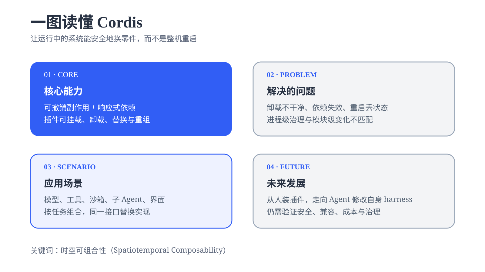
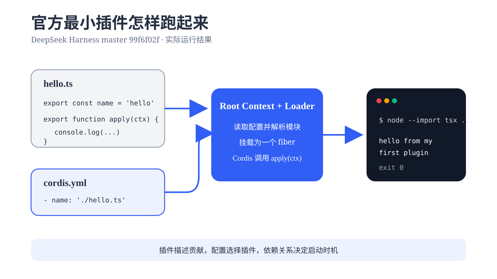
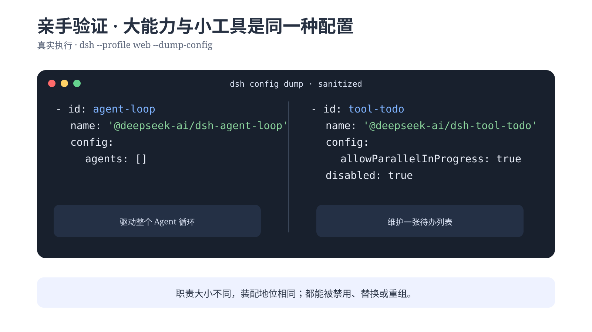
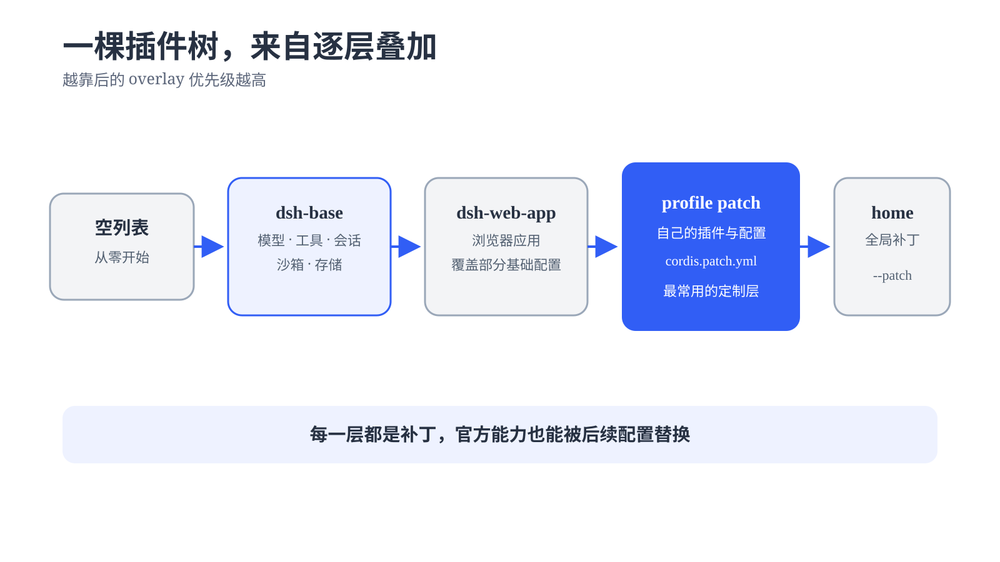
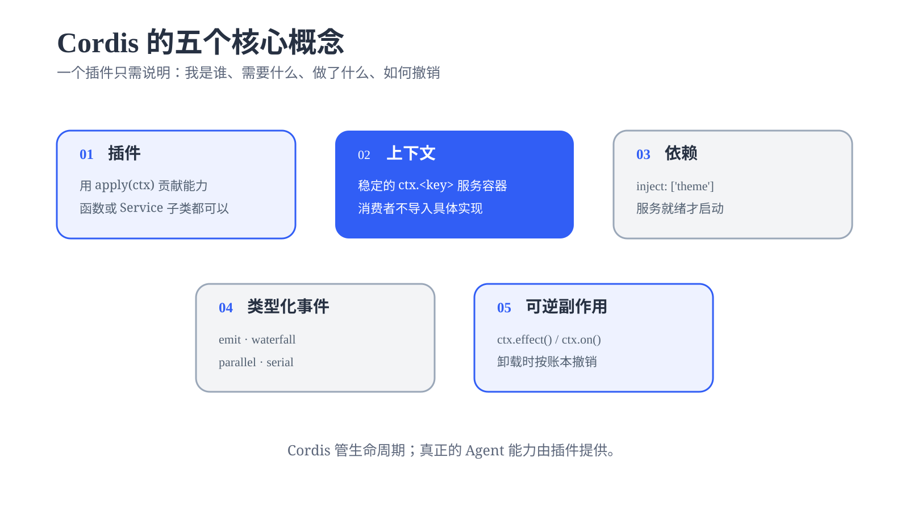
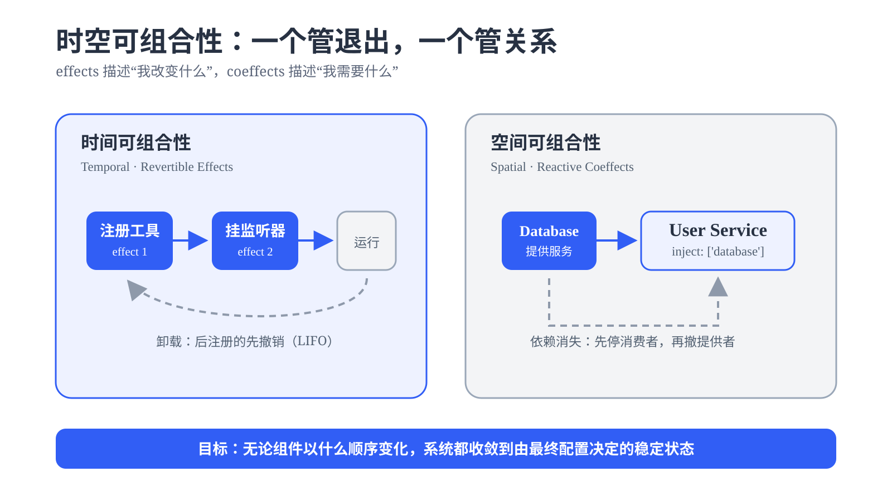
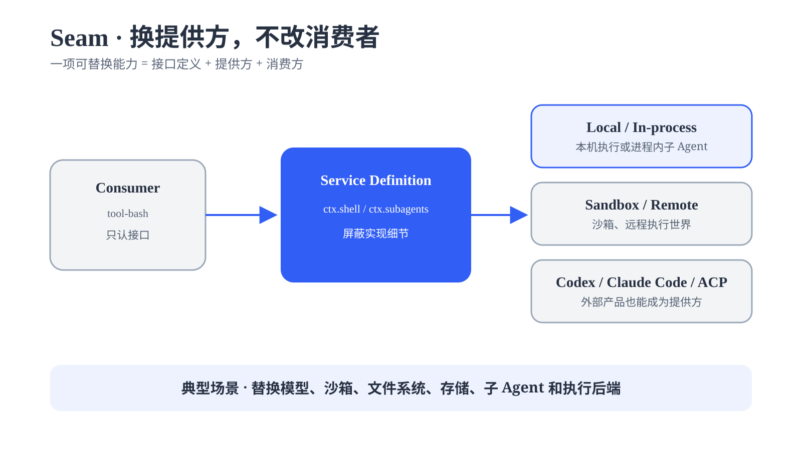
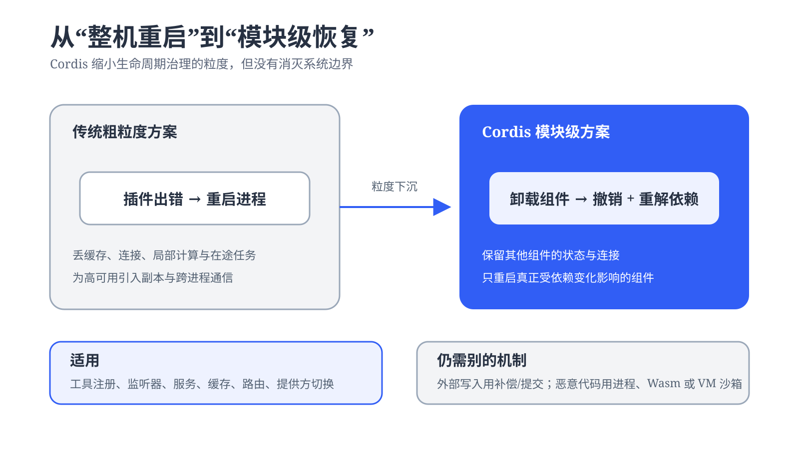
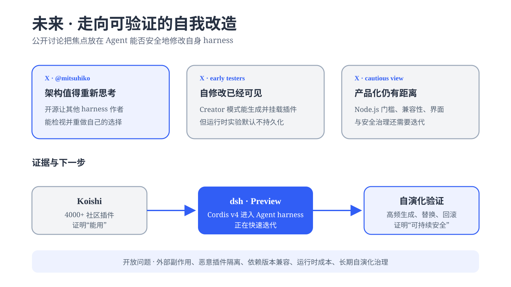

# dsh 的核心：cordis {#ch-12}

模型决定 Agent 能想多远，harness 决定它能做什么。Cordis 位于 dsh 的装配层。模型、工具、沙箱、会话和 Agent Loop 都由插件提供，Cordis 管理它们的挂载、卸载与依赖关系。



## 一切皆插件：dsh 的模块化设计 {#sec-12-1}

模型适配器、工具注册表、会话日志、沙箱、存储和界面都会进入同一个 Cordis Context。决定下一步动作的 Agent Loop 也在其中。Cordis 负责装配，具体能力留在插件里。


插件配置项会并发启动。`cordis.yml` 中排在前面的插件，不一定先执行。插件需要另一项能力时，应通过 `inject` 声明依赖，由 Cordis 决定启动时机。

### 跑通官方最小插件

官方教程的第一份插件只有一个命名导出和一个 `apply` 函数。

```ts
import type { Context } from '@deepseek-ai/cordis'

export const name = 'hello'

export function apply(ctx: Context) {
  console.log('hello from my first plugin')
}
```

`cordis.yml` 只负责选择这个模块。

```yaml
- name: './hello.ts'
```

我按官方 master 版教程实际运行了启动器。终端打印下面这一行，进程以状态码 0 退出。

```console
$ node --import tsx ../../vendor/cordis/bin.js
hello from my first plugin
```



这里没有框架启动代码。启动器创建根 `Context`，Loader 读取配置并挂载 `hello.ts`，随后 Cordis 调用 `apply(ctx)`。插件描述自己的贡献，配置文件负责组合应用。

### 从一个插件看到完整 dsh

下面的命令不需要模型密钥。它会打印当前 profile 最终装配出的配置树：

```sh
dsh --profile web --dump-config
```

实际输出中，驱动循环的 `agent-loop` 和维护待办列表的 `tool-todo` 具有相同的配置形状。



dsh 从空列表开始，依次叠加组合包、profile 补丁、home 补丁和 `--patch` overlay。后应用的层按 `id` 覆盖前面的配置行。覆盖会替换整块 `config`，不会深度合并其中的键。



Standard、Code、Minimal 和 Creator 是四套插件组合。切换模式，相当于给会话换一组能力。

## cordis 的核心组成 {#sec-12-2}

官方教程展开了六个彼此衔接的组成部分。



插件接受三种形态。最常用的是函数，也可以传入带 `apply` 方法的对象。需要公开服务时，再使用 `Service` 子类。

Loader 把每个配置项挂载成一个 fiber。fiber 会经过 `PENDING`、`LOADING`、`ACTIVE`、`UNLOADING` 和 `DISPOSED` 等状态；加载或配置校验失败时进入 `FAILED`。

服务以名称挂在 `ctx` 上。`inject` 声明硬依赖，服务未就绪时 fiber 留在 `PENDING`。提供方在运行中消失，消费方会先卸载；服务恢复后，消费方再重新加载。

事件负责松耦合通信。Cordis 提供 `emit`、`parallel`、`serial`、`bail` 和 `waterfall` 五种分发模式。harness 使用 `waterfall` 包装模型请求与审批决定。观察型监听器必须调用 `next()`，否则会截断后续处理。

effect 保存资源和对应的 disposer。`ctx.on()`、`ctx.plugin()`、服务注册和工具注册本身已经属于 effect；定时器、连接或 watcher 等外部资源才需要手动放进 `ctx.effect()`。

### 两种可组合性

论文把动态组合拆成两个问题。组件退出后，已经做过的修改要能撤销；依赖出现、消失或换实现后，相关组件要能跟着调整。



**时间可组合性**把副作用和逆操作放在一起。卸载开始时，Cordis 按 effect 的注册顺序逆向启动 disposer。多个异步 disposer 可能并发运行；有严格先后关系的清理步骤应放进同一个 disposer，逐项等待。

**空间可组合性**把依赖写进 `inject`。提供方出现，消费者激活。提供方准备退出时，消费者先撤销自己的 effect，随后提供方才能完成卸载。

### 用 seam 替换能力

dsh 把可替换能力称为 **seam**（接缝）。一条 seam 包含接口定义、提供方和消费者。消费者只认识稳定接口，无需知道背后运行的是本机进程、远程沙箱或另一个 Agent 产品。



评测可以固定工具与循环，只替换 `llm` 服务。部署时也能让同一套 shell 消费方在本机后端和远程沙箱之间切换。

子 Agent 接口采用同样的做法，后端可以接进程内 Agent、ACP、Codex 或 Claude Code。存储与权限策略也能沿各自的 seam 更换，消费方无需改动。

## cordis 的设计原理 {#sec-12-3}

传统插件系统常用进程重启处理卸载残留和依赖变化。Cordis 把治理粒度缩小到插件实例，并用 fiber 保存每个实例的运行状态。



HMR 利用这套机制。旧插件先卸载，所属 effect 随之回卷；新代码随后加载，依赖它的插件自动重新求解。Loader 还会按稳定 `id` 比较新旧配置，只处理发生变化的配置项。

`PENDING` 也是正常状态。依赖的服务暂时没有提供方时，插件可以安静等待。如果应用中没有其他活跃任务，Node 甚至会正常退出。新增插件毫无输出时，应先检查模块拼写和 fiber 状态。

这套机制有两条边界。

Cordis 只能撤销由 Context 管理的副作用。已经发出的消息、写入外部系统的数据或完成的付款不会随插件卸载消失，这些动作仍需延迟提交或补偿操作。

依赖声明也不承担安全隔离。恶意插件如果能直接访问 Node.js 或原生系统接口，仍可能绕过 Context。不可信代码需要进程、WebAssembly 或虚拟机等隔离边界。

### X 上的三种判断

截至 2026 年 8 月 19 日，公开讨论大致分成三类。Pi Agent 作者 Armin Ronacher 认为，dsh 虽不完美，却让他重新审视自己的 harness 设计，并称赞项目选择开源。

早期体验者更关注 Creator 模式展示的自修改能力。Agent 已能生成并挂载插件，运行时实验默认不会跨重启保留，持续自演化仍有一段路。谨慎意见则集中在 Node.js 工具链门槛、插件兼容和安全治理。

### 未来要验证什么

Cordis 已在 Koishi 的 4000 多个社区插件中支撑真实生态。dsh 把同一机制带进 Agent harness。论文把持续生成、替换和回滚自身组件列为后续验证方向，尚未把它当成已经完成的能力。



下一步要先处理外部动作补偿和不可信代码隔离，再评估接口兼容与频繁重组的运行成本。长期自演化还需要明确的批准与审计机制。
