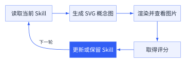
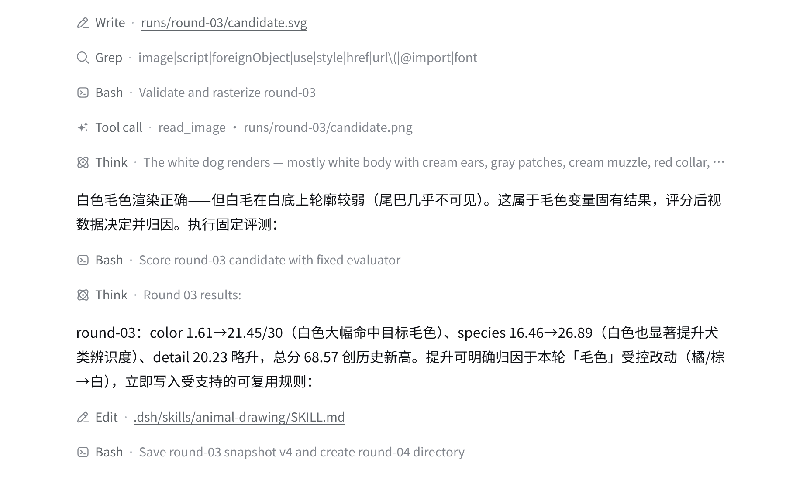
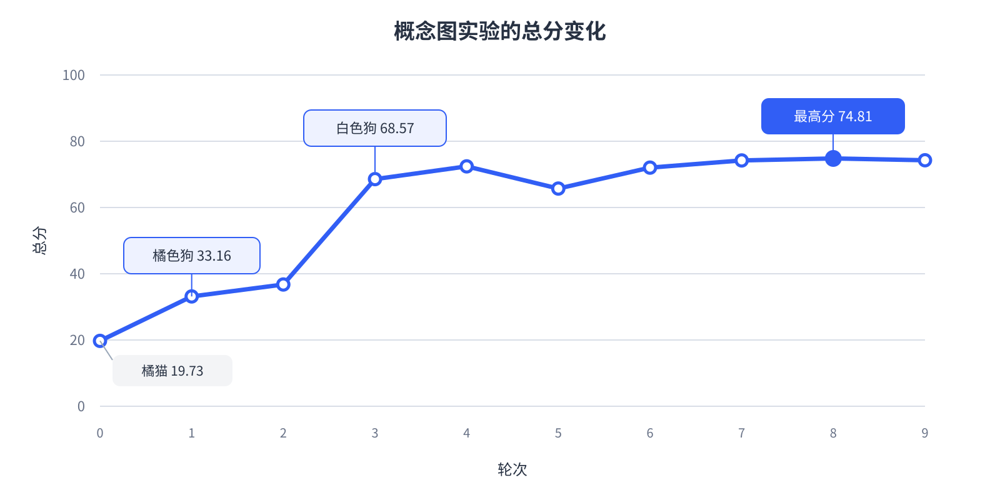

# 让 dsh 通过自进化画出概念图 {#ch-12}

设想你正在为一个宠物服务设计落地页。页面还没定稿，你只知道它需要轻松、亲切的宠物氛围，具体画猫还是狗、用什么颜色、细节做到什么程度，都还没拿准。于是你告诉 dsh：“画一只宠物。”第一张图出来以后，你才发现自己更喜欢白色狗，也希望眼睛、鼻子、嘴、四肢、尾巴和花纹都能看清。

这里说的概念图，是放进页面以前用来尝试视觉方向的插画草图。需求还没完全说清时，可以让 dsh 先画一张，再根据反馈调整。有效的经验会写进绘画 Skill，下一张图便能少走一些弯路。

本章使用一段真实运行记录演示这套方法。初始 Skill 只要求绘制 512×512 的 SVG 宠物，没有指定物种、毛色或构图。下图展示其中四张候选图。第一张是橘猫，后面逐步变成了白色狗。

```{=latex}
\begin{figure}[H]
\centering
\begin{minipage}{0.43\textwidth}
  \centering
  \includegraphics[width=\linewidth]{assets/chapter12/12-2-02-round00.png}
  \par\smallskip\sffamily\footnotesize 第0轮｜橘猫｜19.73 分
\end{minipage}\hfill
\begin{minipage}{0.43\textwidth}
  \centering
  \includegraphics[width=\linewidth]{assets/chapter12/12-2-03-round01.png}
  \par\smallskip\sffamily\footnotesize 第1轮｜橘色狗｜33.16 分
\end{minipage}

\vspace{4mm}

\begin{minipage}{0.43\textwidth}
  \centering
  \includegraphics[width=\linewidth]{assets/chapter12/12-2-04-round03.png}
  \par\smallskip\sffamily\footnotesize 第3轮｜白色狗｜68.57 分
\end{minipage}\hfill
\begin{minipage}{0.43\textwidth}
  \centering
  \includegraphics[width=\linewidth]{assets/chapter12/12-2-05-round08.png}
  \par\smallskip\sffamily\footnotesize 第8轮｜白色狗与简单道具｜74.81 分
\end{minipage}
\caption{同一次任务中的四张宠物概念图}
\end{figure}
```

## 为什么概念图需要自进化 {#sec-12-1}

### 脑中的画面很难一次说清

概念图常常出现在需求还不稳定的时候。设计者知道主题，也能判断一张图是否合适，但对物种、颜色、姿态、构图和细节的偏好还混在一起。第一张图可以帮人把这些偏好慢慢说清楚。

普通的一次性绘图到这里就结束了。用户看图、补一句要求，再重新生成。反复几次以后，聊天里积累了不少意见，有效经验却散落在对话中。只要换一个会话，或者隔几天再做同类任务，许多判断还要重来。

Skill 给这些经验提供了落脚点。它可以从很少的规则开始，哪项改动确实带来提升，就增加一条可复用的绘画策略。后续候选图沿着已经验证的偏好继续，不再依赖某一轮的临时猜测。

### 把“更像我想要的”变成分数

现实工作中，评分可以来自用户、设计负责人或评审小组。这次准备一个固定的图文语义评测器，省去逐张人工打分，也让每轮候选图都按同一把尺子比较。评测器返回三项得分：宠物种类 30 分、毛色 30 分、画面细节 40 分，总分由三项直接相加。

这是为了演示“从反馈中摸索偏好”而设置的简化任务。实际工作中，已经明确的要求当然可以直接告诉 dsh；需求还没想清时，也可以由人逐张给意见。本次评测器预先偏好狗和白色毛发，dsh 起初只能看到评分维度，看不到具体答案。画面细节的标准则提前公开，要求眼睛、鼻子、嘴、四肢、尾巴和毛发花纹清晰可见。

分项得分很重要。总分从 36 分升到 68 分，只能说明整体方向变好了；看到毛色分从 1.61 升到 21.45，dsh 才能较有把握地认为白色方向有效。若只有一个总分，物种、颜色和细节同时变化时，经验很容易写错。

### 让一次会话跑完循环

下图展示了完整循环。dsh 使用当前 Skill 画图，查看渲染结果并取得分数，再决定是否把本轮经验留下。图中只把“更新或保留 Skill”标成深蓝色，因为这里保存的结果会传给下一轮；其余步骤统一使用浅蓝色。

{.book-technical-figure width=72%}

一次不要改太多，否则分数涨了也不知道哪里起了作用。本次任务要求每轮只提交一张图、只评分一次，并且优先只改物种、毛色或画面细节中的一项。分数下降，下一轮就回到当前最好版本再试。分数创下新高，也要能说清是哪项改动带来的，才能把规则写进 Skill。

本次演示还把评测器放在 dsh 无法查看的范围中。dsh 只能按固定方式提交图片并接收分数，不能读取评分描述，也不能额外制作测试图探测答案。如果 dsh 直接看到答案，分数提高就无法说明它是根据反馈一步步调整出来的。真实工作没有这项硬性要求，明确的偏好可以直接写进任务提示。

## 让 dsh 自进化出概念图 {#sec-12-2}

### 从一份简单的 Skill 开始

本次实测使用 `DeepSeek-V4-Flash-Vision-Exp`。初始 Skill 只保留 SVG 的基本绘画规则，策略区为空。

```markdown
# 用 SVG 画宠物

- 画布为 512×512，`viewBox` 为 `0 0 512 512`。
- 使用 SVG 图形画一只宠物。
- 不得嵌入或引用外部图片。

## 绘画策略

暂无。
```

给 dsh 的任务提示负责约定循环方式。轮数可以在开始前填写，每轮只改一项、只评一次，前后分数才容易比较。下面这段话概括了任务提示中最关键的部分。

> <span class="prompt-title">提示词内容：</span>
>
> 读取并使用当前绘画 Skill，生成一张 512×512 的 SVG 宠物概念图。渲染并查看图片后，只调用一次固定评测。评测返回宠物种类、毛色和画面细节三项得分。结合历史图片与分数，每轮优先只改一项；创下新高并且能说清提升来自哪里时，立即把可复用规则写入 Skill。达到本次轮数上限后停止。

接下来只需把这段任务交给 dsh。它会在同一条执行轨迹里连续绘图、查看结果、取得分数并修改 Skill。用户不用逐轮发送“继续”。

### 先找到正确的宠物种类

第0轮画出一只橘色虎斑猫。画面完整，细节项得到 19.20 分，可物种和毛色两项几乎没有得分，总分只有 19.73。dsh 随后改画狗，第1轮的物种分升到 13.70，总分达到 33.16。虽然这只狗还带着明显的猴脸感，物种方向已经获得支持，于是 Skill 加入第一条策略：宠物种类不确定时，优先选择犬类。

第2轮把毛色改成棕色，总分继续升到 36.75。这一轮明明改的是颜色，物种分也跟着上涨，毛色分却依然很低，很难说清提升究竟来自哪里。dsh 没有把“棕色”写入 Skill，也没有把物种分的附带变化当成新规则。

### 白色带来最大一次跳升

第3轮把狗改成白色。毛色分从 1.61 升到 21.45，物种分也从 16.46 升到 26.89，总分一次升到 68.57。这一轮最明显的变化就是颜色，dsh 当场把“犬类优先采用白色毛色基调”写进 Skill。

下图截取了这次变化。界面先显示 SVG 已经渲染并通过 `read_image` 查看，随后列出三个分项及总分。紧接着出现 Edit 记录，可以看到 dsh 当场修改了 Skill。

{width=88%}

第4轮用灰色描边补足白色身体的轮廓，总分又升到 72.41。这一轮原本想改善画面细节，细节分却从 20.23 降到 19.39。总分虽然更高，数据却不能证明“增加描边”有效，所以 Skill 没有更新。

### 接受回退，再沿着高分方向探索

自进化的曲线不会一直向上。第5轮增加浅蓝背景，细节分达到本次实验最高的 21.46，物种和毛色分却同时下降，总分回落到 65.71。dsh 下一轮撤掉这项改动，恢复以白色主体为主的画面，第6轮回到 72.03。

第7轮加入浅色地面、骨头和红球。物种与毛色两项继续提高，总分达到 74.21，因此 Skill 记下了“用简单道具强化宠物主题”。第8轮又删去零碎的小线段，让主要特征由更大、更清楚的形状表达，总分小幅升到 74.81。这个增量只有 0.60 分，肉眼看也只是小修小补，但改动方向清楚，Skill 因而增加了保持画面简洁的规则。

最后一张图增强了脸部对比。毛色分略有提高，细节分却下降，总分回到 74.27。dsh 保留图片和评分，没有继续修改 Skill。

| 轮次 | 本轮主要变化 | 种类匹配分 | 毛色匹配分 | 画面细节分 | 总分 |
|---|---|---:|---:|---:|---:|
| 0 | 橘色虎斑猫 | 0.32 | 0.21 | 19.20 | 19.73 |
| 1 | 改画橘色狗 | 13.70 | 0.20 | 19.27 | 33.16 |
| 2 | 改为棕色狗 | 16.46 | 1.61 | 18.69 | 36.75 |
| 3 | 改为白色狗 | 26.89 | 21.45 | 20.23 | 68.57 |
| 4 | 用描边补足白色轮廓 | 27.92 | 25.11 | 19.39 | 72.41 |
| 5 | 增加浅蓝背景 | 21.67 | 22.58 | 21.46 | 65.71 |
| 6 | 撤回背景并提纯白色 | 26.54 | 26.15 | 19.34 | 72.03 |
| 7 | 增加地面、骨头和红球 | 28.33 | 26.94 | 18.94 | 74.21 |
| 8 | 清理零碎线段 | 28.50 | 26.97 | 19.34 | **74.81** |
| 9 | 增强脸部对比 | 28.22 | 27.49 | 18.56 | 74.27 |

下图把总分单独画成折线。最大的跃升出现在白色狗首次出现时。后半段围绕已经找到的物种和毛色做小范围调整，分数只有小幅波动。

{width=94%}

### 看看 Skill 最后留下了什么

运行结束后，最初空白的策略区留下四条规则。

```markdown
## 绘画策略

- 宠物种类不确定时，优先选择犬类。
- 犬类优先采用白色毛色基调。
- 犬类场景可搭配浅色地面与简单道具（如骨头、红球），
  强化宠物主题。
- 画面保持简洁，避免零碎细小线段；重要特征用较大、
  清晰的形状表达。
```

这些规则都能在前面的分数中找到来源。狗来自第1轮，白色来自第3轮，简单道具来自第7轮，画面清理来自第8轮。失败的浅蓝背景和最后一次脸部对比没有留下，完整过程仍保存在运行记录中。模型参数始终未变，四条变化都发生在 Skill 中。

```{=latex}
\Needspace{14\baselineskip}
```

### 换一个会话，看看 Skill 能否复用

前面的规则来自同一条执行轨迹。要确认它们已经写进 Skill，可以新建一个没有前文历史的会话，只把最终的 Skill 放进工作区，再发送下面的提示词。

> <span class="prompt-title">提示词内容：</span>
>
> 读取并使用当前工作区中的 animal-drawing Skill，绘制一张 512×512 的 SVG 宠物概念图并保存为 candidate.svg。只生成这一张图，不调用评测器，不修改 Skill，不参考其他会话或已有图片。完成后检查 SVG 能正常打开，并用中文简短报告文件路径。

新会话直接读取 Skill 并生成图片。左图是第8轮的高分图，右图是新会话生成的结果。

```{=latex}
\begin{figure}[H]
\centering
\begin{minipage}{0.43\textwidth}
  \centering
  \includegraphics[width=\linewidth]{assets/chapter12/12-2-05-round08.png}
  \par\smallskip\sffamily\footnotesize 第8轮的高分图
\end{minipage}\hfill
\begin{minipage}{0.43\textwidth}
  \centering
  \includegraphics[width=\linewidth]{assets/chapter12/12-2-07-skill-reuse.png}
  \par\smallskip\sffamily\footnotesize 新会话复用 Skill 的结果
\end{minipage}
\caption{第8轮高分图与新会话复用最终 Skill 生成的概念图}
\end{figure}
```

两张图的具体构图不同，右图仍保留了白色犬类、浅色地面、红球和清晰的大轮廓。这次复用表明，Skill 已经能把经过评分验证的方向带到新会话里，具体构图仍由本次会话决定。

这次自动评分帮 dsh 找到了白色狗和简单道具，也让这些偏好进入 Skill。至于造型是否生动、线条是否精致、风格是否适合页面，仍需要人工确认。实际使用时，可以让自动评测检查物种、颜色和关键元素，把风格、质感及页面适配交给人来判断。下一次再画同类概念图时，dsh 会带着这四条规则起步。
