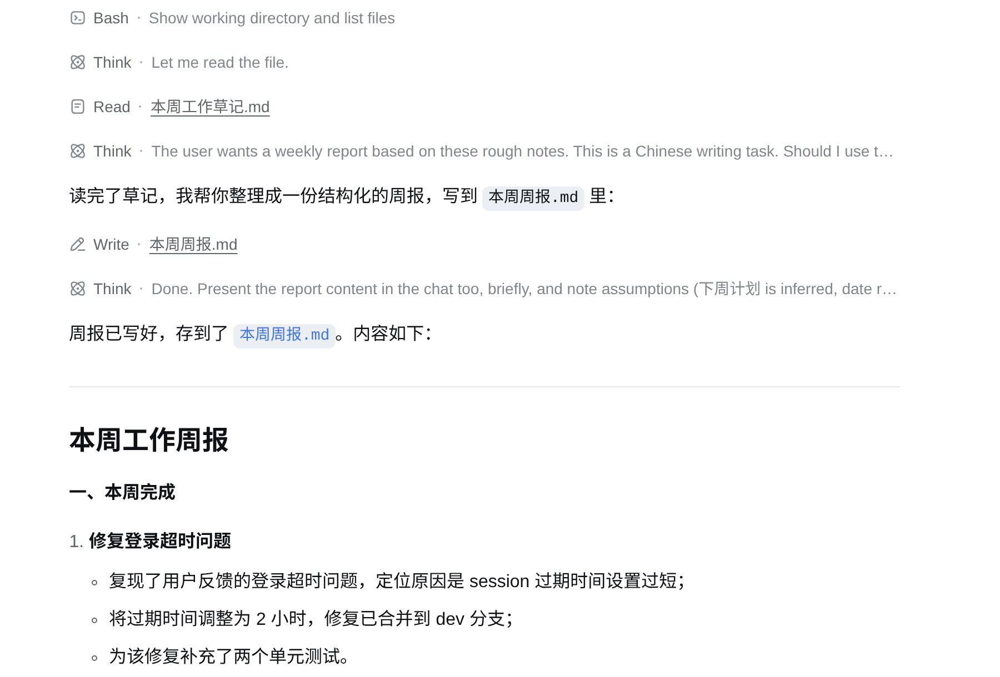
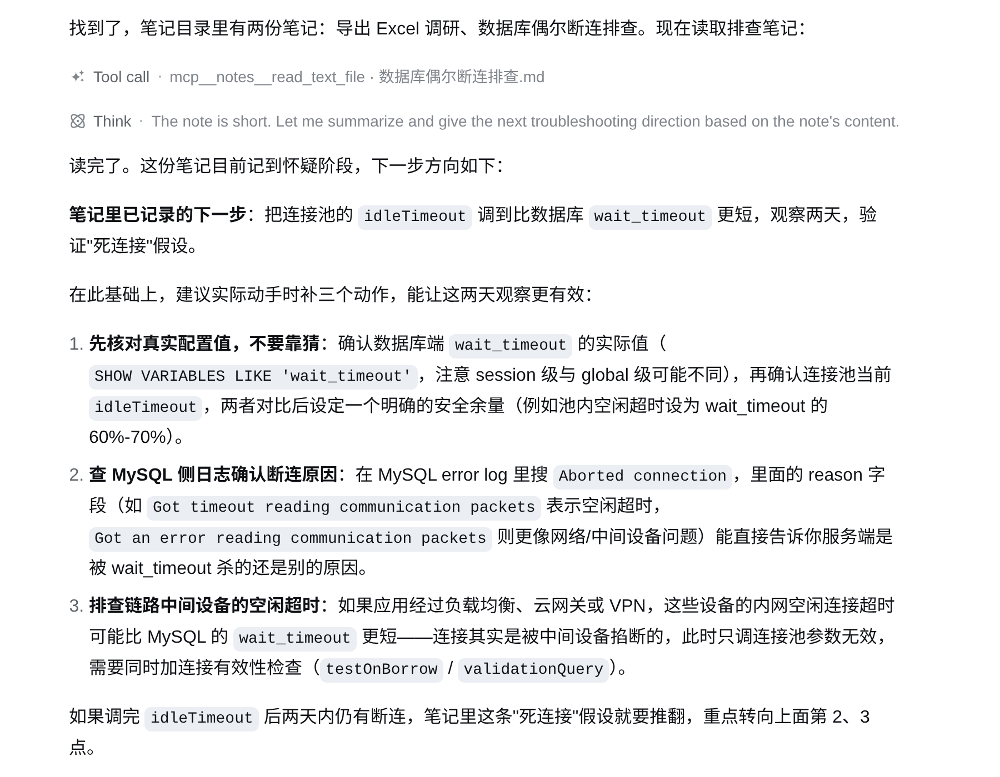
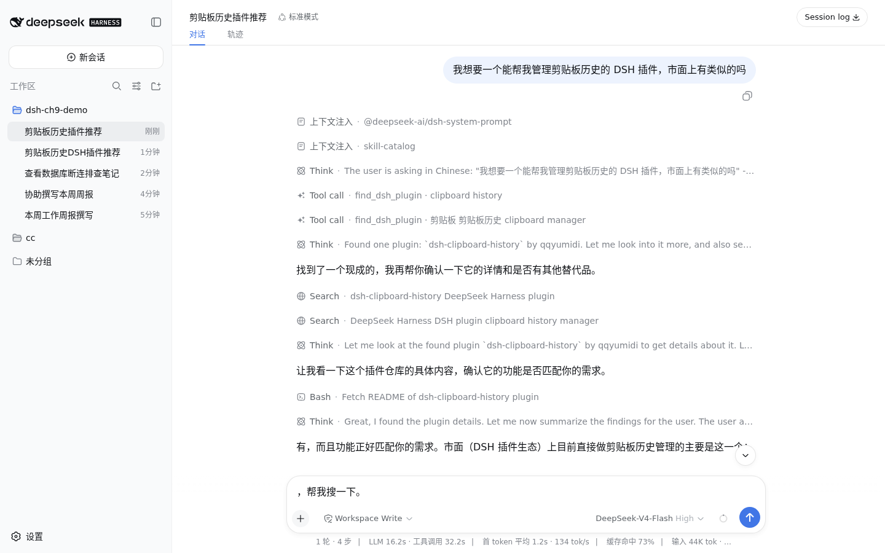
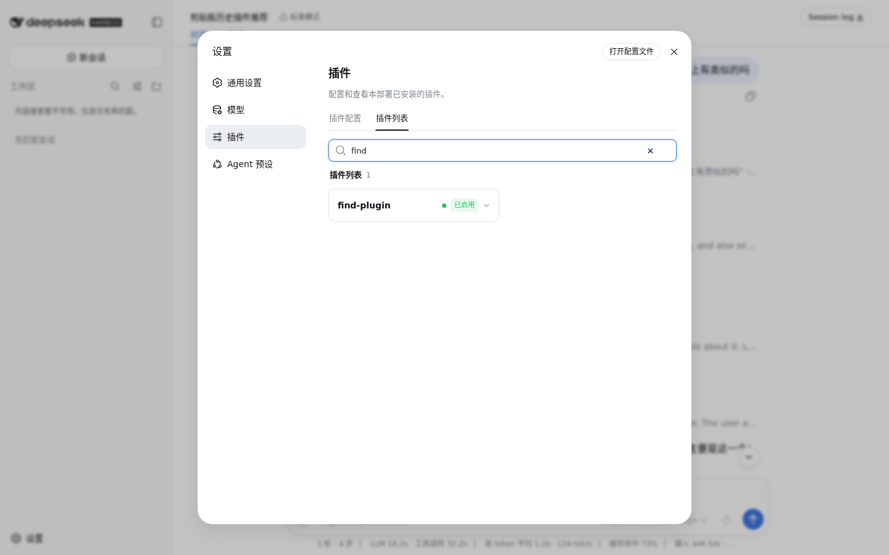
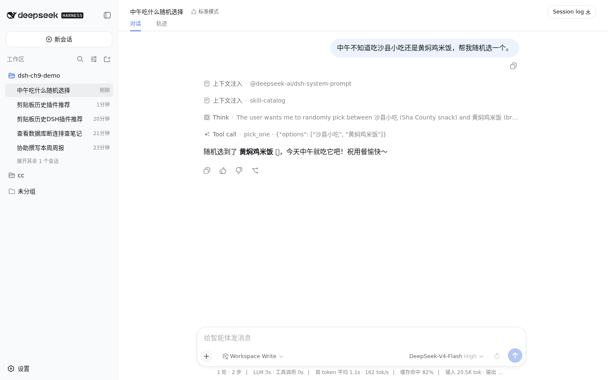

# 扩展 dsh 的能力 {#ch-13}

前面几章看到的都是 dsh 已经装好的能力。第 12 章拆开讲过，dsh 里能看到的每一样东西，模型适配器、工具注册表、system prompt、agent loop 本身，都是一个个插件，靠 `cordis.patch.yml` 这层配置叠加组装起来。这一章反过来，从用的一侧走到扩展的一侧，动手往这套叠层里加东西。四节各加一样东西，先自己写一个 Skill，再接一个 MCP 服务器进来，然后装一个第三方插件，最后自己写一个几十行的插件塞进配置里。每一节结束时，都会有一个能亲眼看到的、dsh 确实多会了一件事的画面。

## 用 Skill 让 dsh 做得更好 {#sec-13-1}

先看一个真实的麻烦。手头有一份本周随手记的工作草稿，想让 dsh 整理成周报。直接在对话里说清楚要求当然可以，但格式要求这种东西，说一次只管这一次，下周再要一份周报，得把“分几段、每段叫什么、日期怎么写”这些规矩重新讲一遍。Skill 解决的就是这类反复要求的方法类知识，写一次，dsh 自己发现、自己按需加载，不用每次现场教。

### 不教它的样子

工作区里放着这样一份草稿，`本周工作草记.md`：

```md
周一到周五的一些记录，随手记的，还没整理：

- 周一 把用户反馈里提到的登录超时问题复现了，是 session 过期时间设太短，改成 2 小时
- 周二 跟进上面那个问题，把修复合并到 dev 分支，写了两个单元测试
- 周三 开会讨论下个月的排期，确定先做导出 Excel 功能
- 周四 导出 Excel 功能写了一半，卡在合并单元格的库选型上，对比了 exceljs 与 xlsx-populate
- 周五上午 定下来用 exceljs，写了基础的导出逻辑
- 周五下午 帮产品那边核对了一版需求文档，提了三条修改意见，还没等他们确认
- 这周还有个遗留问题，测试环境的数据库连接偶尔会断，还没找到原因，先记一下
```

在还没有任何 Skill 的工作区里，打一句“参考本周工作草记.md 里的内容，帮我写一份这周的周报”，dsh 读完文件会自己拿主意该分几段、叫什么名字。

{width=88%}

这次它分了“一、本周工作总结”打头带一段话总述，再跟一串编号列表，写完存成了 `本周周报.md`。内容不算差，但换一次话题、换一天问，标题措辞、要不要编号、文件叫什么名字，都可能不一样，没有一份固定的格式可以照着核对。

### 写一份 Skill

Skill 就是一个带约定格式的 Markdown 文件，放在 dsh 会扫描的目录里就能被发现。项目内的 `.dsh/skills/skill-name/SKILL.md` 只对这个项目生效，适合跟着代码库一起分享给团队；`~/.dsh/skills/skill-name/SKILL.md` 是用户级的，对这台机器上所有项目都生效，适合自己一个人反复用的方法，`skill-name` 换成自己起的名字就行。这次的周报格式跟这个工作区强相关，用项目级。

在工作区里新建 `.dsh/skills/weekly-report/SKILL.md`：

```md
---
name: weekly-report
description: 把本周零散的工作记录整理成固定格式的周报。用户要求"写周报"、"整理本周工作"、"周报"时使用。
whenToUse: 用户提到周报，或者给了一份本周的工作草记要求整理成正式记录时。
---

# 周报整理方法

把用户提供的原始记录，改写成下面这个固定格式的周报，不要自己发明新的章节。

## 输出格式

~~~
# 周报 YYYY-MM-DD

## 本周完成
- 已经做完、有结果的事，一行一条，动词开头

## 进行中
- 开始了但还没做完的事，一行一条，说明卡在哪或者进度到哪

## 下周计划
- 根据本周进行中和遗留的事，推出下周打算做的 1-3 件事

## 风险与阻塞
- 需要别人配合、还没解决的问题；没有的话写"无"
~~~

## 规则

- 日期用原始记录里能推断出的周五日期；推不出来就用今天。
- 每条不超过一行，不写"这周"、"本周"这种在标题里已经说明的词。
- "本周完成"和"进行中"要能对应到原始记录里的具体内容，不要编造原始记录里没有的事。
- 原始记录里如果提到还没解决的问题（比如卡住、等别人确认、故障排查中），归到"风险与阻塞"，不要漏掉。
- 写完之后把周报保存成一个新文件，文件名是 `周报-YYYY-MM-DD.md`。
```

`name` 字段必须是 kebab-case，跟目录名对上；`description` 是 dsh 判断“这次任务要不要用这个 Skill”唯一依据的一句话，写清楚触发场景比写得漂亮更重要。这两项是必填项，`whenToUse` 是给这个判断再补一句更具体的场景描述，可选。

存好文件不用重启 dsh，也不用做任何“注册”的动作。dsh 会监听这几个 Skill 目录，文件一存盘就能发现，新开一个对话就能看到效果。

### 教过它之后

开一个新对话，打同一句“参考本周工作草记.md 里的内容，帮我写一份这周的周报”。

{width=88%}

这次对话开头多了一条“上下文注入 · skill-catalog”，这是 dsh 把当前能用的 Skill 名字和一句话说明报给模型看的目录，模型看到跟任务匹配就会主动调用。往下能看到一行“Skill · weekly-report”，这就是它真的加载了这份格式说明。加载之后它没有直接开写，先跑了一条命令确认今天的日期，因为草记里没写明确的周五日期，按 Skill 里的规则该用今天顶上；接着把内容写进了 `周报-2026-08-17.md`，文件名和上次的 `本周周报.md` 不一样，跟 Skill 里规定的命名规则对上了。

打开这份文件核对内容：

```md
# 周报 2026-08-17

## 本周完成
- 复现登录超时问题，定位为 session 过期时间设置过短，调整为 2 小时
- 将登录超时修复合并到 dev 分支，补充两个单元测试
- 确定下月排期，决定优先开发导出 Excel 功能
- 对比 exceljs 与 xlsx-populate 后确定采用 exceljs，完成基础导出逻辑

## 进行中
- 导出 Excel 功能仍在开发，基础导出逻辑已完成，合并单元格部分待实现

## 下周计划
- 完成导出 Excel 功能的合并单元格实现
- 跟进产品侧对需求文档修改意见的确认
- 排查测试环境数据库连接偶发断开问题

## 风险与阻塞
- 需求文档的三条修改意见已提交，等待产品确认
- 测试环境数据库连接偶尔断开，原因尚未定位
```

四个小标题跟 Skill 里写的一字不差，草记里两条还没解决的事（等产品确认、数据库连接问题）也都被正确归进了“风险与阻塞”，没有漏掉。这就是 Skill 跟直接在对话里下指令的差别。格式规则只用写一次，存成文件就能反复用；这份文件本身可以整个复制到别的项目、别的机器，或者跟着代码一起提交、分享给同事，不用再对着聊天记录复制粘贴一遍要求；而且它不占对话的固定成本，没提到周报的任务里，dsh 目录扫过就过去了，只有真的用上才会把完整内容加载进来。

## 让 MCP 接入更多工具 {#sec-13-2}

dsh 自带的工具就那么多，读写文件、跑命令、搜网页。MCP（Model Context Protocol）是一套开放协议，谁都能按它写一个独立的服务进程，把一组工具通过这个协议暴露出来，dsh 接上之后，这些工具会跟自带工具一样出现在模型面前，模型分不出哪个是原生的、哪个是接进来的。这一节接一个官方维护、免费、不用申请任何密钥的 MCP 服务器，官方的文件系统服务 `@modelcontextprotocol/server-filesystem`，让它读一个当前对话本来碰不到的目录。

先准备一份不在当前工作区里的调研笔记，放在 `~/dsh-mcp-notes/`：

```md
# 数据库偶尔断连排查.md

现象：跑集成测试时，大概每天出现 1-2 次连接被服务端主动断开。

已排除：本地网络问题（同网段其它服务没断过）。
怀疑方向：连接池空闲超时比数据库 wait_timeout 长，连接在池里变成死连接。
下一步：把连接池的 idleTimeout 调到比 wait_timeout 短，观察两天。
```

接入 MCP 服务器的配置写在当前 profile 的 `cordis.patch.yml` 里，也就是启动 `dsh web` 用的那份，路径是 `~/.dsh/profiles/web/cordis.patch.yml`。打开它，往里插一行：

```yaml
- insert:
    - id: mcp-notes
      name: '@deepseek-ai/dsh-mcp-client'
      config:
        serverName: notes
        transport: stdio
        command: npx
        args: ['-y', '@modelcontextprotocol/server-filesystem', '/home/你的用户名/dsh-mcp-notes']
```

`@deepseek-ai/dsh-mcp-client` 是 dsh 自带的一个桥接插件，每接一个 MCP 服务器就照这个样子加一份实例，`serverName` 是给这个服务器起的命名空间，`transport: stdio` 表示这个服务器是一个本地子进程，dsh 会照 `command` 和 `args` 把它拉起来，用标准输入输出跟它说话；如果对方是一个已经在跑的 HTTP 服务，就换成 `transport: streamable-http`，配 `url` 和可选的 `headers`，需要密钥的服务器把密钥放进 `headers` 或者 `env` 字段，用 `!!js process.env.对应变量名` 引用环境变量，配置文件里永远不直接写明文密钥。这几个字段对齐的空格数容易敲错，YAML 靠缩进分层级，`config` 底下这几行少缩进一格就会被解析成跟 `config` 平级，dsh 启动时会直接报错，对不上就照抄一遍缩进结构。

存盘之后不用重启 `dsh web` 进程，这份补丁文件本身是被监听的，改一下就会触发 dsh 断开重连一次这份配置对应的服务器，新开的对话立刻能用。开一个新对话，打一句“用 mcp 文件系统工具看看笔记目录里有什么文件，然后读一下数据库偶尔断连排查这份笔记，告诉我下一步排查方向是什么”。

{width=88%}

调用记录里能看到三次工具调用。

- `mcp__notes__list_allowed_directories`
- `mcp__notes__directory_tree`
- `mcp__notes__read_text_file`

命名规则是 `mcp__` 加服务器名再加原始工具名，中间用两条下划线连起来，这里的 `notes` 就是配置里填的 `serverName`。这三个工具全部来自刚接上的这个服务器，此前的对话里根本不存在。

{width=88%}

最终的回答把笔记里“怀疑连接池空闲超时比 wait_timeout 长”这条具体的排查方向原样接了过去，还补了验证步骤和判断标准。这条建议的来源就是那份笔记本身，回答里能对上笔记原文才算这一步真的接通了。

## 使用社区插件 {#sec-13-3}

前两节加的东西都很轻，一个 Markdown 文件、一行配置。这一节装一个完整的第三方插件包，走一遍真实的分发流程，包发布在 npm 上，安装进 profile，重启后在设置页的插件清单里能看到它。

### 生态调查

动手之前先搞清楚这东西现在到底有没有。dsh 自己的仓库和文档里翻了一圈，没有找到官方维护的插件市场或者插件目录页面。去 npm 上按 `dsh-plugin` 这类关键词搜，能找到零星几个独立开发者发布的包，命名上有个约定，插件名前缀 `dsh-` 或者带 `dsh-plugin` 关键词，一部分作者还在 GitHub 上给仓库打 `dsh-plugin` 这个 topic 标签，围着这个标签自发聚起一份 `awesome-dsh-plugin` 精选列表。这是一个刚起步、靠零散个人账号维系的社区生态，规模很小，也没有统一的审核或者评分机制，跟成熟生态里那种官方策展的插件市场不是一回事。装第三方插件之前查一眼源码，是这个生态现阶段该有的谨慎，不是走个形式。

这次选择安装的是 `dsh-find-plugin`，一个真实发布在 npm 上、MIT 协议的包。选它的原因很直接，它的源码只有几个文件，核心逻辑几十行就能看完，干的事情也单一，注册一个模型可以调用的工具，实时搜索 GitHub 上带 `dsh-plugin` 标签的仓库，不读写任何本机文件，不触碰配置之外的任何东西，是一个装第一个第三方插件时风险很低的起点。

### 走一遍安装流程

dsh 提供了一条专门装插件的命令，帮你把依赖装进 profile、注册进插件树这两步一起做掉，不用手改 `package.json` 和 `cordis.patch.yml`：

```sh
dsh plugin --profile web add dsh-find-plugin
```

这条命令在幕后就是进到 `~/.dsh/profiles/web/` 目录跑一次 `pnpm add`，装完之后打开这份 profile 的 `package.json` 能看到变化：

```json
{
  "dependencies": {
    "dsh-find-plugin": "^0.3.6"
  },
  "dsh": {
    "profile": {
      "bundles": [
        "@deepseek-ai/dsh-base",
        "@deepseek-ai/dsh-web-app",
        "dsh-find-plugin"
      ]
    }
  }
}
```

`dsh-find-plugin` 除了进了依赖列表，还自动被加进了 `bundles` 数组。这是因为这个包自己声明了 `dsh.bundle.patch`，属于正规的插件包，会带着自己的一份 patch 层随 `bundles` 列表自动挂载，不需要像上一节的 MCP 服务器那样手动在 `cordis.patch.yml` 里插一行。

这里有个容易踩的坑。`cordis.patch.yml` 改了会自动热更新，但 `package.json` 的依赖和 `bundles` 列表不在监听范围内，新装的插件不会立刻生效。装完命令马上试，dsh 还是老样子。

{width=88%}

这一步能看到它没有调用任何新工具，退而求其次去搜了网页、翻了本机的 dsh 源码检查目录结构，说明这时候新插件确实还没接进工具注册表。回终端按 `Ctrl+C` 停掉 `dsh web`，重新跑一次 `npx -y @deepseek-ai/dsh web` 再打开页面。

开一个新对话，打一句“我想要一个能帮我管理剪贴板历史的 dsh 插件，市面上有类似的吗，帮我搜一下”。

{width=88%}

这次调用记录里出现了 `find_dsh_plugin`，这个工具此前在这台机器上根本不存在，是 `dsh-find-plugin` 这个插件唯一注册的工具。它内部实时查了 GitHub 上带 `dsh-plugin` 标签的仓库。

{width=88%}

回答里给出了一个真实存在的候选插件、可以直接执行的安装命令，还主动提醒第三方插件装之前最好先过一遍源码、锁定到具体的 commit，跟前面调查生态时得到的结论一致。这条提醒来自 `find_dsh_plugin` 工具自己写在描述里的固定提示。

最后去设置页确认一遍。点开左下角“设置”，切到“插件”标签，再切到“插件列表”子标签，在搜索框里输入 `find`。

{width=88%}

`find-plugin` 这一行状态是“已启用”，这就是这个第三方插件确实被 dsh 认下、正常挂载运行的证据，跟设置页里看自带插件走的是同一个入口。

## 写一个自己的插件 {#sec-13-4}

前三节都是接现成的东西。这一节自己写一个，照着 dsh 自带的 `tool-todo` 插件（不到 250 行，实现“待办事项”这一个工具）的样子，写一个小得多但真能用的版本。挑的例子是“随机做决定”，中午吃什么、两个方案选哪个这种纠结时刻，让 dsh 帮着掷一次骰子。全程不需要会 TypeScript，普通 JavaScript 就够。

### 写代码

新建 `~/.dsh/profiles/web/plugins/tool-decide/package.json`：

```json
{
  "name": "tool-decide",
  "private": true,
  "type": "module",
  "main": "index.js"
}
```

再建同目录下的 `index.js`：

```js
// tool-decide 插件，给 dsh 加一个"随机做决定"的工具。
import { defineTool } from '@deepseek-ai/dsh-tools'

// 插件名字，随便起，配置文件里的 name 字段要跟它对上。
export const name = 'tool-decide'
// 声明这个插件要用到工具注册表服务，dsh 会先把 ctx.tools 准备好再启动这个插件。
export const inject = ['tools']

export function apply(ctx) {
  ctx.tools.register(defineTool({
    // 模型看到的工具名字。
    name: 'pick_one',
    // 模型看到的工具说明，决定它什么时候会想到用这个工具。
    description: '当用户在几个选项里纠结、想随机选一个而不是要理性建议时，从给定的选项列表里随机选出一个。',
    // 模型调用这个工具时要传的参数。
    parameters: {
      options: {
        type: 'array',
        required: true,
        description: '待选项，至少两个。',
        items: { type: 'string' },
      },
    },
    // 工具执行完之后返回给模型的结果长什么样。
    output: {
      schema: {
        type: 'object',
        additionalProperties: false,
        properties: {
          picked: { type: 'string', required: true },
        },
      },
      render: (_args, value) => [{ type: 'text', text: `随机选中：${value.picked}` }],
    },
    // 真正执行的逻辑。
    execute(args) {
      const options = args.options
      if (!Array.isArray(options) || options.length < 2) {
        throw new Error('pick_one 至少需要两个选项')
      }
      const picked = options[Math.floor(Math.random() * options.length)]
      return Promise.resolve({ picked })
    },
  }))
}
```

跟 `tool-todo` 对比着看，结构是一样的。`name` 和 `inject` 两个导出告诉 dsh 这个插件叫什么、依赖哪些服务；`apply` 函数里用 `ctx.tools.register` 注册一个工具，`defineTool` 里的 `name`、`description`、`parameters` 这三样是给模型看的，模型只凭这三样决定要不要调、怎么调；`execute` 是真正跑的代码，跟模型之间完全隔着一层，模型看不到这段代码本身。

`output.schema` 那几行第一次写很容易漏掉一处。`type: 'object'` 的 schema 必须显式写上 `additionalProperties: false` 或者 `true`，写漏了 dsh 启动时会直接拒绝加载，报错信息是这样：

```text
Error: dsh: plugin tree failed to load: failed to apply loader entry
tool-decide (tool-decide): unsupported JSON schema:
schema.additionalProperties must be explicitly true or false
```

这段报错是照着 `tool-todo` 的样子第一次省略这一行时，本机跑出来的真实输出，补上 `additionalProperties: false` 就好了。

### 接进配置，重启，验证

在 profile 的 `package.json` 里把这个本地包加成一条依赖，跟第 2 章“翡翠绿主题”插件用的是同一个手法：

```json
{
  "dependencies": {
    "tool-decide": "file:./plugins/tool-decide"
  }
}
```

`cordis.patch.yml` 里插一行：

```yaml
- insert:
    - id: tool-decide
      name: 'tool-decide'
```

跑一次 `pnpm install` 让 `file:` 依赖链接进 `node_modules`，然后重启 `dsh web`。这里有第二个容易踩的坑。`pnpm install` 把 `plugins/tool-decide/` 下的文件复制（严格说是硬链接）进了 `node_modules/tool-decide/`，之后如果回去改 `index.js` 里的代码，`node_modules` 里那份不会跟着自动更新，得再跑一次 `pnpm install` 才能把改动同步过去，改完代码不生效，先检查是不是漏了这一步。

重启之后开一个新对话，打一句“中午不知道吃沙县小吃还是黄焖鸡米饭，帮我随机选一个”。

{width=88%}

调用记录里的 `pick_one · {"options": ["沙县小吃", "黄焖鸡米饭"]}` 就是刚才写的那个工具，参数是模型自己从这句话里提取出来的两个选项，执行完随机选中一个，写进最终回复。从写下第一行代码到这一刻，中间没有跳过任何步骤。

第 2 章用创造模式现场定义过一个改主题色的动态插件，跟这一节的做法是同一套能力的两种用法。动态插件写好当场审批、当场生效，但只活在这一次进程的内存里，适合“先试试看效果对不对”；写成配置里的一行、装进 `node_modules`，重启才生效，但只要这份配置还在，重启多少次都在，适合长期要用的工具，`pick_one` 用的就是这条路。

`cordis.patch.yml` 里刚才那三行，跟 dsh 自带的 `agent-loop`、`tool-todo` 那几行长得一模一样，都是一个 `id` 加一个 `name`，外加可选的 `config`。dsh 自己怎么跑起来的，和这一节自己加的这个小工具怎么跑起来的，配置上没有任何区别。
