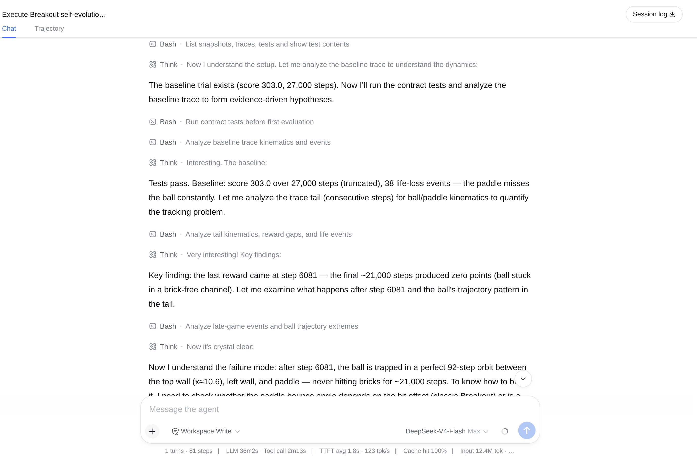
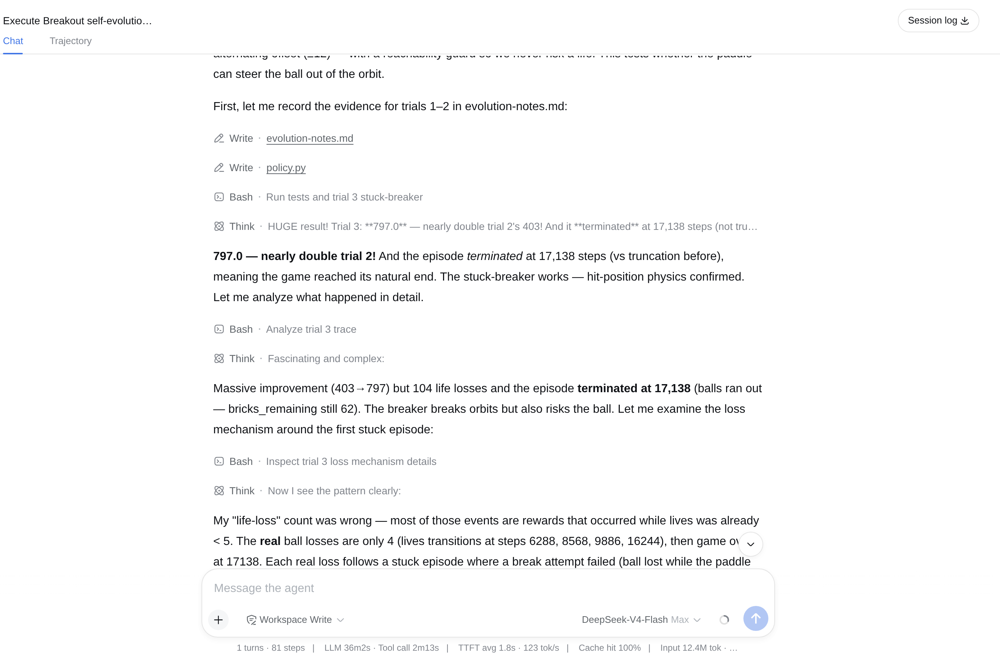
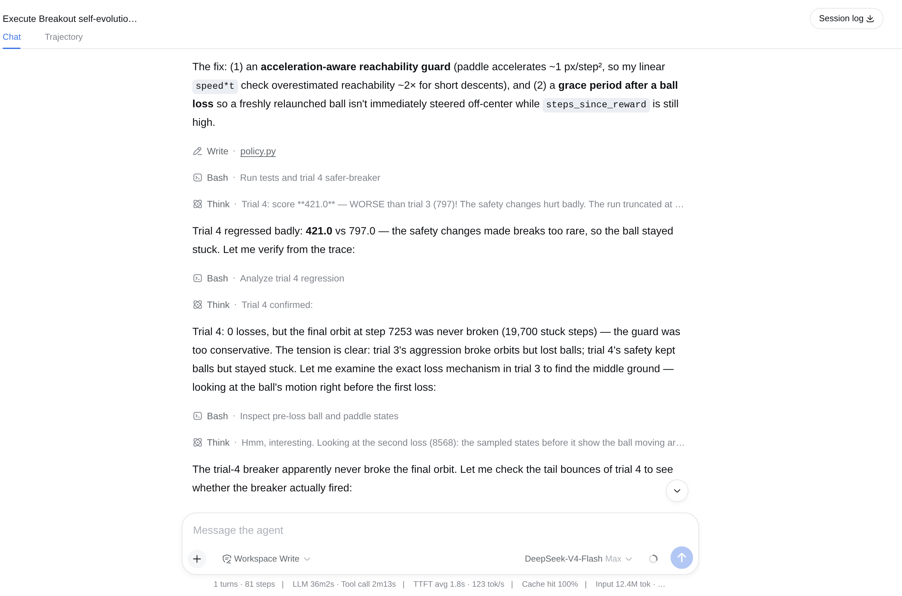
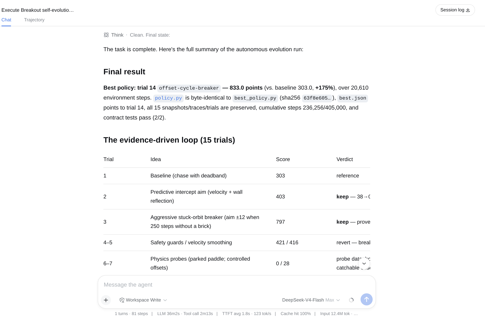
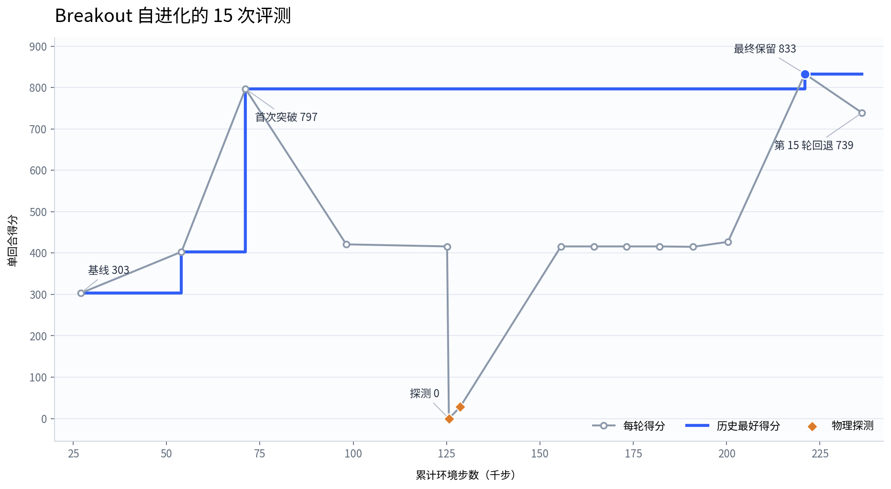

# 使用 dsh 完成一次自进化任务 {#ch-14}

本章让 dsh 独立改进一个 Atari Breakout 策略。实验使用 DeepSeek-V4-Flash，最终把固定开发环境中的得分从 303 提高到 833。本次运行保留了 15 次评测的代码、轨迹和结论，最后一轮下降到 739 后，dsh 恢复了第 14 轮策略。

这里的“自进化”发生在任务层。模型参数没有训练，变化写进了 `policy.py` 和实验记录。评测器、环境和预算保持固定，读者可以沿着每次修改检查分数为何上升或下降。

## 自进化任务如何运转 {#sec-14-1}

这类任务需要四个组成部分。

| 组成 | 本章对应内容 | 责任 |
|---|---|---|
| 候选解 | `policy.py` | 保存当前 Breakout 策略 |
| 固定评测器 | `evaluate.py` | 运行完整回合，返回分数并写入轨迹 |
| 选择规则 | 保留最好版本，低分时回退 | 决定下一轮从哪一版继续 |
| 实验记忆 | `trials.jsonl`、`evolution-notes.md` | 分别保存测量结果与分析结论 |

一次迭代包含五个动作：读取上一轮轨迹，提出一个可验证的假设，修改候选解，按原协议评测，再保留或回退。每轮只处理一个主要问题。若同时改动落点预测、挡板控制和停止条件，分数变化就很难解释。

规则、测量结果和分析结论要分开保存。`AGENTS.md` 写允许修改的文件、预算和停止条件；`trials.jsonl` 由评测器逐行追加分数、环境步数、代码哈希和轨迹路径；`evolution-notes.md` 记录 dsh 对轨迹的解释。下一轮可以推翻旧解释，但不能改写已经产生的分数。

评测器也不能跟随候选解一起变化。本章只允许 dsh 编辑 `policy.py` 和 `evolution-notes.md`。`evaluate.py`、`environment.py`、测试和已生成的记录都受到文件规则保护，并在实验前保存哈希。评测器还会自动保存每轮策略快照，所以回退不依赖模型记忆。

实验必须有上限。本次最多运行 15 个候选解，每个候选解最多使用 27,000 个环境步，累计上限为 405,000 步。达到候选数上限后，dsh 停止修改并恢复历史最好版本。

这个案例只使用 dsh 已有的文件读写和命令执行能力，不需要安装额外插件。网络、Skill、多 Agent 和工作流工具在实验配置中关闭，减少候选解从实验目录之外取得现成答案的机会。这只能控制本次运行能访问的材料，不能证明模型训练阶段从未接触过类似代码，因此本章把它当作可审计的工程实验。

## 用 Breakout 跑通自进化闭环 {#sec-14-2}

### 准备隔离的实验目录

本次实验在书稿仓库外使用独立的 `~/breakout-evolution/` 目录。书稿只提交正文、截图和最终曲线，不提交运行目录。实验使用 EnvPool 1.1.1 的 `Breakout-v5`，策略从 RAM 中取得球、挡板和剩余砖块等字段，不读取游戏画面，也不训练神经网络。

```text
breakout-evolution/
├── headless-isolated.patch.yml
├── starter/
│   ├── AGENTS.md
│   ├── README.md
│   ├── environment.py
│   ├── evaluate.py
│   ├── policy.py
│   ├── tests/
│   ├── snapshots/
│   ├── traces/
│   ├── trials.jsonl
│   └── evolution-notes.md
└── scripts/
    ├── plot_evolution.py
    └── replay_best.py
```

进入目录后安装依赖，并先运行接口测试。

```bash
cd ~/breakout-evolution/starter
python3 -m venv .venv
.venv/bin/pip install envpool==1.1.1 numpy pytest matplotlib
.venv/bin/pytest -q
```

本次开发协议固定为种子 0、`noop_max=1`、每轮最多 27,000 步。环境关闭粘滞动作，使用完整回合计分。动作只有空操作、发球、向右和向左。起始策略采用简单追球规则：球在挡板左侧就向左，球在右侧就向右，距离很近时保持不动。

`headless-isolated.patch.yml` 关闭网络、Skill、多 Agent 和工作流工具。随后从 `starter/` 启动 dsh，并把任务目标交给它。

```bash
node ~/deepseek-harness/apps/cli/lib/bin.js \
  --profile headless \
  --patch ../headless-isolated.patch.yml \
  "执行 Breakout 策略自进化实验。遵守 AGENTS.md，只修改允许的文件；先测基线，每轮提出一个假设并检查轨迹；低分修改必须回退，最多评测 15 次，结束时留下最好策略和完整记录。"
```

dsh 先运行契约测试和基线评测。基线得到 303 分并用完 27,000 步。轨迹显示，最后一次得分出现在第 6,081 步，之后两万多步没有新奖励；球进入了周期约为 92 步的固定轨道，反复穿过已经清空的砖列。

{width=92%}

### 第一次突破来自周期轨道

第 2 轮根据球的速度和墙面反射预测落点，得分升到 403。挡板不再追着球的当前位置跑，这一轮没有丢球，但仍在新的周期轨道里停了约 21,000 步。

第 3 轮把“长时间没有打到砖”作为触发条件。连续 250 步没有得分时，策略让球偏离挡板中心约 12 像素，主动改变反弹角度。这次得到 797 分，并在 17,138 步后自然结束。轨迹确认多个周期轨道被打破，但较大的偏移也造成了 4 次丢球。

{width=92%}

### 低分轮次提供了新的测量

第 4 轮试图加入加速度可达性判断和丢球后的保护期，得分降到 421。它没有丢球，却在最后 19,700 步里一直困在同一条轨道。保护条件限制过多，偏心击球几乎没有真正发生。dsh 保留这次记录，并恢复第 3 轮策略。

{width=92%}

第 6、7 轮分别只得到 0 分和 28 分。它们是有意安排的物理探测：先停住挡板，再用一组受控偏移接球，以估算挡板不同接触位置对出球方向的影响。第一次探测连球都接不到；第二次留下了几次有效接触。数据表明，可接住的偏移范围大约只有 6 到 7 个坐标单位，12 像素的固定目标经常直接漏球。

随后六轮集中处理速度估计、冻结落点和挡板刹车。RAM 坐标的量化噪声让短窗口速度出现约 1 像素每步的误差，窗口代码还出现过边界计数错误。第 8 到第 12 轮长期停在 415 到 416 分，第 13 轮也只有 427 分。这段停滞让 dsh 确认了两个条件：挡板需要提前刹车才能稳定停在目标附近，破坏周期轨道需要在可接住的范围内改变偏移，固定偏移很快又会形成新轨道。

15 次评测的关键结果如下。低分探测和被回退的修改都保留在表中。

| 轮次 | 主要变化 | 得分 | 处理 |
|---|---|---:|---|
| 1 | 简单追球基线 | 303 | 基准 |
| 2 | 预测落点与墙面反射 | 403 | 保留 |
| 3 | 无奖励 250 步后偏心击球 | 797 | 保留 |
| 4 至 5 | 安全限制、平滑速度 | 421 / 416 | 回退 |
| 6 至 7 | 挡板反弹物理探测 | 0 / 28 | 取得数据后回退 |
| 8 至 12 | 冻结落点与速度窗口修正 | 416 / 416 / 416 / 416 / 415 | 回退 |
| 13 | 刹车控制器与固定安全偏移 | 427 | 回退 |
| 14 至 15 | 循环偏移、发散保护 | 833 / 739 | 保留第 14 轮，回退第 15 轮 |

### 第 14 轮成为最终版本

第 14 轮使用偏移序列 `{0, ±2, ±4, ±6, ±3, ±5}`。球向下运动时，策略提前冻结一次落点，再让挡板根据剩余距离和当前速度刹车。每次进入停滞阶段就换一个仍可接住的偏移，直到球路离开原来的周期。该版本得到 833 分，运行 20,610 步后结束。

第 15 轮加入“预测落点偏离冻结目标时立即放弃”的保护条件。浅角度运动下，速度量化噪声会让预测落点在相邻步骤间摆动，保护条件频繁触发，得分降到 739。dsh 因此把 `policy.py` 恢复成第 14 轮快照。

{width=92%}

分数曲线由运行目录中的 `plot_evolution.py` 直接读取 `trials.jsonl` 生成。灰线保留每轮真实得分，蓝色阶梯线表示截至当时的历史最好成绩。第 6、7 轮的低点属于物理探测；第 15 轮的下降则触发了最终回退。

{width=92%}

### 独立复跑并说明局限

开发结束后，`replay_best.py` 从 `best_policy.py` 单独加载策略，不写入开发日志。按原协议复跑得到 833 分、20,610 步，代码哈希与第 14 轮完全一致，契约测试仍为 `2 passed`。

```bash
cd ~/breakout-evolution
starter/.venv/bin/python scripts/replay_best.py
```

随后把 `noop_max` 从 1 改为 30，让每次开局有不同长度的空操作，并使用三个新种子。这些运行改变了开发协议，只用于检查策略对起点扰动的反应，不能与开发曲线混为一组。

| 运行 | 种子 | `noop_max` | 得分 | 环境步数 |
|---|---:|---:|---:|---:|
| 原协议复跑 | 0 | 1 | 833 | 20,610 |
| 起点扰动 | 101 | 30 | 477 | 14,526 |
| 起点扰动 | 202 | 30 | 418 | 9,812 |
| 起点扰动 | 303 | 30 | 418 | 9,812 |

这组结果给出了清楚的边界：833 分可以在固定协议下精确复现，换成扰动起点后只能得到 418 到 477 分。策略学会了处理开发轨迹中的周期轨道，但对开局变化的适应仍然有限。若继续实验，应在开始前规定一组开发起点，并用它们的平均分选择候选解。
