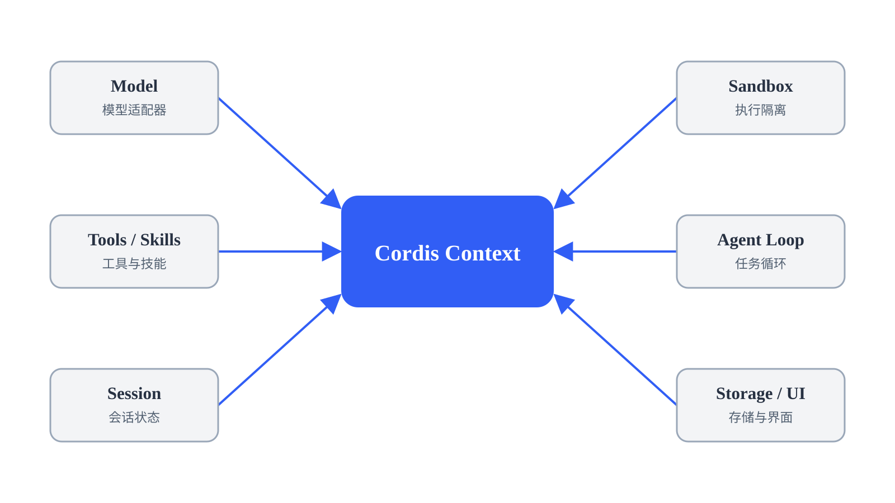

# dsh 的核心：Cordis {#ch-14}

上一章沿着一次任务的执行过程，介绍了模型、工具、会话和 Agent Loop 怎样配合完成任务。在 dsh 中，这些能力由不同插件提供，Cordis 负责组织这些插件的运行。

本章从 Cordis 本身讲起，先用小示例看清插件的生命周期、依赖和通信，再回到 dsh 的配置与工具调用过程。

## 认识 Cordis {#sec-14-1}

Cordis 是一个用于组织 TypeScript 插件的运行时框架。dsh 中的模型、工具、会话和 Agent Loop 等能力可以分别由不同插件实现，而 Cordis 负责把这些插件加载起来，并管理它们的运行、依赖和卸载。

Cordis 自己不实现模型调用、工具执行或会话管理。它更像这些插件共同运行的基础设施：插件什么时候启动、需要哪些能力、怎样与其他插件通信，以及停止时怎样清理资源，都由 Cordis 提供相应的机制。

本章会陆续遇到下面这些概念。现在不需要全部记住，先分清 **Plugin、Fiber 和 Context** 就够了。

| 概念    | 先这样理解                              |
| ------- | --------------------------------------- |
| Plugin  | 一份可以被 Cordis 加载的功能代码        |
| Fiber   | Plugin 被挂载一次后产生的运行实例       |
| Context | 插件与 Cordis 运行时交互的入口          |
| Loader  | 按配置加载、更新和卸载插件              |
| Service | 一个插件提供给其他插件使用的能力        |
| Event   | 插件围绕某件事发送通知或参与处理的机制  |
| Effect  | 需要跟随 Fiber 一起清理的资源或注册操作 |

其中最需要先分清的是 Plugin 和 Fiber：

```text
Plugin            挂载            Fiber
功能代码  ─────────────────►  一次运行实例
```

同一个 Plugin 可以被多次挂载，每次都会产生一个独立的 Fiber。简单来说，**Plugin 是可以反复使用的功能代码，Fiber 是这份代码的一次运行**。

Context 则是这个 Fiber 与 Cordis 运行时交互的入口。插件后面要访问 Service、监听 Event、注册 Effect，都会通过 Context 完成。

下面先从一个最小插件开始，看一个 Plugin 是怎样被加载、运行和卸载的。Service、Event 和 Effect 会在后面的例子中分别引入，最后再回到 dsh，看看这些机制怎样组合成完整的 Harness。

## 插件如何加载和卸载 {#sec-14-2}

完整的 dsh 一次会加载许多插件，不容易看清单个插件是怎样运行的。本节先把环境缩到最小，从一个 `hello` 插件开始，看配置怎样变成一个正在运行的 Fiber；随后再给插件加入配置和需要清理的资源，观察 Fiber 卸载时会发生什么。

### 从 Plugin 到 Fiber

配套示例位于 `demo/chapter14-cordis/14-2-lifecycle`，目录中有四个文件：

```text
12-2-lifecycle/
├── package.json      # 项目依赖
├── pnpm-lock.yaml    # 依赖版本锁定文件
├── cordis.yml        # Cordis 加载配置
└── hello.js          # 插件代码
```

先看插件代码 `hello.js`：

```js
export function apply(ctx) {
  console.log('hello from my first plugin')
}
```

`apply()` 是插件开始运行时执行的入口。参数 `ctx` 是这个 Fiber 使用的 Context；插件以后访问 Service、监听 Event 或注册需要清理的资源，都会通过它完成。

同一目录中还有一份 `cordis.yml`：

```yaml
- name: './hello.js'
```

`cordis.yml` 告诉 Loader 这次需要加载哪些插件。这里只有一项，`name` 的值 `./hello.js` 是相对于当前配置文件的模块路径，因此 Loader 会导入同一目录中的 `hello.js`。

在这个目录中安装依赖，再运行示例：

```bash
pnpm install
pnpm exec cordis
```

终端会输出：

```text
hello from my first plugin
```

`pnpm exec cordis` 会启动当前项目依赖中的 Cordis 命令行程序。启动后，配置文件、Loader、Plugin 和 Fiber 会按下面的顺序连接起来：

```text
pnpm exec cordis
    │ (1) 启动 Cordis，并挂载 Loader
    ▼
  Loader
    │ (2) 读取 cordis.yml，得到 ./hello.js
    │ (3) 导入 hello.js
    ▼
  Plugin
    │ (4) 挂载 Plugin，创建 Fiber
    ▼
  Fiber
    │ (5) 调用入口函数，并传入 ctx
    ▼
apply(ctx)
    │
    ▼
hello from my first plugin
```

这里的 `hello.js` 是磁盘上的代码文件。Loader 导入它之后，文件导出的 `apply()` 等内容构成 Plugin；Cordis 每挂载一次这个 Plugin，就创建一个 Fiber，表示这份代码的一次运行。Fiber 开始运行时，Cordis 调用 `apply(ctx)`，并把这个 Fiber 使用的 Context 作为 `ctx` 传入，代码中的 `console.log()` 随后产生终端输出。

这里先记住这条路径：**配置告诉 Loader 加载哪个 Plugin；Plugin 被挂载后形成一个 Fiber；Fiber 开始运行时执行 `apply(ctx)`。** 同一个 Plugin 可以被多次挂载，每次挂载都会形成一个独立的 Fiber。

### 用 config 为插件传入参数

前面的 `hello` 插件没有参数，因此每次运行都会输出同一句话。实际插件往往需要根据配置改变行为。Cordis 允许在 `cordis.yml` 的插件条目中写入 `config`，并在插件启动时把它作为第二个参数传给 `apply(ctx, config)`。

`name` 决定加载哪个 Plugin，`config` 决定这个 Plugin 这一次怎样运行。同一个 Plugin 因此可以用不同配置多次挂载，每次挂载得到的 Fiber 使用各自的 `config`。

直接使用 YAML 中的配置还有一个问题：字段可能缺失，也可能写错类型。为此，插件可以导出一个名为 `Config` 的 Schema。Cordis 会先用它检查配置并补上默认值，通过后才执行 `apply()`。

```typescript
import type { Context } from '@deepseek-ai/cordis'
import Schema from '@deepseek-ai/schemastery'

export interface Config {
  greeting: string
  targets: string[]
}

export const Config: Schema<Config> = Schema.object({
  greeting: Schema.string().default('Hello'),
  targets: Schema.array(String).default(['world']),
})

export function apply(_ctx: Context, config: Config) {
  for (const target of config.targets) {
    console.log(`${config.greeting}, ${target}!`)
  }
}
```

这里出现了两个同名的 `Config`：

| 写法               | 作用                                           |
| ------------------ | ---------------------------------------------- |
| `interface Config` | 给 TypeScript 看，检查代码中 `config` 的字段和类型 |
| `const Config`     | 给 Cordis 看，在运行时校验实际配置并补默认值   |

两者虽然同名，但工作在不同阶段。`interface Config` 只负责类型检查；真正处理 `cordis.yml` 中配置的是运行时的 Schema。

```text
cordis.yml 中的 config
        │
        ▼
      Schema
  校验并补默认值
        │
        ▼
apply(ctx, config)
```

例如，只配置 `targets`：

```yaml
- name: './config-demo.ts'
  config:
    targets: ['alpha', 'beta']
```

运行后会得到：

```text
Hello, alpha!
Hello, beta!
```

这里没有提供 `greeting`，Schema 会自动补上默认值 `Hello`。因此 `apply()` 实际收到的 `config` 已经是：

```typescript
{ greeting: 'Hello', targets: ['alpha', 'beta'] }
```

如果把 `targets` 错写成字符串：

```yaml
config:
  targets: 'not-an-array'
```

它就不符合 Schema 对 `targets` 的要求。配置会在 `apply()` 执行之前校验失败，对应的 Fiber 进入 `FAILED`，插件不会继续启动。

### 让资源跟随 Fiber 清理

插件开始运行后，还可能创建定时器、连接或文件监视器。如果插件已经卸载，这些资源却还在运行，就可能留下无效的任务或连接。因此，这些资源也应该随着对应的 Fiber 一起停止。

Cordis 用 **Effect** 管理这类需要跟随 Fiber 一起清理的资源。插件可以通过 `ctx.effect()` 创建资源，并同时提供一个清理函数：

```typescript
ctx.effect(() => {
  const timer = setInterval(() => console.log('tick'), 200)

  return () => {
    clearInterval(timer)
    console.log('heartbeat cleaned up')
  }
})
```

传给 `ctx.effect()` 的函数会立即执行，因此这里的定时器马上开始运行。它返回的函数称为 **disposer**，负责清理刚刚创建的资源。当前 Fiber 卸载时，Cordis 会自动调用 disposer。

```text
ctx.effect(...)
      │
      ├── 创建资源
      │
      └── 返回 disposer
              │
              │ Fiber 卸载
              ▼
           自动执行
              │
              ▼
           释放资源
```

`ctx.effect()` 自身也会返回一个函数，可以提前结束这项 Effect；多数情况下不需要主动调用，因为 Fiber 卸载时会自动清理。

下面把定时器放进一个 `heartbeat` 插件，再由外层插件在 700 毫秒后调用 `fiber.dispose()`，主动卸载它：

```typescript
import type { Context } from '@deepseek-ai/cordis'

function heartbeat(ctx: Context) {
  console.log('heartbeat plugin loading')

  ctx.effect(() => {
    const timer = setInterval(() => console.log('tick'), 200)

    return () => {
      clearInterval(timer)
      console.log('heartbeat cleaned up')
    }
  })
}

export function apply(ctx: Context) {
  const fiber = ctx.plugin(heartbeat)

  ctx.effect(() => {
    const timer = setTimeout(async () => {
      await fiber.dispose()
      console.log('disposed')
    }, 700)

    return () => clearTimeout(timer)
  })
}
```

`heartbeat` 启动后每 200 毫秒输出一次 `tick`。700 毫秒后，外层插件调用 `fiber.dispose()`；Fiber 开始卸载，之前通过 `ctx.effect()` 注册的 disposer 随即执行并停止定时器。

终端会显示：

```text
heartbeat plugin loading
tick
tick
tick
heartbeat cleaned up
disposed
```

因此，插件停止运行时，它创建的定时器不会继续留在后台。

Fiber 的主要状态包括：

```text
LOADING → ACTIVE → UNLOADING → DISPOSED
   ↘
   FAILED
```

正常情况下，Fiber 从 `LOADING` 进入 `ACTIVE`；卸载时进入 `UNLOADING`，等 disposer 全部执行完成后成为 `DISPOSED`。如果配置校验或插件启动失败，则进入 `FAILED`。下一节还会加入一个 `PENDING` 状态，用来表示“依赖尚未准备好”。

`ctx.effect()` 主要用于 Cordis 不知道怎样清理的外部资源，例如定时器、连接和文件监视器。对于 Cordis 自己提供的注册 API，通常不需要手动写 disposer：例如 `ctx.on()` 注册的事件监听、`ctx.plugin()` 挂载的子插件，以及 Service 注册，都会自动跟当前 Fiber 绑定，并在 Fiber 卸载时撤销。dsh 中的 `ctx.tools.register()` 也是如此。

**因此，Effect 的核心作用就是把资源的生命周期和 Fiber 绑在一起：Fiber 在，资源就在；Fiber 卸载，资源也随之清理。**

## 插件如何依赖、通信和更新 {#sec-14-3}

前面只看了一个插件从加载到卸载的生命周期。真实的 dsh 中，插件很少完全独立运行：工具插件可能要使用工具运行时，Agent Loop 需要模型、会话等服务，其他插件还可能监听某个过程，或者在其中插入自己的处理逻辑。

Cordis 主要用两套机制处理这些关系：

```text
需要长期使用另一项能力
         │
         ▼
  Service + inject

某件事发生时需要通知、观察或介入
         │
         ▼
       Event
```

简单来说，**Service + `inject` 处理“我长期需要另一项能力”，Event 处理“某件事发生时我想参与”**。下面先看 Service 和 `inject`。

### 用 Service 和 `inject` 建立依赖

插件经常需要使用其他插件提供的能力。例如，一个插件提供问候功能，另一个插件需要调用它。Cordis 用 **Service** 表示这种需要长期使用的能力，用 `inject` 声明插件运行时需要哪些 Service。

如果写过 Python，可以用 `import` 做一个类比，但两者解决的问题不同：`import` 找的是代码，`inject` 等的是运行时能力。

|                  | Python `import` | Cordis `inject`                                  |
| ---------------- | --------------- | ------------------------------------------------ |
| 找什么           | 模块代码        | 一个具名 Service                                 |
| 不可用时         | 导入报错        | Fiber 等在 `PENDING`                             |
| 是否管理运行状态 | 不负责          | Service 消失或恢复时会影响依赖它的 Fiber         |

**`import` 解决“代码从哪里来”，`inject` 解决“运行时有没有这项能力”。** **`inject` 不会帮你加载提供 Service 的插件。** 提供方仍然必须由配置加载，或者由其他插件通过 `ctx.plugin()` 挂载；如果所需 Service 暂时不存在，使用方 Fiber 会留在 `PENDING`。

Service 是一个插件提供给其他插件使用的具名能力。例如，可以注册一个名为 `greeter` 的 Service：

```js
import { Service } from '@deepseek-ai/cordis'

export class GreeterService extends Service {
  constructor(ctx) {
    super(ctx, 'greeter')
  }

  greet(who) {
    return `Hello, ${who}!`
  }
}

export const name = 'greeter'

export function apply(ctx) {
  ctx.plugin(GreeterService)
}
```

Cordis 运行时会执行两步：`super(ctx, 'greeter')` 注册名为 `greeter` 的 Service，`ctx.plugin(GreeterService)` 把这个 Service 插件挂载起来。如果改用 TypeScript，通常还会通过 `declare module` 为 `ctx.greeter` 补充类型；这只影响类型检查，不参与 Service 注册。

另一个插件需要使用这项能力时，可以声明：

```js
export const name = 'consumer'
export const inject = ['greeter']

export function apply(ctx) {
  console.log(ctx.greeter.greet('world'))
}
```

`inject = ['greeter']` 表示这个插件依赖 `greeter` Service。只有这项 Service 可用时，Cordis 才会调用 `apply()`；因此进入 `apply()` 后，可以直接使用 `ctx.greeter`。

在 `cordis.yml` 中组合两个插件：

```yaml
- name: './consumer.js'
- name: './greeter.js'
```

本书配套目录 `demo/chapter14-cordis/14-3-relations` 已经准备好这两个文件。进入该目录后运行：

```bash
pnpm install
pnpm exec cordis
```

运行后会看到：

```text
Hello, world!
```

为什么 `consumer` 写在 `greeter` 前面，却没有提前执行？因为 `inject` 把 Service 是否可用变成了 Fiber 的运行条件。

```text
greeter 不可用
      │
      ▼
consumer: PENDING
      │
      │ greeter 可用
      ▼
consumer: LOADING → ACTIVE
```

`PENDING` 表示“插件已经存在，但它需要的 Service 还没有准备好”。使用方依赖的是 `greeter` 这项能力，提供能力的具体文件可以变化。只要新的 Service 实现保持相同接口，使用方代码就不需要改变。

### 依赖变化时重新加载

如果 `greeter` Service 的提供方消失，`consumer` Fiber 会先从 `ACTIVE` 进入 `UNLOADING`，执行 disposer 并清理自己的 Effects。清理完成后，它进入 `PENDING` 等待依赖。`greeter` 恢复后，同一个 Fiber 再经过 `LOADING` 回到 `ACTIVE`，并重新执行 `apply()`。

```text
greeter 消失
      │
      ▼
consumer: ACTIVE → UNLOADING
      │
      │ 执行 disposer，清理 Effects
      ▼
consumer: PENDING
      │
      │ greeter 恢复
      ▼
consumer: LOADING → ACTIVE
```

### 用 Event 观察或介入运行过程

Service 适合插件调用一项长期存在的能力。另一种情况是：程序运行到某个时刻时，其他插件希望收到通知，或者参与这一步的处理。Cordis 用 **Event** 处理这种协作。

Event 可以有不同的分发方式。本章重点看两种：**`emit` 用于通知，`waterfall` 用于组成处理链。**

例如，一个插件可以用 `ctx.emit()` 发出 `stats/report` 事件：

```ts
ctx.emit('stats/report', name, count)
```

其他插件通过 `ctx.on()` 监听：

```ts
ctx.on('stats/report', (name, count) => {
  console.log(`[stats] ${name} -> ${count}`)
})
```

`ctx.emit()` 发出事件，所有通过 `ctx.on()` 注册的监听器都会收到通知。发送方不需要知道有哪些监听器，因此以后增加新的监听插件时，不需要修改发送方。

```text
                 ┌──► listener B
plugin A ──Event─┤
                 └──► listener C
```

在 TypeScript 中，示例开头还可以通过 `declare module ... interface Events` 补充事件名称和参数类型。这段声明只用于类型检查；运行时由 `ctx.emit()` 和 `ctx.on()` 完成事件的发送和监听。

`ctx.on()` 注册的监听器也跟当前 Fiber 绑定。Fiber 卸载时，监听器会自动撤销，因此不需要手动清理。

Cordis 还提供其他几种分发方式。这里先了解它们的区别即可，本章后面只会继续使用 `emit` 和 `waterfall`。

| 模式        | 行为                                           |
| ----------- | ---------------------------------------------- |
| `emit`      | 同步通知所有监听器，不使用返回值               |
| `parallel`  | 并行执行并等待所有监听器完成                   |
| `serial`    | 按顺序执行，得到第一个可用结果后停止           |
| `bail`      | `serial` 的同步版本                            |
| `waterfall` | 监听器组成处理链，可以继续、包装或截断后续处理 |

下面重点看 `waterfall`。在 waterfall 中，每个监听器都像包在下一层外面的一层处理器。调用 `await next()` 会把控制权交给下一层；下一层返回后，当前监听器再从 `await next()` 后面继续执行。

```text
A 进入
  ↓
B 进入
  ↓
默认处理
  ↓
B 返回
  ↓
A 返回
```

配套示例使用两个监听器。A 调用 `next()` 并包装下一层的结果；B 可以继续调用 `next()`，也可以直接返回并截断后面的处理。

```js
export const name = 'waterfall-demo'

export function apply(ctx) {
  ctx.on('demo/transform', async (_input, next) => {
    console.log('A enter')
    const downstream = await next()
    console.log('A leave')
    return `A(${downstream})`
  })

  ctx.on('demo/transform', async (input, next) => {
    console.log('B enter')
    if (input.includes('blocked')) {
      console.log('B short-circuit')
      return 'blocked'
    }
    const downstream = await next()
    console.log('B leave')
    return `B(${downstream})`
  })

  void (async () => {
    console.log(await ctx.waterfall(
      'demo/transform',
      'hello',
      async () => {
        console.log('default')
        return 'hello'
      },
    ))

    console.log(await ctx.waterfall(
      'demo/transform',
      'blocked words',
      async () => {
        console.log('default')
        return 'blocked words'
      },
    ))
  })()
}
```

`cordis.yml` 只加载这个文件：

```yaml
- name: './waterfall-demo.js'
```

进入 `demo/chapter14-cordis/14-3-waterfall`，依次执行：

```bash
pnpm install
pnpm exec cordis
```

运行时会先输出第一组结果：

```text
A enter
B enter
default
B leave
A leave
A(B(hello))
```

第一组中，A 和 B 都调用 `next()`，因此处理进入默认函数；默认函数返回后，再按 B、A 的顺序返回。

随后，第二次调用继续输出：

```text
A enter
B enter
B short-circuit
A leave
A(blocked)
```

第二组中，B 发现输入包含 `blocked` 后直接返回，没有调用 `next()`。因此默认函数不会执行，但已经进入的 A 仍然会收到 B 的结果并继续执行。

**waterfall 最需要记住的是 `next()`：调用它就继续进入下一层，不调用它就从当前层直接返回。**

dsh 的工具运行过程就使用了 waterfall。例如，`tools/pre-execute`、`tools/execute` 和 `tools/post-execute` 分别让插件在工具执行前、执行时和执行后介入处理。下一节回到 dsh 时，我们会沿着一次真实工具调用继续看这三条处理链。

到这里，插件之间的两种主要关系就清楚了：**Service + `inject` 负责长期能力依赖，Event 负责运行过程中某一步的通知和协作。** 前者会影响 Fiber 能否运行，后者的监听器则跟随所属 Fiber 一起注册和撤销。下一节回到 dsh，看看这些机制怎样出现在真实的工具调用中。

## Cordis 如何组装 dsh {#sec-14-4}

前面看到的例子都只有少量插件。真实的 dsh 则需要同时组织模型、工具、会话和 Agent Loop 等许多插件。本节先看 **dsh 怎样生成插件配置，Cordis 又怎样把这份配置变成正在运行的插件**，再沿着一次工具调用观察这些插件怎样协作。

### 从 profile 得到插件配置树

dsh 启动时会读取当前 profile。profile 描述这次运行采用哪些配置，其中可以引用一个或多个 bundle。

bundle 可以理解为一组可复用的插件配置。不同 bundle 和用户自己的 patch 会按顺序叠加，最终得到一棵完整的插件配置树。patch 可以加入新的插件配置，也可以修改已有配置。

```text
dsh 配置层

profile
  ├── bundle
  ├── bundle
  └── patch
       │
       ▼
   插件配置树

Cordis 运行时

   插件配置树
       │
       ▼
  Root Context
       │
     Loader
   ┌───┼───┐
   ▼   ▼   ▼
Plugin Plugin Plugin
   │    │    │
 Fiber Fiber Fiber
```

**这里有一个重要的边界：dsh 负责决定运行哪些插件以及使用什么配置；Cordis 的 Loader 负责根据这份配置挂载 Plugin，并产生对应的 Fiber。**

### 配置变化时热更新插件

dsh 运行后，插件配置还可以继续变化。例如，修改 `cordis.patch.yml` 后，不需要重新启动整个 dsh。dsh 会重新合成配置，Loader 比较新旧配置，只处理发生变化的插件。

Loader 用稳定的 `id` 识别“这是之前的同一个插件配置”，从而判断某一项是新增、删除还是修改。新增配置会挂载新的插件，删除或禁用配置会卸载插件，修改配置则只更新对应的插件。其他没有变化的插件继续运行。

如果被更新的插件提供了 Service，依赖它的 Fiber 也可能暂时进入 `PENDING`，等 Service 恢复后重新运行。插件卸载时，它之前注册的 Effect 也会随 Fiber 一起清理。

下面的命令会打印 Web profile 静态合成后的配置树，随后直接退出，不会启动应用：

```bash
npx -y @deepseek-ai/dsh --profile web --dump-config
```

实际输出中可以找到下面这样的片段：

```yaml
- id: tool-todo
  name: '@deepseek-ai/dsh-tool-todo'
  config:
    allowParallelInProgress: true
  disabled: true

# 中间省略其他配置项

- id: agent-loop
  name: '@deepseek-ai/dsh-agent-loop'
  config:
    agents: []
```

这里看到的还只是配置。`--dump-config` 打印完成后会直接退出，因此这些 Plugin 并没有真正挂载，也不会产生 Fiber。`tool-todo` 在这份配置中还带有 `disabled: true`，Loader 真正启动应用时也不会挂载它。

模型适配器、工具、会话、沙箱和 Agent Loop 等能力，也都通过插件进入 Cordis 运行时。

{.book-technical-figure width=68%}

图中的 `Context` 表示插件共同使用的运行环境，箭头表示协作关系，不代表实际加载顺序。

配置树解决了“这些插件怎样进入 dsh”。接下来再看它们运行起来之后怎样协作。下面以 `tools` Service 为例，沿着一次工具调用，把前面介绍的 Service、Event 和 Effect 对应到真实的 dsh 运行过程。

### 向 tools Service 注册工具

下面的 `greet-tool.ts` 声明对 `tools` Service 的依赖，再通过 `ctx.tools.register()` 注册一个名为 `greet` 的工具。文件末尾的测试代码代替模型发起一次调用，并打印返回内容：

```ts
import type { Context } from '@deepseek-ai/cordis'
import { defineTool } from '@deepseek-ai/dsh-tools'
import { CallId } from '@deepseek-ai/dsh-llm'

export const name = 'greet-tool'
export const inject = ['tools']

export function apply(ctx: Context) {
  ctx.tools.register(defineTool({
    name: 'greet',
    description: 'Greet the named person.',
    parameters: {
      name: {
        type: 'string',
        required: true,
        description: 'Who to greet',
      },
    },
    output: {
      schema: { type: 'string' },
      render: (_args, value) => [{ type: 'text', text: value }],
    },
    async execute(args) {
      return `Hello, ${args.name}!`
    },
  }))

  void (async () => {
    const result = await ctx.tools.execute({
      callId: CallId('demo-1'),
      name: 'greet',
      arguments: { name: 'Cordis' },
      signal: new AbortController().signal,
    })
    console.log('tool replied:', JSON.stringify(result.content))
  })()
}
```

这里的 `ctx.tools` 是 dsh 提供的工具注册表 Service，`inject` 保证插件运行时这项能力已经可用。调用 `ctx.tools.register()` 后，工具定义会被加入注册表，Agent Loop 此后便能找到并调用 `greet`。

### 让真实工具流水线执行一次

实际运行时，Agent Loop 会通过 `ctx.tools.execute()` 发起工具调用。上面的测试代码使用同一个入口调用 `greet`，因此也会经过完整的工具执行流程：

这次调用会经过 dsh 的工具执行扩展点：

```text
ctx.tools.execute()
        ↓
tools/pre-execute（waterfall 事件）
  A1 → A2 → A3 → 默认允许 → A3 → A2 → A1
        ↓
审批处理与工具调用守卫
        ↓
tools/execute（waterfall 事件）
  B1 → B2 → greet.execute() → B2 → B1
        ↓
规范化工具结果
        ↓
tools/post-execute（waterfall 事件）
  C1 → C2 → C3 → 默认接受 → C3 → C2 → C1
        ↓
最终内容整理
        ↓
tools/result（emit 事件）
```

`tools/pre-execute`、`tools/execute` 和 `tools/post-execute` 都是 Cordis Event，采用 waterfall 分发模式，监听器可以调用 `next()` 把处理交给下一层。图中的横向链路先向右进入各层，默认处理完成后再按相反顺序返回。`tools/result` 采用 emit 模式，它在最终结果确定后通知所有监听器，监听器只能观察结果，不能改变这次工具调用的返回值。

`tools/pre-execute` 负责执行前的检查，可以允许、拒绝或要求审批。随后工具调用守卫继续约束这次调用。`tools/execute` 包住工具本身的执行，适合加入超时、重试和指标统计。

工具返回后，tools Service 会校验并渲染结果，再经过 `tools/post-execute` 和最终内容整理做最后处理。结果确定后，tools Service 发出 `tools/result` 事件，通知观察者。

### 观察工具结果

另一个名为 `tool-logger` 的插件可以监听 `tools/result`，观察已经完成的工具调用。事件参数 `exec.name` 表示本次调用的工具名称，在这个例子中是 `greet`：

```typescript
import type { Context } from '@deepseek-ai/cordis'
import type {} from '@deepseek-ai/dsh-tools'

export const name = 'tool-logger'
export const inject = ['tools']

export function apply(ctx: Context) {
  ctx.on('tools/result', (exec, result) => {
    const text = result.content
      .map(block => block.type === 'text' ? block.text : '')
      .join('')
    console.log(`[tool-logger] ${exec.name} -> ${text}`)
  })
}
```

如果把 logger 和前面的 `greet` 工具一起加入配置：

```yaml
- name: '@deepseek-ai/dsh-system-prompt'
- name: '@deepseek-ai/dsh-tools'
- name: './tool-logger.ts'
- name: './greet-tool.ts'
```

一次成功调用中，`tool-logger` 先打印事件中收到的结果，测试代码随后打印 `ctx.tools.execute()` 的返回内容：

```text
[tool-logger] greet -> Hello, Cordis!
tool replied: [{"type":"text","text":"Hello, Cordis!"}]
```

`tools/result` 会在 `ctx.tools.execute()` 返回之前发出，因此 logger 先收到并打印结果。`greet-tool` 和 `tool-logger` 没有直接依赖彼此：前者通过 `ctx.tools` 注册能力，后者通过 Event 观察执行结果，两者在同一条工具流水线中协作。

把这次调用对应回前面几节，Cordis 的几个核心概念都有了具体位置：

| **Cordis 概念** | **在 dsh 工具系统中的位置**                                  |
| --------------- | ------------------------------------------------------------ |
| Service         | `ctx.tools` 提供工具注册和执行能力                           |
| `inject`        | 工具插件声明自己依赖 `tools`                                 |
| Effect          | `ctx.tools.register()` 和 `ctx.on()` 随所属 Fiber 一起撤销   |
| Event           | `tools/result` 用于观察结果，执行前后的 waterfall 事件可以介入处理 |
| Plugin          | tools、工具、logger 和策略都可以由独立插件提供               |
| Fiber           | Plugin 挂载后形成自己的运行实例                             |

从 Agent Loop 接收模型给出的工具调用，到 tools Service 执行工具，再到会话日志保存调用和结果，一次工具调用把多个插件串在了一起。Agent Loop 负责调度，工具插件完成具体工作，审批、策略和日志插件通过 Event 参与过程，会话插件保存调用记录。每个插件只承担其中一段职责，Cordis 用 Service、`inject`、Event 和 Effect 管理它们之间的连接与生命周期。dsh 正是通过这种协作方式，把各自独立的插件组装成一套完整的 Agent Harness。
