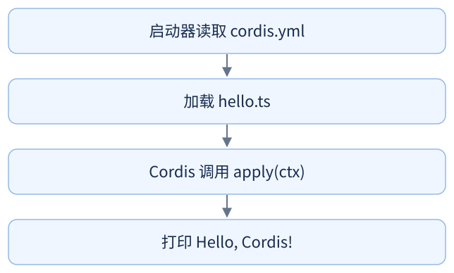
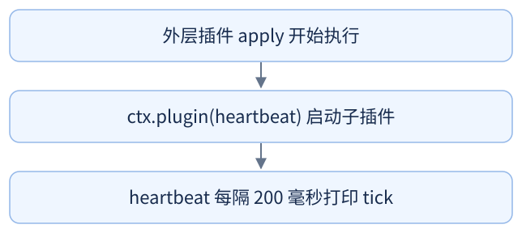
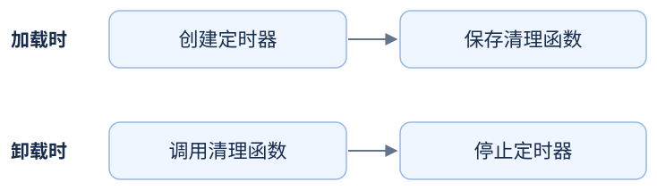
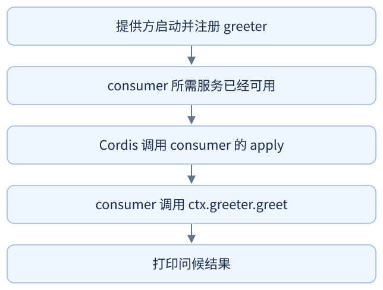
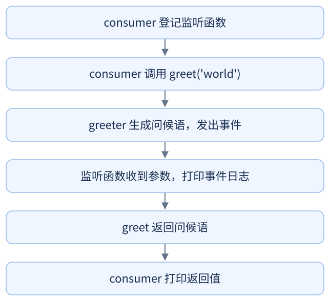
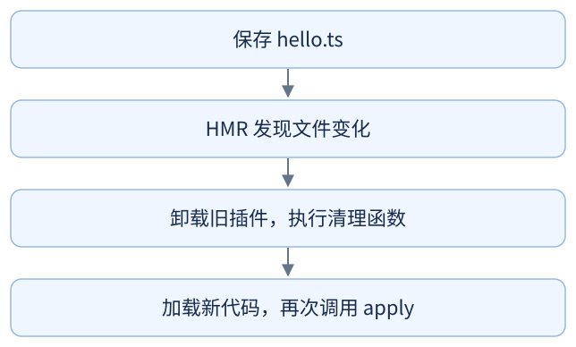
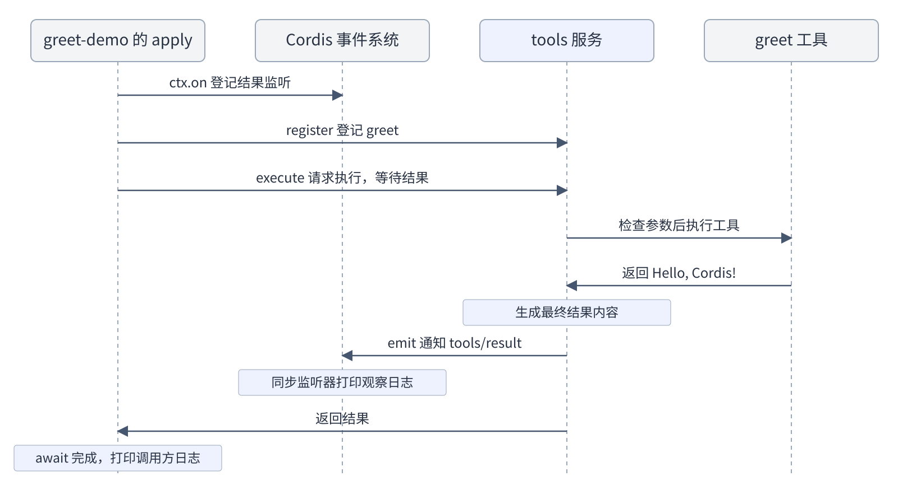

# dsh 的核心：Cordis {#ch-15}

第 12 章里，我们已经写过自己的插件；第 14 章介绍了模型、工具和会话怎样配合完成任务。这一章接着看：插件怎样启动，怎样使用其他插件提供的功能，以及停用时怎样清理资源。

本章从一个打印问候语的插件开始，逐步加入定时器、共享功能和事件通知，介绍插件的启动与卸载、服务、事件、配置和热重载。最后的示例将问候功能注册为 `greet` 工具，通过 harness 的工具服务调用它，并用监听器记录调用过程和结果。所有示例都不调用大模型，也不需要 API 密钥。

对于每组示例，本章会先给出需要准备的文件和运行方法，再结合终端输出解释代码。涉及的 TypeScript 写法会在对应位置说明，示例后的语法速查表可供查阅。

## 认识 Cordis {#sec-15-1}

### 环境准备与示例目录

运行本章示例需要先下载 deepseek-harness 源码，并安装仓库依赖。

环境准备好后，将本书 `demo/` 目录下的 `chapter15-cordis` 文件夹完整复制到 deepseek-harness 仓库根目录。示例使用这个仓库已有的依赖和配置，无需在各示例目录中单独安装依赖。

复制后的目录结构如下。每组示例都有独立的代码和 `cordis.yml`，可以分别运行。

```text
deepseek-harness/              ← 源码仓库根目录
├── node_modules/              ← 已安装的仓库依赖
├── vendor/cordis/bin.js       ← 仓库已有启动器
└── chapter15-cordis/
    ├── 01-first-plugin/
    ├── 02-lifecycle/
    ├── 03-services/
    ├── 04-events/
    ├── 05-config/
    ├── 06-hmr/
    └── 07-tools/
```

每节运行示例时，先从 deepseek-harness 仓库根目录进入该节文件夹，再启动程序。


### 第一个插件

我们先从打印一句问候语开始。你可能会想到：写一个 `hello` 函数，再调用 `hello()` 就够了。确实如此。不过，等程序里有了很多功能，你还得安排哪些要启动、在哪里启动，以及停用时怎么清理。

用 Cordis 时，可以把这些功能分别写成插件，在配置里选出要启动的插件，由 Cordis 调用它们的入口函数。我们先把打印问候语写成一个插件，跑起来看看。

#### 准备文件并运行

我们先在 `01-first-plugin` 中创建 `hello.ts`，写入以下代码：

```typescript
import type { Context } from '@deepseek-ai/cordis'

export function apply(ctx: Context) {
  console.log('Hello, Cordis!')
}
```

还需要一份配置，告诉启动器加载哪个插件。我们在同一目录中创建 `cordis.yml`，内容如下：

```yaml
- name: './hello.ts'
```

我们看一下配置中的 `name`：这里填 `./hello.ts`，启动器就会加载同一目录下的这个文件。后面用到已经安装好的插件时，这里也可以填插件包的名字。

两个文件准备好后，我们进入这组示例的文件夹，启动程序：

```bash
cd chapter15-cordis/01-first-plugin
node --import tsx ../../vendor/cordis/bin.js
```

```text
Hello, Cordis!
```

`--import tsx` 让 Node 能加载 TypeScript 文件；`../../vendor/cordis/bin.js` 指向仓库中的启动器，它会读取当前示例的 `cordis.yml`。

下图展示了启动器读取配置、加载插件并调用入口函数的流程。

{.book-technical-figure width=60%}

回头看 `hello.ts`，我们只定义了 `apply`，没有直接调用它。启动器加载这个文件后，会把它导出的 `apply` 交给 Cordis 调用。这个文件就是一个最简单的插件。

**语法速查**

| 写法 | 含义 |
| --- | --- |
| `import type { Context } …` | 导入 `Context` 类型，供 TypeScript 检查。 |
| `ctx: Context` | 将参数 `ctx` 的类型声明为 `Context`。 |
| `export function apply` | 导出插件入口，由 Cordis 加载时调用。 |

## 插件如何加载和卸载 {#sec-15-2}

前面的插件只打印了一句话。这次让插件每隔 200 毫秒打印一次 `tick`，再让它停下来。这里多了一个要处理的东西：定时器。入口函数执行完，定时器还会继续运行；停用插件时，也得把它关掉。

我们当然也可以用 `clearInterval` 关闭定时器，但要安排好什么时候调用它。用 Cordis 时，把清理函数登记到插件上，Cordis 就会在卸载插件时调用它。下面一起把定时器和清理函数写出来；具体怎么关闭资源，仍然需要写在清理函数里。

### 准备文件并运行

首先，我们在这组示例的文件夹里新建 `lifecycle.ts`，把启动定时器和安排卸载的代码写进去。完整示例运行后，我们再逐段看它的执行过程。

```text
chapter15-cordis/02-lifecycle/
├── lifecycle.ts   ← 本节的插件
└── cordis.yml     ← 本节的配置
```

`lifecycle.ts` 的完整内容：

```typescript
import type { Context } from '@deepseek-ai/cordis'

function heartbeat(ctx: Context) {
  console.log('heartbeat 启动')
  ctx.effect(() => {
    const timer = setInterval(() => console.log('tick'), 200)
    return () => {
      clearInterval(timer)
      console.log('heartbeat 已清理')
    }
  })
}

export function apply(ctx: Context) {
  const fiber = ctx.plugin(heartbeat)
  ctx.effect(() => {
    const timer = setTimeout(async () => {
      await fiber.dispose()
      console.log('子插件已卸载')
    }, 700)
    return () => clearTimeout(timer)
  })
}
```

插件代码写好后，我们在 `02-lifecycle` 中创建 `cordis.yml`，配置如下：

```yaml
- name: './lifecycle.ts'
```

文件准备好后，我们运行示例，观察 `tick` 打印了几次、什么时候停下来，再回到代码里看是谁关掉了定时器。

```bash
cd chapter15-cordis/02-lifecycle
node --import tsx ../../vendor/cordis/bin.js
```

```text
heartbeat 启动
tick
tick
tick
heartbeat 已清理
子插件已卸载
```

这里通常有三个 `tick`。卸载后，定时器停止打印，清理日志出现在“子插件已卸载”之前。

### 外层插件与子插件的分工

回到 `lifecycle.ts`，可以找到两个函数：`heartbeat` 启动定时器，每隔 200 毫秒打印一次；外层的 `apply` 启动 `heartbeat`，并安排在约 700 毫秒后卸载它。

下图展示了外层 `apply` 启动 `heartbeat` 子插件，并由子插件创建定时器的过程。

{.book-technical-figure width=68%}

`ctx.plugin(heartbeat)` 把函数直接交给 Cordis，因此这个函数不必叫 `apply`。它返回的 `fiber` 是管理这次插件实例的对象，后面用 `fiber.dispose()` 卸载它。

### 用 ctx.effect 管理资源

为了让 Cordis 在插件卸载时执行清理，我们在 `heartbeat` 中使用 `ctx.effect`：

```typescript
ctx.effect(() => {
  const timer = setInterval(() => console.log('tick'), 200)
  return () => {
    clearInterval(timer)
    console.log('heartbeat 已清理')
  }
})
```

传给 `ctx.effect` 的函数在加载时执行，`setInterval` 创建一个每隔 200 毫秒打印一次的定时器。`timer` 保存定时器对象，`clearInterval(timer)` 可以停止它。

注意，`return () => { ... }` 返回一个清理函数，此时不会执行清理。Cordis 先保存这个函数，等子插件卸载时再调用。这个清理函数也叫 `disposer`。

下图展示了清理函数在插件加载时保存、在插件卸载时执行的流程。

{.book-technical-figure width=85%}

### 卸载子插件

再往下看外层 `apply` 中的 `setTimeout`。我们想先看到几次 `tick`，再卸载子插件，所以把等待时间设成了 700 毫秒。

```typescript
setTimeout(async () => {
  await fiber.dispose()
  console.log('子插件已卸载')
}, 700)
```

`setTimeout` 会在约 700 毫秒后调用 `fiber.dispose()`，卸载子插件。清理完成后，才会执行后面的打印，因此终端会先显示“`heartbeat` 已清理”，再显示“子插件已卸载”。

外层的定时任务也通过 `ctx.effect` 登记了清理函数。如果外层插件提前卸载，这个任务会被取消，子插件也会一并卸载。

### 卸载时机与资源清理

插件可能因停用、重新加载或依赖服务消失而卸载；卸载一个插件不等于退出整个程序。`apply` 执行结束也不等于插件卸载，它登记的功能仍可继续存在。

自己创建的普通定时器、连接，需要通过 `ctx.effect` 登记相应的清理函数。`ctx.on` 登记的监听器和 `ctx.plugin` 挂载的子插件，则由 Cordis 随所属插件卸载而清理。

**语法速查**

| 写法 | 含义 |
| --- | --- |
| `ctx.plugin(heartbeat)` | 启动子插件并返回 `fiber`；父插件卸载时，子插件也会卸载。 |
| `return () => { … }` | 返回一个函数，本例用作清理函数。 |
| `ctx.effect(() => { … })` | 执行回调创建资源；保存回调返回的清理函数，在插件卸载时调用。 |
| `async` / `await` | `async` 声明异步函数，函数内可用 `await` 等待异步操作完成。 |
| `fiber.dispose()` | 卸载子插件，返回等待清理完成的 Promise。 |

## 插件如何依赖、通信和更新 {#sec-15-3}

### 通过服务共享功能

如果我们想让另一个插件也能生成问候语，可以直接 `import` 一个函数；如果需要保存状态，也可以创建一个对象，传给要用它的代码。对象由谁创建、什么时候能用、什么时候释放，也要跟着安排好。

而在 Cordis 中，我们可以让一个插件把问候功能注册成服务，另一个插件通过 `ctx` 调用它。使用方在 `inject` 里写明需要哪个服务，Cordis 就会等服务准备好，再启动它。

#### 准备文件并运行

准备两个插件文件：`greeter.ts` 提供问候功能，`consumer.ts` 调用它。再用 `cordis.yml` 把两个插件都加载进来：

```text
chapter15-cordis/03-services/
├── greeter.ts     ← 提供问候服务
├── consumer.ts    ← 调用服务
└── cordis.yml
```

`greeter.ts` 的完整内容：

```typescript
import { Service, type Context } from '@deepseek-ai/cordis'

declare module '@deepseek-ai/cordis' {
  interface Context {
    greeter: GreeterService
  }
}

export class GreeterService extends Service {
  constructor(ctx: Context) {
    super(ctx, 'greeter')
  }

  greet(who: string) {
    return `Hello, ${who}!`
  }
}

export function apply(ctx: Context) {
  ctx.plugin(GreeterService)
}
```

问候服务定义好后，我们再在 `consumer.ts` 中调用它：

```typescript
import type { Context } from '@deepseek-ai/cordis'
import type {} from './greeter.ts'

export const inject = ['greeter']

export function apply(ctx: Context) {
  console.log(ctx.greeter.greet('world'))
}
```

两个插件写好后，我们通过 `cordis.yml` 将它们加载进来：

```yaml
- name: './greeter.ts'
- name: './consumer.ts'
```

配置完成后，我们运行示例，终端仍会打印 `Hello, world!`。这次问候语在 `greeter.ts` 里生成，在 `consumer.ts` 里打印，运行后我们再顺着调用看一遍：

```bash
cd chapter15-cordis/03-services
node --import tsx ../../vendor/cordis/bin.js
```

```text
Hello, world!
```

结合刚才的输出，我们先看 `consumer.ts` 中传给 `console.log` 的这一句：

```typescript
ctx.greeter.greet('world')
```

从左到右读：通过上下文 `ctx` 找到 `greeter` 服务，调用它的 `greet` 方法，把 `world` 传进去。`greet` 返回 `Hello, world!`。

#### 类、实例与方法

接着回到 `greeter.ts`，看看 `ctx.greeter` 上的 `greet` 方法是从哪里来的。

先看 `class GreeterService`：问候功能写在这个类里，`extends Service` 让它继承 Cordis 的服务基类。创建并注册好服务对象后，另一个插件就能通过 `ctx.greeter` 找到它，调用它的 `greet` 方法。

`constructor` 是创建服务对象时执行的初始化方法。里面的 `super(ctx, 'greeter')` 调用父类初始化，把这个服务以 `greeter` 的名字注册起来。

定义类本身不会启动它。文件末尾的 `apply` 调用 `ctx.plugin(GreeterService)`，Cordis 才挂载这个服务类，创建实例并执行初始化。

`greet` 中 `who: string` 表示参数是字符串。反引号里的 `${who}` 会把参数放进问候语。这个方法只返回文字，不打印。

#### 用 `inject` 声明服务依赖

如果把两个插件在配置里的顺序交换，`consumer` 还能正常使用 `greeter` 吗？先看 `consumer` 声明的依赖：

```typescript
export const inject = ['greeter']
```

有这行 `inject` 声明，即使交换配置顺序，`consumer` 也会等 `greeter` 服务可用后才执行 `apply`。这里填的 `greeter`，要和提供方 `super(ctx, 'greeter')` 中注册的服务名一致。

下图展示了 `greeter` 服务注册后，依赖它的 `consumer` 插件启动的流程。

{.book-technical-figure width=65%}

两个插件都有 `apply` 没有冲突，它们属于不同文件。没有依赖关系时，两个插件都可以启动；不能用 YAML 的排列顺序保证谁先完成。有依赖时，Cordis 根据服务是否可用决定启动时机。

服务提供方卸载后，服务会移除；依赖它的插件也会卸载，等服务恢复后再加载。

#### 用 `declare module` 补充类型声明

`greeter.ts` 中的 `declare module` 为 `Context` 补充了 `greeter` 属性的类型，让编辑器能够识别 `ctx.greeter.greet()`：

```typescript
declare module '@deepseek-ai/cordis' {
  interface Context {
    greeter: GreeterService
  }
}
```

`consumer.ts` 通过 `import type {} from './greeter.ts'` 引入这段类型声明。实际加载服务仍由 `cordis.yml` 中的配置完成。

**语法速查**

| 写法 | 含义 |
| --- | --- |
| `class GreeterService extends Service` | 定义服务类，继承 Cordis 的 `Service` 基类。 |
| `constructor` / `super(ctx, 'greeter')` | 构造方法负责初始化；`super` 调用父类构造方法，将服务注册为 `greeter`。 |
| `ctx.plugin(GreeterService)` | 挂载服务类，创建并初始化服务实例。 |
| `export const inject = ['greeter']` | 等待 `greeter` 服务可用后，再启动本插件。 |
| `declare module '@deepseek-ai/cordis' { … }` | 通过声明合并补充 `Context` 的类型信息。 |
| `import type {} from './greeter.ts'` | 引入 `greeter.ts` 中的类型声明。 |

### 通过事件发送通知

前面的服务示例调用 `greet` 后，调用方能直接拿到问候语。如果还想记一条日志，或者统计问候了多少次，怎么让这些功能也知道刚才发生了什么？

你可以逐个调用回调函数，也可以用 `EventEmitter` 等事件库。在 Cordis 里，我们用 `ctx.emit` 发通知，用 `ctx.on` 接收通知；插件卸载时，Cordis 还会移除它登记的监听器。下面给问候服务加一条通知，再写代码接收它。

#### 准备文件并运行

我们在前面的服务示例中加入事件通知：`greeter` 生成问候语时发出通知，`consumer` 在调用问候方法之前登记监听。

```text
chapter15-cordis/04-events/
├── greeter.ts     ← 本节自己的版本，生成问候语后发出事件
├── consumer.ts    ← 本节自己的版本，先监听再调用
└── cordis.yml
```

在独立的 `04-events` 文件夹中新建下面的文件，保留 `03-services` 中的版本，方便对照。先写 `04-events/greeter.ts`：

```typescript
import { Service, type Context } from '@deepseek-ai/cordis'

declare module '@deepseek-ai/cordis' {
  interface Context {
    greeter: GreeterService
  }
  interface Events {
    'greeter/greeted'(who: string, message: string): void
  }
}

export class GreeterService extends Service {
  constructor(ctx: Context) {
    super(ctx, 'greeter')
  }

  greet(who: string) {
    const message = `Hello, ${who}!`
    this.ctx.emit('greeter/greeted', who, message)
    return message
  }
}

export function apply(ctx: Context) {
  ctx.plugin(GreeterService)
}
```

有了发送通知的代码，我们再在 `consumer.ts` 中登记监听，然后调用问候方法：

```typescript
import type { Context } from '@deepseek-ai/cordis'
import type {} from './greeter.ts'

export const inject = ['greeter']

export function apply(ctx: Context) {
  ctx.on('greeter/greeted', (who, message) => {
    console.log(`[事件] 问候 ${who}：${message}`)
  })

  const message = ctx.greeter.greet('world')
  console.log(`[返回值] ${message}`)
}
```

这两个插件仍通过 `cordis.yml` 加载，配置与上一组示例相同：

```yaml
- name: './greeter.ts'
- name: './consumer.ts'
```

文件准备好后，我们运行示例：

```bash
cd chapter15-cordis/04-events
node --import tsx ../../vendor/cordis/bin.js
```

```text
[事件] 问候 world：Hello, world!
[返回值] Hello, world!
```

从日志顺序可以看到，`greet` 发出事件后，监听函数先打印问候语；随后，`greet` 返回结果，调用方再打印一次。因此，一次方法调用产生了两条日志。

#### 发送与监听事件

下面分别说明 `greeter.ts` 如何发送事件，以及 `consumer.ts` 如何监听事件。两边要使用相同的事件名，发送的数据也要和监听函数接收的参数对应。

提供方新增的这句负责发送事件：

```typescript
this.ctx.emit('greeter/greeted', who, message)
```

这里用服务持有的上下文 `this.ctx` 发出通知。第一个参数 `greeter/greeted` 是事件名，后面的 `who` 和 `message` 是一起发出的数据。监听时也要写这个事件名。

使用方新增的这段负责监听：

```typescript
ctx.on('greeter/greeted', (who, message) => {
  console.log(`[事件] 问候 ${who}：${message}`)
})
```

这段通过 `ctx.on` 登记监听函数，每次收到 `greeter/greeted` 事件，就把事件参数传给它并执行。登记时不会立即打印；后面调用 `greet`，`greet` 发出事件，才触发这里的 `console.log`。

下图展示了一次 `greet` 调用中，发送事件、执行监听函数和返回问候语的顺序。

{.book-technical-figure width=65%}

这里由同一个 `consumer` 先登记监听，再发起调用，保证本次事件不会在监听之前发生。如果先调用 `greet`，之后才登记监听，就会错过那次通知。

#### 服务调用与事件通知的区别

回头看这次 `greet` 调用：`consumer` 想拿到问候语，就调用方法、接收返回值；日志功能想知道问候了谁，就监听事件。同一个功能里，这两种写法可以一起用。

发送方不用知道是谁在监听。可以增加多个监听器，分别打印、统计或做其他处理。`emit` 是同步广播，不收集监听器的返回值，也不等待它们返回的异步任务。当前例子里的监听函数是同步打印，所以它的日志先出现。

`ctx.on` 已经由 Cordis 管理，所属插件卸载时监听器自动移除，不必额外包一层 `ctx.effect`。

**语法速查**

| 写法 | 含义 |
| --- | --- |
| `interface Events` | 声明事件名称和参数类型，供 TypeScript 检查 `emit` 和 `on` 的用法。 |
| `ctx.emit('greeter/greeted', …)` | 发送事件并传递参数；不等待异步监听任务。 |
| `ctx.on('greeter/greeted', …)` | 登记监听函数；插件卸载时自动移除。 |

### 插件配置

假如想把 `Hello` 换成你好，或者换一组问候对象，每次都去改插件源码会有些麻烦。普通函数可以通过参数接收这些值；要从配置文件里读取，就还得处理默认值和填错类型的情况。

这次把问候语和名字放进 `cordis.yml`，在插件里写好检查规则，交给 Cordis 读取和检查。先换一组名字，再故意填错一个类型，看看会发生什么。

#### 准备文件并运行

先建两个文件：`config-demo.ts` 里写问候逻辑和配置规则，`cordis.yml` 里填这次要使用的值。以后换问候语或名字，就去改 YAML 文件。

```text
chapter15-cordis/05-config/
├── config-demo.ts
└── cordis.yml
```

`config-demo.ts` 的完整内容：

```typescript
import type { Context } from '@deepseek-ai/cordis'
import Schema from '@deepseek-ai/schemastery'

export interface Config {
  greeting: string
  targets: string[]
}

export const Config: Schema<Config> = Schema.object({
  greeting: Schema.string().default('Hello'),
  targets: Schema.array(String).default(['world']),
})

export function apply(ctx: Context, config: Config) {
  for (const target of config.targets) {
    console.log(`${config.greeting}, ${target}!`)
  }
}
```

配置规则写好后，我们在 `cordis.yml` 中填入这次使用的值：

```yaml
- name: './config-demo.ts'
  config:
    targets: ['alpha', 'beta']
```

配置里没有写 `greeting`，输出中的 `Hello` 是从哪里来的？先运行看看：

```bash
cd chapter15-cordis/05-config
node --import tsx ../../vendor/cordis/bin.js
```

```text
Hello, alpha!
Hello, beta!
```

输出中的 `Hello` 来自 `Schema.string().default('Hello')`：`greeting` 没填时会使用这个默认值。`targets` 提供了两个名字，所以打印两句问候语。

#### 在 `apply` 中接收配置

看过运行结果后，我们再对照下面的函数，看看它比最小插件的 `apply` 多了哪个参数。

```typescript
export function apply(ctx: Context, config: Config) {
  for (const target of config.targets) {
    console.log(`${config.greeting}, ${target}!`)
  }
}
```

`apply` 多了第二个参数 `config`。Cordis 读取 YAML 中这个插件的 `config`，检查并补上默认值后，传给 `apply`。`for` 循环逐个取出 `targets` 中的名字，每个打印一句。

本例传给 `apply` 的配置相当于：

```typescript
{
  greeting: 'Hello',
  targets: ['alpha', 'beta']
}
```

#### 配置类型与校验规则

`interface Config` 声明配置的类型，供 TypeScript 检查代码中对配置的使用。例如，`greeting` 是字符串，`targets` 是字符串数组。

`const Config` 定义运行时的校验规则，供 Cordis 读取 YAML 配置时使用。这里通过 `Schema.object` 指定各字段的类型和默认值，校验后的配置再传给 `apply`。

#### 修改配置与验证校验规则

现在改一下 `cordis.yml`，看看插件能不能用上新值；然后填错一个类型，看看检查规则会在哪里拦住它。

我们先把配置改成：

```yaml
- name: './config-demo.ts'
  config:
    greeting: '你好'
    targets: ['小明', '小红']
```

再次运行会得到：

```text
你好, 小明!
你好, 小红!
```

新配置生效后，我们再试着把 `targets` 写成一个字符串：

```yaml
- name: './config-demo.ts'
  config:
    targets: 'not-an-array'
```

运行后会报错，下面只摘出关键部分；终端还会显示调用栈等信息：

```text
invalid config:
  - $.targets expected array but got not-an-array (at targets)
```

报错指出 `targets` 应该是数组，实际收到的却是字符串。错误发生在 `apply` 运行之前，所以不会打印问候语。默认值用于补上未填写的值，不负责把错误类型自动改对。

看完错误输出后，把配置恢复成前面的合法版本。

**语法速查**

| 写法 | 含义 |
| --- | --- |
| `interface Config { … }` | 声明配置类型，供 TypeScript 检查代码；类型可以与变量同名。 |
| `export const Config: Schema<Config> = …` | 导出配置校验规则，`Schema<Config>` 指定规则对应的配置类型。 |
| `Schema.string().default('Hello')` | 声明字符串配置，未填写时使用默认值 `'Hello'`。 |
| `apply(ctx: Context, config: Config)` | 第二个参数接收已检查、已补默认值的配置。 |

### 插件组合与热重载

前面改完代码，都要重新运行启动命令。这次我们就让程序一直开着：修改插件文件，保存后就看到新输出。这个功能叫热重载。

我们用 HMR 插件来完成它。HMR 是 Hot Module Replacement（热模块替换）的缩写；文件变化后，它会卸载旧插件，再加载新代码。下面给 `hello` 加上卸载日志，就能从终端里看到这个过程，然后再试试从配置里停用和启用插件。

#### 准备文件并运行

先给 `hello.ts` 加一个清理函数，在插件卸载时打印一行日志。这样保存新代码后，就能看见旧插件有没有被卸载。

```text
chapter15-cordis/06-hmr/
├── hello.ts       ← 本节新建，包含卸载日志
└── cordis.yml     ← 本节独立启用 HMR
```

在 `06-hmr` 中新建 `hello.ts`，保留 `01-first-plugin` 中的文件。完整内容如下：

```typescript
import type { Context } from '@deepseek-ai/cordis'

export function apply(ctx: Context) {
  console.log('Hello, Cordis!')
  ctx.effect(() => {
    return () => console.log('hello 已卸载')
  })
}
```

为了观察热重载，我们在 `cordis.yml` 中加入所需的插件：

```yaml
- id: logger
  name: '@deepseek-ai/cordis-plugin-logger-console'
- id: timer
  name: '@deepseek-ai/cordis-plugin-timer'
- id: hmr
  name: '@deepseek-ai/cordis-plugin-hmr'
  config:
    root: ['.']
- id: hello
  name: './hello.ts'
```

前三项是已经安装在仓库依赖中的插件，不用自己创建文件。它们分别负责把日志显示到终端、提供计时服务、监视变化并重新加载。最后一项才是自写的 `hello.ts`。

HMR 的 `root: ['.']` 指定监视当前目录。`timer` 提供它依赖的计时服务，因此这两项需要一起加载。

配置好这些插件后，我们启动程序：

```bash
cd chapter15-cordis/06-hmr
node --import tsx ../../vendor/cordis/bin.js
```

启动后会打印 `Hello, Cordis!`，并出现包含 `hmr watching` 的日志。保持本节程序运行，打开 `chapter15-cordis/06-hmr/hello.ts`，把第一条打印改为：

```typescript
console.log('Hello, 修改后的插件!')
```

保存后会看到 HMR 的重新加载日志，以及自写插件的两行输出：

```text
hello 已卸载
Hello, 修改后的插件!
```

第一行来自旧插件的清理函数，第二行来自新代码的 `apply`。HMR 日志带有时间戳，这里只列出我们自己写的两行。

下图展示了保存代码后，卸载旧插件并加载新代码的流程。

{.book-technical-figure width=65%}

还记得 15.2 节写的清理函数吗？热重载时它就派上用场了：旧插件的定时器、连接等需要先清理掉。Cordis 会清理它管理的资源；自己创建的资源，也要登记好对应的清理函数。

#### 用 disabled 停用插件

如果想暂时关掉 `hello`，又保留配置方便以后启用，可以给它加上 `disabled`。

将 `chapter15-cordis/06-hmr/cordis.yml` 的最后一项改为：

```yaml
- id: hello
  name: './hello.ts'
  disabled: true
```

保存后，`hello` 插件被卸载，会打印“hello 已卸载”。配置项仍然在文件里，只是暂时停用。把 `true` 改成 `false` 再保存，又会加载它，打印修改后的问候语。

`id` 用来识别配置项，服务则使用各自注册时的名称。负责读取配置、加载插件的组件叫 `loader`（加载器）。固定 `id` 让它知道你修改的是原来的配置项；不写 `id` 时，重新读取会生成新标识，未改内容的配置项也可能被当作删除后重新添加。

## Cordis 如何组装 dsh {#sec-15-4}

现在把问候功能做成一个工具。`greet(name)` 本来就能返回问候语，不过，要接收模型或其他外部输入发来的调用请求，还得告诉调用方工具叫什么、参数怎么填，并检查参数、整理结果，让监听器知道是哪次调用完成了。

这些工作可以交给 harness 的 `tools` 服务。我们写一个 `greet` 工具，注册进去，再用代码发起一次调用，看看监听器怎样收到结果。这里用到的插件加载、服务依赖和事件机制由 Cordis 提供，工具定义和执行流程由 harness 的工具插件提供；这个示例不调用大模型。

### 准备文件并运行

还记得 15.3 节事件示例中要先监听、再发出事件吗？这里也按登记监听 → 注册工具 → 发起调用的顺序写在同一个插件里，确保调用前监听器已经准备好。

```text
chapter15-cordis/07-tools/
├── greet-demo.ts
└── cordis.yml     ← 本节只加载工具示例需要的插件
```

这一组示例先准备 `cordis.yml`，加载工具服务及其依赖：

```yaml
- name: '@deepseek-ai/dsh-system-prompt'
- name: '@deepseek-ai/dsh-tools'
- name: './greet-demo.ts'
```

前两项分别提供 `systemPrompt` 和 `tools` 服务。系统提示词是应用交给模型的说明，例如有哪些工具、怎样使用。`systemPrompt` 服务负责组织这些说明，`tools` 服务会向它加入工具说明，因此也依赖它。

本例虽然不调用模型，加载 `tools` 时仍然需要满足这个依赖。缺少提供方时，它会像 15.3 节服务示例中的 `consumer` 一样等待。

依赖配置好后，我们在 `greet-demo.ts` 中编写监听、注册和调用工具的代码：

```typescript
import type { Context } from '@deepseek-ai/cordis'
import { brandString } from '@deepseek-ai/dsh-brand'
import { defineTool } from '@deepseek-ai/dsh-tools'
import type { ToolCallId } from '@deepseek-ai/dsh-llm'

export const inject = ['tools']

export async function apply(ctx: Context) {
  ctx.on('tools/result', (exec, result) => {
    const text = result.content
      .map(block => block.type === 'text' ? block.text : '')
      .join('')
    console.log(`[观察] ${exec.name} -> ${text}`)
  })

  ctx.tools.register(defineTool({
    name: 'greet',
    description: 'Greet the named person.',
    parameters: {
      name: { type: 'string', required: true, description: 'Who to greet' },
    },
    output: {
      schema: { type: 'string' },
      render: (_args, value) => [{ type: 'text', text: value }],
    },
    async execute(args) {
      return `Hello, ${args.name}!`
    },
  }))

  const result = await ctx.tools.execute({
    callId: brandString<ToolCallId>('demo-1'),
    name: 'greet',
    arguments: { name: 'Cordis' },
    signal: new AbortController().signal,
  })

  console.log('调用方收到：', JSON.stringify(result.content))
}
```

现在运行工具示例，看看观察者和调用方的日志谁先出现。

```bash
cd chapter15-cordis/07-tools
node --import tsx ../../vendor/cordis/bin.js
```

```text
[观察] greet -> Hello, Cordis!
调用方收到： [{"type":"text","text":"Hello, Cordis!"}]
```

同一次工具调用出现两条日志：监听器打印一条，调用方拿到结果后再打印一条。它和 15.3 节的事件通知与方法返回是相似的过程。

### 插件、服务与工具

先对照刚才的文件和代码，分清插件、服务、工具这三个名称各指什么。

`greet-demo.ts` 是插件，Cordis 调用它的 `apply` 入口。`ctx.tools` 是入口中使用的服务对象；`greet` 是登记在这个服务里的工具。插件负责把本例需要的监听、注册和调用组织起来。

`ctx.tools.register` 登记工具，工具服务会在所属插件卸载时撤销注册；`ctx.tools.execute` 发起工具调用。`greet` 由 `tools` 服务管理和调用；15.3 节服务示例中的 `ctx.greeter` 则是单独注册的问候服务。

### 用 `defineTool` 定义工具

`defineTool` 用来描述工具的名称、用途、参数和返回结果，再由 `ctx.tools.register` 注册到工具服务中。

本例的 `greet` 工具接收字符串参数 `name`，由 `execute(args)` 生成问候语，`output.render` 将它转换为文本内容块。

注册时不会执行问候功能。发起调用后，工具服务先检查参数，再执行工具。

本例的返回值与内容块之间是这样转换的：

```text
execute 返回：
'Hello, Cordis!'

output.render 转换后：
[{ type: 'text', text: 'Hello, Cordis!' }]
```

`output.render` 接收工具返回的问候语，将它转换为文本内容块。结果用数组保存，可以包含多个内容块。

### 调用请求的字段

工具已经注册好了，往下找到 `ctx.tools.execute`，给它传入这次调用的请求。这里除了工具名和参数，还要带上调用标识和取消信号：

```typescript
const result = await ctx.tools.execute({
  callId: brandString<ToolCallId>('demo-1'),
  name: 'greet',
  arguments: { name: 'Cordis' },
  signal: new AbortController().signal,
})
```

这份请求通过 `name: 'greet'` 选择刚才注册的工具，并通过 `arguments` 传入参数 `{ name: 'Cordis' }`。工具执行时，`execute(args)` 中的 `args.name` 就是这里的 `'Cordis'`。请求还包含调用标识 `callId`，用于关联这次请求与结果，以及用于传递取消请求的 `signal`。`await ctx.tools.execute(...)` 等待工具执行完成，随后打印返回结果。

### 监听 tools/result

再回到 `apply` 开头的结果监听器。如果以后加了更多工具，也想打印它们的结果，可以在这里统一接收结果通知，不必挨个给工具加打印代码。

`ctx.on('tools/result', ...)` 登记结果监听器，`exec` 是这次调用的信息，`result` 是最终结果。代码遍历 `result.content`，取出文本块的文字，再用 `join` 拼起来打印。

工具服务得到最终结果后，以 `emit` 模式通知已登记、且作用域匹配的监听器。作用域可以先理解为监听器的接收范围：只有这次调用在它的接收范围内，它才会收到通知。监听器只观察结果，不改变工具的返回值。

`emit` 不等待异步监听任务。本例同步打印，所以观察日志在调用方日志之前。

下图展示了工具注册、执行和结果通知的完整流程。

{.book-technical-figure width=100%}

### 监听工具执行过程

前面是在结果出来后打印日志。如果还想看到执行开始和执行返回的时刻，可以再监听 `tools/execute`。下面在这两个时刻各打印一行，并记录它们之间的耗时。

`execute` 在本例中有三种用法：`ctx.tools.execute(...)` 发起工具调用，工具定义中的 `execute(args)` 实现问候功能，`tools/execute` 则是用于监听执行过程的事件名。

监听 `tools/execute` 时，函数会多收到一个 `next` 参数。调用它，后面的处理才会继续；等待它返回后，还可以接着写代码。这种事件分发方式叫 waterfall。

在现有示例的基础上，我们把下面这段加入 `greet-demo.ts` 的 `apply` 内，放在现有结果监听之后、`ctx.tools.register` 之前。

```typescript
  ctx.on('tools/execute', async (exec, next) => {
    const started = performance.now()
    console.log(`[开始] ${exec.name}`)
    const result = await next()
    const elapsed = (performance.now() - started).toFixed(1)
    console.log(`[执行返回] ${exec.name}，耗时 ${elapsed} ms`)
    return result
  })
```

看 `await next()` 的前后：前面记下开始时间、打印“开始”，后面拿到返回结果、计算耗时并打印“执行返回”，最后用 `return result` 交回结果。`performance.now()` 用来读取时间，`toFixed(1)` 把耗时保留到一位小数。

加入监听后，我们重新运行示例，输出类似下面这样；6.3 ms 是一次实跑值，每次耗时都会不同：

```text
[开始] greet
[执行返回] greet，耗时 6.3 ms
[观察] greet -> Hello, Cordis!
调用方收到： [{"type":"text","text":"Hello, Cordis!"}]
```

`tools/execute` 返回后，还会进行后续结果处理；最终结果由 `tools/result` 通知。

到这里，你已经写好了一个工具，也能看到它开始执行、执行返回和发出结果通知。示例中的调用由代码发起；接入真实智能体后，调用请求由模型提出，harness 执行工具并把结果交回模型。
