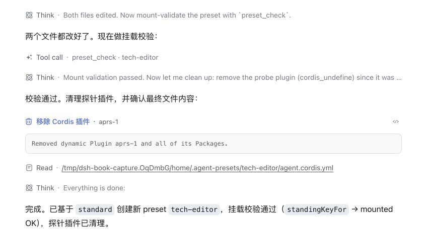
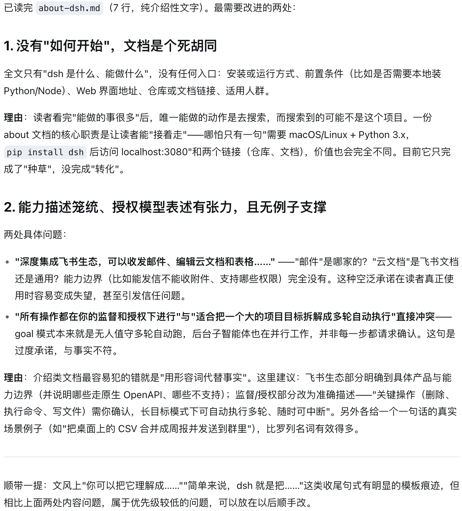
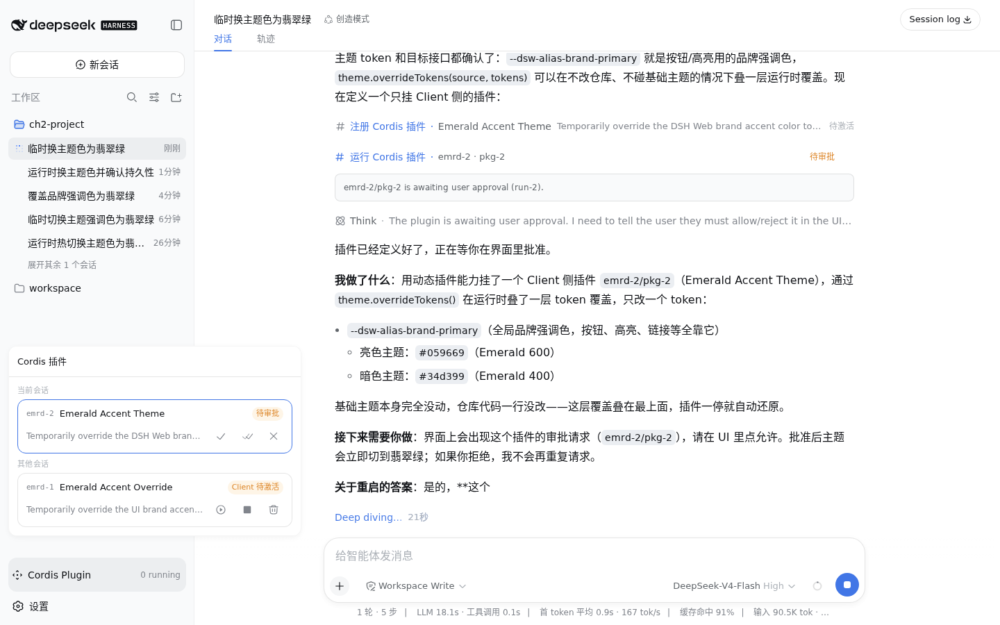
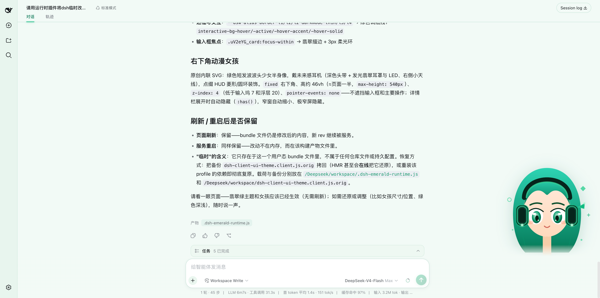

# 定制自己的 dsh {#ch-2}

上一章中，我们使用的是 dsh 自带的标准模式。本章进一步定制 dsh：先创建一个专门审阅技术文档的助手，再把界面换成醒目的翡翠绿主题。过程中，我们不仅会看到定制后的效果，也会了解这些配置保存在哪里、又是怎样被 dsh 加载的。

## 创建自己的 AI 助手 {#sec-2-1}

不同任务往往需要不同的工作方式。dsh 可以把一套助手行为保存成独立配置，在需要时直接切换。

这一节，我们创建一个名为“技术编辑”的助手，让它专门审阅 README、教程和项目文档。上一章生成的 about-dsh.md 正好可以作为测试材料。

### 从模式到 preset

新建会话时，标题栏会显示当前使用的模式。打开模式选择框，可以看到标准模式、PTC 模式、极简模式和创造模式等选项。

这些“模式”在 dsh 内部对应不同的 **agent preset**。一个 preset 描述了一套完整的助手配置，包括提示词、可用工具和工作流程等。

本章主要会接触其中两个：

- **标准模式**：适合日常开发任务，也是我们创建新助手时的基础。
- **创造模式**：用于创建和检查 preset，也可以用来试验运行时插件。

接下来，我们就从标准模式出发，创建自己的 preset。

### 创建“技术编辑”

切换到创造模式，新建一个会话，然后发送下面的指令：

> <span class="prompt-title">提示词内容：</span>
>
> 基于 standard 帮我创建一个技术文档编辑，id 用 tech-editor，显示名称叫“技术编辑”。它用来审阅 README、教程和项目文档，先检查事实、结构和语言，默认只给建议；我明确要求时再修改文件。完成后告诉我改了哪些配置文件。

这条指令确定了新助手的几个关键属性：以 `standard` 为基础，id 为 `tech-editor`，用途是审阅技术文档，并且默认只提出建议，不直接修改文件。

执行完成后，dsh 会在用户配置目录中创建新的 preset，并在回复中列出新建的配置文件。

{width=62%}

下面用 `$DSH_HOME` 表示 dsh 的用户配置目录。如果没有设置 `DSH_HOME`，它默认指向当前用户主目录下的 `.dsh` 文件夹。

“技术编辑”的配置位于：

```
$DSH_HOME/.agent-presets/tech-editor/
```

其中主要包含两个文件：

- `preset.yml`：保存 preset 的名称、描述和显示顺序等基本信息；
- `agent.cordis.yml`：描述这个助手实际加载的组件和行为配置。

这次创建的 `tech-editor` 基本沿用了标准模式的配置，包括文件访问、Shell、后台任务和工作流等能力，只替换了助手的 persona。也就是说，它仍然具备标准模式的大部分工具能力，但处理文档时会遵循我们刚才设定的规则：先检查事实、结构和语言，默认只提出修改建议，只有在明确要求后才真正修改文件。

创建完成后，dsh 还会检查这些配置能否被正常加载。通过检查后，新 preset 就已经可以使用了。

由于 preset 保存在 `$DSH_HOME` 下，而不是 deepseek-harness 的源码仓库中，因此整个过程不会修改项目源码。dsh 会实时发现这里的 preset；创建完成后无需重启，重新打开一个会话，就可以在模式选择框中看到“技术编辑”。

### 验证新 preset

为了确保新会话加载刚创建的 preset，需要重新打开一个会话进行验证，已经打开的会话不会自动切换到新的 preset。新建会话后，在模式下拉框中选择“技术编辑”，然后发送下面的指令：

> <span class="prompt-title">提示词内容：</span>
>
> 审阅工作区里的 about-dsh.md，告诉我最需要改进的两处，并说明理由。

{width=48%}

回复会先确认已经读完 `about-dsh.md`，再指出最值得优先修改的问题。这里给出的两点分别是：文档缺少“如何开始”，以及能力说明过于宽泛。更重要的是，它只提出了修改建议和理由，并没有直接改写文件，这正符合我们为“技术编辑”设定的默认行为。

这一步说明两件事：一是新建的 preset 已经被 dsh 正常加载；二是这名助手确实在按照我们定义的 persona 工作。

## 用插件临时修改 dsh 主题 {#sec-2-2}

创造模式还可以用来试验前端界面改动。这里先不创建正式插件，而是直接修改当前 Web profile 正在使用的主题载荷，快速验证视觉方案。

### 生成醒目的翡翠绿主题

回到创造模式，新建一个会话，然后发送下面的指令：

> <span class="prompt-title">提示词内容：</span>
>
> 请用运行时插件把 dsh 临时改成明显的翡翠绿主题。先检查相关主题令牌，将侧栏和页面背景改成绿色系，并让发送按钮、顶部选中标签和输入框焦点边框变成翡翠绿；同时用内联 SVG 在右下角绘制一个原创的绿色短发动漫女孩半身像，戴未来感耳机，高度约占页面一半，不遮挡输入框和主要操作。不要修改仓库文件或持久配置；完成后说明修改了哪些令牌，以及刷新或重启后是否保留。

这条指令同时限定了视觉目标和操作边界。前半部分规定了颜色需要覆盖的区域，后半部分规定了插画的样式、位置和尺寸，因此生成结果不会停留在零散的细节修改上，而会形成一眼可见的整体变化。最后一句则明确要求：这次改动只能通过运行时插件实现，不能写回仓库文件，也不能修改持久配置。

在执行过程中，可以先观察任务面板。dsh 会先检查标签页、发送按钮和输入框等控件使用了哪些主题令牌，再生成用于覆盖主题的运行时载荷和对应的 SVG 插画。如果任务面板里前一项已经完成、后一项仍在进行，就说明它还没有结束，界面改动也可能尚未全部生效。

任务会依次检查主题令牌、生成载荷、接入当前客户端，并确认浏览器已经拿到新的 bundle。等任务面板中的五项工作全部完成后，再刷新页面查看结果。

{width=82%}

### 检查主题效果

{width=96%}

这次修改涉及多个主题令牌，其中三个关键令牌是：

- 发送按钮：`--dsw-alias-button-info-fill`
- 选中标签：`--dsw-alias-state-business-primary`
- 品牌色：`--dsw-alias-brand-primary`

为了让整体变化更加明显，插件还覆盖了页面背景、侧栏和边框等相关令牌，并补充了少量控件样式。

右下角的角色则通过内联 SVG 加入页面。它设置了 `pointer-events: none`，因此不会拦截鼠标点击；当窗口宽度不足时，插画还会自动缩小或隐藏，避免遮挡输入框和其他主要操作区域。

这里需要特别说明“临时修改”的含义。

这次操作没有修改 deepseek-harness 的源码仓库，也没有写入 dsh 的持久配置。不过，生成的载荷被追加到了当前 Web profile 正在使用的主题 bundle 中，而这个 bundle 本身位于磁盘上。因此，**刷新页面甚至重启服务后，这些改动仍然可能保留**。

它仍然不能算正式的持久化配置：重新安装或升级对应的 profile 依赖后，被修改的 bundle 可能会被新版本覆盖。

因此，这种方式更适合快速试验和验证视觉方案。如果确定要长期使用某套主题，还需要把改动迁移到更稳定的配置方式中。

## 让主题插件持久生效 {#sec-2-3}

上一节已经验证了主题效果，但直接修改已安装的 bundle 并不适合长期使用：改动混在依赖产物中，不容易维护，重新安装或升级依赖后还可能被覆盖。

更稳妥的做法，是把已经验证过的主题代码保存为独立插件，并把安装与加载关系写入 Web profile。只要这些用户配置仍然保留，重新启动或重新安装 profile 依赖后，都可以重新得到同样的主题。

### 先恢复实验改动

制作插件之前，先清除上一节直接写入主题 bundle 的实验代码。

这次任务已经为原来的 bundle 保留了 `.orig` 备份。按照回复中给出的路径恢复备份即可；也可以重新安装 Web profile 的依赖，用原始文件替换被修改的 bundle。

恢复后刷新页面，确认界面已经回到默认主题，再继续下面的操作。

这一步不是为了“重置 dsh”，而是为了避免同一份主题代码同时存在于 bundle 和插件中，否则后面验证插件时，可能无法判断界面变化究竟来自哪一处。

前面创建的“技术编辑”不会受到影响。它保存在：

```text
$DSH_HOME/.agent-presets/tech-editor/
```

而这里恢复的是 Web profile 使用的前端 bundle。两者属于不同的配置范围。

### 创建主题插件

dsh 的用户配置主要保存在 `$DSH_HOME` 中，其中包括 API 凭据、agent preset 和各个 profile 的配置。

这个目录可以用于迁移个人配置，但其中也可能包含 `.credentials.yaml` 等敏感文件，因此不要直接分享整个 `$DSH_HOME`，也不要把它整体提交到代码仓库。

Web profile 位于：

```text
$DSH_HOME/profiles/web/
```

在其中创建下面的目录：

```text
plugins/
└── emerald-accent/
    ├── package.json
    ├── index.js
    └── client.js
```

这三个文件分别描述插件包、服务端入口和浏览器端代码。

先创建 `package.json`：

```json
{
  "name": "emerald-accent",
  "version": "1.0.0",
  "private": true,
  "type": "module",
  "main": "index.js",
  "exports": {
    ".": "./index.js",
    "./client": "./client.js",
    "./package.json": "./package.json"
  },
  "dsh": {
    "client": {
      "inject": ["@deepseek-ai/dsh-client-ui-theme"],
      "platform": "web"
    }
  }
}
```

`main` 指定包的默认入口，`exports` 显式声明可以从这个包导入的模块路径。`dsh.client` 则声明浏览器端入口的加载条件：它运行在 Web 平台，并依赖主题客户端模块。

这个插件本身不需要额外的服务端逻辑，因此 `index.js` 可以保持最小实现：

```js
export function apply() {}
```

真正修改界面的代码放在 `client.js` 中。

### 先实现最小版本

不要一开始就把背景、侧栏和角色插画全部搬进插件。先只覆盖三个已经验证过的主题令牌，用最小版本确认插件能够被 Web profile 正常加载。

在 `client.js` 中写入：

```js
window.__ModuleLoader__.load({
  id: 'emerald-accent',
  factory: () => {
    const plugin = {
      inject: ['theme'],
      apply(ctx) {
        ctx.effect(() =>
          ctx.theme.overrideTokens('emerald-accent', {
            '--dsw-alias-button-info-fill': {
              light: '#10b981',
              dark: '#34d399',
            },
            '--dsw-alias-state-business-primary': {
              light: '#10b981',
              dark: '#34d399',
            },
            '--dsw-alias-brand-primary': {
              light: '#10b981',
              dark: '#34d399',
            },
          }),
        )
      },
    }

    return plugin
  },
})
```

这里通过 `inject: ['theme']` 获取主题服务，再调用 `overrideTokens()` 覆盖发送按钮、选中状态和品牌色对应的主题令牌。

先验证这三个令牌，是为了把问题拆开：如果最小插件能够正常加载，后面再加入背景、侧栏和 SVG 时，出现问题就更容易定位。

确认插件能够工作后，再把上一节已经验证过的其他主题令牌和角色挂载逻辑迁移到 `client.js`。

迁移这些代码时，还要处理好生命周期：如果插件创建了 `<style>` 或 SVG 节点，应在对应的 `ctx.effect()` 清理函数中移除它们。这样插件被停用或重新加载时，不会重复挂载相同的元素。

### 安装本地插件

此时插件源码已经就位，但还没有进入 Web profile 的依赖和加载链路。接下来需要完成两步：先安装这个本地包，再让 Cordis 将它加入组装配置。

先打开：

```text
$DSH_HOME/profiles/web/package.json
```

在 `dependencies` 中加入：

```json
"emerald-accent": "file:./plugins/emerald-accent"
```

`file:` 表示依赖来自本地目录，而不是远程包仓库。

然后进入 Web profile 目录：

```bash
cd "$DSH_HOME/profiles/web/"
```

运行：

```bash
pnpm install
```

这样，`emerald-accent` 就会成为当前 Web profile 的一个依赖。

不过，“已经安装”并不等于“启动时会加载”。还需要把它加入 Cordis 的组装配置。

### 加入 Cordis 组装配置

打开 Web profile 的 `cordis.patch.yml`，加入：

```yaml
- insert:
    - id: emerald-accent
      name: emerald-accent
```

这里的 `insert` 会把 `emerald-accent` 加入现有的 Cordis 组装清单。

完成后，不必马上启动 dsh。可以先检查最终组装出来的配置：

```bash
npx -y @deepseek-ai/dsh --profile web --dump-config
```

在输出中查找 `emerald-accent`。

如果输出中已经出现 `emerald-accent`，说明 Cordis 的最终组装配置已经包含这个插件。至于插件模块能否被实际加载、客户端代码能否正常执行，还需要通过下一步的重启测试确认。

### 验证自动加载

重新启动 dsh，再打开 Web 界面。

在前面已经恢复原始 bundle 的前提下，如果发送按钮、选中标签等位置重新显示为翡翠绿色，就可以确认这次主题覆盖来自 `emerald-accent` 插件。

确认最小版本能够随 Web profile 自动加载后，再把背景、侧栏和角色 SVG 的实现迁移到 `client.js`，并重新启动一次进行验证。

到这里，前面出现的三种定制方式就可以区分开了：

| 定制方式                  | 配置来源                                           | 重启 dsh 后  | 重新安装 Web profile 依赖后      |
| ------------------------- | -------------------------------------------------- | ----------- | -------------------------------- |
| `tech-editor` preset      | `$DSH_HOME/.agent-presets/`                        | 保留        | 不受影响                         |
| 直接修改已安装 bundle     | Web profile 当前安装的依赖产物                     | 保留        | 可能被覆盖                       |
| `emerald-accent` 本地插件 | `plugins/` 中的源码以及 profile 的依赖、加载配置   | 自动重新加载 | 配置仍在时，可以重新安装并加载   |

上一节直接修改的是 Web profile 当前正在使用的构建产物，适合快速验证视觉方案；这一节则把验证过的代码保存为独立插件，并把插件纳入 Web profile 的依赖和加载流程。

两种方法可以得到完全相同的界面效果，但配置的生命周期不同。直接修改 bundle 的改动依附于生成产物，重新安装或升级依赖后容易被覆盖；独立插件则拥有明确的源码、依赖声明和加载配置，更适合长期维护和继续扩展。
