# 定制自己的 DSH {#ch-2}

## 创建自己的 AI 助手 {#sec-2-1}

这一节接着第一章装好、接通模型的 DSH，这次不问它要答案，换个方向，让它帮你改造它自己。DSH 内置了好几种“模式”，每种背后是一套不同的工具和提示词组合，其中有一种模式专门用来创建新模式。用它让 DSH 写一个有自己性格的编码助手，再切过去试一遍，确认换的是真的人设，不是换了个称呼糊弄过去。

### 认识模式下拉框

打开一个新会话，点标题栏上“标准模式”那个下拉框，会看到四个选项，标准模式、PTC 模式、极简模式，还有创造模式。标准模式是默认的全功能编码助手；PTC 模式在标准模式基础上多了一层 Code Mode SDK，能让模型自己写一段 TypeScript 程序串起多步操作；极简模式只给持久 bash 和一个文本编辑工具，功能收得很窄。创造模式跟前三个不是一路的东西，说明文字写着专门用于创建自定义 Agent preset，除了标准模式的全部能力，还额外提供运行时检查、插件实验和 preset 创作指导，这一节和下一节都要靠它。

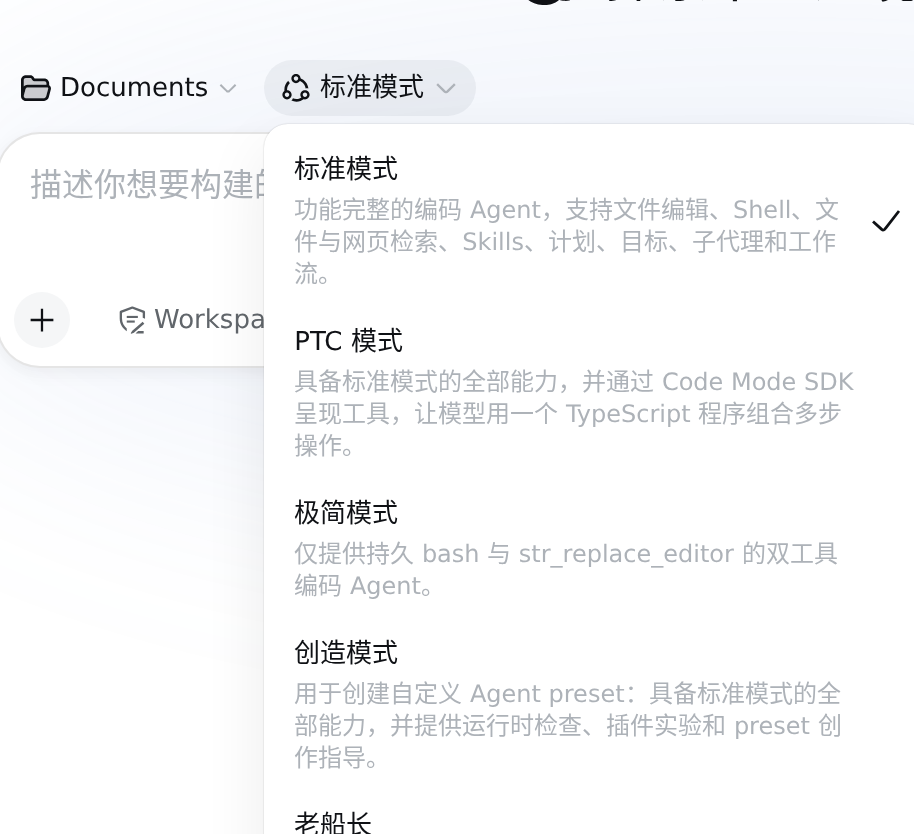

### 让创造模式帮你写一个新人设

切到创造模式。

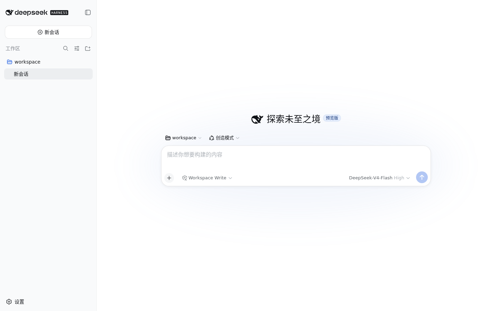

在输入框里打一句“帮我基于 standard 创建一个新的 agent preset，id 用 sailor，人设是一名走过很多航线的老船长，说话简短，喜欢用航海的比喻，但技术建议依然要准确专业。preset 的显示名字叫“老船长”，描述写清楚这是什么风格的助手。做完之后告诉我改了哪些文件。”，回车发送。

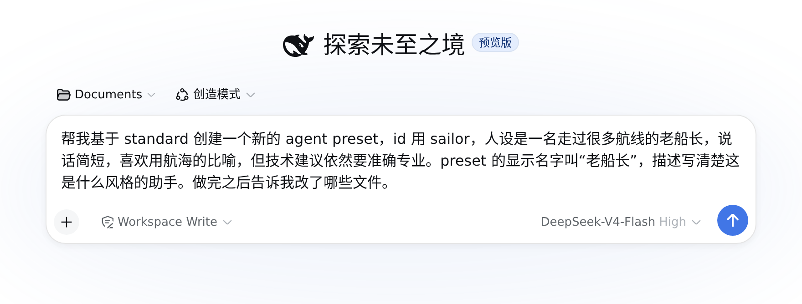

DSH 干这件事的路数跟第一章标准模式写文档没什么两样，先看清楚要改什么，再落地写文件，写完照实报告改了哪。这次它生成了两个文件，`preset.yml` 存一份给人看的简短描述，`agent.cordis.yml` 才是组装清单，里面把标准模式原有的工具行几乎照抄了一份，只在最前面加了一段人设文本，把说话风格、语气、比喻习惯写成了系统提示词的一部分。

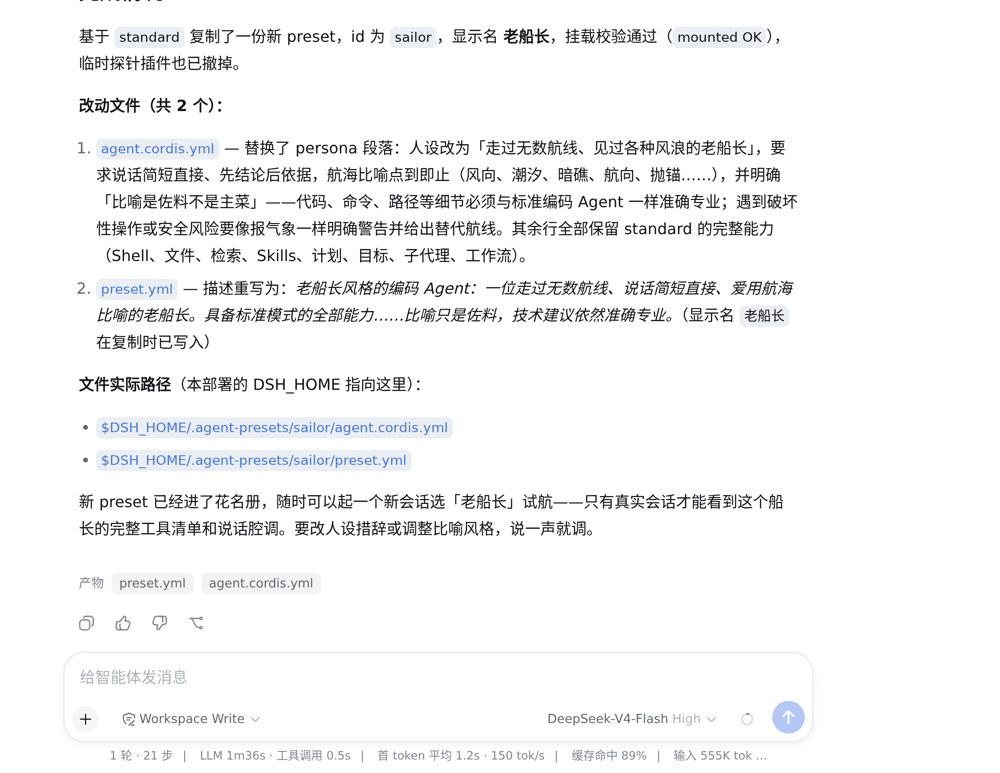

回复里报的位置是 `$DSH_HOME/.agent-presets/sailor/`，这是 DSH 自己的配置目录，跟 deepseek-harness 那份源码仓库不是一回事，这次改动只是加了一份属于你自己的配置，不会碰到程序本体。

### 切换过去，验证真的换了人设

回到模式下拉框，这次会多出一个“老船长”选项，选它，开一个新会话。

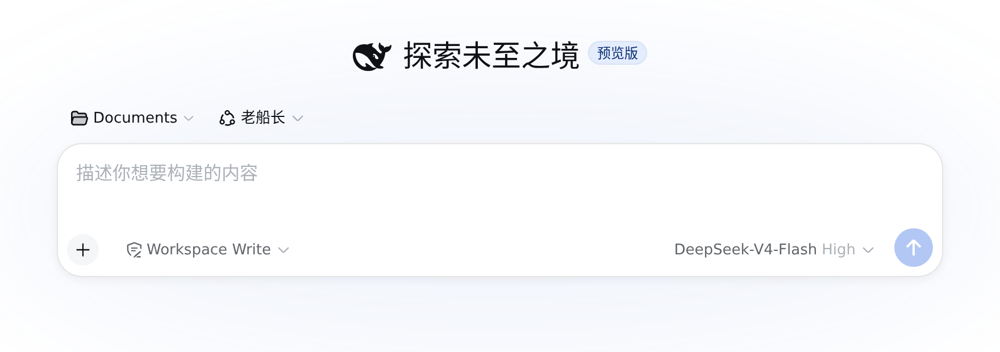

这里有个容易踩的坑，预设只对此后新建的会话生效，已经开着的旧会话会保留它开始时用的那个模式，切换下拉框不会追着把旧会话也换掉。想验证新人设，得像这样另开一个新会话才作数。

打一句“你好，你是谁？看看这个工作区文件夹里有什么”，回车发送。

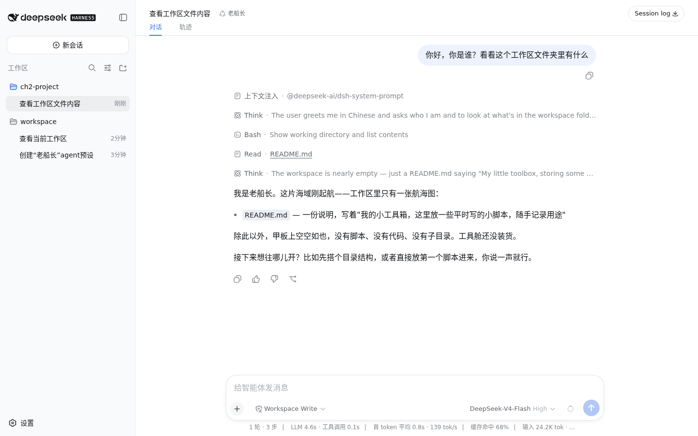

回复用的是老船长的口吻，说自己刚起航，这片工作区里眼下只有一张航海图，但内容是准的，它真的跑了 `Bash` 和 `Read` 读了工作区里的 `README.md`，说清楚里面写的是“我的小工具箱”，跟文件里实际的内容对得上。人设变了，但会读文件、会用工具这些标准模式的能力一个没少，说明这份 preset 是在标准模式基础上叠了一层人设，不是另起炉灶做了个阉割版的助手。

## 用动态插件更换 DSH 主题 {#sec-2-2}

接着上一节的创造模式会话，这次不创建新预设，换用它另一项能力，在不改任何代码、不重启进程的前提下，让 DSH 现场给自己“挂”一个插件，临时改一样看得见的东西，比如界面配色。这项能力在 DSH 里叫 Cordis，运行时检查、定义、批准、卸载插件，全程都在对话里完成。

### 让创造模式动手实验

还在刚才那个创造模式会话里，打一句“现在用你的动态插件能力，把整个界面的主题强调色（就是按钮、高亮这些用的品牌色）临时换成翡翠绿，不用改仓库代码，用你运行时能力现挂一个插件做。做完跟我说这个改动是不是重启就没了。”，回车发送。


DSH 没有直接去改 CSS 文件，先查了一遍主题服务实际暴露了哪些令牌，确认品牌强调色对应的令牌叫 `--dsw-alias-brand-primary`，需要同时给出浅色和深色两个值，再照着这个格式定义了一个只在浏览器里跑的插件。定义完插件，离生效还差最后一步。

### 批准这次运行

DSH 定义完插件不会自己让它生效，界面左下角会弹出一个“Cordis 插件”面板，当前这次运行显示“待审批”，得点一下面板里的允许按钮才会真的执行。


这是个明显的检查点。DSH 自己在回复里也说清楚了，界面上会出现这次运行的审批请求，要在 UI 里点允许，批准后主题会立即切换，如果点拒绝，它不会重复请求。也就是说这一步不是它自说自话就能过去的，不点允许，插件就一直停在待审批状态，界面颜色不会有任何变化。点一下允许。

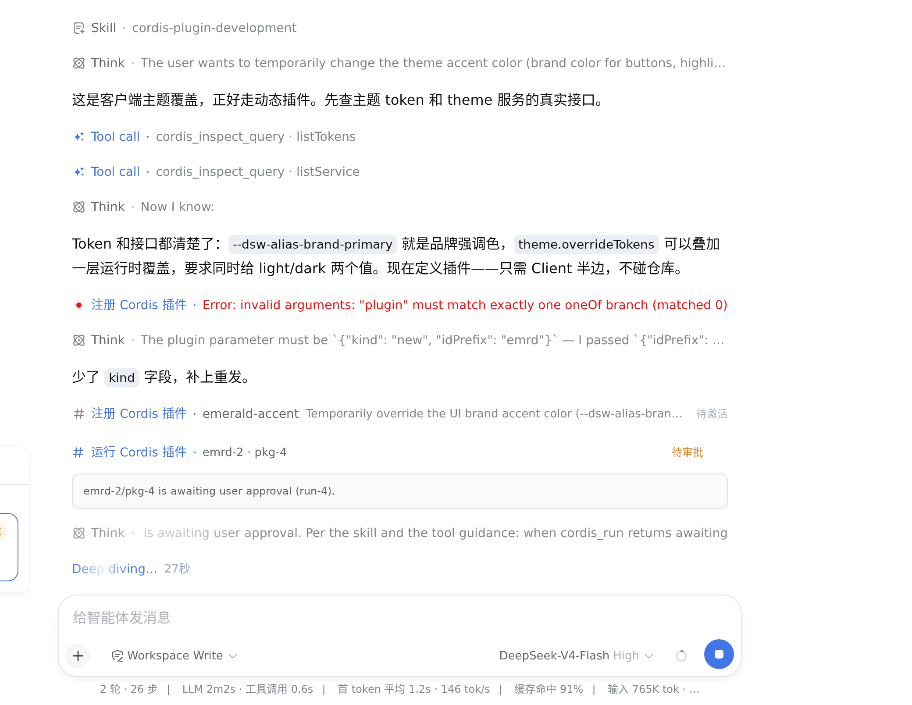

### 别只看聊天回复，找个真的用了这个变量的地方看一眼

批准之后 DSH 很快回复插件已经激活，浅色主题变成 `#059669`，深色主题变成 `#34d399`，还列出发送按钮、高亮、链接这些“用品牌色的地方”应该都变绿了。

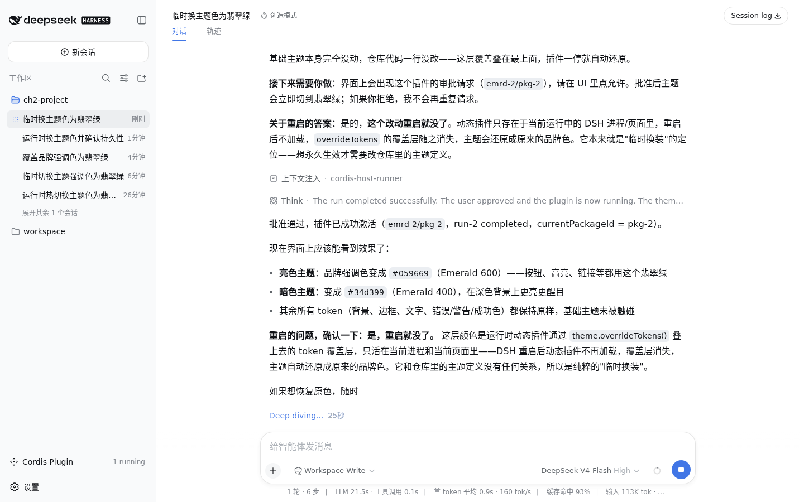

这正是第一章强调过的习惯，光看聊天回复不够，得去找一个真能看见效果的地方核实。麻烦的是，发送按钮和顶部选中的标签页看着还是原来的蓝色。翻了一下 DSH 源码才弄明白，这两处根本不吃这个令牌，各自用的是不同的旧令牌。顶部选中的标签页用的是另一个专门表示“业务强调色”的令牌，源码注释里直接写着这是业务蓝色；发送按钮又是单独一个“info”配色对，只是刚好用的是同一款蓝色色板，两者视觉上撞了色，实际上各管各的，都跟品牌强调色无关，压根不受这次覆盖影响。`--dsw-alias-brand-primary` 只管输入框获得焦点时的边框颜色，以及预设卡片、插件卡片被选中时的高亮描边，这些才是能验证的地方。

打开设置里的“Agent 预设”，找到“老船长”这张卡片，点复制按钮，弹出的“复制预设”对话框里点进“标识符”输入框。改动前，这个框获得焦点时边框是接近黑色的深灰；改动之后，同一个框、同一次点击，边框变成了清清楚楚的翡翠绿。

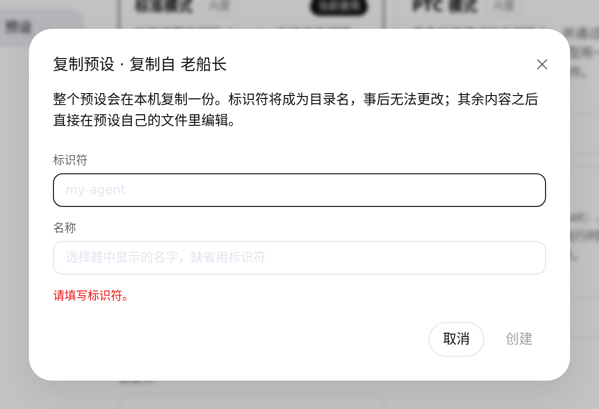

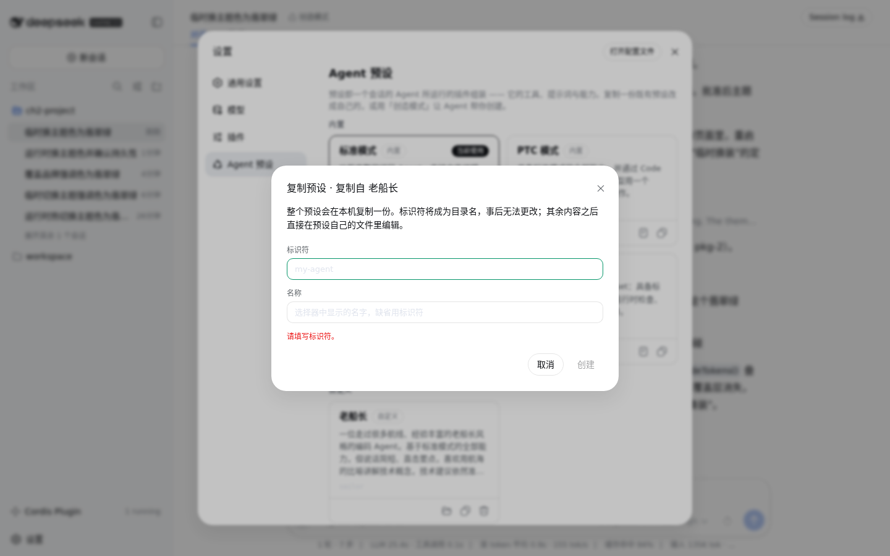

两张图对着看，颜色是真变了，不是聊天里说说而已。DSH 在回复里还主动交代了这次改动的边界，说这层覆盖只活在当前运行的进程和当前页面里，重启就没了。这句话是不是真的，下一节接着验证。

## 保存并使用整套定制 {#sec-2-3}

上一节的翡翠绿是创造模式现场挂的动态插件做出来的，DSH 自己说过重启就没了。这一节先验证这句话，再看看真要把一个改动留下来，到底要往哪写。

### 重启之后，真的还原了

把刚才那个 `dsh web` 进程杀掉，重新执行一次 `npx -y @deepseek-ai/dsh web` 拉起一个新进程，再用浏览器打开。

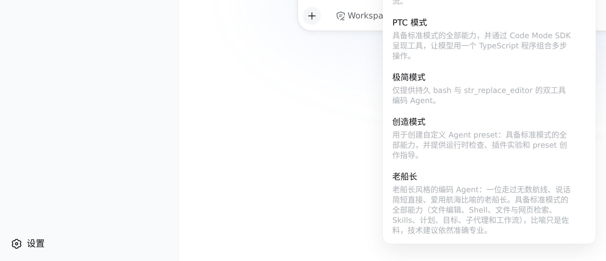

左下角原来那个“Cordis 插件”面板整个消失了，说明那次插件定义确实只活在上一个进程的内存里，新进程从没听说过它。再去设置里打开同一个“复制老船长”对话框看那个标识符输入框，边框也确实变回了默认的深灰，跟批准运行那一刻看到的翡翠绿不一样了。DSH 之前的说法是准的，运行时插件不写文件、不留痕迹，纯粹是内存里的一层临时覆盖，进程一没就跟着没了。

不过要留意，人设那份改动没受任何影响。“老船长”这个预设从创建的那一刻起就是写进磁盘的文件，重启完模式下拉框里它照样在，不需要额外一步“保存”。同样是这一章做的定制，一个天生就是永久的，一个默认是临时的，接下来要处理的正是后一种。

### 把插件从临时变成永久

DSH 提示过，想让改动留下来，得改配置里的主题定义，不能靠运行时现挂，管这件事的是 `$DSH_HOME/profiles/web/` 这个目录。里面的 `package.json` 声明这份 Web 档案要装哪些插件包，`cordis.patch.yml` 是在这些插件包之上再叠一层的个人补丁层。

在 `profiles/web/plugins/emerald-accent/` 下新建一个小插件包，只有三个文件，`package.json` 声明这是给浏览器端用的插件，`index.js` 是空的服务端占位，干活的是 `client.js`，内容如下。

```js
window.__ModuleLoader__.load({
  id: 'emerald-accent',
  factory: (require) => {
    var module = { exports: {} };
    function apply(ctx) {
      ctx.effect(() => ctx.theme.overrideTokens('emerald-accent', {
        '--dsw-alias-brand-primary': { light: '#059669', dark: '#34d399' },
      }))
    }
    module.exports.apply = apply;
    module.exports.inject = ['theme'];
    return module.exports;
  },
});
```

跟上一节 DSH 现场写的运行时插件比，覆盖的令牌、色值都一模一样，区别只是这次它是一份写在磁盘上的文件。接着在 `profiles/web/package.json` 里把这个本地包加成一条依赖（`"emerald-accent": "file:./plugins/emerald-accent"`），在 `cordis.patch.yml` 里插入一行把它接进插件链，再跑一次 `pnpm install` 让这个 `file:` 依赖链接进 `node_modules`，改了 `package.json` 里的依赖不重新装一次是不会生效的。这几步做完，翡翠绿就从“这次运行内存里的一层覆盖”变成了“这份 Web 档案自带的一部分”。

这是手动挡的做法，直接改这两个文件。DSH 其实带了一个专门干这件事的命令 `dsh plugin --profile web add <路径>`，面向要打包、分发给别人用的正规插件，会自动处理依赖链接和 patch 注册，通常不需要手改这两个文件。像这次只是想给自己临时调个颜色，量级够小，手动改两行、跑一次 `pnpm install` 更直接。

小提醒，这几个文件都在 `$DSH_HOME` 底下，跟 `deepseek-harness` 那份源码没有关系，写错了大不了删掉重来，不会动到程序本体。

### 确认真的保住了

再重启一次 DSH，这次连页面都还没做任何操作，只是打开首页。

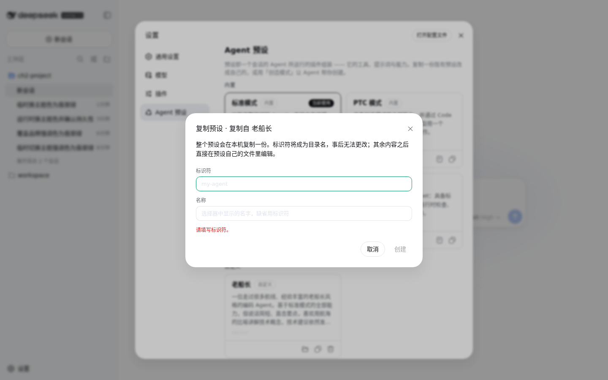

同样打开设置里的“复制老船长”对话框，点进标识符输入框，边框直接就是翡翠绿，跟上一节批准运行之后看到的颜色完全一样，而且这次左下角根本没有出现“Cordis 插件”面板，因为这已经是写进档案配置里的正式插件，不再是一次性的运行时插件，不用再点任何允许，也经得起反复重启。

这时候 `$DSH_HOME` 目录里实际留下了两类改动，`.agent-presets/sailor/` 存着“老船长”这份人设，`profiles/web/` 存着这份翡翠绿主题插件和它所在的插件清单。这两类东西有个共同点，都只待在 `$DSH_HOME` 这一个目录里。想把这整套定制搬到另一台机器，把 `$DSH_HOME` 整个目录复制过去，用同样的命令启动就行，人设和主题会原样带过去，不用再重新做一遍第一章接密钥、这一章建人设改主题的全部步骤。
