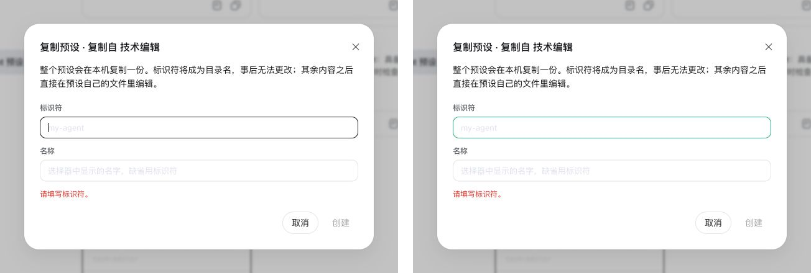

# 定制自己的 dsh {#ch-2}

上一章使用的是 dsh 自带的标准模式。本章进一步修改助手的工作方式和界面主题。先创建一个专门审阅技术文档的助手，再比较临时插件与持久插件的区别。

## 创建一个新的 AI 助手 {#sec-2-1}

dsh 可以为不同任务保存不同的助手配置。这里创建一名“技术编辑”，让它检查 README、教程和项目文档。第一章生成的 `about-dsh.md` 正好可以用来验证这份配置。

### 模式与 preset

新建会话时，标题栏会显示“标准模式”。打开下拉框，可以看到标准模式、PTC 模式、极简模式和创造模式。

这里的“模式”是界面上的称呼，背后实际加载的是 agent preset。一个 preset 保存了助手要使用的提示词、可调用的工具以及相关工作流程。切换模式时，新会话会改用相应的 preset。

标准模式适合日常开发，可以读写文件、运行命令和查找资料。PTC 模式拥有相近的能力，不过会让模型用 TypeScript 程序组织连续操作。极简模式只保留命令运行和文本编辑。创造模式则用来制作和检查新的 preset，也能试验运行时插件。

### 创建技术编辑

> 帮我基于 standard 创建一个新的 agent preset，id 用 tech-editor。它是一名技术文档编辑，审阅文档时先检查事实是否准确、结构是否清楚、语言是否自然。默认只给出有依据的修改建议，不主动改文件；只有收到明确的修改要求后才写入。preset 的显示名称叫“技术编辑”，描述写清楚它适合审阅 README、教程和项目文档。完成后告诉我改了哪些文件。

收到指令后，创造模式先查看 preset 服务提供了哪些操作，并临时加载一个探针插件。它从现有列表中找到 `standard`，复制出 `tech-editor`，随后写入新的名称、描述和 persona。挂载校验通过后，探针插件也被移除。消息流保留了整个过程，共十六个步骤。

{width=84%}

新 preset 保存在 `$DSH_HOME/.agent-presets/tech-editor/`，目录中有两个配置文件。`preset.yml` 决定它在模式下拉框中的名称和简介，`agent.cordis.yml` 决定它由哪些能力组成。后者继续使用标准模式的工具和工作流程，只把 persona 换成刚才指定的审阅规则。

截图末尾的 `mounted OK` 是挂载校验结果，表示 dsh 已经找到并加载 `tech-editor`。这些配置都保存在 `$DSH_HOME` 下，deepseek-harness 源码仓库没有变化。

### 检查新 preset

preset 只在新会话中生效。此时模式下拉框已经多出“技术编辑”，选择它并审阅第一章的文件。

> 审阅工作区里的 about-dsh.md，先不要修改。告诉我最需要改进的两处，并说明理由。

{width=84%}

消息流中先出现 `Glob` 和 `Read`，说明建议来自工作区中的实际文件。随后，技术编辑指出定位表述和长句结构的问题。任务只要求审阅，因此这次没有出现 `Write` 或 `Edit`。读取能力来自标准模式，先给建议、不主动写文件则来自新加入的 persona，两部分都按预期生效。

## 下载插件定制 dsh 主题 {#sec-2-2}

创造模式还可以加载只在当前进程中存在的插件。这里把界面的品牌强调色临时改成翡翠绿，不修改 dsh 源码，也不写入持久配置。这样可以先看效果，再决定是否保留。

### 临时修改主题

> 请临时把界面的品牌强调色改成翡翠绿。不要修改仓库文件，使用运行时插件完成，并说明重启后是否保留。

dsh 检查了客户端主题服务，找到品牌强调色对应的 `--dsw-alias-brand-primary`。临时插件为浅色模式设置 `#10b981`，为深色模式设置 `#34d399`。它只覆盖这一项主题令牌，其他颜色和布局保持原样。

插件定义完成后不会立刻运行。页面左下角会展开“Cordis 插件”面板，状态显示为“待审批”。

{width=72%}

面板右侧有三个按钮。单个对勾只允许当前版本，双对勾会继续允许同一插件的后续版本，叉号用于拒绝。本例选择“仅允许此版本”。批准后，插件才会在浏览器中运行。

### 比较前后效果

复制 preset 的对话框有一圈清楚的焦点边框。打开“设置”中的“Agent 预设”，复制“技术编辑”，让“标识符”输入框保持焦点。左右两幅画面使用相同的窗口尺寸和裁剪范围。

{width=94%}

顶部标签页和发送按钮仍然是蓝色，因为它们使用的是其他主题令牌。这个例子也说明，修改主题时要先找准令牌，不能只凭界面上的颜色猜测。

## 创建自己的 dsh 插件 {#sec-2-3}

临时插件适合试验，关闭 dsh 进程后便会消失。要让主题改动在下次启动时继续生效，需要把插件文件和加载配置写入 Web 档案。

### 重启后发生了什么

停止当前的 `dsh web` 进程，再次运行 `npx -y @deepseek-ai/dsh web`。重新打开页面后，“技术编辑”仍然存在，输入框边框则恢复为默认颜色。

两项定制采用了不同的保存方式。“技术编辑”已经写入 `$DSH_HOME/.agent-presets/tech-editor/`，dsh 启动时会重新读取。主题插件此前只存在于内存中，进程结束后便没有可以再次加载的文件。

### 保存插件配置

API 密钥、`tech-editor` preset 和主题插件都保存在 `$DSH_HOME`。这个目录可以用于迁移配置，但包含 `.credentials.yaml` 等敏感文件，不能分享或提交到代码仓库。

Web 档案位于 `$DSH_HOME/profiles/web/`。在其中新建 `plugins/emerald-accent/`，准备 `package.json`、`index.js` 和 `client.js`。

`package.json` 声明插件的服务端入口和浏览器端入口：

```json
{
  "name": "emerald-accent",
  "version": "1.0.0",
  "private": true,
  "type": "module",
  "main": "index.js",
  "exports": {
    ".": "./index.js",
    "./client": "./client.js",
    "./package.json": "./package.json"
  },
  "dsh": {
    "client": {
      "inject": ["@deepseek-ai/dsh-client-ui-theme"],
      "platform": "web"
    }
  }
}
```

这个插件不需要服务端逻辑，`index.js` 只有一行，内容是 `export function apply() {}`。

主题覆盖写在 `client.js` 中。代码仍然使用上一节验证过的颜色值：

```js
window.__ModuleLoader__.load({
  id: 'emerald-accent',
  factory: () => {
    const plugin = {
      inject: ['theme'],
      apply(ctx) {
        ctx.effect(() => ctx.theme.overrideTokens('emerald-accent', {
          '--dsw-alias-brand-primary': {
            light: '#10b981',
            dark: '#34d399',
          },
        }))
      },
    }
    return plugin
  },
})
```

在 `profiles/web/package.json` 的 `dependencies` 中登记本地插件，键值为 `"emerald-accent": "file:./plugins/emerald-accent"`。

把加载项写入 `cordis.patch.yml`。`insert` 表示向现有组装清单中新增一项：

```yaml
- insert:
    - id: emerald-accent
      name: emerald-accent
```

进入 `$DSH_HOME/profiles/web/`，运行 `pnpm install`，将本地插件链接到 `node_modules`，再用 `dsh --profile web --dump-config` 检查最终配置。

`dump-config` 输出出现 `emerald-accent` 后，重启 dsh。输入框焦点仍为翡翠绿，页面也不再出现运行审批，说明插件已经随 Web 档案加载。
