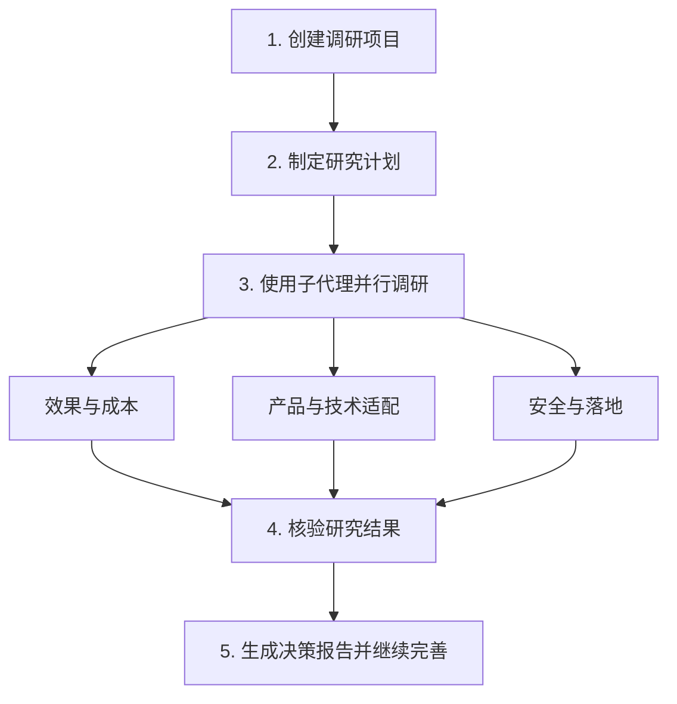
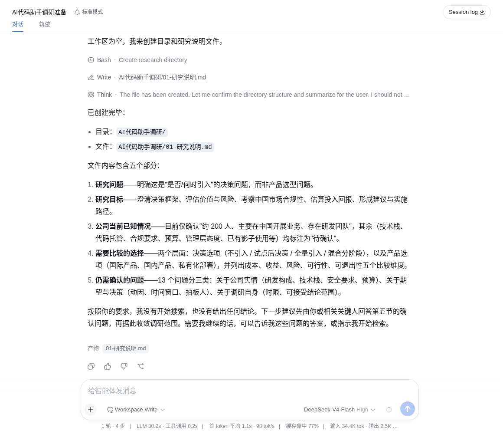
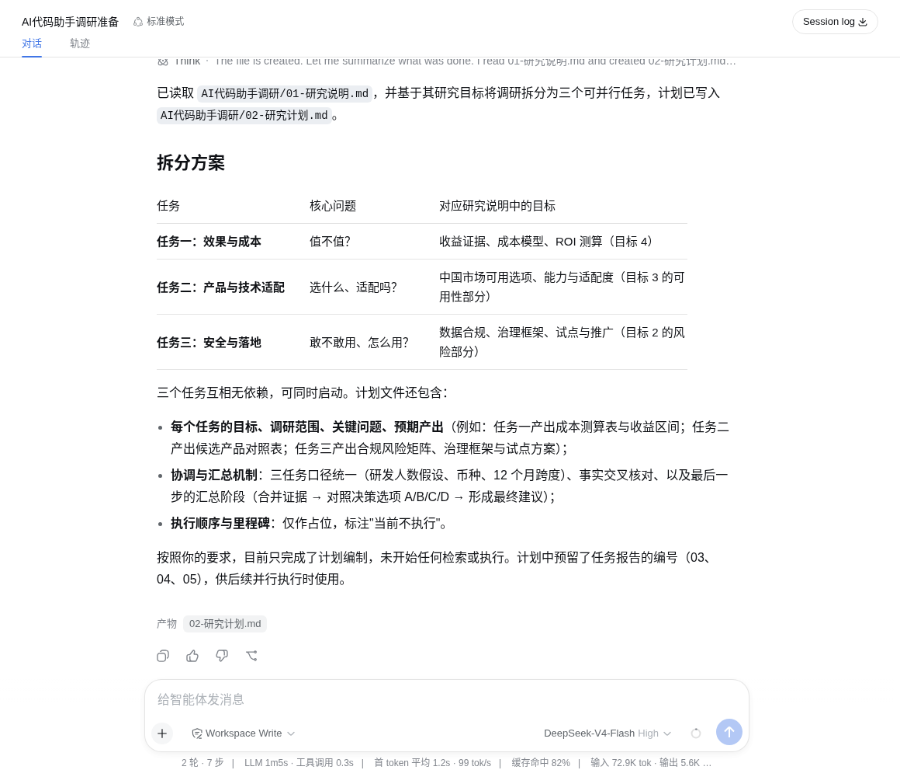
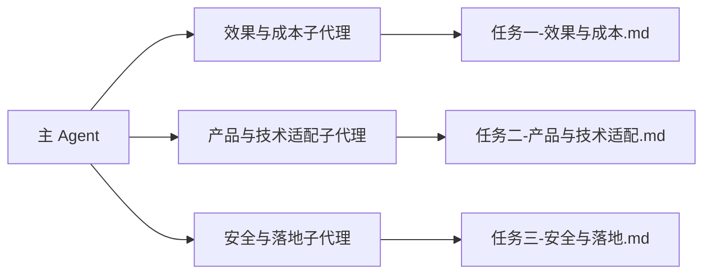
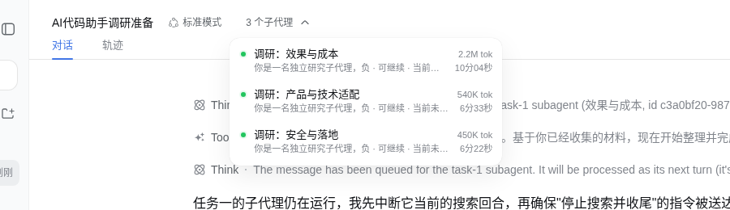
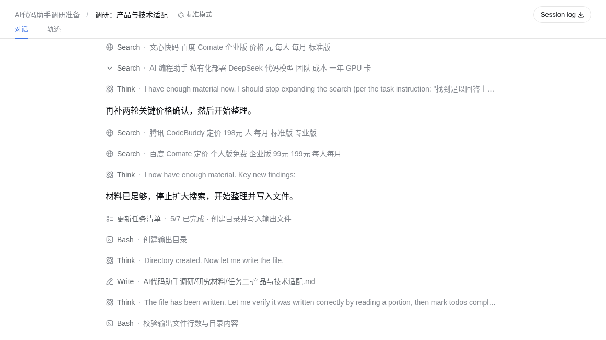
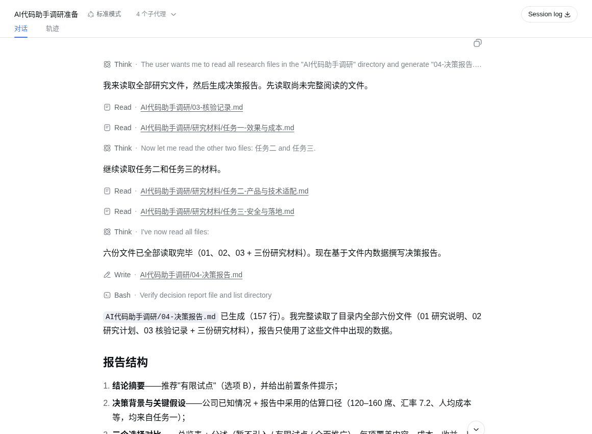

# 让 dsh 生成深度研究报告 {#ch-3}

当我们第一次让大模型做调研时，最容易采用的方式是直接提问：

> 一家约 200 人、主要在中国开展业务的软件公司，是否应该在未来 12 个月内为研发团队引入 AI 代码助手？

模型通常会很快给出一篇结构完整的回答，列出效率、安全、成本等方面的利弊。但这样的回答往往有一个问题：我们不知道它是否真正查过资料，也不知道哪些结论有证据、哪些只是模型根据常识作出的推测。

DeepSeek Harness 提供了另一种工作方式。我们不要求智能体立即给出答案，而是让它先建立项目、拆分任务，再把相互独立的工作交给多个子代理同时完成。等资料搜集完成后，再启动一个新的子代理检查这些资料，最后由主会话整合报告。

在这个过程中，DeepSeek Harness 不只是一个聊天窗口。智能体可以读取和编辑工作区里的文件、使用网页搜索、维护计划，也可以把工作委派给其他智能体。调研的中间结果会保存在文件中，不会只存在于一段越来越长的对话里。

本章将带你实际完成一次调研。整个过程分为五步：

1. 创建调研项目；
2. 制定研究计划；
3. 使用子代理并行调研；
4. 核验研究结果；
5. 生成决策报告并继续完善。



*图 1：使用 DeepSeek Harness 开展深度调研的五个步骤。第三步包含三个并行研究方向，完成后再进入核验和报告生成。*

最终，我们会在工作区中得到下面这些文件：

```text
AI代码助手调研/
├── 01-研究说明.md
├── 02-研究计划.md
├── 研究材料/
│   ├── 任务一-效果与成本.md
│   ├── 任务二-产品与技术适配.md
│   └── 任务三-安全与落地.md
├── 03-核验记录.md
└── 04-决策报告.md
```

这个目录并不复杂，但它已经包含了一次完整调研所需要的主要内容：研究什么、怎样分工、找到了什么、哪些材料经过核验，以及最后得出了什么建议。

本章接着使用第 1 章已经安装并接通模型的 DSH。开始前，新建一个空目录作为本次调研的工作区，并在 DSH 中选中该目录，再创建一个标准模式会话。后续生成的研究说明、材料和报告都会保存在这里。

## 明确问题并创建调研项目 {#sec-3-1}

### 先把问题写清楚

深度调研的第一步不是搜索，而是确认究竟要解决什么问题。

“要不要引入 AI 代码助手”仍然有很多没有说明的地方。例如，公司是准备直接向整个研发团队推广，还是先选择一个小组试用？公司最关心的是开发速度、代码质量，还是数据安全？研究结果是供研发负责人参考，还是要提交给管理层做采购决策？

如果这些问题没有说清楚，智能体可能搜集很多有趣的信息，却无法支持公司的实际决策。

在主会话中输入：

```text
请为本次调研创建“AI代码助手调研”目录，并生成“01-研究说明.md”。
研究问题是：一家约 200 人、主要在中国开展业务的软件公司，是否应该在未来 12 个月内为研发团队引入 AI 代码助手？
先不要开始搜索，也不要给出结论。请在文件中写清楚研究目标、公司当前已知情况、需要比较的选择，以及仍需确认的问题。
```

主智能体会分析任务，并在工作区中创建目录和文件。完成后，打开 `01-研究说明.md`，检查其中是否至少包含下面几项内容：



- 公司需要做出的具体决定；
- “暂不引入、先试点、全面推广”等可选方案；
- 效率、质量、安全、技术适配和成本等评价角度；
- 研究结果的使用者；
- 公司内部仍然缺少的信息。

最后一项尤其重要。网页搜索可以找到产品资料、行业研究和其他公司的案例，却无法知道这家公司的研发人数、当前开发周期、缺陷率、预算和代码敏感程度。智能体应该把这些内容标记为“待确认”，而不是根据想象填入数字。

如果文件中混入了未经提供的公司信息，可以直接在会话中指出：

```text
研究说明中有些公司情况并未提供。请删除推测内容，把它们改成待确认问题。
```

这里体现了使用智能体的第一个基本方法：不要只看它最后说了什么，也要检查它写入工作区的文件。文件才是后续步骤共同使用的依据。

### 此时的项目结构

```text
AI代码助手调研/
└── 01-研究说明.md    ← 本步新增
```

**完成标志：**工作区中已经出现 `AI代码助手调研/01-研究说明.md`，并且你认可其中对研究问题和公司情况的描述。

## 拆分任务并制定研究计划 {#sec-3-2}

### 把大问题拆成三个方向

研究问题明确后，下一步是决定从哪些方向搜集资料。对于第一次使用子代理的读者，任务不宜拆得太细。本案例分为三个方向就足够了。

| 研究方向 | 主要问题 |
| --- | --- |
| 效果与成本 | AI 代码助手能否提高效率、会不会影响质量、需要投入多少成本 |
| 产品与技术适配 | 有哪些候选产品，能否适配公司的编程语言、开发工具和代码平台 |
| 安全与落地 | 如何处理代码和数据，存在哪些合规与知识产权风险，怎样制定使用规范 |

这三个方向可以同时开展，因为它们不需要等待彼此的结论。最终报告则不能立即开始，因为它依赖三项研究的结果。

让主智能体读取刚才的研究说明并制定计划：

```text
请读取“AI代码助手调研/01-研究说明.md”，把调研拆成“效果与成本”“产品与技术适配”“安全与落地”三个可以并行开展的任务，并将计划写入“02-研究计划.md”。暂时不要开始执行。
```

主智能体完成后，打开 `02-研究计划.md`。一份可执行的计划不能只写三个标题，还应说明每项任务要回答什么问题、需要寻找什么资料，以及结果写到哪个文件。



例如，“产品与技术适配”不应只写成“调查市场上的 AI 代码助手”，而应说明需要比较候选产品、支持的编程语言和开发工具、部署方式、企业管理能力以及与现有代码平台的适配情况。

在进入下一步之前，先检查三个任务是否有明显重叠。如果两个任务都在全面比较产品，子代理就会重复工作。更合理的分工是：“产品与技术适配”负责产品功能和接入条件，“安全与落地”负责数据处理、安全风险和使用制度。

### 为什么不立即生成报告

初次使用智能体时，我们很容易把“制定计划”和“完成任务”写在同一条指令中。智能体可能一边规划，一边搜索，一边开始撰写报告。看起来很高效，实际却很难检查中间过程。

这里特意让主智能体先停下来，是为了给人留出一个检查点。你仍然负责确认研究范围是否正确，智能体负责执行已经确认的计划。

### 此时的项目结构

```text
AI代码助手调研/
├── 01-研究说明.md
└── 02-研究计划.md    ← 本步新增
```

**完成标志：**`02-研究计划.md` 中已经包含三个边界清楚的研究任务，并为每项任务指定了单独的结果文件。

## 让多个 Agent 并行调研 {#sec-3-3}

### 什么是子代理

DeepSeek Harness 把被主 Agent 委派出去、独立完成任务的 Agent 称为 subagent，当前中文界面显示为“子代理”。本章后面统一使用这个名称。

可以把主 Agent 理解为调研负责人。它掌握完整目标，但不需要亲自顺序完成所有工作。三个子代理分别负责一个研究方向，可以同时搜索和整理资料。每个子代理拥有自己的对话记录，因此不会把所有搜索过程都塞进主会话。

子代理不是三个完全不同的模型角色，也不需要为它们编写复杂的人设。对于这次调研，只要给每个子代理一个范围明确的任务和一个独立的结果文件即可。



*图 3：主 Agent 同时委派三个子代理。每个子代理只负责一个研究方向，并写入自己的文件。*

### 同时启动三个子代理

回到主会话，输入：

```text
请按照“AI代码助手调研/02-研究计划.md”，同时启动三个子代理，分别完成“效果与成本”“产品与技术适配”“安全与落地”研究。
请让它们使用网页搜索查找资料，记录来源和日期，并分别写入“研究材料”目录中的对应文件。三个子代理不要修改同一个文件。
每份材料保留最关键的 8—12 个来源；找到足以回答研究问题的材料后停止扩大搜索范围，整理并写入文件。没有核对全文或仍不确定的内容要明确标注。
```

这里最关键的词是“同时启动”。主智能体可以在同一轮中委派三个相互独立的任务，DeepSeek Harness 会让它们并行工作，而不是等第一个任务结束后再开始第二个。

子代理启动后，当前会话页面顶部会出现子代理入口。打开后，可以看到已经创建的子代理、它们是否仍在运行，以及各自已经运行了多长时间。点击其中一项，还可以查看这个子代理自己的对话记录和工具调用过程。


主会话发出委派后会先结束本轮回复，子代理继续在后台执行。你不必一直停留在某个子代理页面等待，也不需要反复询问“完成了吗”。展开列表即可看到“正在运行”或“当前未运行”的状态；任务完成后，耗时和 token 用量也会保留下来。



实际运行中，如果只要求“尽可能全面地搜索”，子代理可能不断扩大检索范围，却迟迟不写文件。因此，上面的指令增加了来源数量和停止条件。如果某个任务仍然运行过久，可以打开它检查进度，并要求它停止继续扩展搜索，立即基于已有材料整理结果。

### 观察子代理如何使用工具

子代理执行研究时，会根据任务使用网页搜索。搜索工具返回的材料可能包括标题、摘要和来源。对于影响最终决策的重要结论，子代理应尽量核对原始来源；如果当前可用工具无法读取全文，也应该在材料中说明“仅根据搜索结果或摘要，尚未核对全文”，不能把它写成已经完全确认的事实。

打开任意一个子代理的记录，可以重点观察三个方面：

1. 它搜索的问题是否与自己的任务有关；
2. 它是否只使用厂商宣传，还是也寻找研究、企业案例和反面材料；
3. 它是否把结果写入了指定文件。

你不需要理解每一次工具调用的技术细节。对于第一次使用智能体，更重要的是学会判断：它现在正在做与目标相关的工作吗？它的结果能否追溯到来源？




### 为什么要分别写文件

三个子代理共享同一个工作区。如果它们同时修改同一份报告，就可能出现内容互相覆盖、结构反复变化或者编辑冲突。因此，本案例让它们分别写入：

```text
研究材料/任务一-效果与成本.md
研究材料/任务二-产品与技术适配.md
研究材料/任务三-安全与落地.md
```

每份材料的写法可以有所不同，但至少应包含：主要发现、来源、资料日期、适用范围和仍然无法确认的问题。

如果某个子代理已经结束，但文件内容过于简单，可以从顶部入口打开它并继续发消息，例如：

```text
请补充两个方面：寻找与当前结论相反的材料，并标出哪些来源没有核对到全文。完成后更新原来的文件。
```

这也是子代理与一次性生成内容的区别。它有自己的上下文，知道自己之前负责什么，可以在原有工作的基础上继续补充。

### 此时的项目结构

```text
AI代码助手调研/
├── 01-研究说明.md
├── 02-研究计划.md
└── 研究材料/                 ← 本步新增
    ├── 任务一-效果与成本.md
    ├── 任务二-产品与技术适配.md
    └── 任务三-安全与落地.md
```

**完成标志：**三个子代理都显示为“当前未运行”，`研究材料` 目录中出现三份内容完整、带有来源的研究文件。

## 核验材料并补充缺口 {#sec-3-4}

### 不让研究者自己给自己打分

资料搜集完成，并不意味着其中的结论都可靠。某个子代理可能引用了过时资料，也可能把厂商公布的数字当成普遍结论，或者忽略了不支持自己判断的案例。

因此，我们不让原来的三个子代理直接宣布自己的研究已经可靠，而是启动一个新的核验子代理。它不负责重新写三份材料，而是站在检查者的角度寻找问题。

在主会话中输入：

```text
请启动一个新的子代理，读取“AI代码助手调研/01-研究说明.md”和“研究材料”中的三份文件，检查关键结论是否有来源支持、资料之间是否矛盾、是否遗漏反面材料，以及哪些问题必须通过公司内部数据或试点才能回答。请把结果写入“03-核验记录.md”。
```

这个子代理主要检查四类问题：

- **来源问题**：网页是否真的支持材料中的结论；
- **适用问题**：国外研究或个人体验能否直接用于这家中国软件公司；
- **冲突问题**：三份材料是否对同一产品或风险给出了不同说法；
- **缺口问题**：哪些问题无法通过公开资料解决。


例如，公开研究或许能够说明 AI 代码助手在某些编程任务中提高了完成速度，但它无法证明这家公司也能获得相同收益。公司的代码库、人员经验和研发流程都可能不同。这样的结论不应被简单判为“错误”，而应被记录为“需要通过内部试点验证”。

### 根据核验结果补充材料

核验完成后，打开 `03-核验记录.md`。如果其中只列出少量不影响决策的问题，可以直接保留到最终报告的“未知信息”部分。如果它指出关键结论缺少证据，就需要补充调研。

这时不必把全部流程重新运行一遍。可以让主智能体只针对缺口继续工作：

```text
请根据“03-核验记录.md”，只补充其中会影响最终决策的关键缺口。需要时把任务交给对应的子代理，更新相关研究材料，并在核验记录中注明补充结果。
```

主 Agent 可以向已有子代理继续发送任务，也可以创建新的子代理。对于初学者，不必刻意追求哪种方式更高级。判断标准很简单：如果新任务仍然属于原来的研究方向，就让原子代理继续；如果任务是独立检查，或者需要不同的观察角度，就创建新的子代理。

调研不会因为资料数量很多就自动变得可靠。第四步的目标，是把“看起来有道理的材料”变成“知道证据强弱和适用范围的材料”。

### 此时的项目结构

```text
AI代码助手调研/
├── 01-研究说明.md
├── 02-研究计划.md
├── 研究材料/
│   ├── 任务一-效果与成本.md
│   ├── 任务二-产品与技术适配.md
│   └── 任务三-安全与落地.md
└── 03-核验记录.md             ← 本步新增
```

**完成标志：**`03-核验记录.md` 已经列出可采用的结论、需要谨慎表述的结论和仍待解决的问题；影响决策的明显缺口已经得到补充或明确标记。

## 生成并完善决策报告 {#sec-3-5}

### 让主会话综合，而不是重新猜测

前四步完成后，主会话已经可以读取研究说明、研究计划、三份研究材料和核验记录。现在才到了生成最终报告的时候。

在主会话中输入：

```text
请读取“AI代码助手调研”目录中的全部研究文件，生成“04-决策报告.md”。报告应比较“暂不引入、有限试点、全面推广”三个选择，说明推荐方案、主要依据、风险和未知信息，并给出一个可执行的小规模试点方案。不要使用研究文件中没有出现的数据。
```

主 Agent 可能亲自完成整合，也可能再启动一个报告子代理。无论具体由谁执行，任务都不是把三份研究材料依次拼接起来，而是围绕最初的问题作出综合判断。最终报告可以采用下面的结构：



1. 公司需要做出的决定；
2. 调研得到的主要发现；
3. 三个选择的比较；
4. 推荐方案及其成立条件；
5. 主要风险和仍未确认的信息；
6. 试点范围、周期和评估指标；
7. 关键资料来源。

这里仍然需要人的检查。至少确认下面几件事：

- 报告是否回答了最初的决策问题；
- 重要结论能否在研究材料中找到依据；
- 有没有把“可能”“在特定条件下有效”改写成“必然有效”；
- 是否正面比较了三个选择，而不是默认一定要采购；
- 是否把缺少的公司内部信息诚实地列出来；
- 试点方案是否包含可以观察的指标和停止条件。

对于 AI 代码助手，单纯统计生成代码行数或建议采纳次数并不够。更值得关注的是任务完成周期、代码审查时间、缺陷和返工情况、开发者是否持续使用，以及有没有出现敏感信息提交或安全事件。

如果报告建议先试点，还应说明试点结束后怎样作出下一步决定。例如：达到哪些效率和质量标准后扩大使用；出现哪些安全或合规问题时立即停止；如果结果不明显，什么时候重新评估。

### 用后续对话逐步完善报告

最终文件生成后，不必要求智能体一次修改所有问题。可以像与一位真正的研究助理合作一样，逐项给出反馈：

```text
报告对安全风险的说明比较抽象。请根据“任务三-安全与落地.md”补充具体风险，但不要增加没有来源的新判断。
```

也可以要求它只修改报告中的某一部分。由于材料已经保存在工作区中，主 Agent 可以重新读取文件，而不需要依赖自己是否还记得之前的全部对话。

随着公司的内部数据、访谈结果和试点数据逐渐补齐，还可以继续更新研究材料和决策报告。深度调研不是一次性生成一份永远正确的文档，而是建立一套能够继续核验和更新的研究过程。

### 此时的项目结构

```text
AI代码助手调研/
├── 01-研究说明.md
├── 02-研究计划.md
├── 研究材料/
│   ├── 任务一-效果与成本.md
│   ├── 任务二-产品与技术适配.md
│   └── 任务三-安全与落地.md
├── 03-核验记录.md
└── 04-决策报告.md             ← 本步新增
```

**完成标志：**`04-决策报告.md` 已经形成一项有依据的建议，重要判断可以追溯到研究材料，未知信息和下一步验证方式也已明确列出。

### 小结

在这次调研中，我们没有让 DeepSeek Harness 直接回答“是否应该引入 AI 代码助手”，而是完成了一套更接近真实工作的流程：

1. 主 Agent 创建研究说明，明确要解决的问题；
2. 主 Agent 把大问题拆成三个可以并行的任务；
3. 三个子代理同时搜索和整理不同方向的资料；
4. 一个新的子代理检查来源、冲突和信息缺口；
5. 主会话根据经过核验的材料生成决策报告。

在这个过程中，读者实际使用了 DeepSeek Harness 的几项核心能力：选择工作区、让 Agent 读写文件、使用网页搜索、委派子代理、查看子代理状态和对话记录，以及在同一个项目中持续修改交付结果。

这也是智能体工作方式与普通问答最重要的区别。普通问答希望模型立即给出一段答案；使用智能体，则是先建立工作过程，让不同智能体和工具共同完成任务，并把中间结果保存在可以检查的文件中。

当调研问题变得更复杂时，可以增加研究方向或进行更多轮核验。但对于第一次使用 Agent 的用户，三个并行子代理、一个核验子代理和一份最终报告，已经足以建立完整而清晰的使用体验。
