# 用 dsh 完成日常办公 {#ch-4}

在日常办公中，我们经常需要处理表格、文档、演示文稿和扫描资料。DSH 可以在同一个工作区中读取这些文件，帮助我们完成整理、写作、制作和核查等任务。处理这类任务时，需要注意内容准确、原始资料完整，交付文件也要便于继续修改。

本章以一次虚构的“产品发布会费用复盘”为例。发布会结束后，项目组要汇总各项成本、编写复盘报告、准备汇报幻灯片，并归档收据和其他扫描文件。我们将依次使用 DSH 整理 Excel 费用表、编写 Word 报告、生成 PPT 演示文稿，以及阅读和归纳一批扫描 PDF。完成本章后，工作区中会保留整理后的表格、费用复盘报告、汇报幻灯片和扫描文件清单。

## 整理 Excel 表格 {#sec-4-1}

项目组汇总的费用表共有 19 条记录，其中混用了多种日期格式，“场地费”和“场地租赁”等相近类别也没有统一，还包含一条重复记录和几个空白字段。本节让 DSH 检查这些问题，生成一份格式统一、带有汇总结果的新工作簿。

### 准备示例表格

将本书配套目录 `demo/chapter4-office-workflow` 复制一份，并把副本命名为 `product_launch_cost_review`。在 DSH 中添加这个文件夹作为工作区。本节使用的原始表格位于 `4-1-excel/source/产品发布会费用明细.xlsx`，后续生成的文件保存在 `4-1-excel/output/`，不会覆盖原始表格。

### 安装 Excel Skill

Excel 工作簿不仅保存单元格中的文字和数字，还包含公式、样式、工作表结构等信息。为了让 DSH 按照一套稳定的方法处理这些内容，我们使用 MiniMax-AI 发布的 `minimax-xlsx` Skill。

在 `product_launch_cost_review` 工作区中新建会话，输入：

```text
请将下面的 Excel Skill 安装到当前工作区的
.agents/skills/minimax-xlsx：

https://github.com/MiniMax-AI/skills/tree/main/skills/minimax-xlsx

安装完成后检查文件是否齐全，并告诉我安装位置。先不要处理表格。
```

DSH 会把 Skill 下载到当前工作区，并检查其中的说明、脚本和模板。安装完成后，可以让 DSH 尝试加载 `minimax-xlsx`。出现 Skill 调用记录，并返回完整的技能指令，说明 DSH 已经发现它，如图 4-1 所示。

{width=76%}

### 整理费用表

继续在当前会话中输入：

```text
请使用已安装的 minimax-xlsx Skill，整理
4-1-excel/source/产品发布会费用明细.xlsx。

要求：
1. 保留原始文件，不要覆盖；
2. 统一日期和费用类别；
3. 删除完全重复的记录；
4. 保留场地押金退回这笔负数记录；
5. 标出类别缺失、凭证缺失等需要人工确认的问题；
6. 生成“整理后明细”“费用汇总”和“异常记录”三个工作表；
7. 在汇总表中统计总费用及各类别费用；
8. 调整列宽、表头、金额格式和重点数据的样式；
9. 将结果保存为
4-1-excel/output/产品发布会费用整理结果.xlsx。

完成后说明发现了哪些问题、做了哪些修改，并给出整理后的费用总额。
```

整理过程中，DSH 先读取工作簿，检查日期、类别、空白字段和重复记录，再创建新的工作簿并验证其中的公式。完成后，它会在回复中列出发现的问题，如图 4-2 所示。

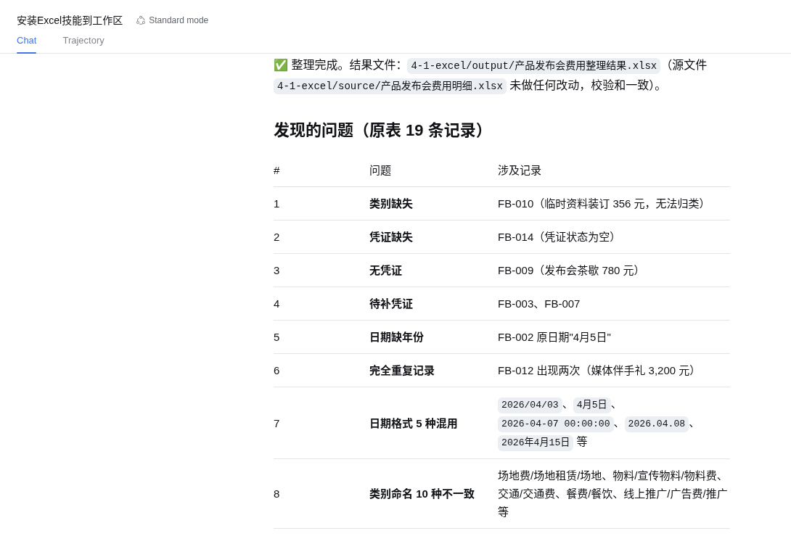{width=82%}

### 检查整理结果

打开 `4-1-excel/output/产品发布会费用整理结果.xlsx`。其中的“整理后明细”保留了 18 条去重后的记录，日期已经统一为 `yyyy-mm-dd`，相近的费用名称也被归入统一类别。“费用汇总”按类别计算费用，并给出 40,221.10 元的总费用；场地押金退回仍以 -1,000 元计入。“异常记录”集中列出了类别缺失、凭证缺失和日期缺少年份等事项，便于后续人工确认。

DSH 可以完成批量检查和格式整理，但不应自行补造缺失的业务信息。例如，临时资料装订应当归入哪个费用类别，仍要由项目负责人确认。把这类记录单独列出，可以在提高整理效率的同时保留核查线索。

## 编写 Word 报告 {#sec-4-2}

整理好的 Excel 工作簿能够说明每笔费用和分类合计，但项目负责人还需要一份便于阅读和传阅的费用复盘报告。本节继续使用 4.1 的整理结果，让 DSH 提炼主要数据、组织报告结构，并生成 Word 文档。

### 准备报告材料

本节使用两个文件：

- `4-1-excel/output/产品发布会费用整理结果.xlsx`：上一节生成的费用明细、汇总和异常记录；
- `4-2-word/source/报告写作要求.md`：发布会日期、地点、费用预算、报告对象和写作要求。

写作要求中规定，所有金额和异常事项均以 Excel 工作簿为准，资料没有提供的信息标记为“待确认”。这样可以避免报告中出现未经核实的业务数据。

### 安装 Word Skill

在 `product_launch_cost_review` 工作区中新建会话，输入：

```text
请将下面的 Word Skill 安装到当前工作区的
.agents/skills/minimax-docx：

https://github.com/MiniMax-AI/skills/tree/main/skills/minimax-docx

安装完成后检查 SKILL.md、scripts 和 references 是否齐全，
并告诉我安装位置。先不要生成报告。
```

DSH 会将 Skill 安装到 `.agents/skills/minimax-docx`，并核对其中的文件，如图 4-3 所示。

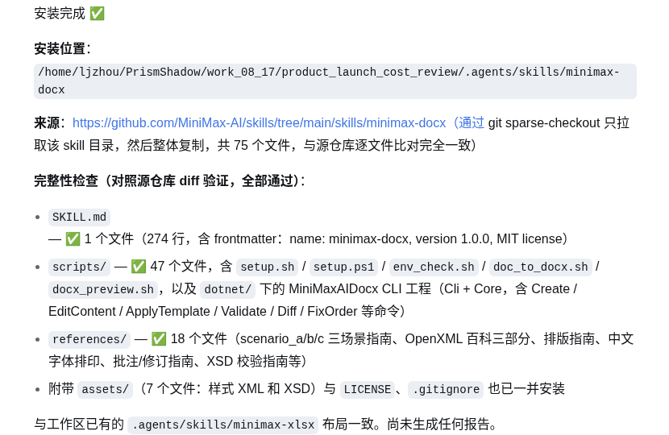{width=74%}

### 生成费用复盘报告

安装完成后，单击 `New Session` 新建会话，输入：

```text
请使用 minimax-docx Skill，读取：

4-1-excel/output/产品发布会费用整理结果.xlsx
4-2-word/source/报告写作要求.md

生成一份《产品发布会费用复盘报告》。

要求：
1. 金额和异常事项以 Excel 为准，不补造数据；
2. 包含项目概况、预算执行、分类费用分析、异常事项和后续建议；
3. 使用表格展示主要费用数据；
4. 采用简洁、正式的办公报告风格；
5. 检查标题层级、分页、表格宽度和中文排版；
6. 将文件保存为
4-2-word/output/产品发布会费用复盘报告.docx；
7. 生成页面预览并检查排版。

完成后说明生成了哪些文件，以及报告中的主要结论。
```

DSH 读取两个文件后，生成报告正文和页面预览，并检查标题层级、表格宽度和分页情况。完成后的回复会列出文件位置和检查结果，如图 4-4 所示。

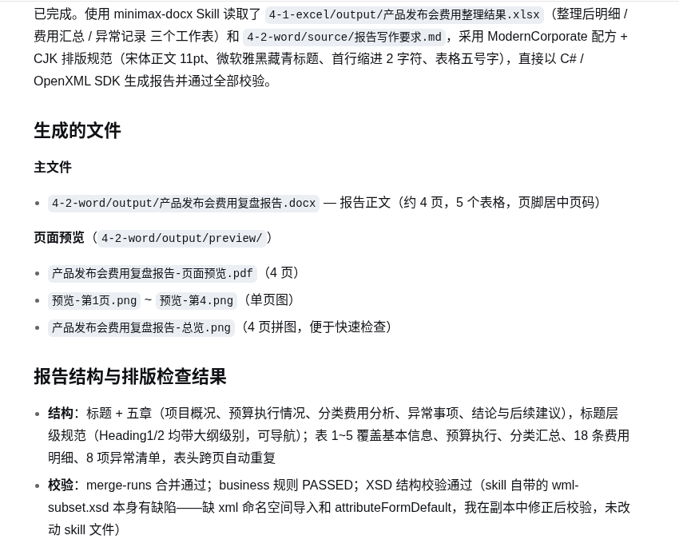{width=76%}

### 检查报告内容和排版

本例生成的报告共有 4 页，包含项目概况、预算执行情况、分类费用分析、异常事项、结论和后续建议，并使用 5 个表格展示相关数据。页面总览如图 4-5 所示。

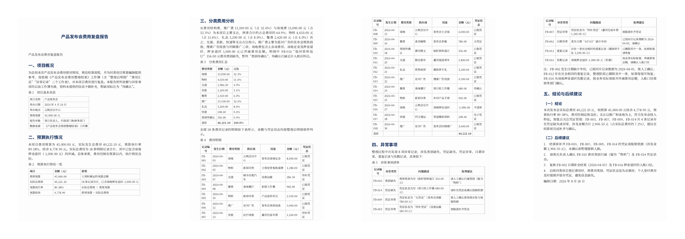{width=92%}

报告给出的实际总费用为 40,221.10 元，预算执行率为 89.38%，预算结余为 4,778.90 元。推广和场地两类费用合计约占总费用的 64.9%。报告还列出了 8 项异常记录，并将需要补充凭证、确认类别和复核日期的事项写入后续建议。

检查 Word 报告时，应重点核对关键金额、表格是否跨出页面，以及标题和表格有没有被分页拆开。确认无误后，保留 `4-2-word/output/产品发布会费用复盘报告.docx`，下一节将使用其中的主要结论制作汇报演示文稿。

## 设计并生成 PPT 演示文稿 {#sec-4-3}

费用复盘报告适合保存完整内容，汇报时还需要把结论转化为重点突出、便于讲解的幻灯片。本节将使用上一节的 Word 报告和 Excel 数据，生成一套 6 页的费用复盘演示文稿。

### 配置视觉能力

本章使用的 DeepSeek-V4 模型目前不具备视觉能力，无法直接读取幻灯片的页面预览。为了让 DSH 检查生成后的版式，需要先通过 ModLens 插件接入视觉模型。

在终端中运行：

```bash
npx -y @deepseek-ai/dsh plugin --profile web add @liustack/modlens@3.18.1
```

安装完成后重启 DSH，打开“设置 → 插件”，在“视觉引擎（ModLens）”中填写：

- 引擎：`openai`，表示使用 OpenAI 兼容接口；
- API 密钥：在智谱开放平台创建的 API Key；
- 接口地址：`https://open.bigmodel.cn/api/paas/v4/`；
- 模型：`glm-5v-turbo`。

智谱开放平台的 API Key 管理页面为：

```text
https://open.bigmodel.cn/usercenter/apikeys
```

保存配置后，DSH 就可以通过 ModLens 调用视觉模型，如图 4-6 所示。

{width=72%}

可以使用上一节生成的 Word 页面预览检查配置。在新会话中输入：

```text
请使用 ModLens 阅读下面这张页面预览：

4-2-word/output/preview/预览-第1页.png

只根据图片内容，告诉我页面标题、费用预算、实际总费用和预算执行率。
```

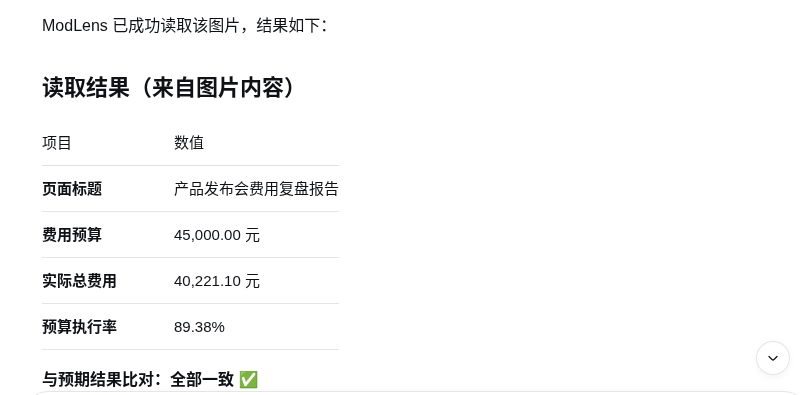{width=60%}

图 4-7 中，DSH 调用 `modlens_read_image`，并准确读出页面中的四项信息，说明视觉能力已经可以使用。

### 准备演示文稿要求

配套文件 `4-3-ppt/source/演示文稿制作要求.md` 规定了汇报对象、汇报时间、页面结构和视觉风格。本例使用 16:9 页面，共 6 页，依次展示封面、预算执行、费用结构、重点支出、异常事项以及结论与行动。视觉上采用深蓝色和浅蓝色，使用橙色标出异常事项。

### 安装 PPT Skill

在 `product_launch_cost_review` 工作区中新建会话，输入：

```text
请将下面的 PPT Skill 安装到当前工作区的
.agents/skills/pptx-generator：

https://github.com/MiniMax-AI/skills/tree/main/skills/pptx-generator

安装完成后检查 SKILL.md 和 references 是否齐全，
并告诉我安装位置。先不要生成演示文稿。
```

安装结果如图 4-8 所示。`pptx-generator` 中包含页面设计、PptxGenJS、编辑方法和质量检查等参考资料。

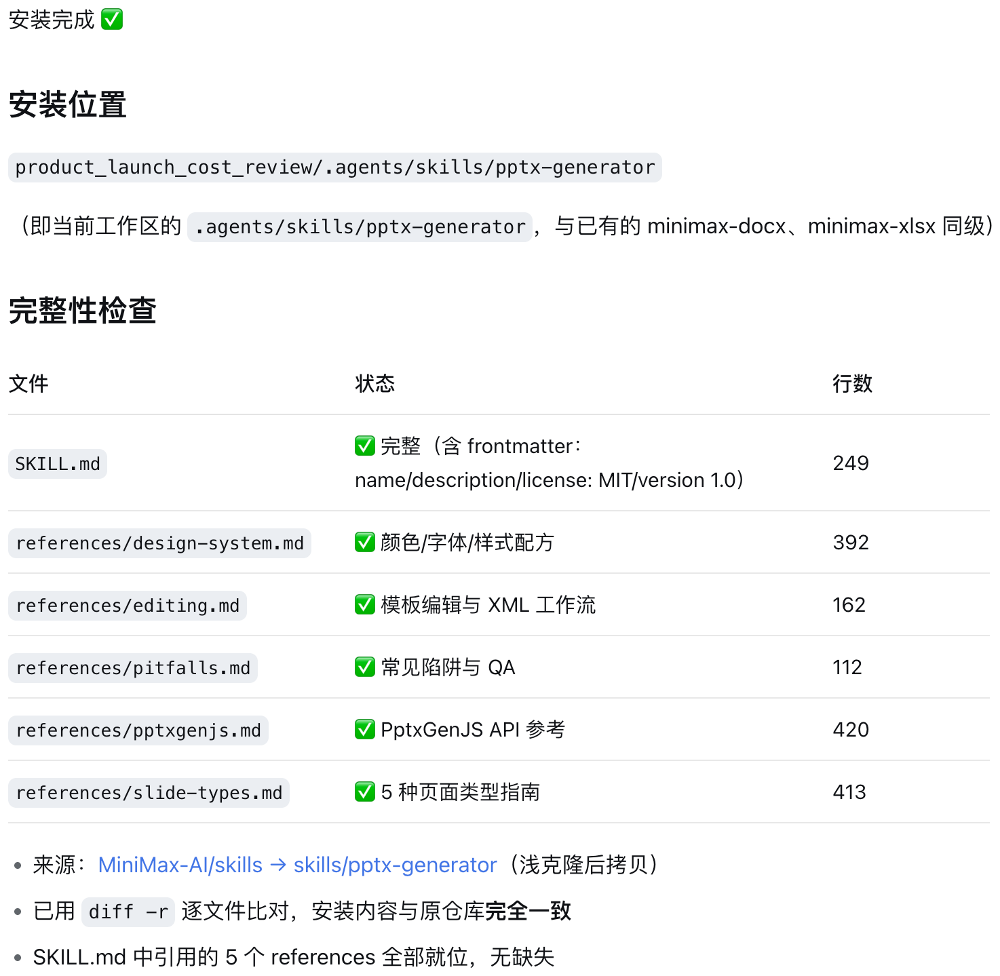{width=76%}

### 生成并检查演示文稿

安装完成后，单击 `New Session` 新建会话，输入：

```text
请使用 pptx-generator Skill，读取：

4-1-excel/output/产品发布会费用整理结果.xlsx
4-2-word/output/产品发布会费用复盘报告.docx
4-3-ppt/source/演示文稿制作要求.md

生成一套《产品发布会费用复盘》演示文稿。

要求：
1. 严格按照制作要求生成 6 页、16:9 的幻灯片；
2. 金额、比例和异常事项必须与 Excel、Word 报告一致；
3. 采用深蓝、浅蓝为主，橙色突出异常事项；
4. 使用大数字、图表和简短列表，避免大段文字；
5. 生成可以继续编辑的 PPTX，并保留生成源文件；
6. 生成每页预览，使用 ModLens 检查文字溢出、重叠、对齐和风格一致性；
7. 发现问题后直接修正并重新检查；
8. 将最终文件保存为：
4-3-ppt/output/产品发布会费用复盘.pptx。

缺少运行依赖时请自行安装。完成后说明生成了哪些文件，
以及检查和修改了哪些问题。
```

DSH 生成 PPTX、每页预览和对应的 JavaScript 源文件，并使用 ModLens 检查全部页面。完成后的回复会列出交付文件和 6 页内容，如图 4-9 所示。

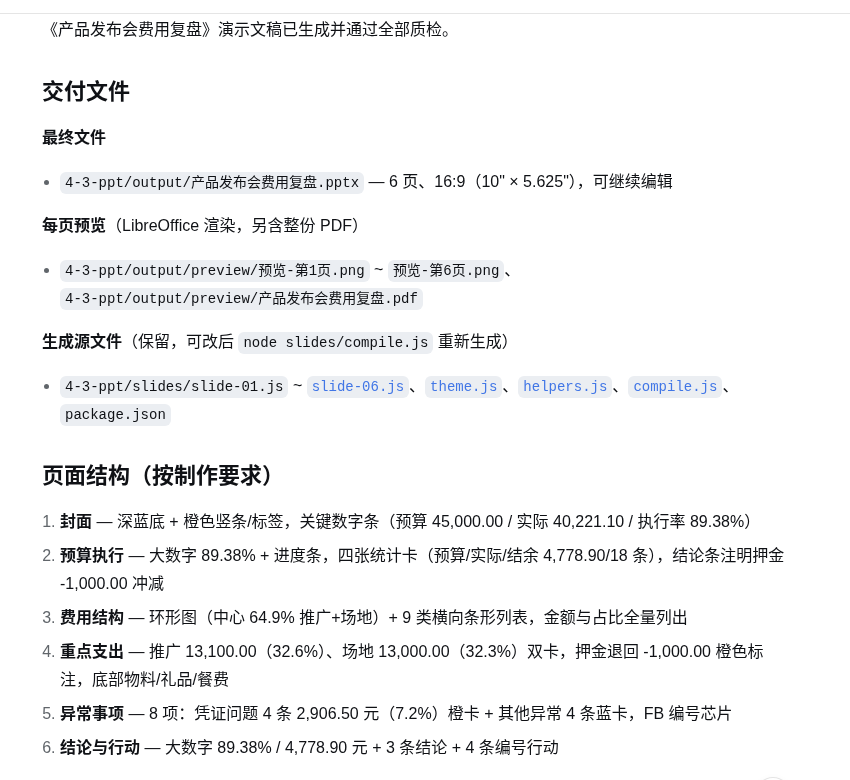{width=76%}

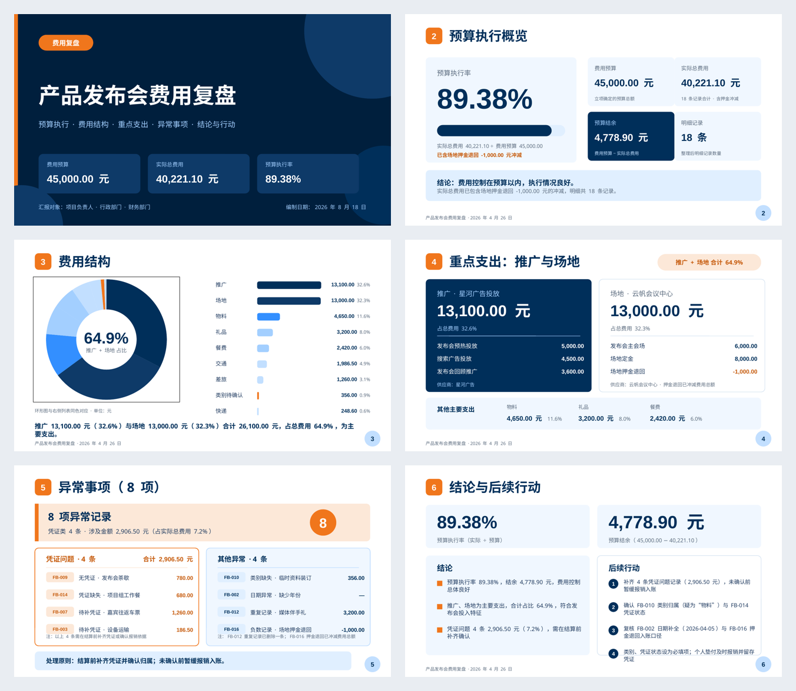{width=88%}

图 4-10 展示了本例的 6 页预览。封面和预算页突出关键数字，费用结构页使用环形图和条形列表，异常事项页使用橙色强调需要处理的凭证问题。

打开 `4-3-ppt/output/产品发布会费用复盘.pptx`，确认页数为 6 页，并抽查预算、实际费用、执行率和异常金额。源文件保存在 `4-3-ppt/slides/`，需要调整页面时可以继续修改并重新生成。

## 阅读和整理 PDF {#sec-4-4}

发布会结束后，收据、费用确认单和结算单常以扫描件或手机照片的形式保存为 PDF。这类文件可能没有文字层，还可能出现倾斜、阴影、旋转、缺页和重复文件。本节继续使用前面配置好的视觉能力，让 DSH 批量读取这些资料，并与 4.1 的 Excel 整理结果核对。

### 准备 PDF 资料

本节的输入文件位于 `4-4-pdf/source/`，共有 13 份 PDF、16 个页面。资料中既有清晰扫描件，也有低对比度页面、横向旋转页面和手机拍摄件，如图 4-11 所示。部分文件还存在内容重复或页码不连续的问题，需要 DSH 在读取内容的同时检查文件质量。

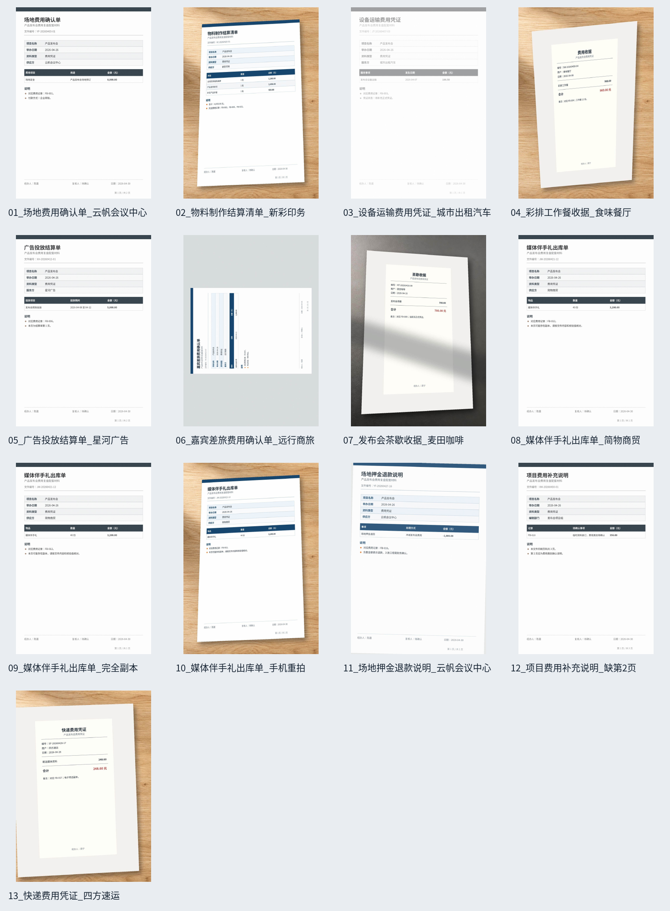{width=82%}

本节沿用 4.3 配置的 ModLens 视觉能力，无需再安装新的 Skill。

### 批量读取并核对资料

在 `product_launch_cost_review` 工作区中新建会话，输入：

```text
请读取 4-4-pdf/source 中的全部 PDF，使用视觉能力逐页识别内容，并完成以下工作：

1. 提取文件名称、资料类型、供应商、日期、金额和对应记录编号；
2. 按资料类型分类整理；
3. 检查重复文件、内容重复、缺页、旋转和识别困难等问题；
4. 与 4-1-excel/output/产品发布会费用整理结果.xlsx 核对，找出缺少凭证的费用记录；
5. 将汇总表保存为 4-4-pdf/output/PDF资料汇总.xlsx；
6. 将核查结论保存为 4-4-pdf/output/PDF资料核查报告.md。

保留原始 PDF。无法确认的内容请标记为“待人工核对”，不要猜测。
```

DSH 会逐页读取 PDF，提取单据中的字段，再通过文件校验值、页面内容和印刷页码检查重复及缺页情况。完成后，它会生成 Excel 汇总表和 Markdown 核查报告，并在回复中列出主要问题，如图 4-12 所示。

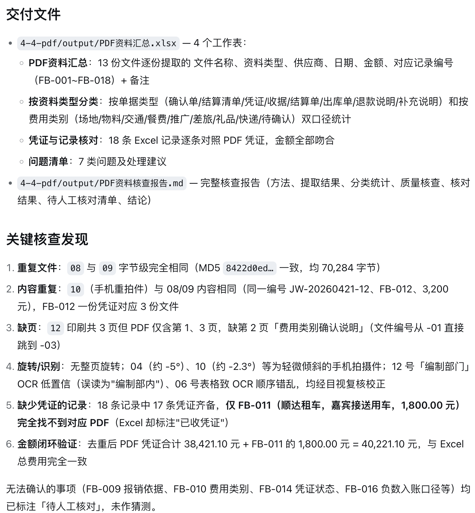{width=70%}

### 检查并修正识别结果

打开原始 PDF，并对照 DSH 给出的“关键核查发现”。本例的首次结果正确找出了重复文件、内容重复、缺页和缺少凭证的记录，但将 06 号文件判断为“无整页旋转”。实际打开该文件，可以看到页面中的内容横转了 90°。

PDF 的页面旋转属性为 0°，只表示页面坐标没有设置旋转，画面中的扫描内容仍可能是横向的。继续在当前会话中输入：

```text
请重新检查 06_嘉宾差旅费用确认单_远行商旅.pdf。该文件的页面内容横转了 90°，PDF 页面旋转属性为 0°，不代表画面方向正常。

请使用视觉能力复核，并更新 PDF资料核查报告.md 和 PDF资料汇总.xlsx 中的旋转检查结果。其他正确结论保持不变。
```

DSH 重新使用 ModLens 检查页面，并结合 OCR 文本框方向确认画面内容逆时针横转了 90°。随后，它更新了两份交付文件中的问题说明，同时保留原有的金额和凭证核对结果，如图 4-13 所示。

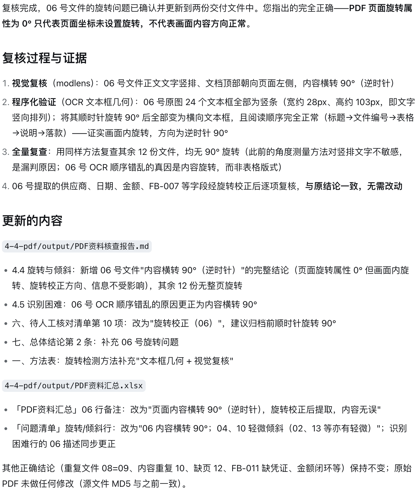{width=70%}

### 查看整理结果

打开 `4-4-pdf/output/PDF资料汇总.xlsx`。工作簿包含“PDF资料汇总”“按资料类型分类”“凭证与记录核对”和“问题清单”4 个工作表。13 份 PDF 去除重复件后的凭证金额为 38,421.10 元，与 Excel 总费用相差 1,800.00 元。逐条核对后可以确认，这一差额对应 FB-011：Excel 中记录了顺达租车的 1,800.00 元费用，PDF 目录中却没有相应凭证。

`PDF资料核查报告.md` 进一步列出了以下问题：

- 08 和 09 是内容及文件校验值均相同的重复文件；
- 10 是同一张伴手礼凭证的手机重拍件；
- 12 的印刷页码从第 1 页跳到第 3 页，缺少第 2 页；
- 06 的画面内容横转 90°，归档前需要校正；
- FB-011 没有对应的 PDF 凭证。

对于报销依据、费用类别和凭证状态等无法从资料中确定的信息，DSH 将其保留为“待人工核对”。原始文件仍保存在 `4-4-pdf/source/`，整个处理过程没有覆盖或修改输入资料。
