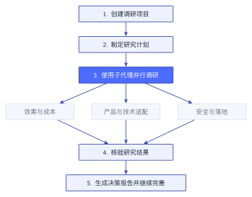
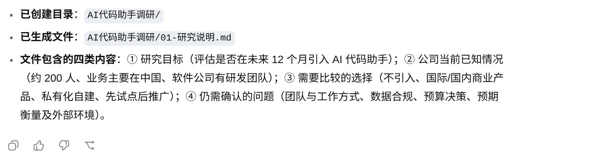
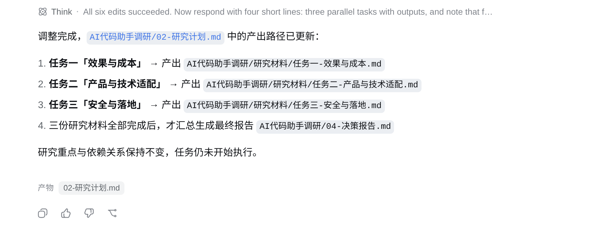
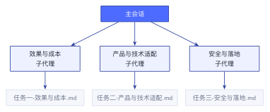
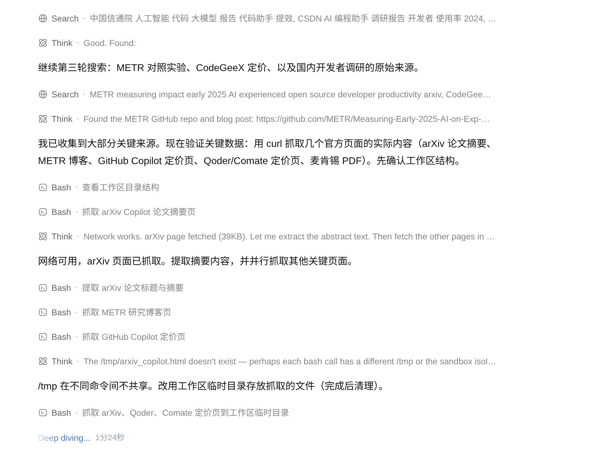
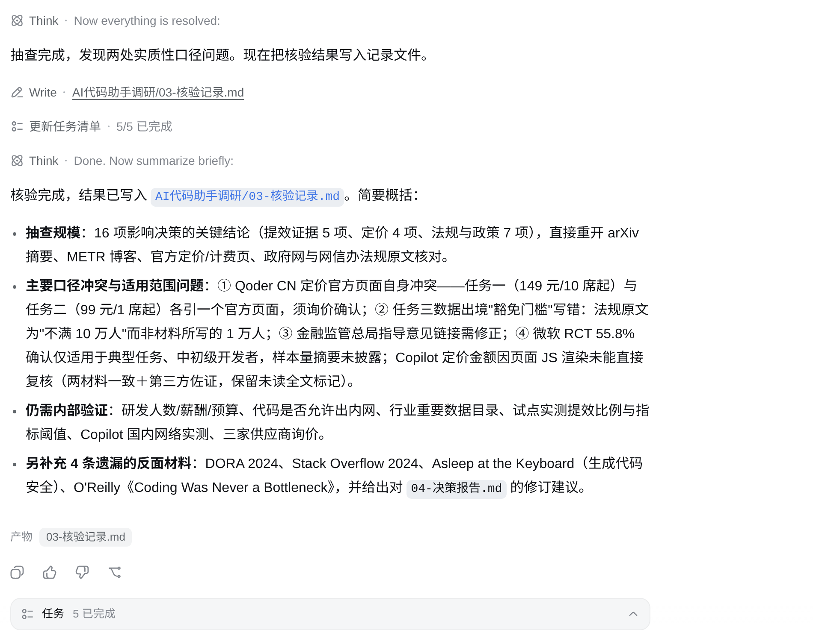
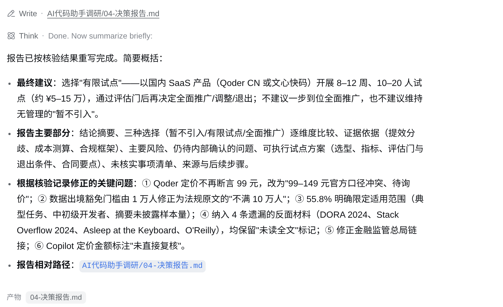

# 让 dsh 完成一次调研 {#ch-4}

设想你所在的团队正面临一个很现实的问题：要不要引入 AI 代码助手？真正做决定时，需要考虑投入和代码安全，也要看它能否适应现有的研发流程。我们先把问题整理成一个明确的调研题目：

> <span class="prompt-title">提示词内容：</span>
>
> 一家约 200 人、主要在中国开展业务的软件公司，是否应该在未来 12 个月内为研发团队引入 AI 代码助手？

直接让大模型回答，它通常很快就能写出一篇结构完整的分析，效率和风险都能谈到。可当这份分析真的要拿来做决策时，麻烦就出现了：它引用过哪些资料，关键数据能否经得住复核，都很难继续追查。dsh 可以先建立项目和研究计划，再让子代理分别搜集资料；材料齐备后，主会话根据工作区中留下的内容核验结论并生成报告。

## 明确问题并创建调研项目 {#sec-4-1}

本章接着使用第 2 章已经安装并接通模型的 dsh。开始前，新建一个空目录作为工作区，按照第 2 章的方法在 dsh 中选中该目录，再创建一个标准模式会话。本次实测使用 DeepSeek-V4-Flash，并将推理等级设为 Max。

下面的流程图展示了这次调研的完整过程。研究说明、原始材料和核验记录都会保存在工作区里，后续核验可以回到这些文件，不必只依赖一段越来越长的对话。

{.book-technical-figure width=68%}

第三步包含三个并行研究方向，完成后再进入核验和报告生成。

完成后，工作区中会留下下面这些文件：

```text
AI代码助手调研/
├── 01-研究说明.md
├── 02-研究计划.md
├── 研究材料/
│   ├── 任务一-效果与成本.md
│   ├── 任务二-产品与技术适配.md
│   └── 任务三-安全与落地.md
├── 03-核验记录.md
└── 04-决策报告.md
```

这些文件分别记录研究问题和分工、三个方向的原始材料、核验结果与最终建议。后面的每一步都会在这个目录中新增或更新文件。

### 先把问题写清楚

深度调研的第一步，是确认这次到底要回答什么，再开始搜索。“要不要引入 AI 代码助手”仍然有很多没有说明的地方。例如，公司是准备直接向整个研发团队推广，还是先选择一个小组试用？公司最关心的是开发速度、代码质量，还是数据安全？研究结果是供研发负责人参考，还是要提交给管理层做采购决策？

如果这些问题没有说清楚，dsh 可能搜集很多有趣的信息，却无法支持公司的实际决策。

在主会话中输入下面的指令：

> <span class="prompt-title">提示词内容：</span>
>
> 请为本次调研创建“AI代码助手调研”目录，并生成“01-研究说明.md”。
> 研究问题如下。一家约 200 人、主要在中国开展业务的软件公司，是否应该在未来 12 个月内为研发团队引入 AI 代码助手？
> 先不要开始搜索，也不要给出结论。请在文件中写清楚研究目标、公司当前已知情况、需要比较的选择，以及仍需确认的问题。

dsh 会分析任务，并在工作区中创建目录和文件。完成后，打开 `01-研究说明.md`，逐项检查下面这些内容：

- 具体决策和“暂不引入、有限试点、全面推广”等备选方案
- 效率、质量、安全、技术适配和成本等评价角度
- 研究结果交给谁看
- 公司内部仍然缺少的信息

{width=76%}

网页搜索可以找到产品资料、行业研究和其他公司的案例，却无法知道这家公司的研发人数、当前开发周期、缺陷率、预算和代码敏感程度。凡是公开资料无法知道的内容，都应先标记为“待确认”，不能由模型补出数字。

如果文件中混入了未经提供的公司信息，可以直接在会话中纠正：

> <span class="prompt-title">提示词内容：</span>
>
> 研究说明中有些公司情况并未提供。请删除推测内容，把它们改成待确认问题。

后续步骤会继续读取这些文件，因此这里发现的问题要先改完。

做到这一步后，工作区中应出现下面的文件：

```text
AI代码助手调研/
└── 01-研究说明.md    ← 本步新增
```

## 拆分任务并制定研究计划 {#sec-4-2}

### 把大问题拆成三个方向

研究问题明确后，下一步是决定从哪些方向搜集资料。第一次使用子代理时，任务不宜拆得太细。本案例按照管理层做决定时需要比较的信息，将调研分成三个方向。每个方向回答一组相对独立的问题，产出的材料也能直接用于报告。

| 研究方向 | 主要问题 |
| --- | --- |
| 效果与成本 | AI 代码助手能否提高效率、会不会影响质量、需要投入多少成本 |
| 产品与技术适配 | 有哪些候选产品，能否适配公司的编程语言、开发工具和代码平台 |
| 安全与落地 | 如何处理代码和数据，存在哪些合规与知识产权风险，怎样制定使用规范 |

这三个方向可以分别搜索和整理，因此能够同时开展。决策报告要等三份研究材料齐备后再写。

在主会话中输入下面的指令，让 dsh 读取研究说明并制定计划：

> <span class="prompt-title">提示词内容：</span>
>
> 请读取“AI代码助手调研/01-研究说明.md”，把调研拆成“效果与成本”“产品与技术适配”“安全与落地”三个可以并行开展的任务，并将计划写入“02-研究计划.md”。暂时不要开始执行。

一份可执行的 `02-研究计划.md` 要说明每项任务回答什么问题、寻找什么资料，以及结果写到哪个文件，只有三个标题还不够。

{width=76%}

例如，“产品与技术适配”要列出候选产品，并检查它们对编程语言、开发工具、部署方式、企业管理和现有代码平台的支持情况。“调查市场上的 AI 代码助手”范围太宽，无法直接执行。

进入下一步前，先检查三个任务是否有明显重叠。如果两个任务都在全面比较产品，子代理就会重复工作。可以让“产品与技术适配”负责产品功能和接入条件，让“安全与落地”负责数据处理、安全风险和使用制度。

### 为什么不立即生成报告

初次使用 dsh 时，我们很容易把“制定计划”和“完成任务”写在同一条指令中。dsh 可能一边规划，一边搜索，一边开始写报告。看上去省事，后面却很难检查中间过程。

这里让 dsh 先停下来，给人留出一个检查点。先确认研究范围和任务分工，再让 dsh 执行计划。

研究计划确认后，工作区结构如下：

```text
AI代码助手调研/
├── 01-研究说明.md
└── 02-研究计划.md    ← 本步新增
```

## 让多个 Agent 并行调研 {#sec-4-3}

### 什么是子代理

子代理是从主会话中启动、独立完成一项任务的工作单元。每个子代理都有自己的会话记录，并与主会话共享工作区。dsh 的中文界面使用“子代理”这个名称，本章后面也沿用它。

主会话保留完整的研究目标，三个子代理分别负责一个研究方向。它们可以同时搜索和整理资料，搜索过程留在各自的会话记录中，不会全部挤进主会话。

这次调研无须给子代理编写复杂的人设。只要为每个子代理划定任务范围，并指定一个独立的结果文件即可。

{.book-technical-figure width=82%}

每个子代理只负责一个研究方向，并写入自己的文件。

### 同时启动三个子代理

回到主会话，输入下面的指令：

> <span class="prompt-title">提示词内容：</span>
>
> 请按照“AI代码助手调研/02-研究计划.md”，同时启动三个子代理，分别完成“效果与成本”“产品与技术适配”“安全与落地”研究。
> 请让它们使用网页搜索查找资料，记录来源和日期，并分别写入“研究材料”目录中的对应文件。三个子代理不要修改同一个文件。
> 每份材料只保留足以支持主要结论的来源，一般不超过 12 个。找到足以回答研究问题的材料后停止扩大搜索范围，整理并写入文件。没有核对全文或仍不确定的内容要明确标注。

提示词里要明确写出“同时启动”。dsh 会在同一轮中创建三个子代理，让它们并行运行，三个任务不必依次等待。

子代理启动后，当前会话页面顶部会出现子代理入口。列表中会显示各自的名称、状态、耗时和 token 用量。点击其中一项，还可以查看这个子代理自己的对话记录和工具调用过程。

{width=48%}

dsh 完成委派后会结束主会话的这一轮回复，子代理继续在后台执行。你不必停留在某个子代理页面等待，也不需要反复询问“完成了吗”。任务结束时，列表会改为“当前未运行”，并保留耗时和 token 用量。

{width=48%}

实际运行中，如果只要求“尽可能全面地搜索”，子代理可能不断扩大检索范围，却迟迟不写文件。因此，上面的指令增加了来源数量和停止条件。如果某个任务仍然运行过久，可以打开它检查进度；确认它仍在反复扩大搜索范围后，再要求它基于已有材料整理结果。

{width=68%}

### 为什么要分别写文件

三个子代理共享同一个工作区。如果它们同时修改同一份报告，就可能出现内容互相覆盖、结构反复变化或者编辑冲突。因此，本案例让它们分别写入下面三个文件：

```text
研究材料/任务一-效果与成本.md
研究材料/任务二-产品与技术适配.md
研究材料/任务三-安全与落地.md
```

每份材料的写法可以有所不同，但至少要有主要发现和来源，并注明资料日期、适用范围和仍然无法确认的问题。

如果某个子代理已经结束，但文件内容过于简单，可以从顶部入口打开它，继续发送下面的指令：

> <span class="prompt-title">提示词内容：</span>
>
> 请补充两个方面。寻找与当前结论相反的材料，并标出哪些来源没有核对到全文。完成后更新原来的文件。

子代理保留自己的上下文，知道之前负责什么，可以在原有材料的基础上继续补充。

三个子代理完成任务后，研究材料会集中在同一目录中：

```text
AI代码助手调研/
├── 01-研究说明.md
├── 02-研究计划.md
└── 研究材料/                 ← 本步新增
    ├── 任务一-效果与成本.md
    ├── 任务二-产品与技术适配.md
    └── 任务三-安全与落地.md
```

## 核验材料并补充缺口 {#sec-4-4}

### 在生成报告前核验一次

三份材料写完后，还要核对其中的结论。子代理可能引用过时资料，把厂商公布的数字当成普遍结论，或者漏掉与自己判断相反的案例。

三个子代理分别负责不同方向，主会话保留了最初的研究问题和全部输出，适合在这里交叉检查材料。本步回到主会话读取三份材料，找出来源、冲突、适用范围和信息缺口方面的问题，无须再启动新的子代理。

在主会话中输入下面的指令：

> <span class="prompt-title">提示词内容：</span>
>
> 请读取“AI代码助手调研/01-研究说明.md”和“研究材料”中的三份文件，在主会话中完成核验，不要启动新的子代理。
> 请抽查支撑关键结论的来源，重新打开网页，核对原文、发布日期、研究样本和数据口径。没有读到全文的资料要保留原来的不确定标记。
> 再检查三份材料之间是否矛盾、是否遗漏反面材料，以及哪些问题必须通过公司内部数据或试点才能回答。请把结果写入“03-核验记录.md”。

核验记录重点看三类问题：

- 原文能否支持关键结论，材料的适用范围是否符合本案例
- 三份材料对同一产品或风险的说法是否冲突
- 哪些问题无法通过公开资料解决

这次实际运行中，dsh 抽查了 16 项会影响决策的结论，其中包括 5 项提效证据、4 项定价信息和 7 项法规与政策。

核验发现，Qoder CN 的两个官方页面给出了不同价格，数据出境豁免门槛也被材料误写成了 1 万人。微软实验中的 55.8% 提速只适用于特定任务和参与者，不能直接套用到所有研发团队。dsh 还补入了几份持相反结论的材料，并把无法从公开资料确认的问题留给公司内部调查和试点。

{width=82%}

例如，公开研究或许能够说明 AI 代码助手在某些编程任务中提高了完成速度，但它无法证明这家公司也能获得相同收益。公司的代码库、人员经验和研发流程都可能不同。这样的结论应记录为“需要通过内部试点验证”，不能简单判为“错误”。

### 根据核验结果补充材料

`03-核验记录.md` 中，少量不影响决策的问题可以保留到最终报告的“未知信息”部分。关键结论缺少证据时，则需要补充调研。

这时不必把全部流程重新运行一遍。在主会话中只针对缺口继续工作：

> <span class="prompt-title">提示词内容：</span>
>
> 请根据“03-核验记录.md”，只补充其中会影响最终决策的关键缺口。需要时把任务交给对应的子代理，更新相关研究材料，并在核验记录中注明补充结果。

如果缺口仍然属于原来的研究方向，就把补充任务交还给对应的子代理。材料之间的冲突或适用范围问题，可以让 dsh 直接写入核验记录。这里不需要重新拆分整项调研。

核验结束后，工作区中会新增核验记录：

```text
AI代码助手调研/
├── 01-研究说明.md
├── 02-研究计划.md
├── 研究材料/
│   ├── 任务一-效果与成本.md
│   ├── 任务二-产品与技术适配.md
│   └── 任务三-安全与落地.md
└── 03-核验记录.md             ← 本步新增
```

## 生成并完善决策报告 {#sec-4-5}

### 由主会话综合研究材料

前四步留下了研究说明、研究计划、三份研究材料和核验记录。研究材料齐备时，dsh 可能已经按照计划生成了一份报告初稿。核验完成后，仍要回到主会话根据核验记录重写报告，前面发现的口径冲突和适用范围问题才会进入最终版本。

输入下面的指令：

> <span class="prompt-title">提示词内容：</span>
>
> 请读取“AI代码助手调研/01-研究说明.md”“AI代码助手调研/02-研究计划.md”“AI代码助手调研/03-核验记录.md”和“AI代码助手调研/研究材料”中的三份文件，根据核验结果重写“AI代码助手调研/04-决策报告.md”。不要启动新的子代理，也不要继续搜索。
> 报告需要比较“暂不引入”“有限试点”“全面推广”三种选择，明确给出建议、证据依据、主要风险、仍待内部确认的问题和可执行的试点方案。必须纳入核验记录里的口径修正、适用范围和反面材料；无法确认的数据继续标注不确定，不要自行补造。

生成报告时，dsh 要围绕最初的问题比较三个选择，并说明判断和依据。整理三份研究材料时，应按报告需要取舍和组合内容。

本次重写后的报告建议公司先做有限试点，并比较了“暂不引入、有限试点、全面推广”三个选择。报告保留了 Qoder CN 定价尚待询价、Copilot 定价未直接复核等不确定信息，也纳入了核验时找到的反面材料。试点范围、评估指标和退出条件都写进了报告。

{width=74%}

最终报告不要只看结论，还要核对：

- 是否回答了最初的决策问题
- 重要结论能否在研究材料中找到依据
- 是否把尚不确定或有适用条件的结论写得过于肯定
- 是否逐一比较了三个选择
- 缺少的公司内部信息是否如实列出
- 试点方案是否有评估指标

评估 AI 代码助手时，应关注任务完成周期、代码审查时间、缺陷和返工情况、开发者是否持续使用，以及有没有出现敏感信息提交或安全事件。生成代码行数和建议采纳次数只能作为辅助数据。

如果报告建议先试点，还应说明试点结束后怎样作出下一步决定。达到哪些效率和质量标准后扩大使用，出现哪些安全或合规问题时立即停止，以及结果不明显时何时重新评估，都要写清楚。

### 用后续对话逐步完善报告

报告生成后，可以针对发现的问题逐项给出反馈：

> <span class="prompt-title">提示词内容：</span>
>
> 报告对安全风险的说明比较抽象。请根据“任务三-安全与落地.md”补充具体风险，但不要增加没有来源的新判断。

也可以要求 dsh 只修改报告中的某一部分。材料已经保存在工作区中，dsh 可以重新读取文件，不需要依赖会话里还保留着多少前文。

随着公司的内部数据、访谈结果和试点数据逐渐补齐，还可以继续更新研究材料和决策报告。研究文件会在后续核验中不断补充，不必把第一次生成的版本当作定稿。

### 查看调研结果

生成报告并完成必要修改后，回到工作区逐个查看本次调研留下的文件。`01-研究说明.md` 和 `02-研究计划.md` 记录了问题范围与任务分工，`研究材料` 目录保存三个方向的结论和来源。`03-核验记录.md` 中列出的口径冲突和证据缺口，应当在最终报告中得到相应处理。

最后打开 `04-决策报告.md`，从推荐方案中挑几条关键结论，再到研究材料和核验记录里查依据。核验记录中仍有待确认的问题，最终报告也应如实说明。

试点范围和评估指标要与前面的材料一致，并写清出现什么情况就停止。发现遗漏时，可以回到主会话继续修改对应文件。

调研完成时，工作区中应包含下面这些文件：

```text
AI代码助手调研/
├── 01-研究说明.md
├── 02-研究计划.md
├── 研究材料/
│   ├── 任务一-效果与成本.md
│   ├── 任务二-产品与技术适配.md
│   └── 任务三-安全与落地.md
├── 03-核验记录.md
└── 04-决策报告.md             ← 本步新增
```
