# 用 dsh 完成日常办公 {#ch-5}

## 整理 Excel 表格 {#sec-5-1}

## 编写 Word 报告 {#sec-5-2}

## 设计并生成 PPT 演示文稿 {#sec-5-3}

一份完整的演示文稿，需要同时处理内容结构、参考资料、页面版式和视觉风格。自己逐页制作往往要花费不少时间，DSH 可以帮助我们完成资料整理、内容规划、页面生成和成品检查，快速得到一套可以继续编辑的 PPT。

本章以《从大语言模型到智能体》为主题，制作一份面向公司内部分享的 8 页演示文稿。整个过程分为六步：配置多模态能力、确定主题、组织多个 Agent 调研、确认内容大纲和视觉风格、调用 Skill 生成幻灯片，以及检查并保存成品。

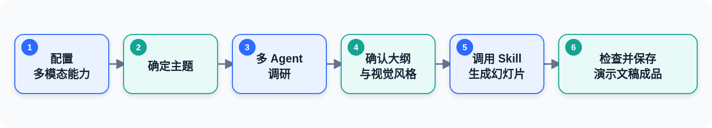

完成本章后，工作区中将保留调研资料、内容大纲、视觉规范、页面源文件、预览图和最终的 PPTX 文件。以后需要修改文字、调整样式或增加页面时，可以继续让 DSH 在这些文件的基础上处理。

### 配置 dsh 多模态能力

本章使用的 DeepSeek-V4 目前还不具备视觉能力，无法直接读取图片。制作演示文稿时，DSH 需要理解参考图片、分析图表，并检查生成后的页面预览。我们将通过 ModLens 插件接入 GLM-5V-Turbo，为 DSH 补充视觉能力。

DeepSeek 仍然是负责理解任务、组织内容和调用工具的主模型；GLM-5V-Turbo 负责读取图片，再把识别结果交还给 DeepSeek。ModLens 在两个模型之间完成连接。

#### 安装 ModLens

打开终端，输入下面的命令：

```bash
npx -y @deepseek-ai/dsh plugin --profile web add @liustack/modlens@3.18.1
```

安装成功后，终端会显示类似下面的内容：

```text
dependencies:
+ @liustack/modlens 3.18.1

Packages: +3
+++
Progress: resolved 3, reused 0, downloaded 3, added 3, done
Done in 2s using pnpm v11.22.0
```

安装完成后，重启 DSH，使插件生效。

#### 配置视觉模型

重启后，单击页面左下角的 **Settings**。在设置页面左侧选择 **Plugins**，打开 **Plugin configuration** 选项卡，然后向下找到并展开 **视觉引擎（ModLens）**。

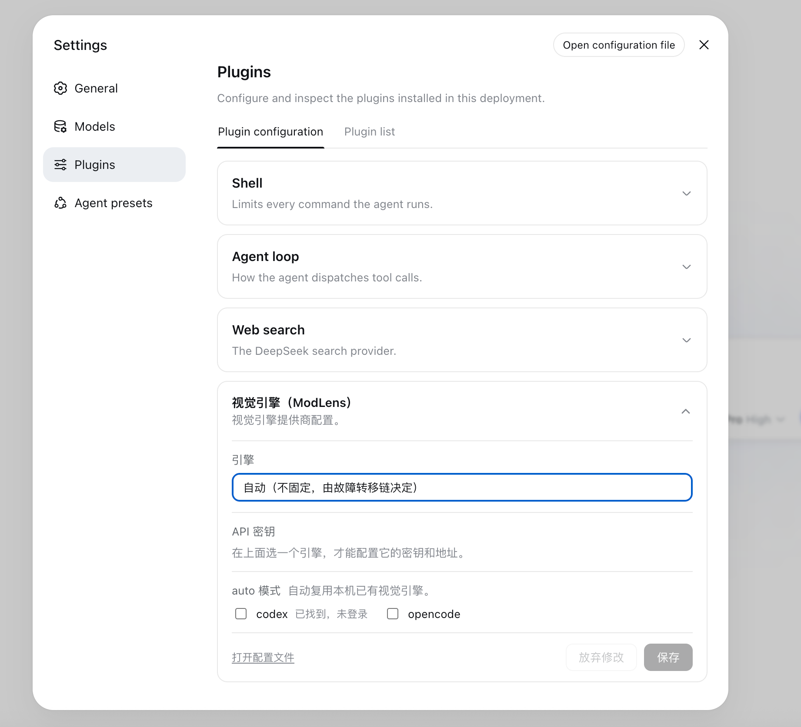

单击“引擎”下拉框并选择 `openai`，这里的 `openai` 表示采用 OpenAI 兼容接口，ModLens 可以通过这种通用接口连接 GLM-5V-Turbo。

接下来在浏览器中打开智谱开放平台的 API Keys 页面：

`https://bigmodel.cn/usercenter/proj-mgmt/apikeys`

登录后创建一个 API Key。复制生成的 API Key，返回 DSH 的 ModLens 配置卡片，依次填写：

- **引擎**：`openai`
- **API 密钥**：刚刚创建的智谱 API Key
- **接口地址**：`https://open.bigmodel.cn/api/paas/v4/`
- **模型**：`glm-5v-turbo`

填写完成后，单击 **保存**。

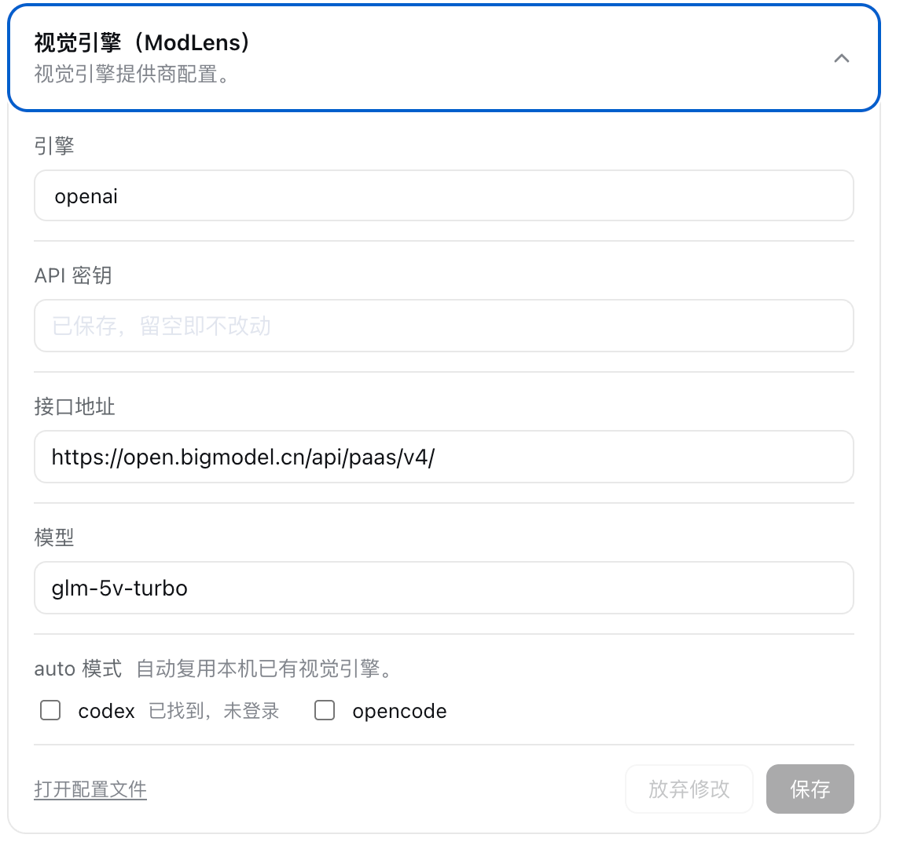

#### 验证视觉能力

配置值保存成功后，还要通过一次真实的图片读取确认接口能够正常工作。返回会话页面，将一张图片直接粘贴到输入框中，然后输入：

```text
你能读到这张图吗？
```

如下图所示，消息记录中出现了 `modlens_read_image` 工具调用，DSH 随后描述了图片的背景、文字和主体元素。这说明 ModLens 已经能够调用 GLM-5V-Turbo 读取图片。

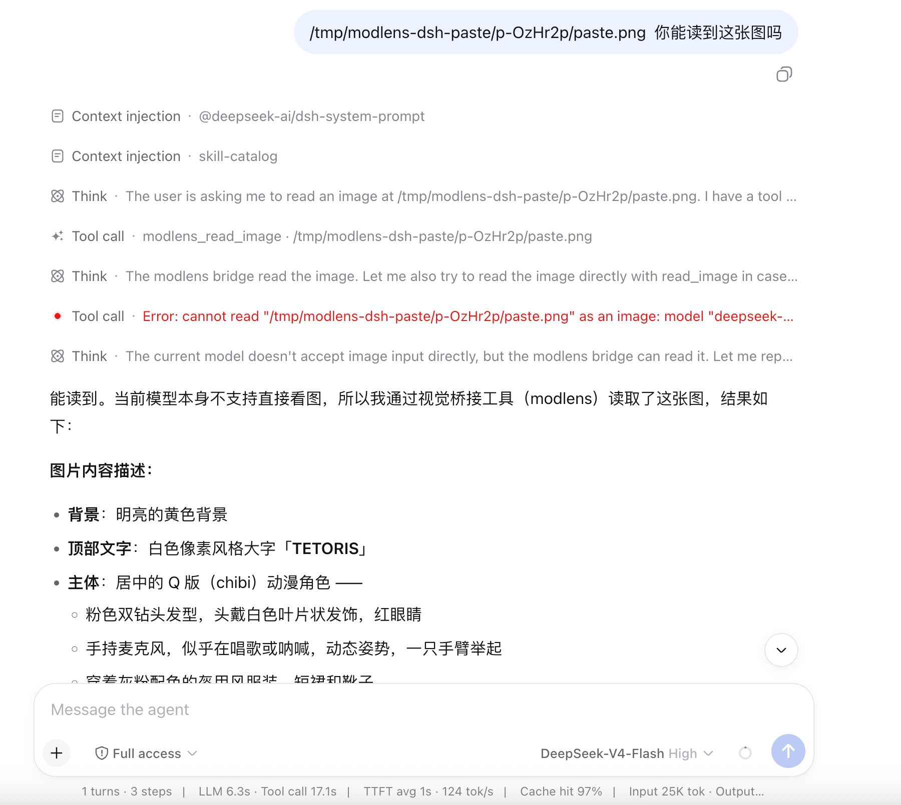

图中还有一条红色错误信息。ModLens 完成识别后，Agent 又尝试让 DeepSeek-V4 直接读取同一张图片，由于主模型不接受图片输入，这次额外尝试失败了。上方的 `modlens_read_image` 调用和下方的图片描述均已正常返回，因此不影响本节的配置结果。

### 准备主题和参考资料

#### 创建演示文稿工作区

先为这次演示文稿创建一个单独的工作区。单击 DSH 左侧 **Workspaces** 旁的 **Add workspace**，在 Finder 中新建或选择一个名为 `llm-to-agent-ppt` 的文件夹。后续产生的调研资料、页面源文件和 PPTX 成品都会保存在这里。

选择这个工作区，新建一个会话，并确认当前使用 **Standard mode**。本节需要调用多个子 Agent 分头调研，相关能力已经包含在标准模式中。

#### 确定主题

开始调研前，先告诉 DSH 这份演示文稿要讲什么、讲给谁听，以及演讲时间和页数。输入下面的内容：

```text
我要制作一份题为《从大语言模型到智能体》的演示文稿。

使用场景：公司内部知识分享
目标听众：对 Agent 了解不多的普通同事
演讲时间：约 10 分钟
幻灯片数量：8 页左右

内容从大语言模型的基础能力讲起，重点介绍工具调用、Agent 执行循环、
上下文管理、多 Agent 协作和 Agent Harness。介绍 Agent Harness 时，
先说明通用概念，再以 DeepSeek Harness 为具体案例。

请复述你对这项任务的理解，并列出接下来需要调研的关键问题。只需输出
任务理解和问题清单，不需要再向我确认其他偏好。此时先不要调研、拟订
大纲或制作幻灯片。
```

DSH 根据这些条件整理出六部分内容主线，并指出 10 分钟、8 页的篇幅要求意味着每一页只能突出一个核心信息。它还围绕各部分列出了后续需要核对的问题，为下一步分头调研划定了范围。

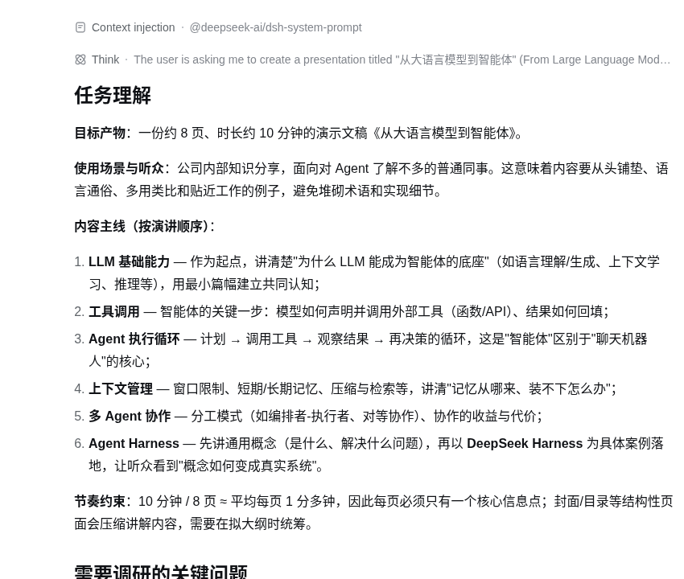

#### 让多个 Agent 分头调研

主题和范围确定后，可以把几个彼此独立的问题交给不同的子 Agent。这里让 4 个子 Agent 分别调查大语言模型、工具调用、Agent 执行过程和 Agent Harness：

```text
请根据刚才整理出的内容主线开始第一轮调研，并同时调用 4 个子 Agent
分头完成下面的任务：

1. 调研大语言模型为智能体提供的基础能力，重点核对 Transformer、
   GPT-3 和指令微调等代表性工作；
2. 调研模型使用外部工具的方式，重点核对函数调用、Toolformer、
   ReAct 和 MCP 等代表性方法；
3. 调研 Agent 执行循环、上下文管理和多 Agent 协作，说明它们分别
   解决什么问题；
4. 调研 Agent Harness 的通用作用，并结合 DeepSeek Harness 的官方
   资料说明模型、工具、上下文、工作区和子 Agent 怎样被组织起来。

每个子 Agent 都要围绕《从大语言模型到智能体》这个主题，优先查找
论文、官方文档或项目官网，记录关键概念、代表性工作、发布时间、
简要意义和原始资料网址。遇到存在争议的定义或结论时，要明确标注。

等所有子 Agent 返回后，请合并重复内容，按照“大语言模型基础能力—
工具调用—执行循环与上下文—多 Agent—Agent Harness”的顺序整理成
一份调研简报，并列出可供演示文稿使用的参考资料。此时先不要拟订
幻灯片大纲或制作幻灯片。
```

DSH 启动 4 个子 Agent 后，当前会话会显示各自的任务名称和运行状态。它们在独立的上下文中工作，完成后把结果交回当前会话。

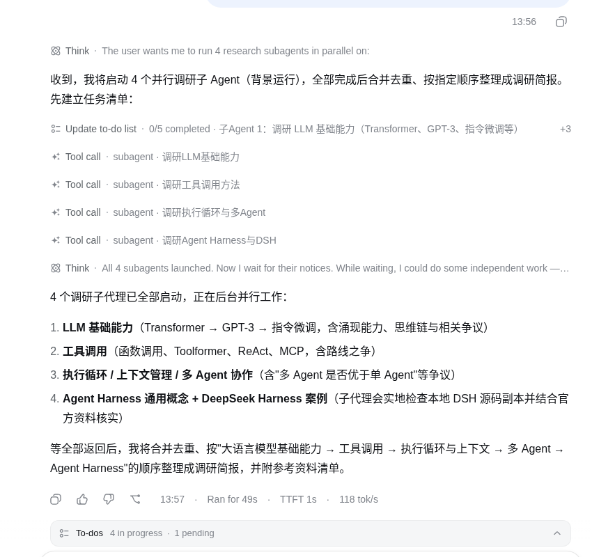

所有任务结束后，主 Agent 对材料进行合并和去重，并生成 `调研简报.md`。4 份专题报告也保留在工作区中，遇到需要进一步核对的观点时，可以回到对应报告查看原始资料。

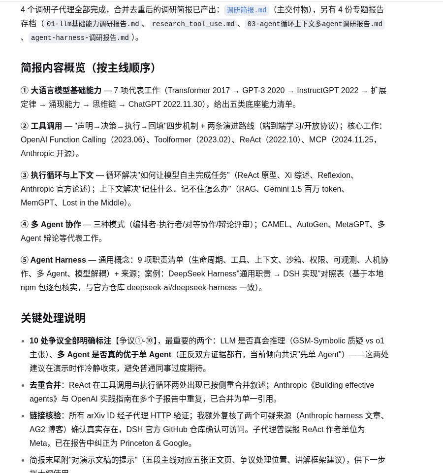

#### 整理参考资料

为了方便后面反复读取，再把调研结果整理为一份内容简报和一份独立的参考资料清单：

```text
请读取当前工作区中的调研简报.md 和 4 份专题调研报告，把已经核对的
材料整理成下面两个文件：

1. research-brief.md
按照“大语言模型基础能力—工具调用—执行循环与上下文—多 Agent—
Agent Harness”的顺序整理。保留关键事实、代表性工作和适合演示文稿
使用的解释；存在争议的结论要明确标注。内容应适合用于一份 8 页、
约 10 分钟的演示文稿。

2. references.md
按主题整理参考资料。每条资料记录标题、作者或发布机构、发布时间、
原始网址，以及它支持的观点。优先保留论文、官方文档和项目官网，
不使用搜索结果页或无法追溯来源的转载文章。

保留现有的调研简报和专题报告，不要删除或覆盖它们。完成后列出新生成
的文件，并简要说明每个文件包含什么。此时先不要拟订幻灯片大纲或制作
幻灯片。
```

完成这一步后，`research-brief.md` 用来提供演示内容，`references.md` 用来核对事实并为幻灯片标注来源。原始专题报告仍然保留，后续生成过程不会丢失调研依据。

### 确定内容大纲和视觉风格

#### 拟定 8 页大纲

有了经过整理的材料，接下来让 DSH 把内容压缩到 8 页。输入：

```text
请读取当前工作区中的 research-brief.md 和 references.md，为
《从大语言模型到智能体》拟订一份 8 页演示文稿大纲。

使用场景仍然是公司内部知识分享，听众是对 Agent 了解不多的普通同事，
演讲时间约 10 分钟。

每一页请写明：
1. 页码和页面标题；
2. 希望听众记住的一句话；
3. 支撑这句话的关键事实；
4. 对应的参考资料；
5. 适合采用的版式或图示。

内容按照“大语言模型基础能力—工具调用—执行循环与上下文—多 Agent—
Agent Harness”的主线展开。Transformer、GPT-3 等模型历史只需简要
交代，把更多篇幅留给工具调用、执行循环、多 Agent 和 Agent Harness。
多 Agent 页面应以当前方法和实际作用为重点，AutoGen 等较早框架只作为
历史资料，不作为页面主角。

请先输出大纲供我确认，此时不要制作幻灯片。
```

DSH 给出的初稿已经包含页面标题、核心观点、事实、来源、版式和时间预算。先检查内容顺序和各页分量，不必急着生成幻灯片。

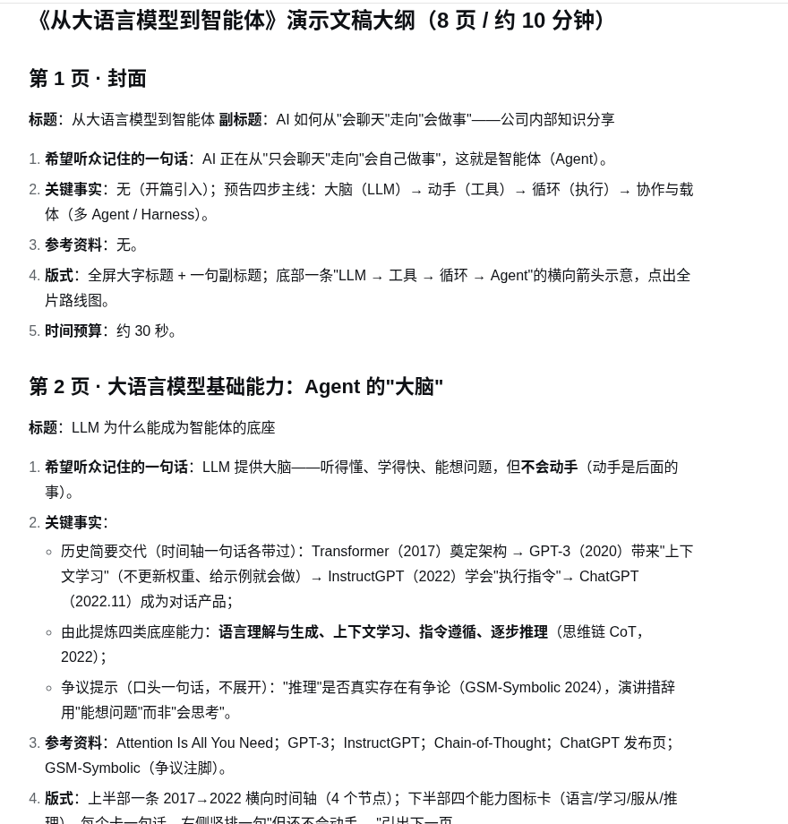

初稿的信息仍然偏多，预计讲解时间也超过了 10 分钟。继续让 DSH 压缩内容，并把确认后的大纲保存为文件：

```text
这个 8 页大纲的整体方向可以采用。请在保持页数和内容顺序不变的前提下
做下面的调整：

1. 每页只保留一个核心观点，支撑事实最多 3 项；
2. Transformer、GPT-3 等历史节点继续压缩，不展开技术原理；
3. 工具调用和执行循环仍作为重点，但各控制在约 1.5 分钟；
4. 多 Agent 页面突出分工、交叉检查和使用边界，AutoGen 等早期框架
   只保留为历史注脚；
5. Agent Harness 页面讲通用职责，最后一页再用 DeepSeek Harness
   完成案例说明和全篇收束；
6. 调整每页时间预算，使 8 页合计不超过 10 分钟；
7. 每页保留页面标题、希望听众记住的一句话、最多 3 项关键事实、
   参考资料、版式建议和时间预算。

调整完成后，将最终大纲保存为当前工作区中的 outline.md。
不要开始制作幻灯片。
```

调整后的大纲共 8 页，总时间为 10 分钟。工具调用、执行循环和多 Agent 协作获得了更多讲解时间，模型发展史被压缩为简短的背景信息。

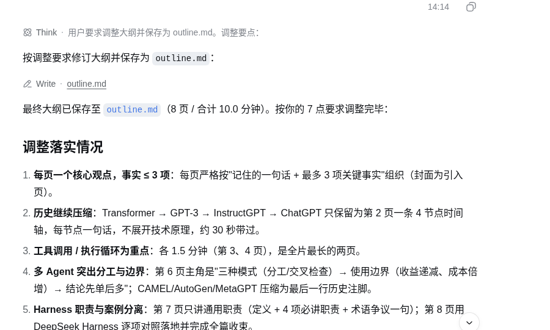

#### 选择视觉风格

同一份大纲可以有多种视觉表达。先让 DSH 给出几种方案，再结合实际演示环境作出选择：

```text
请读取当前工作区中的 outline.md，为《从大语言模型到智能体》提出
3 套视觉风格方案。

这是一份面向公司内部知识分享的 16:9 演示文稿，听众对 Agent 了解不多。
整体效果要清晰、现代，便于在会议室屏幕上阅读。

每套方案请说明整体感觉、配色、字体、统一版式、主要图示，以及方案的
优点和可能存在的问题。最后推荐其中一套，并说明推荐理由。先输出方案
供我选择，暂不制作幻灯片。
```

DSH 给出了“暗夜实验室”“明亮商务”和“渐变光谱”三套方案。考虑到会议室环境光和正文的信息密度，它推荐采用白色背景、蓝色主色的“明亮商务”方案。

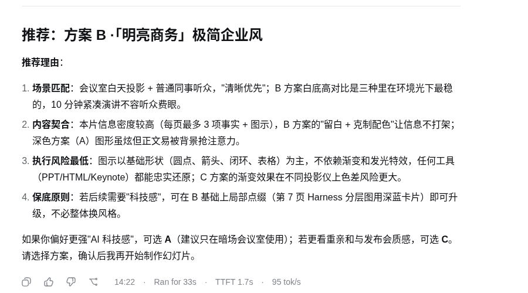

确认选择后，让 DSH 把配色、字体、页面网格和逐页布局写成视觉规范：

```text
采用方案 B“明亮商务”极简企业风。

请结合 outline.md，确定整套演示文稿的配色、字体、统一版式，以及每一页
的布局和主要图示。使用 16:9 页面，以白色或浅灰色为背景、蓝色为主色，
保证会议室屏幕上的文字清晰易读。每页底部保留来源栏，第 7 页可以加入
少量深蓝色科技元素。

将最终视觉规范保存为 visual-style.md，暂不制作幻灯片。
```

`visual-style.md` 统一规定了颜色、字体、页边距、页码和来源栏，还为 8 页内容分别指定了时间轴、循环图、对比图和分层结构图等版式。后续即使由不同子 Agent 制作页面，也可以依据同一份规范保持风格一致。

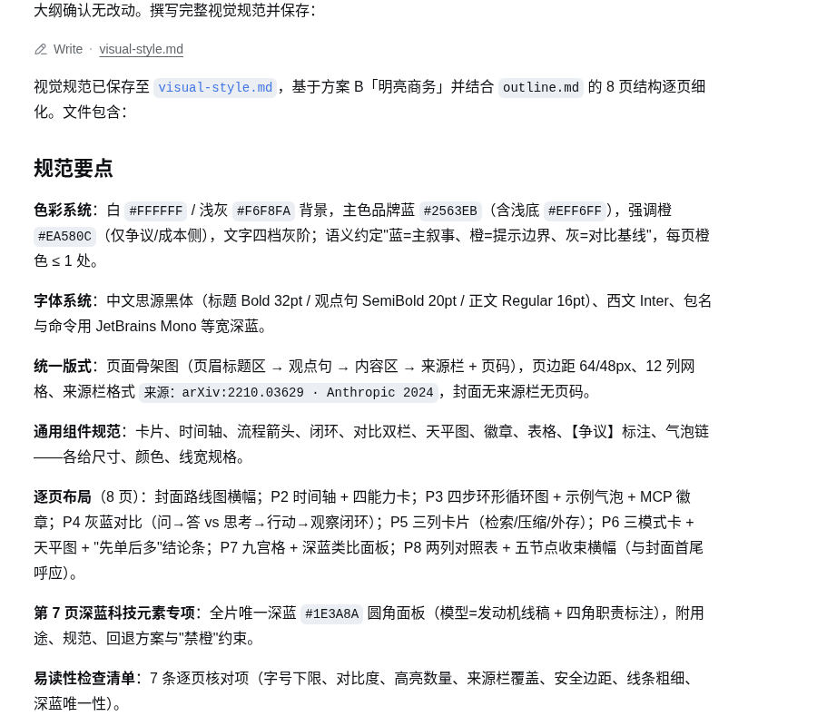

### 调用 Skill 生成整套幻灯片

#### 安装 PPT 生成 Skill

DSH 已经准备好了内容简报、参考资料、大纲和视觉规范，最后需要一套生成 PPTX 的具体方法。本章采用 MiniMax-AI 提供的 `pptx-generator` Skill。继续在当前会话中输入：

```text
请安装下面的 PPT 生成 Skill：

https://github.com/MiniMax-AI/skills/tree/main/skills/pptx-generator

将它安装到当前工作区，供 DSH 后续会话使用。安装完成后检查相关文件
是否齐全，并告诉我安装位置。暂不生成 PPT。
```

本次运行中，DSH 将 Skill 的说明文件和配套参考资料保存到当前工作区的 `.dsh/skills/pptx-generator/`。看到 `SKILL.md` 和 5 个 `references` 文件均通过检查，说明安装已经完成。

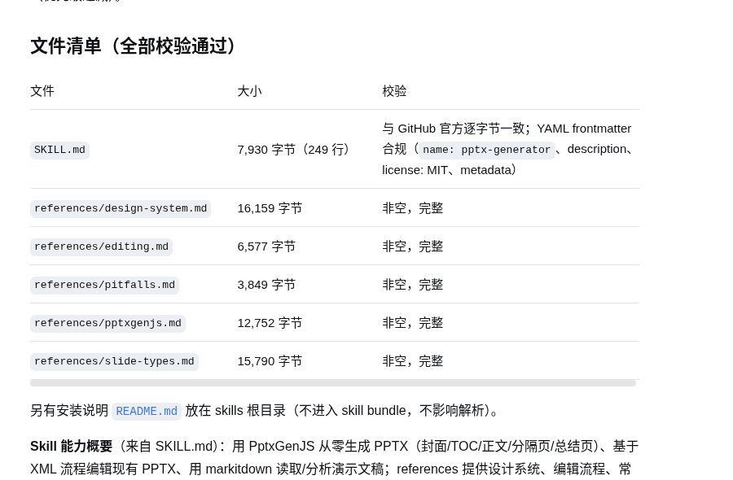

#### 开始生成演示文稿

Skill 安装完成后，单击左侧的 **New Session**，在当前工作区新建一个会话。输入：

```text
请使用 pptx-generator Skill，读取 research-brief.md、references.md、
outline.md 和 visual-style.md，生成《从大语言模型到智能体》8 页演示文稿。

请按照大纲和视觉规范制作，标注资料来源，生成预览并使用 ModLens 检查
页面。缺少依赖时自行安装。保留源文件，并将成品保存为：

slides/output/从大语言模型到智能体.pptx
```

本次运行中，DSH 先读取前面准备的四个文件，再按照 Skill 中的制作方法生成页面源文件和 PPTX，最后把每一页导出为预览图交给 ModLens 检查。生成期间，可以从会话中的任务状态观察当前进度。

#### 观察页面检查和修改

第一版生成后，DSH 先提取 PPTX 中的文字，检查页面数量、正文、来源栏和页码是否齐全；接着把幻灯片转换为预览图，并调用 ModLens 逐页读取。

如下图所示，ModLens 在第一轮检查中发现了文字换行、时间轴标签被截断、循环箭头与节点重叠等问题。DSH 根据检查结果修改对应的页面源文件，然后重新生成并再次检查。

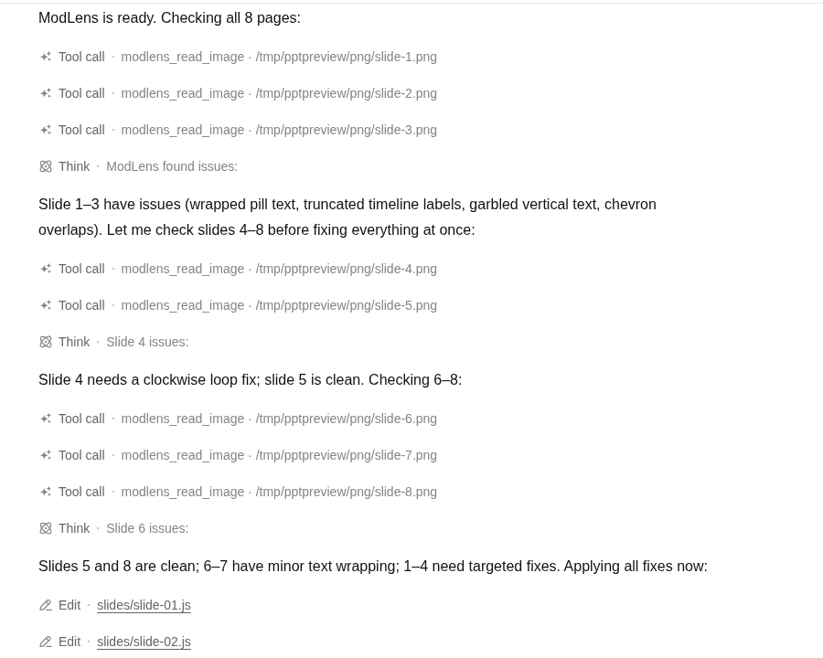

本例共修正了封面胶囊文字换行、时间轴标签截断、竖排文字显示异常、循环图重叠、箭头方向和局部文字拥挤等问题。第二轮检查结束后，8 页预览均通过。

#### 查看生成结果

任务结束时，DSH 给出了最终文件位置，并汇总了制作过程、页面结构、检查结果和保留的源文件。

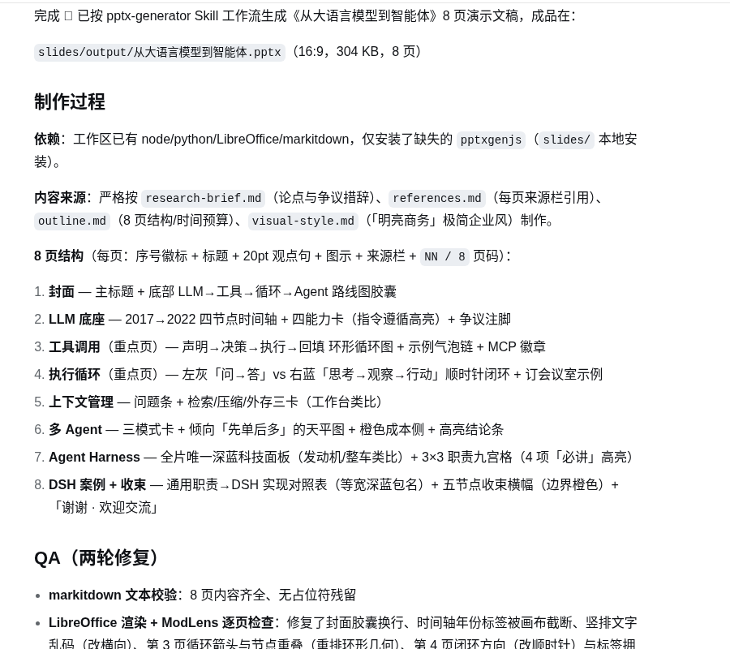

工作区中的主要产物如下：

```text
slides/
├── slide-01.js ... slide-08.js    8 页源文件
├── theme.js                       主题配置
├── helpers.js                     共用组件
├── compile.js                     重新生成 PPTX 的脚本
├── imgs/preview/                  8 张页面预览图
└── output/
    └── 从大语言模型到智能体.pptx   最终成品
```

下面展示了封面、工具调用、多 Agent 协作和 DeepSeek Harness 案例 4 张代表性页面。它们使用相同的标题位置、蓝色主色和来源栏，同时根据内容采用路线图、循环图、对比图和表格等不同版式。

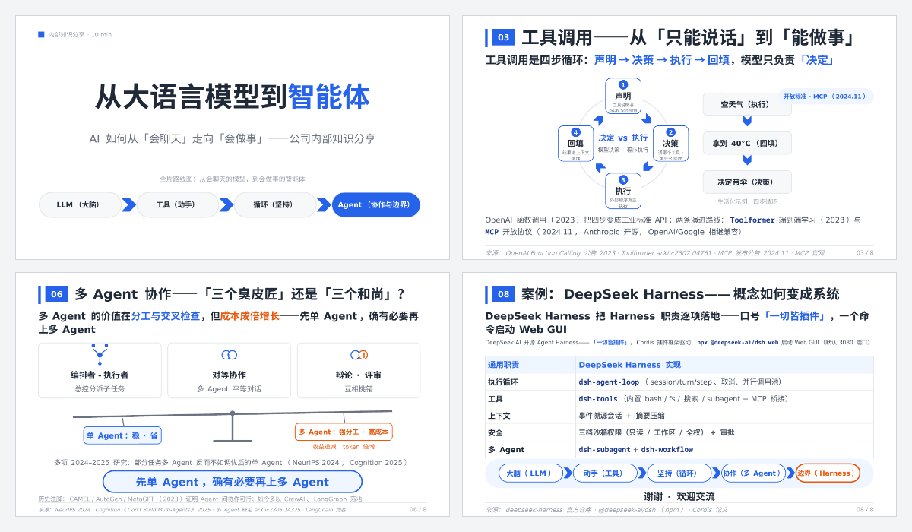

最后打开 `slides/output/从大语言模型到智能体.pptx`，确认文件能够正常播放，文字、图形和来源栏在 PowerPoint 或 Keynote 中显示完整。需要修改内容时，可以让 DSH 编辑对应的 `slide-01.js` 至 `slide-08.js`，再运行 `compile.js` 重新生成 PPTX。

## 阅读和整理 PDF {#sec-5-4}
