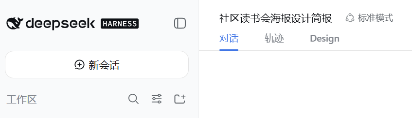
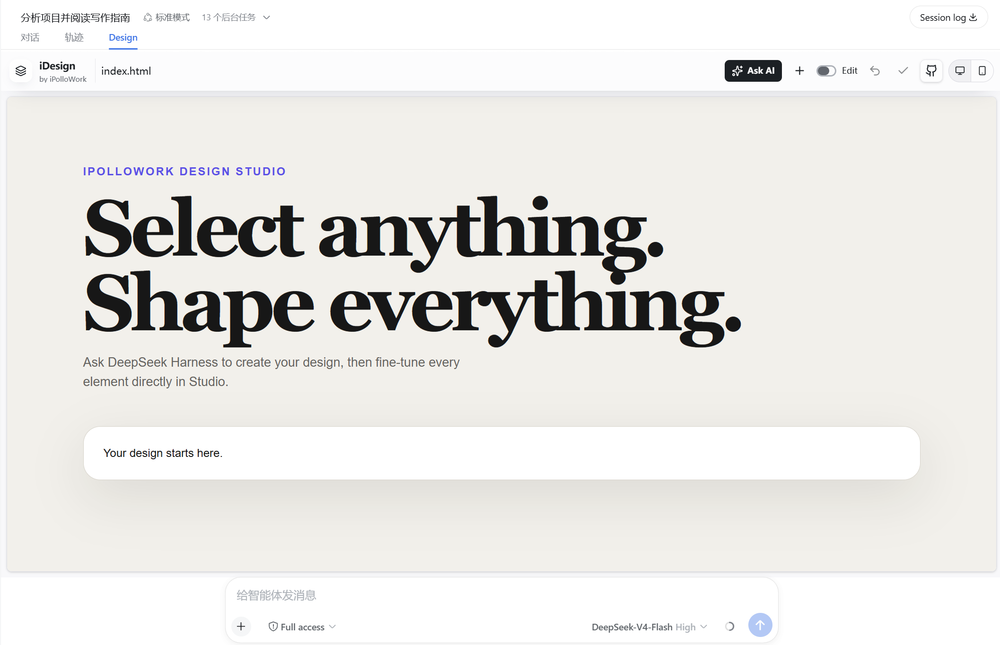
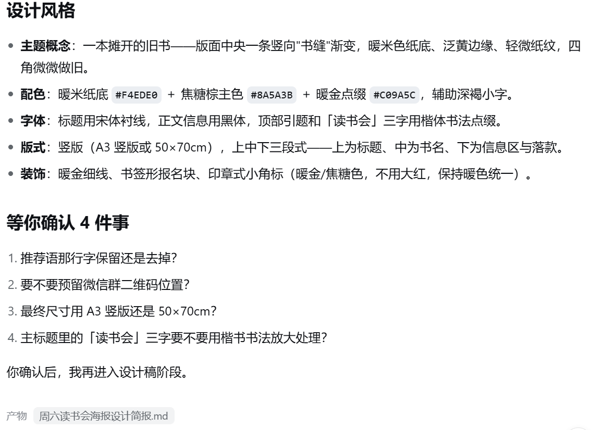
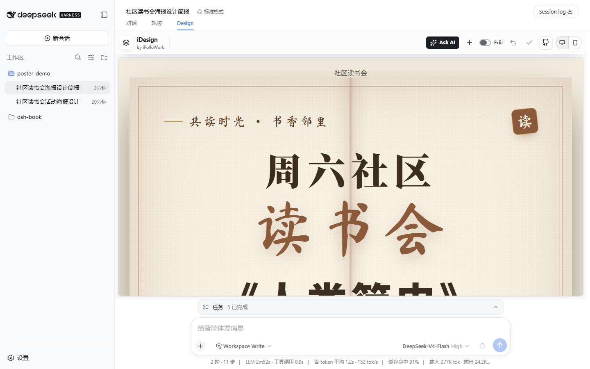
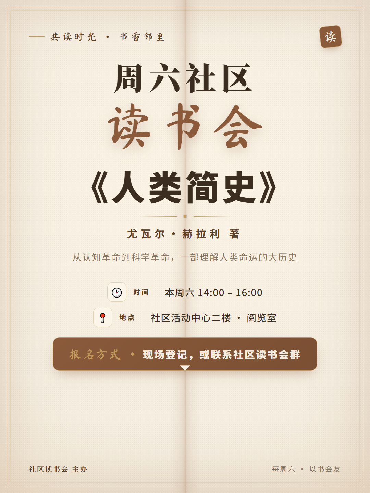
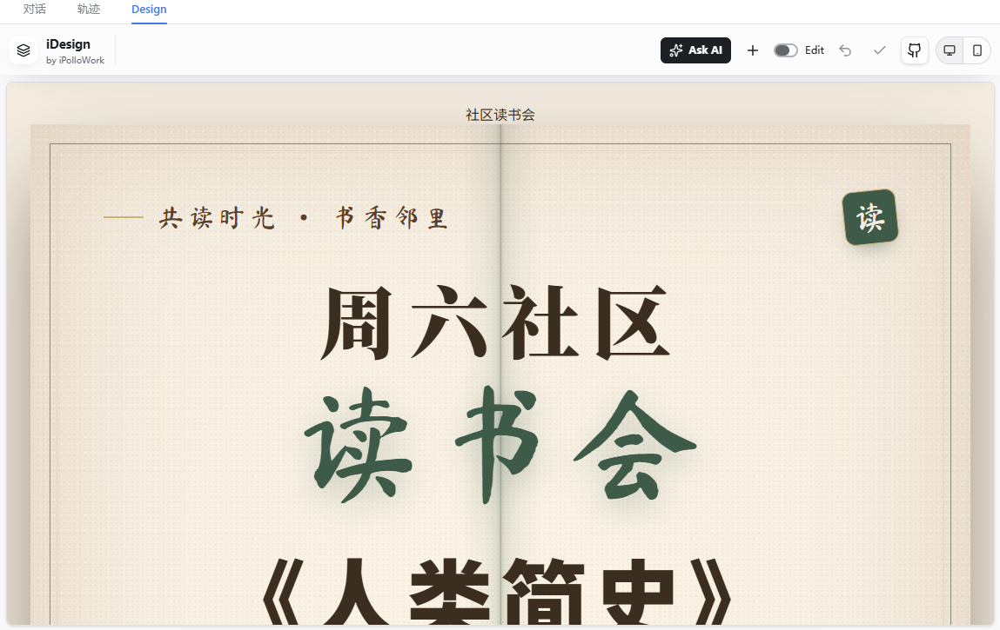
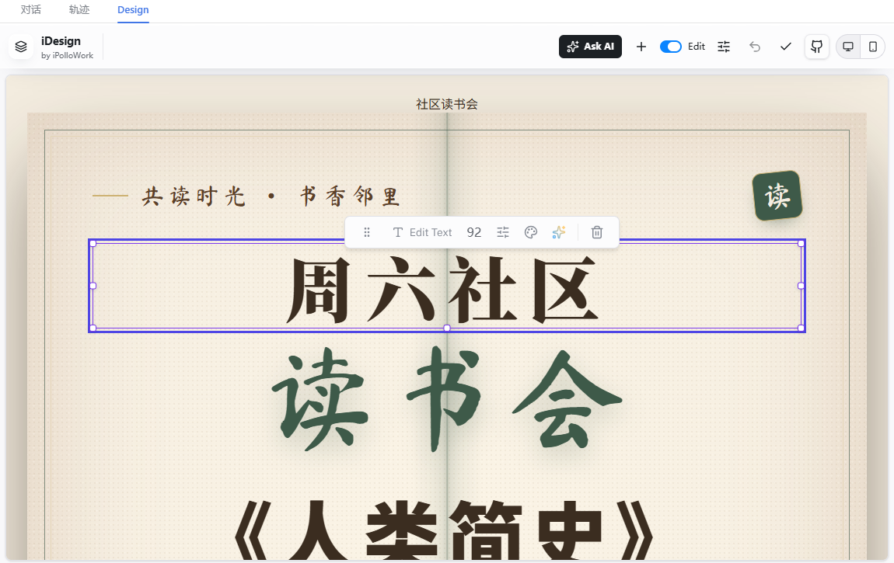
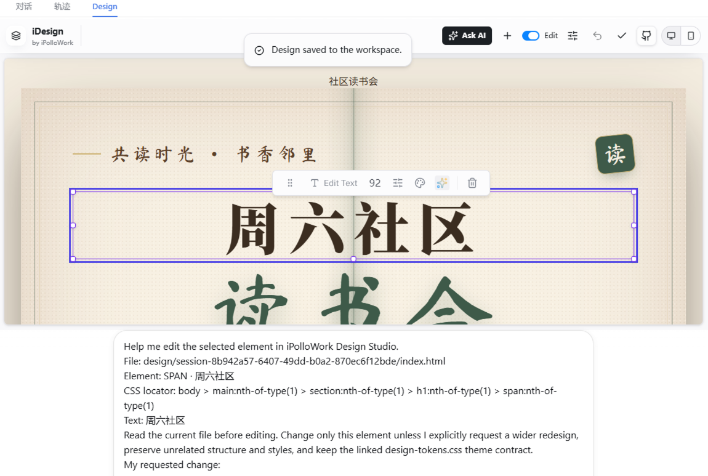

# 让 dsh 设计活动海报 {#ch-6}

前几章的任务主要生成文档、表格和演示文稿。本章转向活动海报设计，介绍 dsh 在可视化设计任务中的基本工作流程。此类任务需要同时支持设计文件生成、画布预览和元素修改。Design 插件（deepseek-idesign，由 iPolloWork 发布）能够在会话中增加独立的设计视图，并将模型生成的文件实时渲染到画布中。该插件适用于网站、App 原型和海报等设计任务，其安装方式与第 4 章使用的 ModLens 插件相同。完成本章后，读者将获得一张可继续编辑和导出的社区读书会海报。

## 安装并打开 Design 插件 {#sec-6-1}

本节依次完成插件安装、工作区创建和 Design 视图打开。前两项用于准备运行环境，Design 视图则用于预览和编辑海报。

### 认识 Design 插件

Design 插件提供一种对话视图。安装后，会话标题栏下方会增加 Design 标签。该标签对应一个名为 Studio 的独立工作台，模型生成的设计文件会在其中实时渲染，画布元素也可以直接点选和修改。

Design 插件将设计项目保存为一组实际文件，并统一存放在工作区的 `design/` 目录下。dsh 可以继续读取和修改这些文件，设计结果也会保留在工作区中，便于后续调整。该管理方式与第 4 章生成可编辑演示文稿的思路一致。

### 安装插件并重启

Design 插件通过 `dsh plugin` 命令安装到 Web 档案。打开终端并运行：

```sh
npx -y @deepseek-ai/dsh plugin --profile web add deepseek-idesign
```

该命令与第 4 章安装 ModLens 时使用相同入口，包名为 `deepseek-idesign`。安装完成后，重新启动 dsh Web 服务，使插件生效：

```sh
npx -y @deepseek-ai/dsh web
```

服务启动后，在浏览器中重新打开 `http://127.0.0.1:3080`。

### 新建工作区和会话

为本章任务创建独立工作区。单击左侧的 **Add workspace**，新建一个空文件夹，例如 `poster-demo`，再在该工作区中创建会话。Design 视图只在会话产生消息后显示；空会话仅显示输入框，不显示视图切换标签。发送第一条消息后，会话标题栏下方会显示“对话”“轨迹”和 **Design** 三个标签。



### 打开 Design 视图

“轨迹”用于查看第 1 章介绍过的原始执行日志。单击 **Design** 后，会话主区域切换为独立画布，左上角显示 iDesign，即 DeepSeek Design 的 Studio 工作台。

{width=88%}

## 准备文案和参考风格 {#sec-6-2}

生成海报前，需要明确文案内容和视觉风格。活动名称、时间、地点、主办方及报名方式会直接影响信息层级和版面安排；配色、字体与整体气质则决定视觉表达。将这些要求写入提示词，可以为后续设计提供明确约束。

### 整理活动信息

本节以社区读书会为例，活动信息如下：

| 项目 | 内容 |
| --- | --- |
| 活动名称 | 周六社区读书会 |
| 本期共读 | 《人类简史》（尤瓦尔·赫拉利） |
| 活动时间 | 本周六 14:00 到 16:00 |
| 活动地点 | 社区活动中心二楼 · 阅览室 |
| 主办方 | 社区读书会 |
| 报名方式 | 现场登记，或联系社区读书会群 |

### 提出风格要求

本例采用温暖、具有书卷感的视觉风格，以适应社区读书会的活动氛围。海报使用暖米色纸张作为背景，以焦糖棕为主色，并以暖金色点缀。标题采用宋体系衬线字体，正文使用黑体，局部可使用楷体作为装饰。版式确定为竖版。

风格描述应尽量具体。明确配色、字体、整体气质和版式，可以减少模型对设计方向的推测，使生成结果更接近预期。

### 查看设计简报

在输入框中一次性提交活动信息和风格要求，并要求 dsh 先整理设计简报，暂不生成设计稿：

> <span class="prompt-title">提示词内容：</span>
>
> 我要为社区读书会设计一张周六活动的海报，请你先帮我整理海报的文案和设计风格，先不要生成设计稿。
>
> 活动信息：
> 活动名称：周六社区读书会
> 本期共读：《人类简史》（尤瓦尔·赫拉利）
> 活动时间：本周六 14:00 到 16:00
> 活动地点：社区活动中心二楼 · 阅览室
> 主办方：社区读书会
> 报名方式：现场登记，或联系社区读书会群
>
> 风格要求：温暖书香，像一本摊开的旧书，适合社区邻里文化氛围；配色用暖米色纸张底、焦糖棕主色、暖金点缀；标题用宋体系衬线，正文黑体，可以加一点楷体书法点缀；版式要竖版海报。
>
> 请把整理好的文案和风格说明整理成一份设计简报，告诉我你打算在海报上放哪些文字、用什么风格。

收到指令后，dsh 会先核对活动信息，再生成设计简报并保存为工作区中的 Markdown 文件，同时在回复中概括主要内容。



简报包含活动信息核对表、海报文案和设计风格说明，并列出推荐语、二维码位置及最终尺寸等待确认事项。进入设计阶段前，应先逐项确认这些内容，避免在版面生成后重复调整基础信息。

## 生成并调整设计稿 {#sec-6-3}

### 确认方案并生成初稿

简报确认后，在当前会话中补充待确认事项，并让 dsh 生成设计稿。输入如下提示词：
> <span class="prompt-title">提示词内容：</span>
>
> 简报内容我确认了，推荐语保留，不需要二维码位置，尺寸用 1080×1440 竖版。

dsh 会按照 Design 项目的格式，将文件写入工作区的 `design/<会话ID>/` 目录。目录包括四个文件：`manifest.json` 是项目清单，用于声明项目类型、入口文件和可编辑的设计变量。`design-tokens.css` 保存主题令牌，将背景色、文字色、主色、字体和间距定义为 CSS 变量，后续可以集中调整。`index.html` 包含海报正文和版面结构。`brief.json` 是设计简报的机器可读版本，用于记录文案与风格决策。

文件生成后，切换到会话的 Design 视图，即可在画布中查看渲染结果。



### 查看初稿效果

竖版画布顶部显示引题“共读时光 · 书香邻里”，并使用楷体作为局部装饰；中部依次排列宋体主标题“周六社区读书会”和书名《人类简史》；下方展示推荐语、时间、地点、报名方式和主办方。初稿采用简报中确定的暖米色背景、焦糖棕主色与暖金色点缀，并通过双线边框和纸张颗粒表现旧书质感。

{width=62%}

### 调整配色和文案

生成初稿后，可根据预览结果调整配色和文案。本例将主色由焦糖棕改为墨绿色，点缀色改为淡金色；报名信息改为“现场登记或联系社区读书会群报名”，并提高该信息的视觉层级。在当前会话中输入：

> <span class="prompt-title">提示词内容：</span>
>
> 设计稿整体不错，我想做两处调整：
> 1. 把主色调从焦糖棕换成墨绿色（更沉静的书卷气），点缀色改成淡金色；
> 2. 报名方式的文字改成"现场登记或联系社区读书会群报名"，并且把这一行做得更醒目一点。

dsh 会读取 `design` 目录下的 `design-tokens.css` 和 `index.html`，修改颜色变量与报名文案，并将结果写回原文件。

### 对比调整结果

返回 Design 视图，可以查看更新后的配色和版面。



对比调整前后的结果，主色由暖调焦糖棕变为冷调墨绿，点缀色由暖金变为淡金，整体视觉倾向更加沉静。报名文案已经更新，其字号和对比度也有所提高。对于配色、文案等整体调整，可以继续通过对话提出要求；dsh 修改文件后，画布会同步刷新。

### 用 Edit 直接精调画布

对话方式适合涉及多个元素的整体调整。若只需修改某个标题的字号或单行文字的颜色，可以使用 Design 视图中的 **Edit** 功能直接定位元素，减少对元素位置的额外描述。

Edit 开关位于 Studio 工具栏的 Ask AI 按钮旁。单击开关后，画布进入编辑模式。将鼠标移至海报并选择目标元素，例如主标题“周六社区”，画布会标出该元素，并显示浮动工具栏。

{width=82%}

浮动工具栏提供单个元素的常用操作。第一个按钮用于编辑文字，单击后会显示包含当前文本的输入框，修改并按回车即可替换。其余按钮可调整字号、文字颜色、字体、间距和背景，工具栏末端还提供 Ask AI 和删除功能。

选中元素后单击 Ask AI，插件会将文件路径、元素定位、当前文字和修改指引整理为草稿，并填入会话输入框。该操作不会自动发送消息。检查草稿并补充具体修改要求后，再单击发送。借助这些上下文信息，dsh 可以准确定位需要修改的元素。

{width=82%}

本节使用了两种修改方式。涉及整体风格和多项内容时，可以在会话中提出要求；涉及单个元素时，可以使用 Edit 功能精确调整。两种方式操作的是工作区中的同一组文件，可根据修改范围选择。

## 导出最终作品 {#sec-6-4}

设计稿确认后，需要将海报导出为便于发布或打印的文件。

### 认识设计项目文件

Design 项目保存在工作区的 `design/<会话ID>/` 目录中，其中 `index.html` 是完整的海报页面。导出过程将该页面转换为可分发或打印的图片、PDF 文件。

打开工作区的 `design/` 目录，可以看到本次设计生成的四个文件。其中，`index.html` 是海报页面，`design-tokens.css` 包含主题样式，`manifest.json` 是项目清单，`brief.json` 对应设计简报。这些文件共同构成完整的设计项目，可用于复制、备份和后续编辑。

### 导出成品图片

可以在浏览器中打开海报的 `index.html`。该页面按照 1080×1440 的竖版尺寸排版，将浏览器窗口调整为相同比例后，页面中的海报区域即为完整画面。可通过截图将其保存为 PNG，也可以打开打印对话框，选择“另存为 PDF”导出 PDF 文件。

本例使用无头浏览器渲染海报页面并导出 PNG，结果如下：

{width=62%}

最终文件包含主标题、书名、时间、地点、报名方式和主办方等全部信息，配色采用调整后的墨绿色与淡金色，画布保持 1080×1440 的竖版比例，可用于社区公告栏张贴或线上发布。
