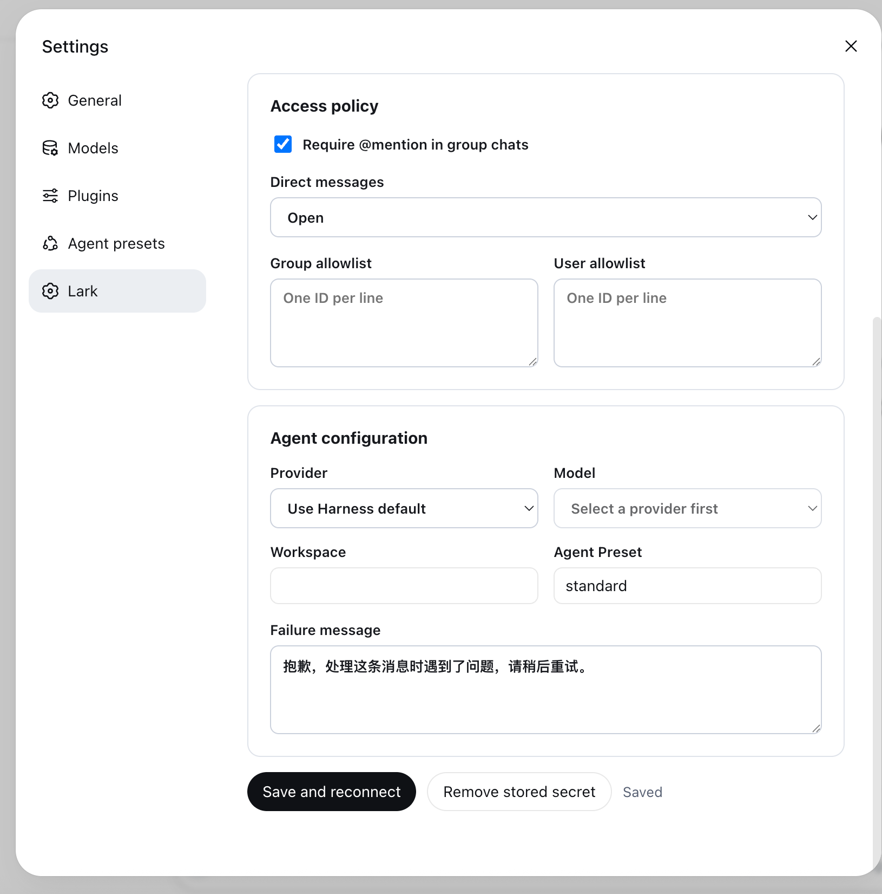
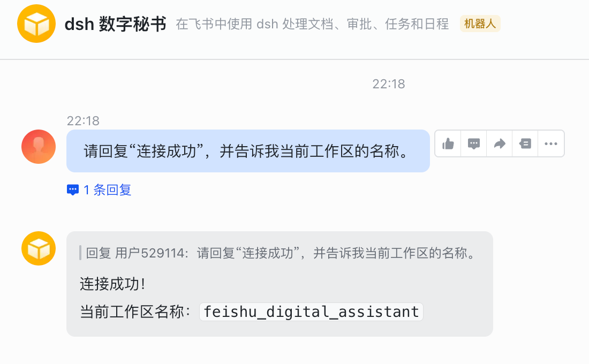
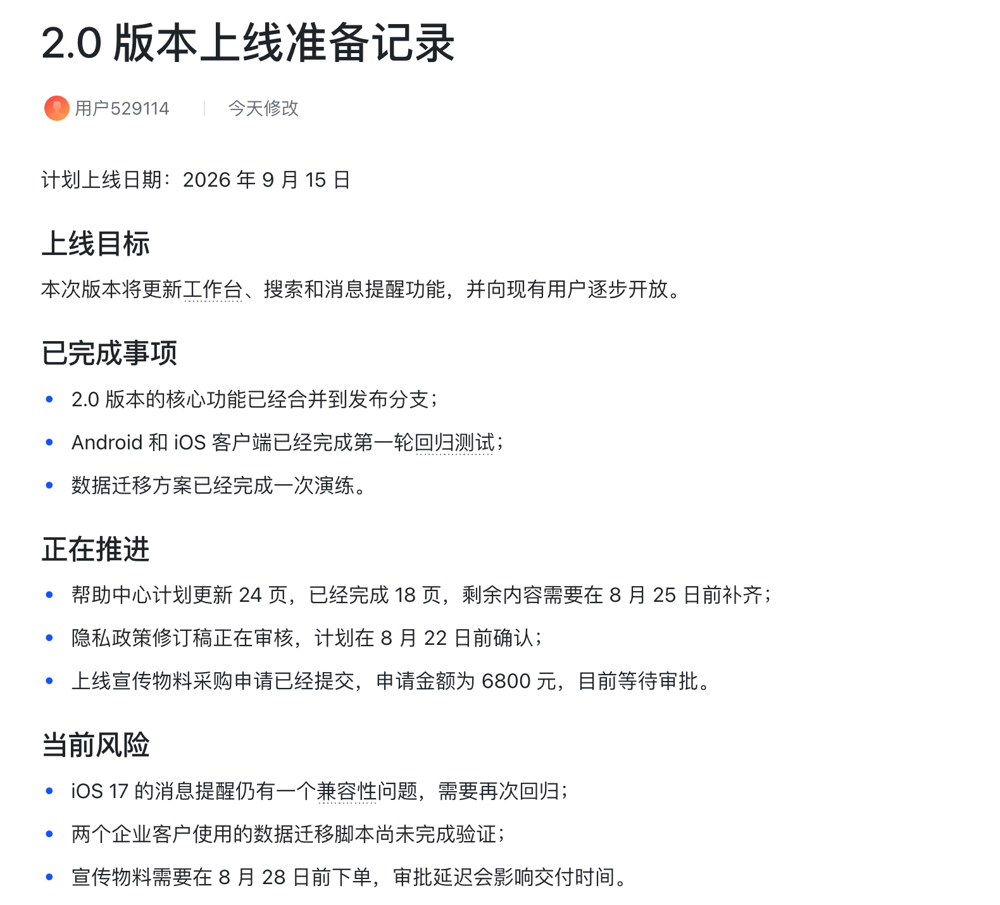
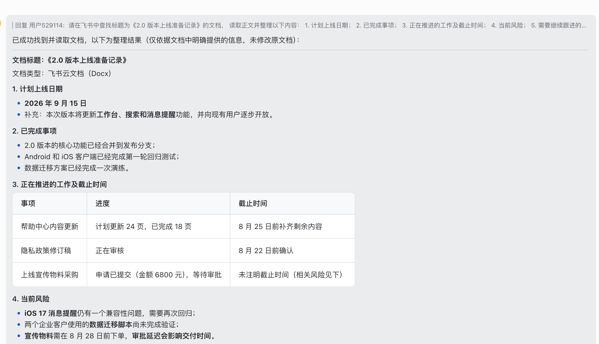
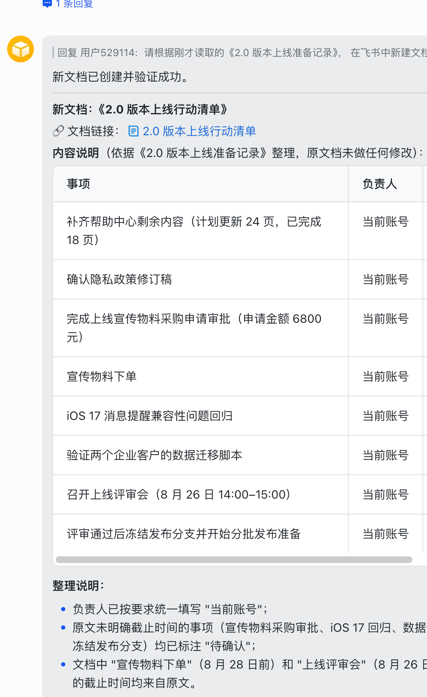
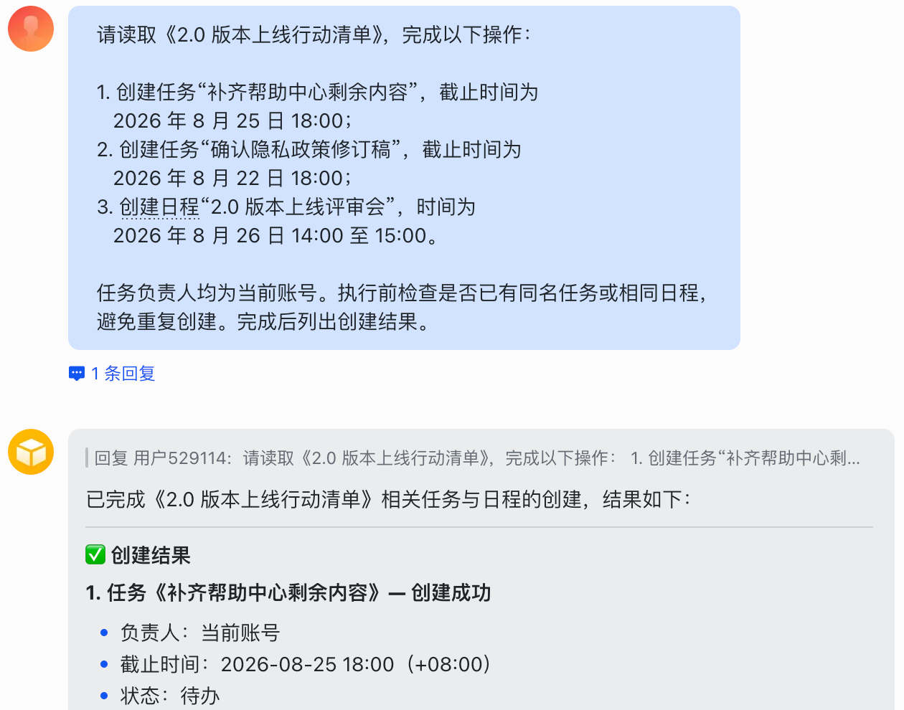
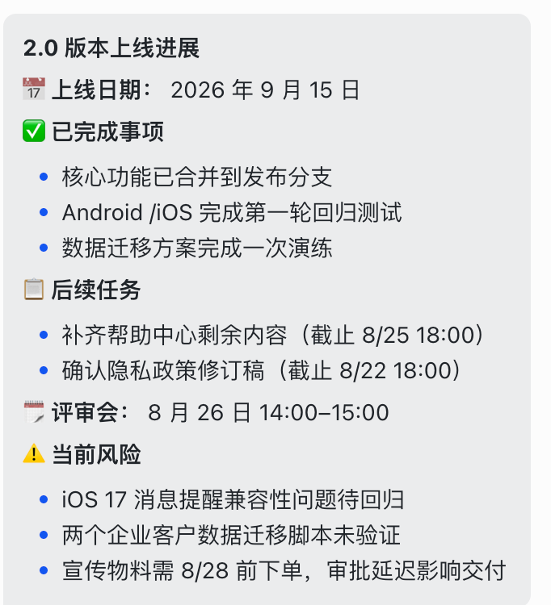
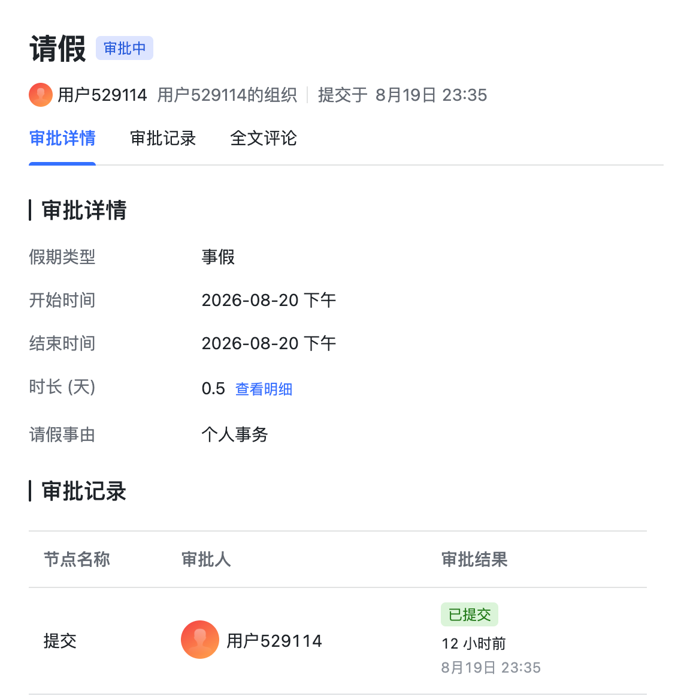

# 让 dsh 成为飞书里的数字秘书 {#ch-6}

将 dsh 接入飞书后，可以直接在聊天窗口中让它读取文档并整理要点、根据文档生成行动清单、创建任务和安排日程、汇总进展并发送消息，以及处理审批流程。

本章以一次虚构的产品版本上线准备为例。我们先让 dsh 读取项目记录并整理要点，再生成一份行动清单。随后，它会建立后续任务和评审日程，把最新进展发送给当前账号，并发起一条请假审批。

## 连接并授权飞书 {#sec-6-1}

本节要建立两条连接。`dsh-lark` 插件负责接收飞书消息，并把 dsh 的回答发回当前会话。飞书官方 CLI 让 dsh 可以读写文档、创建任务和日程、发送消息，以及发起审批。

### 创建专用工作区

在本地新建文件夹 `feishu_digital_assistant`，然后在 dsh 中将它添加为工作区。

### 创建飞书应用

打开飞书开放平台开发者后台：

```text
https://open.feishu.cn/app
```

创建一个企业自建应用，并添加“机器人”能力。接着进入“权限管理”，单击“批量开通权限”，粘贴以下 JSON：

```json
{
  "scopes": {
    "tenant": [
      "im:message.group_at_msg:readonly",
      "im:message.p2p_msg:readonly",
      "im:message:send_as_bot"
    ],
    "user": []
  }
}
```

确认导入后，应用便可以接收单聊消息、接收群聊中 @机器人的消息，并以机器人身份发送回复。

进入“事件与回调”，在订阅方式处选择“使用长连接接收事件”，并添加 `im.message.receive_v1`。保存设置后创建应用版本，将应用发布到当前测试企业。应用尚未发布时，新权限和事件订阅不会在机器人中生效。

### 安装并配置连接插件

在终端中运行：

```bash
npx @deepseek-ai/dsh plugin --profile web add @sugarforever/dsh-lark
```

安装完成后重新启动 dsh。打开“设置 → 飞书与 Lark”，完成以下设置：

- App ID：填写飞书应用的 App ID，
- App Secret：填写飞书应用的 App Secret，
- 域名：选择 `feishu`，
- Workspace：留空时使用 dsh 工作区列表中的第一个工作区，如需指定工作区，填写该工作区的绝对路径，
- Agent Preset：填写 `standard`，
- 单聊策略：选择开放，
- 群聊需要 @机器人：保持开启。

完成设置后，单击“Save and reconnect”保存并重新连接。

{width=58%}

在飞书中打开机器人，发送一条测试消息。

> <span class="prompt-title">提示词内容：</span>
>
> 请回复“连接成功”，并告诉我当前工作区的名称。

机器人返回“连接成功”和工作区名称，如图 5-2 所示，表示飞书消息已经可以交给 dsh 处理。

{width=72%}

### 安装并配置飞书 CLI

继续在终端中运行：

```bash
npx @larksuite/cli@latest install
```

命令启动交互式安装程序。选择中文后，等待 CLI 和飞书 Skills 安装完成。终端随后会给出一个配置链接，用浏览器打开该链接，并选择前面创建的“dsh 数字秘书”应用。

返回终端，在“是否允许 AI 访问……”一项中选择 `Yes`。进入业务域列表后，用空格键勾选以下六项，再按回车确认：

- `approval`，
- `calendar`，
- `docs`，
- `drive`，
- `im`，
- `task`。

确认业务域后，终端会给出用户授权链接。用浏览器打开该链接并确认授权。页面提示可以返回 CLI 时，飞书 CLI 就已配置完成。后续使用某项能力时，如果仍缺少具体权限，dsh 会在对话中给出临时授权链接。打开链接并确认后，即可继续原来的任务。

## 读取文档并整理要点 {#sec-6-2}

项目组已经在飞书中建立《2.0 版本上线准备记录》，其中包含上线日期、完成情况、当前风险和后续安排，如图 5-3 所示。本节让 dsh 查找并读取这份文档，再整理出便于检查的摘要。

{width=66%}

### 让 dsh 整理文档

在飞书中打开数字秘书机器人。

> <span class="prompt-title">提示词内容：</span>
>
> 请在飞书中查找标题为《2.0 版本上线准备记录》的文档，
> 读取正文并整理以下内容：
>
> 1. 计划上线日期，
> 2. 已完成事项，
> 3. 正在推进的工作及截止时间，
> 4. 当前风险，
> 5. 需要继续跟进的行动。
>
> 请注明读取到的文档标题，只整理文档中明确提供的信息，
> 不要修改原文档。

dsh 会先按标题查找文档，再读取正文并组织摘要。回复中可以看到计划上线日期、已完成事项、三项当前风险，以及帮助中心内容、上线评审会等后续行动，如图 5-4 所示。

{width=92%}

## 根据文档生成行动清单 {#sec-6-3}

聊天中的摘要便于快速查看，后续协作还需要一份可以共享和继续编辑的清单。继续使用当前对话。

> <span class="prompt-title">提示词内容：</span>
>
> 请根据刚才读取的《2.0 版本上线准备记录》，
> 在飞书中新建文档《2.0 版本上线行动清单》。
> 请按“事项、负责人、截止时间、当前状态”整理后续工作。
> 负责人统一填写“当前账号”，原文没有明确截止时间时，请标注“待确认”。
> 不要修改原文档。完成后返回新文档链接。

dsh 会根据上一轮读取的内容创建新文档，并在回复中给出文档链接和行动清单预览，如图 5-5 所示。原来的上线准备记录不会改变。

{width=42%}

## 创建任务和安排日程 {#sec-6-4}

行动清单中有两项工作写明了截止时间，文档中还安排了上线评审会。让 dsh 把这些内容写入飞书任务和日历。

> <span class="prompt-title">提示词内容：</span>
>
> 请读取《2.0 版本上线行动清单》，完成以下操作：
>
> 1. 创建任务“补齐帮助中心剩余内容”，截止时间为
>    2026 年 8 月 25 日 18:00，
> 2. 创建任务“确认隐私政策修订稿”，截止时间为
>    2026 年 8 月 22 日 18:00，
> 3. 创建日程“2.0 版本上线评审会”，时间为
>    2026 年 8 月 26 日 14:00 至 15:00。
>
> 任务负责人均为当前账号。执行前检查是否已有同名任务或相同日程，
> 避免重复创建。完成后列出创建结果。

dsh 完成操作后，会在回复中列出两项任务和一项日程的创建结果，如图 5-6 所示。

{width=68%}

打开其中一项任务，可以核对负责人和截止时间，如图 5-7 所示。

{width=74%}

## 汇总进展并发送消息 {#sec-6-5}

最后，让 dsh 汇总本次操作产生的文档、任务和日程，并通过飞书发送给当前账号。

> <span class="prompt-title">提示词内容：</span>
>
> 请汇总《2.0 版本上线准备记录》、刚创建的任务和评审日程，
> 生成一条简短的上线进展消息。
>
> 消息需包含上线日期、已完成事项、后续任务、评审会时间和当前风险。
> 请将消息发送给当前账号，不要只提供草稿。完成后告诉我发送结果。

当前账号会收到一条“2.0 版本上线进展”消息，其中列出了两项后续任务的截止时间、评审会时间和三项当前风险，如图 5-8 所示。

{width=44%}

## 处理审批流程 {#sec-6-6}

本节使用飞书中名为“请假”的审批模板。当前组织没有该模板时，需要先由管理员在飞书审批管理后台创建并启用。然后向数字秘书发送以下内容。

> <span class="prompt-title">提示词内容：</span>
>
> 请在飞书中查找名为“请假”的审批模板，并发起以下申请：
> 假期类型：事假
> 开始时间：2026 年 8 月 20 日 14:00
> 结束时间：2026 年 8 月 20 日 18:00
> 请假事由：个人事务
> 审批人：当前账号
> 请先读取审批定义并检查必填项。

dsh 会读取审批定义，填写申请内容并发起审批。回复出现“事假审批已成功发起”，如图 5-9 所示。

{width=60%}

在飞书审批中打开该申请，可以核对假期类型、日期、请假事由和当前状态，如图 5-10 所示。

{width=56%}

至此，数字秘书已经完成文档读取、行动清单整理、任务和日程创建、进展消息发送与审批发起。后续仍可在同一飞书会话中继续交代新的工作。
