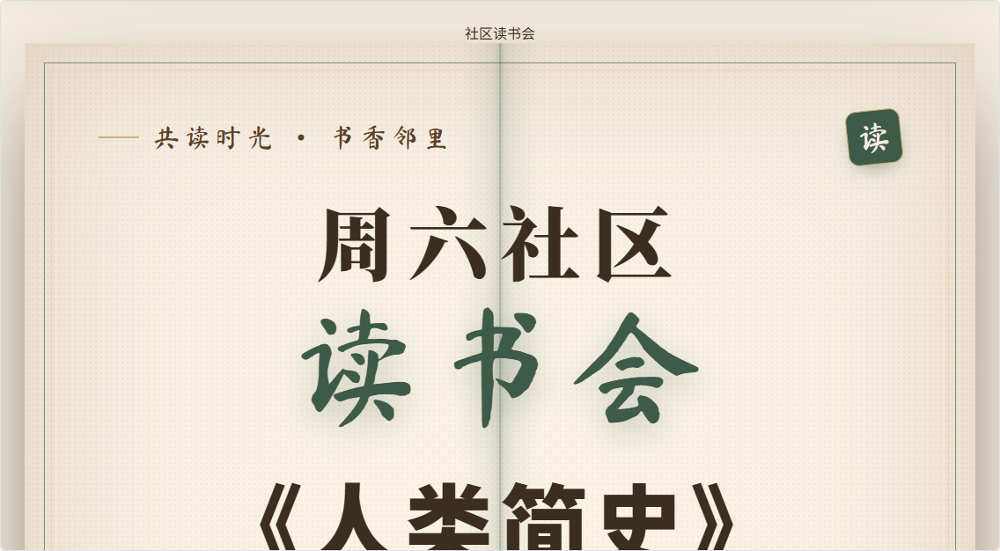
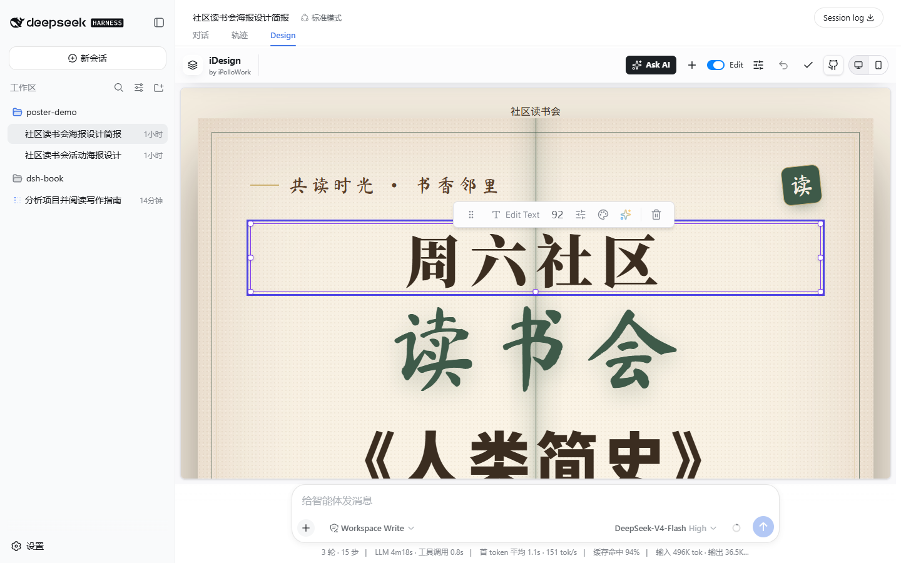
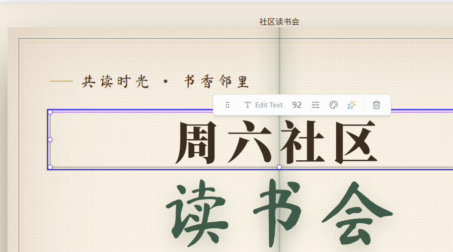
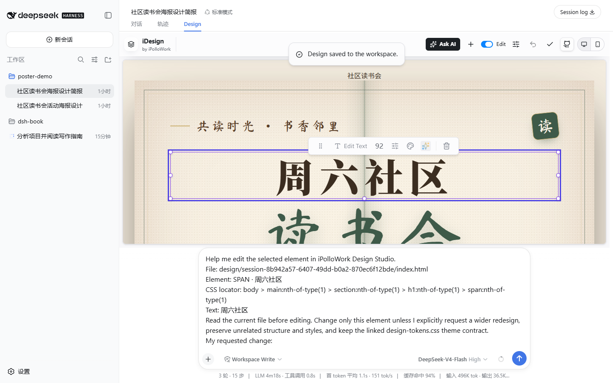

# 让 dsh 设计活动海报 {#ch-6}

前面几章让 DSH 干的活，产出都是文档、表格、幻灯片这类办公文件。这一章换一件事，让 DSH 设计一张活动海报。设计海报需要一套能生成、能预览、能改的界面。DSH 的插件生态里有一类"设计工作台"插件，在对话界面里加一个独立的设计视图，模型生成的文件在画布里实时渲染，还能点选元素继续修改。这一章用的就是其中一个，名字叫 **Design**（deepseek-idesign，由 iPolloWork 发布），专门做网站、App 原型、海报这类设计。它跟第 4 章装视觉插件 ModLens 走的是同一条路，装好重启，对话里就多出一个 Design 视图。

## 安装并打开 Design 插件 {#sec-6-1}

这一节做三件事，装插件、建工作区、打开 Design 视图。前两件是准备工作，第三件做完，画布就摆到眼前了。

### 认识 Design 插件

动手之前，先弄清楚 Design 插件到底给 DSH 加了什么。它是个**对话视图**，装好之后，会话标题栏下面会多出一个叫 Design 的标签，点进去是一块独立的画布，模型生成的设计文件在画布里实时渲染。这个画布叫 Studio，是 DeepSeek Design 的工作台，可以点选画布里的元素继续修改。

Design 插件把设计项目当成一组真实文件来管理，存放在工作区的 `design/` 目录下。DSH 可以继续读取和修改这些文件，成果也会留在工作区里，方便以后接着调整。这一点跟第 4 章做 PPT 的思路一致。

### 安装插件并重启

Design 插件通过 `dsh plugin` 命令安装到 web 档案。打开终端，输入下面的命令。

```sh
npx -y @deepseek-ai/dsh plugin --profile web add deepseek-idesign
```

这条命令跟第 4 章装 ModLens 用的是同一个入口，把包名换成 `deepseek-idesign` 就行。安装完成，重启 dsh web 让插件生效。

```sh
npx -y @deepseek-ai/dsh web
```

重启之后，浏览器重新打开 http://127.0.0.1:3080。

### 新建工作区和会话

先单独建一个工作区。在左侧点 **Add workspace**，新建一个空文件夹，比如 `poster-demo`。在这个工作区下新建一个会话。设计视图要等会话开始运转之后才会出现（这是 DSH 的规则，空会话只显示输入框，不显示任何视图切换）。发完消息，会话标题栏下面就会出现一排标签，默认是"对话"，旁边多出了"轨迹"和 **Design** 两个。


### 打开 Design 视图

"轨迹"是第 1 章看过的原始执行日志，Design 就是这一章的主角。点一下 **Design**，会话主区域会切换成一个独立的画布界面，左上角写着 iDesign，这就是 DeepSeek Design 的 Studio 工作台。


## 准备文案和参考风格 {#sec-6-2}

设计海报之前，先把两样东西定下来。一是海报上到底放哪些文字，活动名、时间、地点、主办方、报名方式，多一条少一条直接影响版面；二是整体风格，是活泼还是沉稳，用什么配色。这两样在聊天里说清楚，模型才有依据动手。

### 整理活动信息

这一节用一场社区读书会做例子。活动信息如下：

| 项目 | 内容 |
| --- | --- |
| 活动名称 | 周六社区读书会 |
| 本期共读 | 《人类简史》（尤瓦尔·赫拉利） |
| 活动时间 | 本周六 14:00 到 16:00 |
| 活动地点 | 社区活动中心二楼 · 阅览室 |
| 主办方 | 社区读书会 |
| 报名方式 | 现场登记，或联系社区读书会群 |

### 提出风格要求

现在需要确定海报风格。社区读书会的风格要跟活动调性相配：温暖书香，像一本摊开的旧书，适合社区邻里氛围。配色用暖米色纸张底、焦糖棕主色、暖金点缀，标题用宋体系衬线，正文黑体，可以加一点楷体书法点缀，版式要竖版海报。

风格描述越具体越好。只说“好看一点”模型没有方向，说清楚配色、字体、气质，模型才能把视觉语言落到设计稿里。

### 查看设计简报

在输入框里把这些内容一次性发给 DSH，并且明确告诉它，先整理文案和风格，不要急着生成设计稿。

```text
我要为社区读书会设计一张周六活动的海报，请你先帮我整理海报的文案和设计风格，先不要生成设计稿。

活动信息：
活动名称：周六社区读书会
本期共读：《人类简史》（尤瓦尔·赫拉利）
活动时间：本周六 14:00 到 16:00
活动地点：社区活动中心二楼 · 阅览室
主办方：社区读书会
报名方式：现场登记，或联系社区读书会群

风格要求：温暖书香，像一本摊开的旧书，适合社区邻里文化氛围；配色用暖米色纸张底、焦糖棕主色、暖金点缀；标题用宋体系衬线，正文黑体，可以加一点楷体书法点缀；版式要竖版海报。

请把整理好的文案和风格说明整理成一份设计简报，告诉我你打算在海报上放哪些文字、用什么风格。
```

发出去之后，DSH 会先把活动信息核对一遍，然后列出一份设计简报，写进工作区的一个 Markdown 文件，再把要点贴在回复里。


简报里包含三部分：活动信息核对表、海报文案、设计风格说明。简报最后还留了几个待确认事项，比如推荐语要不要保留、要不要预留二维码位置、最终尺寸定多少。这些是模型的提问，可以不用急着回答。这一节先把方案确认下来，下一节让模型按这份简报开工。

## 生成并调整设计稿 {#sec-6-3}

简报确定后，回到对话里确认方案，随后让 DSH 生成设计稿。确认时把待确认事项一并答复。

### 确认方案并生成初稿

```text
简报内容我确认了，推荐语保留，不需要二维码位置，尺寸用 1080×1440 竖版。
```

DSH 会按 Design 项目的格式把文件写进工作区的 `design/<会话ID>/` 目录，产物如下：

```text
design/
└── <会话ID>/
    ├── manifest.json           项目清单
    ├── design-tokens.css       主题令牌
    ├── index.html              海报本体
    └── brief.json              设计简报
```

`manifest.json` 是项目清单，声明这是一份 design 类型的海报项目，入口是哪个文件，以及可编辑的设计变量。`design-tokens.css` 是主题令牌，把背景色、文字色、主色、字体、间距全部定义成 CSS 变量，之后调整颜色只需要改这一个文件。`index.html` 是海报本体，所有文字和版面都在这里。`brief.json` 是设计简报的机器可读版本，记录这次设计的文案和风格决策。

写完文件，切到会话的 Design 视图，画布里已经渲染出了海报。


### 查看初稿效果

这一版的整体效果是这样的。


竖版画布里，顶部是引题"共读时光 · 书香邻里"和楷体点缀，中间是宋体大标题"周六社区读书会"和书名《人类简史》，往下依次是推荐语、时间、地点、报名方式，落款是主办方。配色是简报里定的暖米色纸底、焦糖棕主色、暖金点缀，旧书质感的双线边框和纸张颗粒都在。

### 调整配色和文案

海报初稿通常还要调整，配色和文案是最常改的两处。这一节把主色调从焦糖棕换成墨绿色，点缀色改成淡金色；报名文字改成"现场登记或联系社区读书会群报名"，并加大这一行的视觉分量。在对话里直接说出这两条要求。

```text
设计稿整体不错，我想做两处调整：
1. 把主色调从焦糖棕换成墨绿色（更沉静的书卷气），点缀色改成淡金色；
2. 报名方式的文字改成"现场登记或联系社区读书会群报名"，并且把这一行做得更醒目一点。
```

DSH 会读取 design 目录下的 `design-tokens.css` 和 `index.html`，修改主色变量和报名文字，然后写回文件。

### 对比调整结果

回到 Design 视图，海报已经换成了新配色。




对比调整前后的两张图，主色调从暖调焦糖棕变成了冷调墨绿，点缀从暖金变成淡金，整体气质从"温暖的书房"变成了"沉静的图书馆"。报名文字更新为新文案，视觉上也更突出。配色、文案这类调整，随时可以在对话里提，DSH 改完文件，画布刷新就能看到新效果。

### 用 Edit 直接精调画布

对话调整适合整体性的改动，但有些细节，比如某个标题的字号大了半号、某行文字的颜色想单独调一下，用对话一来一回反而慢，还得让模型去猜具体是哪个元素。Design 视图提供了一个更直接的办法，打开工具栏上的 **Edit** 开关，直接在画布上点选元素修改。

Edit 开关就在 Studio 工具栏上，Ask AI 按钮的旁边，是个小滑块。点一下它，开关亮起，画布进入编辑模式。这时候把鼠标移到海报上，点一下想改的元素，比如主标题"周六社区"，画布会立刻圈出这个元素，旁边浮出一条工具栏。

{width=82%}

这条浮动工具栏集中了单个元素的常用操作。第一个按钮是编辑文字，点它会直接在工具栏里出现一个输入框，显示当前选中的文字，改完回车就替换。旁边是字号、文字颜色，再过去是高级设置，可以调字体、间距、背景这些。工具栏尾部还有两个跨界的按钮，一个是 Ask AI，一个是删除。



选中元素后点 Ask AI，插件把这次修改的上下文整理成一段草稿，填进对话的输入框，不会直接把问题发出去。草稿里带着文件路径、元素定位、当前文字，还有一句修改指引。这样做的好处是模型不用猜你要改哪里，草稿里写得清清楚楚。你确认草稿没问题，补上要改成什么样，再自己点发送。



这一节把两条改稿的路都走了一遍。大改动在对话里说，让 DSH 整体改；小细节在画布上点选，用 Edit 精调。两条路改的都是工作区里同一组文件，互相不冲突，怎么顺手怎么来。

## 导出最终作品 {#sec-6-4}

设计稿调好了，最后一步是把海报导出成能直接用的成品。

### 认识设计项目文件

Design 项目本身是一组真实文件，存在工作区的 `design/<会话ID>/` 目录里，`index.html` 就是完整的海报页面。所谓导出，就是把这组文件变成可以分发、打印的图片或 PDF。

打开工作区的 `design/` 目录，能看到这次设计生成的四个文件。`index.html` 是海报页面，`design-tokens.css` 是主题样式，`manifest.json` 是项目清单，`brief.json` 是设计简报。这四个文件合在一起就是一份完整的设计项目，可以复制、备份、交给别人继续编辑。

### 导出成品图片

最直接的办法，用浏览器打开海报的 `index.html`。海报页面的尺寸是按 1080×1440 竖版排的，把浏览器窗口调成竖版比例，页面里的海报区域就是一张完整的成品图。在浏览器里可以直接截图保存为 PNG，也可以调出打印对话框，目标打印机选"另存为 PDF"，导出成 PDF 文件。

用无头浏览器把海报页面渲染出来导出成 PNG，效果如下。


这张图就是最终的交付物。所有文案齐全，主标题、书名、时间、地点、报名方式、落款，一个不缺，配色是调整后的墨绿配淡金，竖版比例适合直接贴到社区公告栏或者发到群里。
