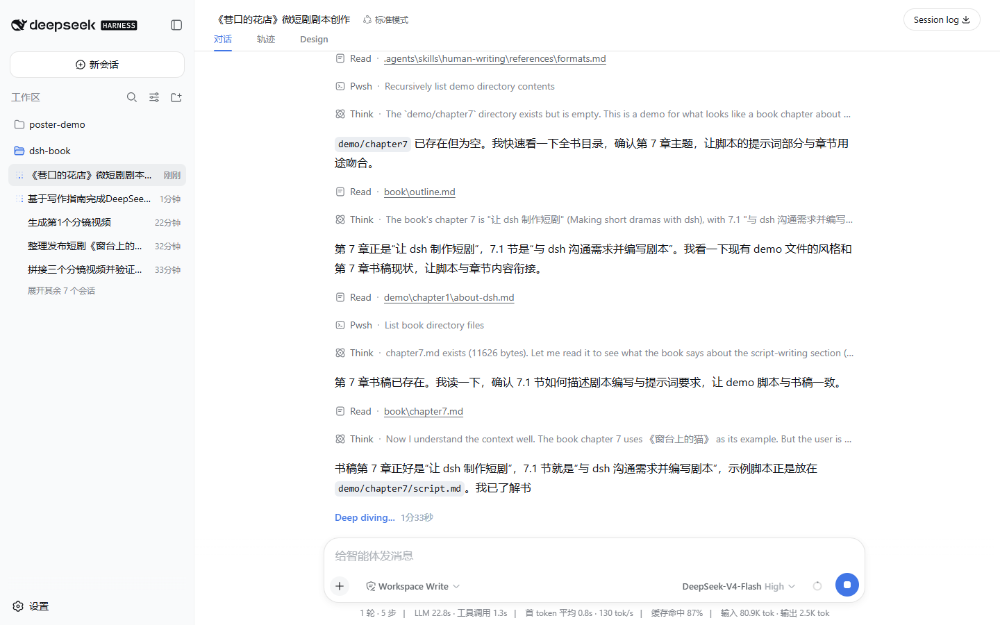
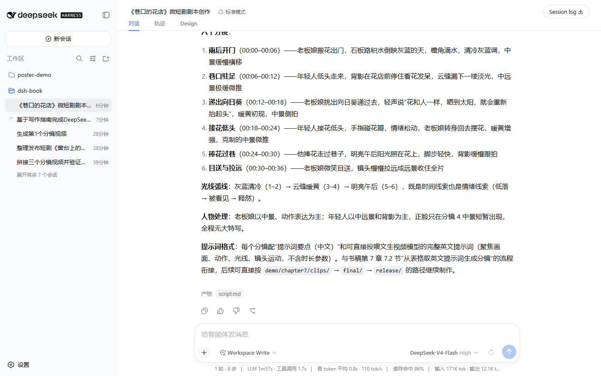
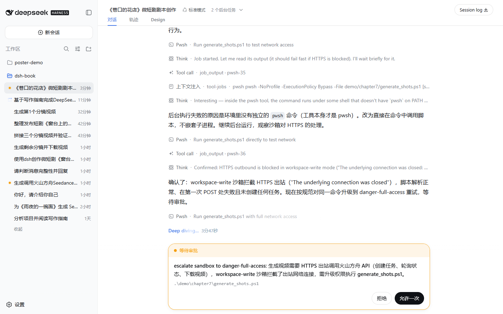
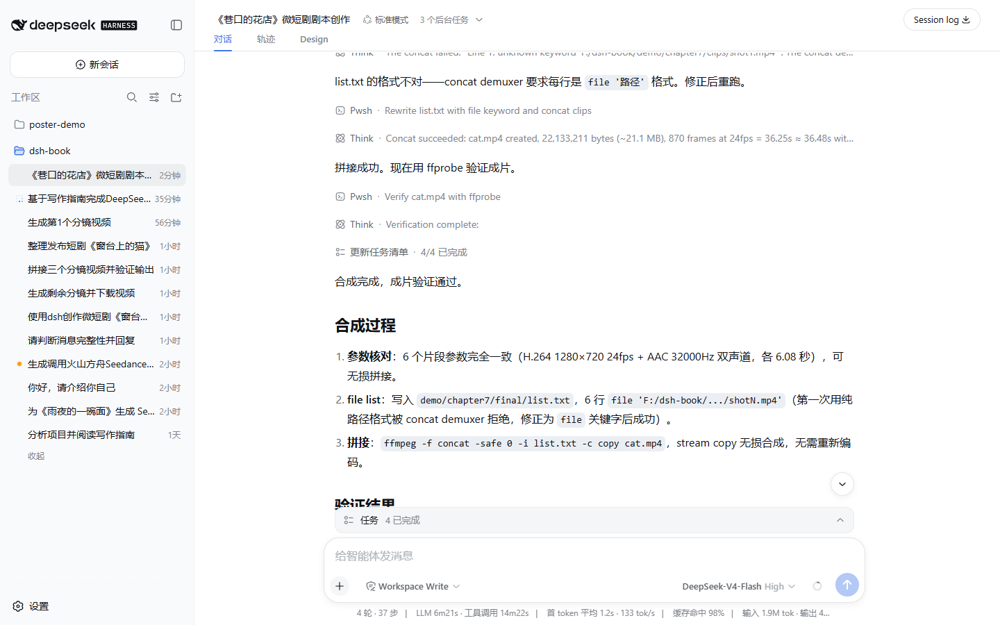
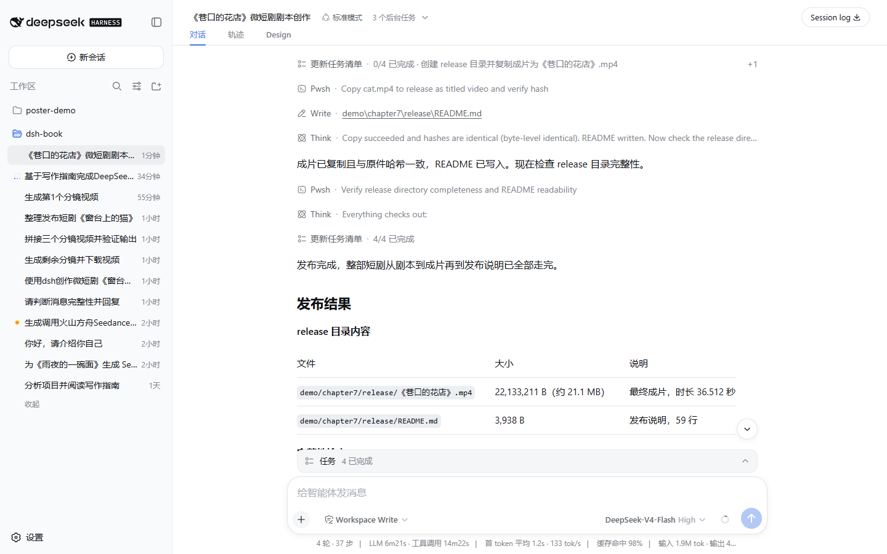

# 让 dsh 制作短剧 {#ch-7}

前面几章让 DSH 产出的都是文档、表格、幻灯片这类办公文件，这一章换一件事，让 DSH 制作一部短剧。短剧还要处理画面、声音和剪辑，最终产物也从办公文件换成了视频。这一章会从一个想法开始，在同一个会话里写剧本、生成分镜、合成成片并整理发布。

这一章制作一部 36 秒的剧情微短剧《巷口的花店》。雨后清晨，老城巷口的小花店开门，一个刚经历挫折的年轻人路过，在花店前驻足。老板娘递给他一束向日葵，说花和人一样，晒到太阳就会重新抬起头。年轻人捧着花穿过巷子，阳光洒在花上，老板娘微笑着目送他走远。全片几乎没有台词，靠画面、光线和动作推进情绪，光线从雨后的清冷灰蓝，到云缝漏出的暖黄，再到明亮的午后。

## 与 dsh 沟通需求并编写剧本 {#sec-7-1}

### 准备视频生成 API 密钥

动手之前需要准备一件事，一个能生成视频的 API 密钥。这一章用的是火山方舟（Volcengine Ark）的 Seedance 2.0 文生视频接口，模型 ID 是 `doubao-seedance-2-0-mini-260615`。去火山方舟控制台开通对应模型，创建 API Key，然后把 Key 保存到用户主目录下一个名为 `.ark-key` 的文件里，用记事本新建即可，内容只有一行 Key。

把 Key 放在用户主目录，可以避免它进入书稿仓库。后续 DSH 用命令读取这个文件，全程不会打印明文，也不要让它出现在对话和截图里。

> 提醒：Key 只在生成视频时需要。不要把它贴进对话，也不要放进任何会提交的文件。

### 向 dsh 描述短剧需求

新建一个会话，在输入框里把短剧想法说清楚。需求描述要包含四样东西，主题和剧情、时长和分镜要求、风格要求、文件保存位置。剧情写得越具体，剧本越有画面感。

```text
我要用 dsh 制作一部微短剧，主题是《巷口的花店》。这是一部 36 秒左右的治愈系剧情短片，请你帮我完成以下工作：

1. 编写一份完整的短剧剧本，包含故事梗概、角色设定、分镜脚本。短剧总时长 36 秒，拆成 6 个分镜，每个分镜 6 秒。每个分镜写清楚画面描述、镜头运动、时长和生成视频时用的提示词要点（中英文都要）。
2. 把剧本保存到工作区下的 script.md 文件。

剧情设定：老城巷口有一家小花店。雨后清晨，花店开门，老板娘把花搬出来。一个刚经历挫折的年轻人路过，在花店前驻足，看着花发呆。老板娘注意到他，递给他一束向日葵，说花和人一样，晒到太阳就会重新抬起头。年轻人接过花，低头看了看，情绪慢慢松动。他捧着花走过巷子，阳光照在花上。结尾花店门口，老板娘微笑着目送他走远，镜头慢慢拉远。

要求：全片无台词或极少台词，靠画面、光线和动作推进情绪。光线从雨后的清冷灰蓝，到阳光出现的暖黄，最后是明亮的午后。人物用中远景和背影为主，避免大特写。

请先完成剧本，写完后告诉我文件路径和剧本要点。
```

发送之后，DSH 会先调用写作 skill 把创作规范加载进来，再动手写剧本。写完把完整的剧本写进 `script.md`，回复末尾挂着"产物"标签。

{width=80%}

### 查看剧本

打开剧本可以看到，故事被拆成了 6 个分镜，每个占 6 秒，分别是「雨后开门」「巷口驻足」「递出向日葵」「接花低头」「捧花过巷」「目送与拉远」。剧本里除了画面描述和镜头运动，还专门设计了一条光线线索，雨后的灰蓝、云缝的暖黄、明亮的午后，颜色的变化就是情绪的变化。每个分镜都配了一列提示词要点，同时给了中文要点和可以直接交给文生视频模型的英文提示词。这三样东西，画面、光线、提示词，是下一节生成视频的全部输入。

{width=80%}

## 调用 SeedDance 生成分镜 {#sec-7-2}

剧本写好了，但分镜还停留在文字阶段。这一节在同一个会话里继续，让 DSH 把 6 个分镜全部变成真实的视频片段。DSH 会读取剧本里的英文提示词，调用视频生成 API 创建任务、轮询状态、下载视频，全程用命令完成，不需要打开浏览器去操作视频平台。

### 让 dsh 生成全部六个分镜

直接告诉 DSH 生成全部 6 个分镜。它会把每个分镜的提示词、任务参数和输出位置都安排清楚。

```text
剧本我看过了，写得很好。现在进入分镜生成阶段，请在当前会话里继续，完成以下任务：

1. 读取剧本 script.md，取出全部 6 个分镜的英文提示词（分镜 1 到分镜 6）。
2. 火山方舟 API Key 在文件用户目录下的.ark-key 里，注意：绝对不要把 key 明文打印到任何输出里，命令里一律用变量引用。
3. 为 6 个分镜依次调用视频生成接口创建任务并下载视频：
   - 接口：POST https://ark.cn-beijing.volces.com/api/v3/contents/generations/tasks
   - 请求头 Authorization: Bearer <key>，Content-Type: application/json
   - 请求体（用 ConvertTo-Json 构造）：
     {
       "model": "doubao-seedance-2-0-mini-260615",
       "content": [{"type": "text", "text": "<分镜N英文提示词>"}],
       "resolution": "720p",
       "ratio": "16:9",
       "duration": 6,
       "generate_audio": true,
       "watermark": false
     }
   - 创建任务拿到 id 后，每 20 秒轮询一次 GET https://ark.cn-beijing.volces.com/api/v3/contents/generations/tasks/{id}，直到 status 是 succeeded 或 failed。视频生成每个分镜通常需要 1 到 3 分钟。
   - 成功后下载保存为 clips/shot1.mp4 到 clips/shot6.mp4。
4. 全部完成后报告：每个分镜的任务状态、视频文件大小。
```

首次调用外部视频 API 时，DSH 会请求网络权限。确认命令只运行本章的生成脚本，而且不会打印 Key，然后点 **允许一次**。

{width=80%}

### 轮询任务并下载视频

DSH 把 6 个分镜的任务排成队列，一个接一个地执行。每个分镜都是同一套流程，创建任务拿到一个任务 ID，每 20 秒查询一次状态，视频生成一般需要一两分钟，任务变成 `succeeded` 后把视频下载到 `clips` 目录，再开始下一个。

{width=80%}

授权后，DSH 会在会话里报告进度。六个分镜全部生成完成后，回复会列出每个任务的 ID、状态和视频文件大小。

六个片段参数一致，都是 720p、16:9、6 秒、带同步音频、无水印，合计约 21 MB。从雨后的灰蓝到明亮午后的光线变化，已经落进了六段真实的视频里。截取其中三个分镜的画面，能直接看到这条光线线索。

{width=80%}

{width=80%}

{width=80%}

## 合成并保存短剧 {#sec-7-3}

六个分镜片段生成了，还差最后一步，把它们拼成一部完整的短剧。这一步还在同一个会话里。

### 拼接六个片段

让 DSH 用 ffmpeg 把六个片段按顺序拼接。六个片段参数一致，可以直接做无损拼接，不需要重新编码。

```text
六个分镜都生成了，非常好。现在进入合成阶段，请在当前会话继续完成任务：

1. 用 ffmpeg 把 6 个片段按顺序拼接成一部完整短剧：
   - clips/shot1.mp4（雨后开门）
   - clips/shot2.mp4（巷口驻足）
   - clips/shot3.mp4（递出向日葵）
   - clips/shot4.mp4（接花低头）
   - clips/shot5.mp4（捧花过巷）
   - clips/shot6.mp4（目送与拉远）
   输出到 final/ 目录，文件名 rain.mp4。
2. 合成后验证输出文件：用 ffprobe 或 ffmpeg 查看时长、分辨率和音视频流。
3. 报告：最终文件路径、时长、大小。
```

DSH 会先写一个 `list.txt` 记录六个片段的顺序，再执行拼接命令，最后用 ffprobe 验证输出。

合成后的成片 `final/rain.mp4` 时长约 36.5 秒，1280×720（720p 16:9），约 24 帧每秒，H.264 视频配 AAC 音频，大小约 21 MB。六个分镜连起来看，雨后的巷口、递出的向日葵、阳光下的背影，一条完整的故事线在 36 秒里走完。

## 发布短剧 {#sec-7-4}

### 整理发布产物

让 DSH 把成片复制到独立的发布目录，用正式名称命名，并写一份发布说明，把短剧的基本信息、剧情、分镜结构和制作方法都记录下来。

```text
成片合成好了，36.5 秒的完整短剧。现在做最后一步：发布短剧。请在当前会话继续，完成以下工作：

1. 整理发布产物：
   - 把最终视频 rain.mp4 复制一份到 release/ 目录，命名为《巷口的花店》.mp4（保持原视频不变）
   - 写一份发布说明 release/README.md，包含：短剧名称、时长、剧情梗概、分镜结构（6 个分镜各 6 秒）、制作方法（DSH + Seedance 2.0 mini 生成、ffmpeg 拼接）、6 个分镜的提示词摘要、视频文件清单
2. 检查 release 目录内容完整（视频文件存在、README 可读）。
3. 报告发布结果：release 目录下有哪些文件、各文件大小、最终视频时长。
```

DSH 会创建 `release` 目录，复制成片，写发布说明，再用命令核对文件完整性和哈希。

{width=80%}

最终 `release/` 目录里有两样东西。一个是《巷口的花店》.mp4，和原始成片字节级一致，约 21 MB，可以直接播放或上传平台。另一个是 README.md，写明了短剧名称、36.5 秒时长、剧情梗概、六个分镜的画面内容、制作方法（DSH 写剧本、Seedance 2.0 mini 逐镜生成、ffmpeg 无损拼接）以及每个分镜的提示词摘要。
