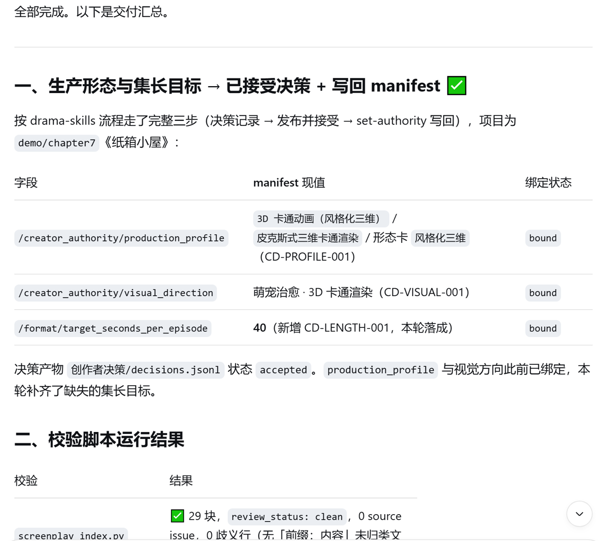
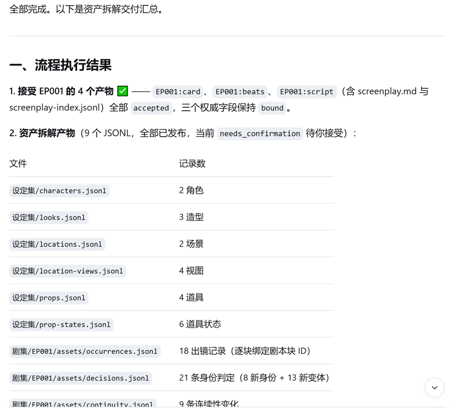
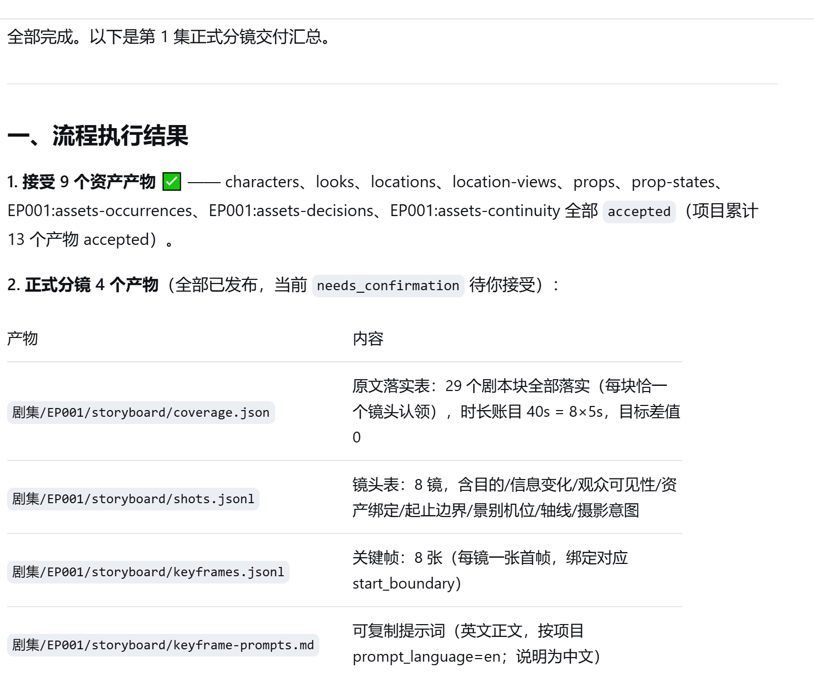
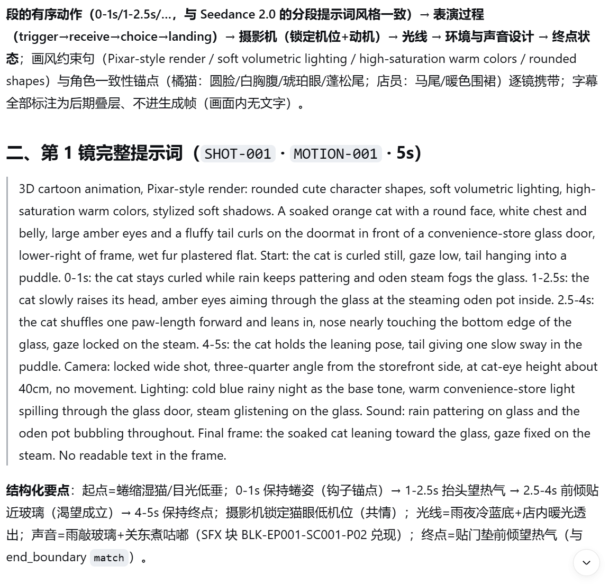
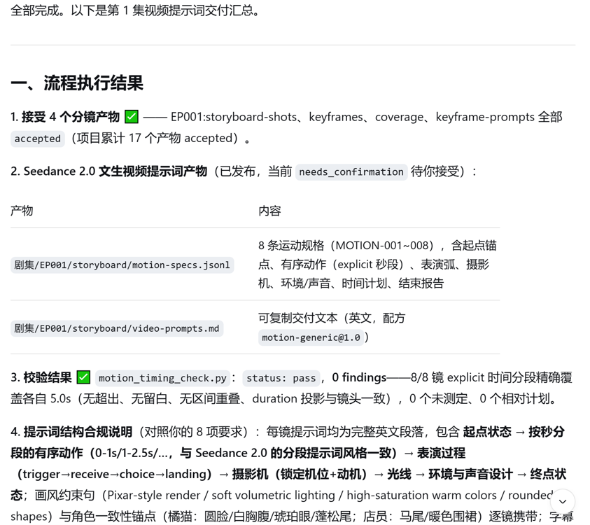
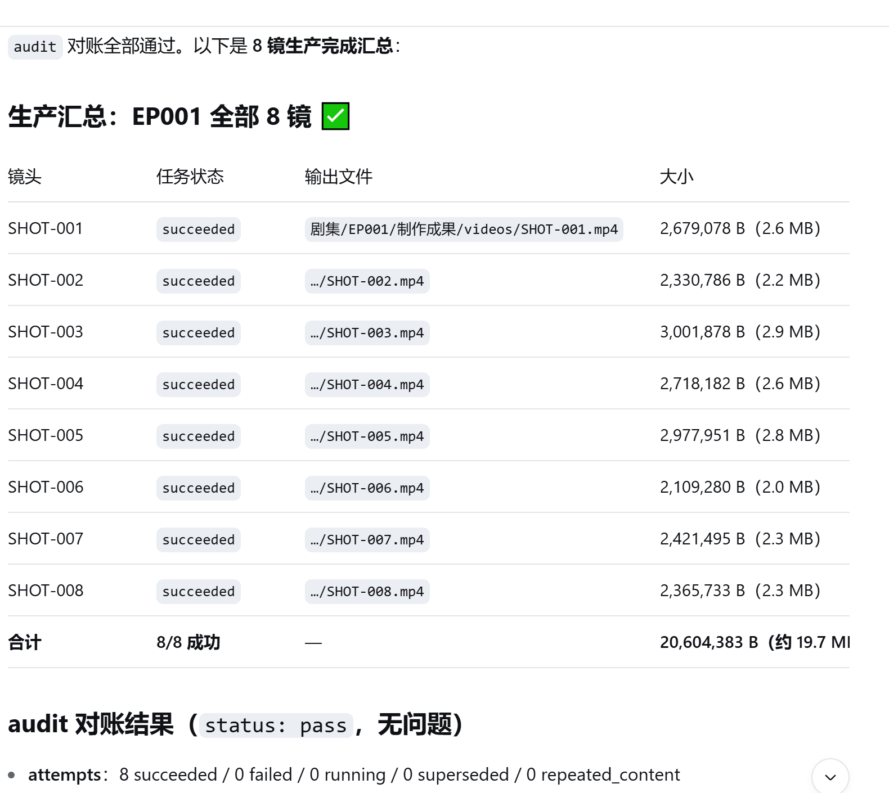
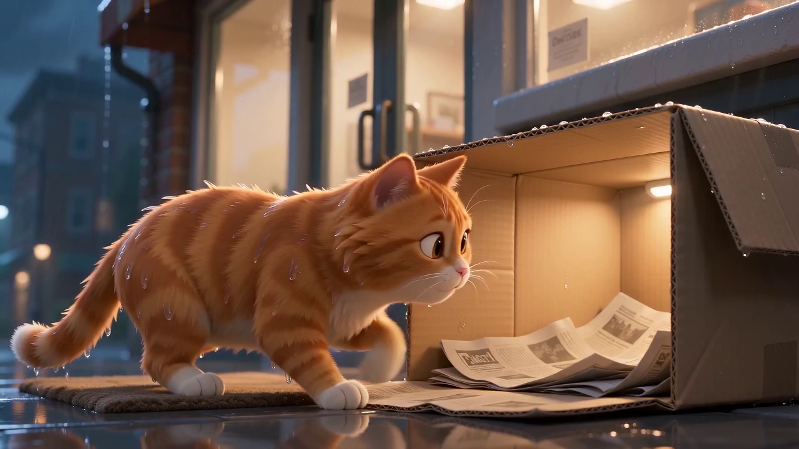
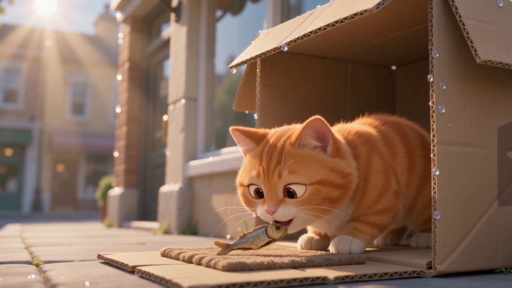

# 让 dsh 制作短剧 {#ch-7}

前几章的任务主要生成文档、表格和演示文稿。本章进一步介绍 dsh 在短剧制作中的应用。与办公文件相比，短剧制作还涉及剧本、资产设定、分镜、画面、声音和剪辑等环节，最终交付物为视频文件。

本章使用开源短剧创作技能集 drama-skills，并由 dsh 完成项目初始化、剧本编写、资产设定、分镜设计和视频提示词生成。确认各阶段产物后，再逐镜生成视频，完成合成与发布。最终成片为一部约 40 秒的 3D 卡通风格萌宠短剧《纸箱小屋》。故事发生在雨夜，一只橘猫在便利店门口躲雨，店员用纸箱为它搭建临时小屋；次日清晨，橘猫衔来一条小鱼干放在门口，阳光照亮纸箱小屋。

全片不使用人物台词，关键信息通过字幕呈现。drama-skills 为各制作阶段提供校验脚本和确认机制，本章将按照这些阶段依次操作。演示项目位于工作区的 `demo/chapter7` 目录，后文路径均以该目录为基准。

## 与 dsh 沟通需求并编写剧本 {#sec-7-1}

### 安装 drama-skills 并准备密钥

开始制作前，需要准备 drama-skills 技能集、视频生成 API 密钥和生产适配器（adapter）配置。

[drama-skills](https://github.com/worldwonderer/drama-skills) 是 GitHub 上的开源技能集，包含十个技能，覆盖剧本、资产、分镜、视频提示词、生产和审查等环节。先克隆仓库，再将技能目录复制到 dsh 的用户级技能目录。dsh 会自动发现该目录中的技能，无须重启：

```text
git clone https://github.com/worldwonderer/drama-skills.git
把 drama-skills/skills/ 下的目录复制到 %USERPROFILE%\.dsh\skills\ 下
```

复制完成后的技能目录结构如下。本章使用 short-drama、short-drama-write、short-drama-assets、short-drama-storyboard、short-drama-video-prompts 和 short-drama-produce：

```text
%USERPROFILE%\.dsh\skills\
├── short-drama             项目初始化、状态与路由
├── short-drama-write       写单集剧本
├── short-drama-assets      拆人物、场景、道具
├── short-drama-storyboard  拆分镜与关键帧
├── short-drama-video-prompts  写视频提示词
├── short-drama-produce     确认后生产视频
└── ……（其余技能）
```

本章使用火山方舟（Volcengine Ark）的 Seedance 2.0 文生视频接口，模型 ID 为 `doubao-seedance-2-0-mini-260615`。在火山方舟控制台开通对应模型并创建 API Key 后，在用户主目录中新建 `.ark-key` 文件，并将 API Key 单独写入一行。

将 API Key 保存在用户主目录，可以避免其进入书稿仓库。后续命令均从该文件读取密钥，不在终端或会话中输出明文。

drama-skills 将提示词编写与视频生产分为两个阶段。提示词先写入文件，生产任务经过预览和确认后才会执行；确认码与任务（job）内容绑定，用于避免误操作产生费用。生产过程通过项目目录之外的 adapter 配置执行，因此密钥不会写入项目文件。先创建 `%USERPROFILE%\.dsh\adapters\` 目录，并添加以下两个文件。

`seedance.json`（adapter 配置，profile 名 seedance-ark）：

```json
{
  "adapters": {
    "seedance-ark": {
      "command": ["cmd", "/c", "%USERPROFILE%\\.dsh\\adapters\\seedance.cmd"],
      "timeout_seconds": 3600
    }
  }
}
```

`seedance.cmd`（启动脚本，从 `.ark-key` 读取密钥并设置模型参数）：

```bat
@echo off
setlocal
set "HTTP_PROXY="
set "HTTPS_PROXY="
set "NO_PROXY=*"
for /f "usebackq delims=" %%k in ("%USERPROFILE%\.ark-key") do set "ARK_API_KEY=%%k"
set "SEEDANCE_MODEL=doubao-seedance-2-0-mini-260615"
set "SEEDANCE_ALLOWED_RATIOS=16:9"
set "SEEDANCE_MIN_DURATION=4"
set "SEEDANCE_MAX_DURATION=15"
set "SEEDANCE_POLL_INTERVAL=10"
set "SEEDANCE_TIMEOUT_SECONDS=1800"
python "%USERPROFILE%\.dsh\skills\short-drama-produce\scripts\provider_adapters.py" seedance
exit /b %ERRORLEVEL%
```

`SEEDANCE_MODEL` 用于指定模型。`SEEDANCE_ALLOWED_RATIOS`、`SEEDANCE_MIN_DURATION` 和 `SEEDANCE_MAX_DURATION` 声明模型支持的画幅与时长范围，adapter 会据此校验每个生产任务。`SEEDANCE_POLL_INTERVAL` 用于设置轮询间隔。脚本开头清空代理环境变量，是为了避免未启动的本地代理阻断网络直连；如果系统没有配置代理，可以删除这三行。

> 提醒：API Key 只在生成视频时使用。不要将其粘贴到对话中，也不要写入任何需要提交的文件。

### 初始化短剧项目

新建会话，并在需求中明确项目路径、标题、语言、画幅、题材方向、一句话故事和技能安装位置。本次实际发送的消息如下：

> <span class="prompt-title">提示词内容：</span>
>
> 用 drama-skills 制作短剧《纸箱小屋》：初始化项目
>
> 用 short-drama 技能初始化一个短剧项目，要求：
> - 项目路径：demo/chapter7（当前工作区的相对路径）
> - 标题：《纸箱小屋》
> - 项目语言 zh-CN，生成器提示词语言 en
> - 画幅 16:9
> - 题材方向：萌宠治愈 · 日常，3D 卡通渲染风格（皮克斯式三维卡通）
> - 一句话故事：雨夜，便利店门口一只橘猫躲雨，店员用纸箱给它搭了个小屋；第二天清晨，猫衔来一条小鱼干放在门口，阳光照亮小屋

收到指令后，dsh 加载 short-drama 技能并依次执行以下操作：运行 `project_tool.py init` 创建项目，将制作形态（3D 卡通动画）和视觉方向（萌宠治愈 · 3D 卡通渲染）记录为创作者决策并写入项目 manifest，最后运行 status 查看项目状态。项目结构如下：

```text
demo/chapter7/
├── short-drama.json          项目 manifest（标题、语言、画幅、权威决策）
├── .short-drama/state.json   生命周期状态
├── 创作者决策/decisions.jsonl  创作者决策记录
├── 项目开发/  设定集/  剧集/  输入/  审查/  交付/   阶段目录
```

### 写第 1 集剧本

下一步编写剧本。创作要求应明确画风、角色、时长、镜头数量、叙事结构和光线变化：

> <span class="prompt-title">提示词内容：</span>
>
> 制作形态：3D 卡通动画（皮克斯式三维卡通渲染，萌宠治愈题材），集长目标 40 秒。请按 drama-skills 流程开始编写第 1 集剧本。
>
> 用 short-drama-write 写第 1 集剧本，创作要求：
> 1. 全片无台词：关键信息用画面文字（字幕）呈现，不追求口型同步
> 2. 角色为 3D 卡通风格：橘猫（圆脸、白色胸腹、琥珀色眼睛、蓬松尾巴）+ 便利店女店员（年轻、暖色围裙、扎马尾）；以中远景为主，避免长时间大特写
> 3. 单集目标时长 40 秒，拆成 8 个镜头，每个约 5 秒
> 4. 结构要求：开场 3 秒内要有钩子（雨夜便利店门口躲雨的橘猫，隔着玻璃望向关东煮的热气），中段小转折（店员心软，用纸箱给猫搭了个小屋），结尾情绪落点（第二天清晨，猫衔来一条小鱼干放在小屋门口，阳光照亮小屋，店员推门看到）
> 5. 情绪曲线：心疼 → 犹豫 → 心软 → 温暖 → 惊喜 → 治愈
> 6. 光线线索：雨夜的冷蓝 → 清晨的暖阳

dsh 加载 short-drama-write 技能后生成四个文件：单集卡 `episode-card.json`、因果节拍 `beats.jsonl`、剧本 `screenplay.md` 和剧本索引 `screenplay-index.jsonl`，随后运行校验脚本。剧本采用短剧节拍结构，以 6 个因果节拍组织 8 个镜头。每个节拍记录事件起因、角色目标、阻碍、可见行动和状态变化。

`beats.jsonl` 中的因果节拍摘要如下：

| 节拍 | 情绪 | 因为什么 → 谁要什么 → 阻挡 → 可见行动 |
|---|---|---|
| BEAT-001 | 心疼 | 雨夜低温 → 猫要暖意 → 大雨和玻璃门 → 湿猫贴玻璃望关东煮热气 |
| BEAT-002 | 犹豫 | 心疼升起 → 店员要开门 → 猫的警惕 → 门开一条缝，猫退回雨里 |
| BEAT-003 | 心软 | 开门会吓跑 → 要给安全入口 → 距离不能缩短 → 从门缝推出纸箱小屋，字幕「先住一晚吧。」 |
| BEAT-004 | 温暖 | 小屋出现 → 猫要确认安全 → 本能警惕 → 嗅箱、探爪、钻入、尾巴盖鼻尖 |
| BEAT-005 | 惊喜 | 被善待一夜 → 猫要回报 → 无法用语言 → 清晨叼来小鱼干放在门口 |
| BEAT-006 | 治愈 | 鱼干与空屋 → 店员要确认昨夜 → 猫可能已离开 → 推门见鱼干，见猫回望，微笑 |

分场结构包含 8 个场景，分别对应 8 个镜头：

| 场景 | 光线 | 内容 | 情绪 |
|---|---|---|---|
| SC001 外·便利店门口 | 雨夜·冷蓝 | 钩子：湿猫隔玻璃望关东煮热气，字幕「雨夜 · 23:47」 | 心疼 |
| SC002 内·便利店 | 雨夜·冷蓝 | 店员听到猫叫停手，隔玻璃对视 | 心疼 |
| SC003 门口 | 雨夜·冷蓝 | 开门惊猫，猫退雨里 | 犹豫 |
| SC004 门口 | 雨夜·冷蓝 | 转折：推出纸箱小屋，字幕「先住一晚吧。」 | 心软 |
| SC005 门口 | 雨夜·冷蓝 | 猫嗅探、钻入、尾巴盖鼻尖 | 温暖 |
| SC006 门口 | 深夜·暖光 | 猫探头眯眼望店内灯光，毛已蓬松 | 温暖 |
| SC007 门口 | 清晨·暖阳 | 惊喜：猫放好小鱼干跑开回望，字幕「谢谢你。」 | 惊喜 |
| SC008 内外·门口 | 清晨·暖阳 | 落点：店员推门见鱼干，微笑，字幕「早安。」 | 治愈 |

剧本全文保存在 `剧集/EP001/screenplay.md`。场景标题记录了光线变化：SC001 至 SC006 采用雨夜冷蓝色调，暖色光源来自店内透光和关东煮热气；SC007 起转为清晨暖阳。全片包含 0 句台词、4 处字幕和 12 个完整的生产标签。校验结果为 review clean，估算时长与 8 个镜头、每个镜头约 5 秒的结构一致。

{width=88%}

## 调用 SeedDance 生成分镜 {#sec-7-2}

剧本完成后，项目仍处于文本制作阶段。本节将依次完成资产设定、分镜设计和视频提示词编写，再经确认后生成 8 个视频片段。


### 拆解资产设定

使用 short-drama-assets 从剧本中提取人物、场景和道具，并建立可复用的资产设定。输入的提示词如下：

> <span class="prompt-title">提示词内容：</span>
>
> 剧本我审阅过了，接受这个版本。
>
> 请按 drama-skills 流程：
> 1. 接受 EP001 的产物
> 2. 然后用 short-drama-assets 从第 1 集拆解人物、场景、道具设定（橘猫、店员、便利店内外、雨夜/清晨、纸箱小屋、小鱼干、关东煮等），运行校验后向我展示：每个角色的外观设定、关键场景与视图、关键道具与状态

橘猫资产由身份设定和两套造型组成。身份特征包括圆脸、白色胸腹、琥珀色眼睛和蓬松尾巴；造型 A 为雨夜湿透状态，造型 B 为干燥蓬松状态。将湿润程度记录为同一角色的造型变化，可以为跨镜头一致性提供依据。店员采用暖色围裙和高马尾造型，全片保持一致。

场景资产分为便利店门口和店内两个地点，每个地点分别记录雨夜冷蓝与清晨暖阳两种视图状态。纸箱小屋是主要道具，其状态依次为柜台下的空箱、屋檐下供猫入住的小屋，以及清晨边角带有露水的空屋。小鱼干的位置则从猫口转移到门垫中央，最后到达店员手中，用于传递结尾的信息差。连续性台账共记录 9 项变化，并为每项变化注明原因和生效范围。

{width=88%}

### 拆分镜

使用 short-drama-storyboard 将剧本拆分为 8 个镜头，每个镜头约 5 秒。输入的提示词如下：

> <span class="prompt-title">提示词内容：</span>
>
> 资产设定我审阅过了，接受全部 9 个资产产物。
>
> 请按 drama-skills 流程：
> 1. 接受 9 个资产产物
> 2. 然后用 short-drama-storyboard 把第 1 集做成正式分镜：8 个镜头每个 5 秒，生成原文落实表、镜头表、关键帧、关键帧提示词，并进行校验校验
> 3. 完成后向我展示 8 个镜头的列表：镜头号、景别、机位、画面内容、时长、转场

分镜阶段生成原文落实表、镜头表、关键帧和关键帧提示词。原文落实表记录每个剧本块的处理方式，关键帧用于固定各镜头的起始画面状态。校验脚本核对镜头时长和剧本覆盖情况：8 个镜头的总时长为 40 秒，29 个剧本块均有对应镜头，未出现遗漏或重复。

镜头设计使用机位高度区分观察视角。橘猫相关镜头采用猫眼低机位，使观众与橘猫保持平视；店员相关镜头采用常规平视机位。内景机位位于玻璃门内侧，外景机位位于门外，整个拍摄过程保持轴线一致。空间隔离还保留了角色之间的信息差：观众能够看到橘猫进入小屋，店员直到结尾发现小鱼干时才获得相应信息。

{width=88%}

### 生成视频提示词

现在使用 short-drama-video-prompts 为每个镜头生成 Seedance 2.0 可直接使用的英文提示词，输入的提示词如下：

> <span class="prompt-title">提示词内容：</span>
>
> 分镜我审阅过了：8 个镜头结构清晰（猫眼低机位共情、内景外景不越轴、信息差保护、光线切换落位），接受 4 个分镜产物。
>
> 请按 drama-skills 流程：
> 1. 接受 4 个分镜产物
> 2. 然后用 short-drama-video-prompts 把分镜逐镜翻译成 Seedance 2.0 文生视频提示词
> 3. 每个镜头的提示词要包含：起点状态、有序动作、表演过程、摄影机运动、光线、环境与声音设计、时间安排、终点状态；提示词用英文，每镜是一段可直接交给文生视频模型的完整提示词；必须包含画风约束：3D 卡通渲染风格（皮克斯式三维卡通质感、柔和体积光、高饱和暖色、圆润造型），并保持橘猫与店员形象在镜间一致
> 4. 完成后向我展示第 1 镜和第 7 镜的完整提示词
每段提示词包含起始状态、按时间划分的连续动作、摄影机设置、光线、声音和结束状态。第 1 镜的完整提示词如下：

{width=88%}

每段提示词开头均包含统一的画风约束，包括 3D 卡通渲染、皮克斯质感、柔和体积光和高饱和暖色。8 个镜头还共用同一组角色特征，以降低画面风格和角色外观的偏移。

动作按照 0-1s、1-2.5s、2.5-4s 和 4-5s 等时间段组织，使模型能够依据时间顺序生成动作。提示词结尾使用 `No readable text in the frame` 排除画面中的可读文字，字幕统一在后期叠加，以避免模型生成无意义字符。

{width=88%}

### 确认并生成八个分镜

生产环节的提示词如下：

> <span class="prompt-title">提示词内容：</span>
>
> 视频提示词我审阅过了：每镜都包含起点状态、时间轴分段动作、摄影机、光线、声音与终点状态，画风约束到位，接受 2 个产物。
>
> 请按 drama-skills 流程：
> 1. 接受 2 个产物
> 2. 然后用 short-drama-produce 进入生产阶段
> 3. 生成期间每个镜头完成后报告任务状态和文件大小

进入生产阶段后，short-drama-produce 会执行强制确认机制。正式生成前，每个 job 的提示词、参数和输出路径都必须向创作者完整展示；只有输入对应确认码后，系统才会调用视频接口。该机制将提示词编写与可能产生费用的视频生成分开，可以降低误操作风险。

dsh 为 8 个镜头分别创建 video job，在会话中进行确认后，dsh 会为各镜头依次执行 confirm 和 run。每个镜头遵循相同过程：调用火山方舟接口创建视频生成任务，持续轮询状态，待状态变为 succeeded 后，将视频下载到 `剧集/EP001/制作成果/videos/`。本次操作中，每个镜头的生成时间约为一至三分钟。

8 个镜头生成完成后，dsh 核对任务记录与输出文件。检查结果显示，8 个 job 的状态均为 succeeded，输出文件与运行记录一致，没有缺失或异常改动。

{width=88%}

8 段视频的技术参数一致：分辨率为 720p（1280×720），帧率为 24 帧每秒，每段时长约 5.1 秒，并包含 Seedance 生成的 AAC 立体声音轨，总大小约 19.7 MB。以下三帧分别呈现雨夜冷蓝、小屋暖光和清晨阳光三个阶段，可以核对预设的光线变化。

{width=80%}

{width=80%}

{width=80%}

## 剪辑并发布短剧 {#sec-7-3}

8 个分镜片段生成后，需要将其合成为完整短剧。由于各片段的技术参数一致，可以使用 ffmpeg 进行无损拼接，无须重新编码。在会话中输入：

> <span class="prompt-title">提示词内容：</span>
>
> 用 ffmpeg将 8 个片段按镜头顺序无损拼接，用 ffprobe 验证输出。

dsh 先生成拼接清单以记录 8 个片段的顺序，再执行 `ffmpeg -f concat -safe 0 -c copy`。拼接完成后，使用 ffprobe 验证输出文件。成片 `final/last-order.mp4` 的时长约为 40.7 秒，与剧本规划的 8 个镜头、每个镜头约 5 秒基本一致。连续播放 8 个分镜后，可以确认雨夜开场、纸箱小屋和清晨谢礼构成了完整的叙事过程。

### 整理发布产物

最后，将成片复制到独立的发布目录，使用正式片名《纸箱小屋》命名，并生成发布说明。至此，我们完成了从项目初始化到发布的全部步骤。项目先确定 3D 卡通制作形态和视觉方向，再生成剧本、资产设定、分镜和视频提示词。各阶段产物经过校验与确认后，dsh 生成 8 段视频并将其无损拼接为约 40 秒的成片。
