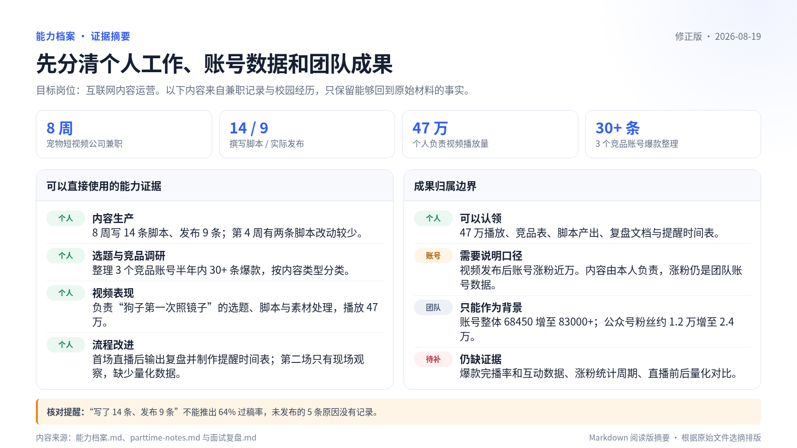
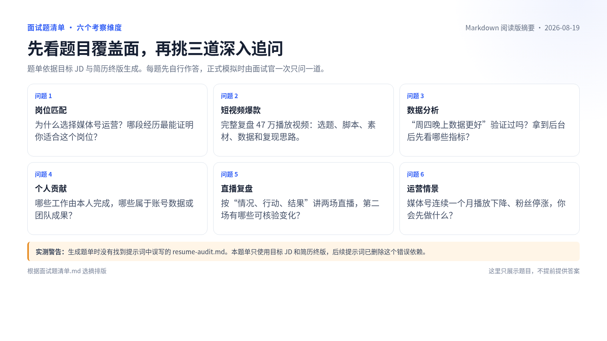

# 让 dsh 帮你找工作 {#ch-8}

本章演示如何使用 dsh 帮你找工作。我们从一份八周兼职笔记开始，整理个人能力，调研目标岗位，再写一页简历并做模拟面试。完成后，工作区里会留下“能力档案.md”、“岗位调研.md”、“差距表.md”、“目标JD.md”、简历文件和“面试复盘.md”。

本章的对话和文件均来自实际操作，人物经历和数字为演示材料。读者操作时，请换成自己的真实资料，并逐项核对数字、职责和成果归属。书中也保留了实测时遇到的问题和修正过程，模拟面试会继续追问简历细节。

## 分析个人能力 {#sec-8-1}

### 先让 dsh 整理材料清单

新建名为 `job-hunt` 的文件夹，把它添加为工作区，再打开一个标准模式会话。本章只需要读取文件、联网调研和生成文档，不必使用创造模式。确认当前会话使用的是 `job-hunt` 工作区后，发送下面这段提示词。dsh 把工作经历需要补充的细节排在清单最前面，接着询问目标岗位和校园经历。图中把“兼职”误称为“实习经历”，后续整理材料时要改回“兼职”。

> \textcolor[HTML]{E45C5C}{\large\textbf{提示词内容：}}
>
> 我是 2027 届市场营销专业本科生，暑假在一家宠物短视频公司做了两个月兼职，现在准备秋招，目标是互联网公司的内容运营岗。接下来想让你帮我盘点能力、调研岗位、写简历、模拟面试。先别开始做，列出你需要我提供哪些材料，按重要性排。

```{=latex}
\begin{figure}[H]
\centering
\includegraphics[width=0.92\textwidth]{assets/chapter8/8-1-01-material-list.png}
\caption{dsh 按重要性列出求职材料}
\end{figure}
```

不用照着清单一次写完长篇自传。已有的笔记、项目总结和作品可以直接放进工作区，零散信息再通过聊天补充。这样更符合真实准备方式，后面的新会话也能继续读取文件。

将兼职期间的笔记[“parttime-notes.md”](assets/chapter8/materials/parttime-notes.md)放进 `job-hunt` 工作区。这份笔记按周记录了八周兼职经历，既有脚本和视频的具体数据，也记下了两次直播的经过。校园经历较短，直接在对话里补充。

```{=latex}
\Needspace{22\baselineskip}
```

> \textcolor[HTML]{E45C5C}{\large\textbf{提示词内容：}}
>
> 我已经把兼职期间的笔记放在工作区，文件名是“parttime-notes.md”。
>
> 再补充一些情况。
>
> 我在校学生会宣传部做过两年，主要参与公众号选题和文案修改，大二时负责安排十几个人的值班和每周选题会。任职期间公众号粉丝从约 1.2 万涨到 2.4 万，这是团队共同完成的。
>
> 课程项目做过一次大学生咖啡消费调研，我是 5 人小组的组长。最后回收了 412 份有效问卷，还做了 15 次访谈。我主要负责问卷修改、部分访谈、SPSS 分析和汇报材料，项目成绩 94 分。
>
> 另外参加过校内新媒体创意大赛，4 人组队获得一等奖，我负责选题、文案和展示材料。平时会用剪映、Excel，SPSS 能做基础分析。英语六级 512 分。我觉得自己执行力还可以，但公开表达容易紧张。
>
> 请读取“parttime-notes.md”，结合这些补充信息分析我的个人能力，并保存为“能力档案.md”。请分清个人工作和团队成果，证据不足的内容列为待补充。

篇幅较长且后面还要反复核对的材料放在工作区，校园经历这类短信息直接发在对话里。dsh 会把两处材料一起写进“能力档案.md”。

### 核对个人能力档案

“能力档案.md”生成后，先查每个数字的来路和成果归属。重点搜索“提升”、“增长”、“独立完成”、“过稿率”等容易扩大贡献的词，措辞是否顺眼可以稍后再看。

初版有两处明显问题。它把“写了 14 条脚本、发布 9 条”概括为 64% 的过稿率。现有材料只能说明其中 9 条实际发布，无法判断其余 5 条是否通过审核，因此不能计算过稿率。它还把单条视频的播放表现和账号增长并列在一起，没有分清个人工作与团队结果。

发现这类问题时，直接指出事实边界，让 dsh 覆盖原文件。

> \textcolor[HTML]{E45C5C}{\large\textbf{提示词内容：}}
>
> 请修正“能力档案.md”。“14 条脚本、9 条发布”不能写成过稿率。爆款视频发布后的近万涨粉属于账号数据，账号整体增长属于团队成果。同步修正总览、分项和成果清单，覆盖原文件。

为了便于展示长文档的内容，图 8-2 将“能力档案.md”和后续复盘中已经核实的关键信息选摘成阅读摘要。它不是 dsh 的原生界面，原始 Markdown 仍保留在工作区。本章后面几张同类文档页也采用这种排版。

{width=98%}

阅读摘要不能代替打开文件复查。三项主要边界已经改正。个人负责的视频播放量为 47 万，视频发布后的近万涨粉属于账号数据，账号整体从 68450 增至 83000 多属于团队结果。实际打开修正版时，文件后部仍残留“稳定过稿”等过度概括。后面生成简历时，我们又明确要求把它改回“第 4 周有两条脚本改动较少”，没有把这句话带进终稿。

## 分析就业市场 {#sec-8-2}

能力档案整理完，暂时不要写简历。目标岗位还没查，此时无法判断哪些经历应该放在前面。先把城市和岗位范围说清，再让 dsh 分头搜索。

### 用四个子 Agent 分头调研

继续在当前工作区发送下面的要求。

> \textcolor[HTML]{E45C5C}{\large\textbf{提示词内容：}}
>
> 先进入岗位调研。
>
> 我想投北京、上海、杭州、深圳的内容运营或新媒体运营校招岗，优先互联网大厂、内容平台和电商平台，不考虑主播、销售和纯投放岗位。
>
> 请用 4 个子 Agent 分头调研真实 JD、薪资范围、近一年的技能要求变化和 2027 届校招时间。目标收集 10 份可以核验的 JD，每份记录公司类型、城市、岗位要求、来源网址、发布日期和采集日期。页面打不开或日期不明就如实标注。不足 10 份时写明实际数量和原因，不要补造。最后汇总为“岗位调研.md”，并在文末保留 JD 原文要点。

这四项任务互不依赖，适合并行处理。运行时可以看到四个子 Agent 分别查找不同地区的 JD、薪资与技能变化，以及校招时间线。

```{=latex}
\begin{figure}[H]
\centering
\includegraphics[width=0.92\textwidth]{assets/chapter8/8-2-01-subagents-running.png}
\caption{四个子 Agent 同时进行岗位调研}
\end{figure}
```

每个子 Agent 都留下了一份原始报告，主 Agent 再把它们合并成“岗位调研.md”。原始报告保留搜索过程和来源，后面抽查某条结论时还能回来看。图 8-4 把汇总路径和样本状态放在同一页，完整网址和 JD 原文仍以工作区文件为准。

```{=latex}
\begin{figure}[H]
\centering
\includegraphics[width=0.98\textwidth]{assets/chapter8/8-2-02-research-summary.png}
\caption{将岗位调研的汇总路径和样本状态选摘排版}
\end{figure}
```

### 先确认样本口径

岗位网页会不断更新，读者实操时得到的结果可能与本章不同。2026 年 8 月 19 日这次调研保留了 10 份样本，其中既有往届岗位，也有已经截止或批次存疑的岗位。这批材料只能用来观察要求出现的频率，不能写成“目前有 10 个岗位可以投”。网页打不开或日期不明的情况，均在文件中照实记录。

10 份样本中只有 2 份涉及 AI 工具：知乎把它列为加分项，阿里的一份样本本身就是 AI 内容运营专项岗。这组样本只能说明部分岗位提到 AI 工具，不能据此把它写成普通内容运营岗的普遍门槛。

统计时，每份 JD 编号为 1 至 10，同一项要求在同一份 JD 中最多计一次。相近表述会合并，例如“数据整理、监测、复盘”和“数据敏感”归入数据分析类。“岗位调研.md”文末保留 10 份 JD 的原文要点、来源网址、发布日期和状态，图 8-5 只展示统计结果的前五项。要复核 8/10 或 7/10 这样的数字，应回到这些原文逐份计数。

### 比较岗位要求和个人信息

接着把岗位要求和现有证据放到一张表里。

> \textcolor[HTML]{E45C5C}{\large\textbf{提示词内容：}}
>
> 读取“能力档案.md”和“岗位调研.md”，生成“差距表.md”。
>
> 表格包含四列，分别是岗位要求、现有证据、差距、毕业前可以完成的补救动作。
>
> 岗位要求只从“岗位调研.md”文末的 10 份 JD 原文要点中统计，写明每项要求在 10 份样本中出现了几次，按出现次数排序。这个样本包含往届、已截止和批次存疑的岗位，只能用于观察岗位要求，不能代表当前全部市场。
>
> 现有证据只能引用“能力档案.md”中已经记录的事实，找不到证据就写“无”。团队成果不能改写成个人成果，也不要补充材料里没有的经历。
>
> AI 工具只按样本原文分类：知乎 JD 中是加分项，阿里 JD 是 AI 内容运营专项岗。不要把专项岗位的职责计作普通内容运营岗的普遍准入门槛。补救动作要具体、能够实际执行。完成后保存文件并说明样本口径。

在这 10 份样本里，数据分析和内容策划各出现 8 次，跨部门协作与平台内容生态各出现 7 次，项目管理出现 6 次。差距表把这些高频要求和个人信息放在一起，并给出毕业前还能完成的补救动作。

{width=92%}

人工复查时，我们在表格后半段发现了“8 周全勤兼职”。原始笔记只证明兼职持续八周，没有全勤记录。这次实测没有回头覆盖“差距表.md”，随后生成的“目标JD.md”也沿用了“全勤”的说法，所幸后面的简历没有采用。读者继续下一节前，应先删除“全勤”，或改成“无全勤记录”，并确认文件已经保存。后续步骤还会读取这些中间文件，发现错误后要及时修正，不能只检查最后的简历。

## 优化个人简历 {#sec-8-3}

差距表汇总了一批岗位的共性。写简历时还要选定一份具体 JD，再从现有经历中挑出与它关系最紧的内容。

```{=latex}
\Needspace{18\baselineskip}
```

### 选择一份具体 JD

> \textcolor[HTML]{E45C5C}{\large\textbf{提示词内容：}}
>
> 结合“能力档案.md”、“岗位调研.md”和“差距表.md”，选一份和我经历最匹配的内容运营 JD，保存为“目标JD.md”。优先选择当前可投的岗位，没有合适的就选一份作为简历练习并说明状态。
>
> 然后针对这份 JD 写一页中文简历。个人信息先用占位符，只使用能力档案中有证据的经历和数字，分清个人成果和团队成果，不要补造。保存可编辑的“resume-draft.md”，同时导出“resume-draft.pdf”，检查 PDF 没有乱码、截断或多余空白页。

dsh 最后选择了快手的媒体号运营实习岗位。它与候选人的短视频经历匹配，2026 年 8 月 19 日采集时页面仍标记为进行中，因此本章用它演示对岗改写。这份 JD 面向 2027 届并提供转正机会，岗位性质仍是实习。只投校招全职岗位时，应在这里要求 dsh 重选。实际投递前还要重新确认岗位状态和申请条件。

### 先修正事实，再换排版

第一版 PDF 能打开，也只有一页，中文没有乱码，但内容和排版都有问题。它把两个月兼职写成了实习，加入了未经确认的到岗时间与六个月实习承诺，还把“第 4 周有两条脚本改动较少”概括成“稳定过稿”。版面上的分隔线穿过正文，页面下方也留下大片空白。

```{=latex}
\begin{figure}[H]
\centering
\includegraphics[width=0.82\textwidth]{assets/chapter8/8-3-02-first-resume.png}
\caption{第一版 PDF 存在事实错误和排版问题}
\end{figure}
```

修改时保留初版，新稿另存为“resume-new.md”，后面还要用它更换模板。

> \textcolor[HTML]{E45C5C}{\large\textbf{提示词内容：}}
>
> 我检查了初版 PDF。请保留初版文件，把优化结果另存为“resume-new.md”和“resume-new.pdf”。
>
> 重新排成一页 A4 简历，姓名放在顶部，联系方式排成一行，各部分标题样式统一，不要再让分隔线穿过文字。
>
> 同时修正几处内容。两个月的经历是兼职，不能写成实习生。删除未经确认的到岗时间和六个月实习承诺，把“稳定过稿”改为“第 4 周有两条脚本改动较少”。其他内容继续严格依据能力档案，不要补造。

第二版修正了这些事实，排版仍然简单，姓名还出现了重复。于是我们让 dsh 停用原来的 PDF 脚本，改用 RenderCV 生成三个模板。

```{=latex}
\Needspace{14\baselineskip}
```

> \textcolor[HTML]{E45C5C}{\large\textbf{提示词内容：}}
>
> 现在的简历排版还是不好看，而且姓名重复了。不要继续使用原来的 PDF 生成脚本。请安装并使用 RenderCV，把“resume-new.md”中的现有内容套入简历模板，分别使用 classic、moderncv、harvard 三种样式，各生成一份一页 A4 的 PDF，放入“resume-options”文件夹。使用本机可用的中文字体，姓名只出现一次，不要修改或补充简历内容。完成后列出三份 PDF 文件。

2026 年 8 月 19 日这次操作使用 RenderCV 2.8。Python 3.9 无法安装这个版本，dsh 改用 uv 建立独立的 Python 3.12 环境。读者的本机环境可能不同，遇到安装或命令执行确认时，先核对版本、命令和安装位置。安装失败就如实报告原因，不能靠修改扩展名伪造 PDF。

{width=98%}

比较三份 PDF 后，我们选择 classic。它采用单栏，信息密度适中，中文经历从上到下读起来也顺。选定模板后，再围绕目标 JD 调整内容顺序和措辞。

```{=latex}
\Needspace{18\baselineskip}
```

> \textcolor[HTML]{E45C5C}{\large\textbf{提示词内容：}}
>
> 请读取“目标JD.md”、“能力档案.md”和“差距表.md”，基于 classic 版简历做针对目标岗位的优化。
>
> 优先展示与岗位最匹配的内容策划、短视频运营、数据分析和协作经历，调整简历顺序和措辞，弱化无关信息。不要增加不存在的经历、修改数字或把团队成果写成个人成果。
>
> 同时补回电话和邮箱占位符，删除英文更新时间，把“实习经历”改成“兼职经历”。保留 classic 模板和一页篇幅，输出“resume-final.pdf”及对应源文件，并简要说明针对目标岗位调整了哪些内容。

dsh 保留 classic 模板，调整内容顺序，并生成“resume-final.pdf”和“resume-options/resume-final.yaml”。后面模拟面试会读取这份 YAML 文件。如果源文件名称不同，需要替换提示词里的路径。

{width=82%}

打开这份对岗版 PDF，回到原始材料逐项检查下面几件事。

- 文件确实只有一页，页面尺寸为 A4
- 中文没有乱码，正文没有截断
- 电话和邮箱仍是待填写的占位符
- 兼职经历没有被改写成正式实习
- 团队增长没有写成个人增长
- 简历中的数字和能力档案一致
- 素材、直播和涨粉的措辞没有超出原始材料

逐项核对后，这份 PDF 已完成本轮对岗改写和排版，可以进入模拟面试。原始笔记只写了“素材都是我自己弄的”和第二场直播“顺多了”，具体环节及判断依据仍不清楚。下一节会继续追问这些细节，再确定简历和面试中的准确说法。

## 模拟求职面试 {#sec-8-4}

对岗版简历生成后，就可以拿它做模拟面试。先让 dsh 一次列出六个问题，检查题目是否覆盖目标岗位。正式回答时一次只问一题，让面试官根据回答继续追问。两种方式分别用于选题和深挖，不必二选一。

### 先生成六个问题

生成题单时，我们误写了一个尚未生成的“resume-audit.md”。dsh 在题单开头标出文件缺失，随后使用目标 JD 和简历源文件生成了六道题。

{width=98%}

图 8-9 将“面试题清单.md”选摘成阅读摘要，底部警告保留了一次真实失误。dsh 报告文件缺失时，应先核对工作区和文件名，不能跳过警告继续假定文件存在。下面的提示词已经删掉了这个错误依赖。

```{=latex}
\Needspace{8\baselineskip}
```

> \textcolor[HTML]{E45C5C}{\large\textbf{提示词内容：}}
>
> 请读取“目标JD.md”和“resume-options/resume-final.yaml”，根据目标岗位一次性生成 6 个面试问题，覆盖岗位匹配、短视频爆款、数据分析、个人贡献、直播复盘和运营情景题。每题注明考察点，但先不要提供答案，保存为“面试题清单.md”。

题单生成后，从中挑三道最值得深挖的问题开始模拟。

> \textcolor[HTML]{E45C5C}{\large\textbf{提示词内容：}}
>
> 现在开始模拟面试。请从这些问题中选择最值得深挖的 3 个，一次只问一个，并根据我的回答最多追问一次。中途不要点评。完成后生成“面试复盘.md”。

### 如实回答比背答案更有用

第一题追问 47 万播放视频的素材来源和选题依据。简历把素材工作概括为本人完成，回答时再说明具体环节：搜集、筛选、拼接和剪辑。回答者也承认，当时没有留下选择“照镜子”方向的具体依据。

```{=latex}
\begin{figure}[H]
\centering
\includegraphics[width=0.96\textwidth]{assets/chapter8/8-4-02-deep-follow-up.png}
\caption{面试官继续追问素材来源和选题依据}
\end{figure}
```

第二题围绕后台数据展开。此前提出过“周四晚上数据更好”的猜想，却没有留下验证结果。继续追问时，回答者说出了数据透视表和几个 Excel 函数。这些方法没有写进简历，能力档案里也没有相应的实操记录。面试前要亲手练习，现场回答只讲自己真正会用的功能。

```{=latex}
\begin{figure}[H]
\centering
\includegraphics[width=0.96\textwidth]{assets/chapter8/8-4-03-data-round.png}
\caption{回答列出 Excel 工具并说明涨粉口径}
\end{figure}
```

第三题检查两场直播的复盘。简历沿用了原始笔记中第二场“流程更顺”的记录，追问时还要解释判断依据。回答者说明，这来自本人做场控时的现场观察，现场没有再看到连续 20 分钟的提醒空窗。由于没有保存后台数据，不能声称在线人数或成交数据得到提升。

三轮结束后，dsh 把需要准备的内容写进“面试复盘.md”。爆款视频的完播率和互动数据、第二场直播的后台数据都没有保留。回答时要说明素材处理、现场观察和账号涨粉的口径。Excel 分析方法还需要补做练习。图 8-12 把三轮发现和面试前行动放在同一页，完整记录仍以原文件为准。

```{=latex}
\begin{figure}[H]
\centering
\includegraphics[width=0.98\textwidth]{assets/chapter8/8-4-05-debrief-summary.png}
\caption{将三轮追问和面试前行动选摘排版}
\end{figure}
```

“面试复盘.md”是这次实测的最后一个文件。模拟面试又发现了素材来源、直播结果和涨粉口径需要收紧，因此“resume-final.pdf”仍要根据复盘修改并重新导出。补入真实个人信息、确认目标岗位状态并完成最后核对后，才能用于投递。
