# 让 dsh 帮你找工作 {#ch-8}

本章演示如何使用 dsh 帮你找工作。我们从一份八周兼职笔记开始，先整理能力证据，再去调研目标岗位。简历写完后，让 dsh 模拟面试，检查里面的说法是否经得起追问。

书中的对话和文件来自实际操作，人物经历与数字仅作演示。照着做时，请换成自己的真实资料，并逐项核对数据和成果归属。

## 分析个人能力 {#sec-8-1}

### 先让 dsh 开材料清单

新建名为 `job-hunt` 的文件夹，把它添加为工作区，再打开一个标准模式会话。确认当前会话使用的是 `job-hunt` 工作区后，发送下面这段提示词。

```text
我是 2027 届市场营销专业本科生，暑假在一家宠物短视频公司做了两个月兼职，现在准备秋招，目标是互联网公司的内容运营岗。接下来想让你帮我盘点能力、调研岗位、写简历、模拟面试。先别开始做，列出你需要我提供哪些材料，按重要性排。
```

dsh 把兼职经历需要补充的细节排在清单最前面，接着询问目标岗位和校园经历。不过截图把“兼职”误称为“实习经历”，后续填写材料时要改回“兼职”。

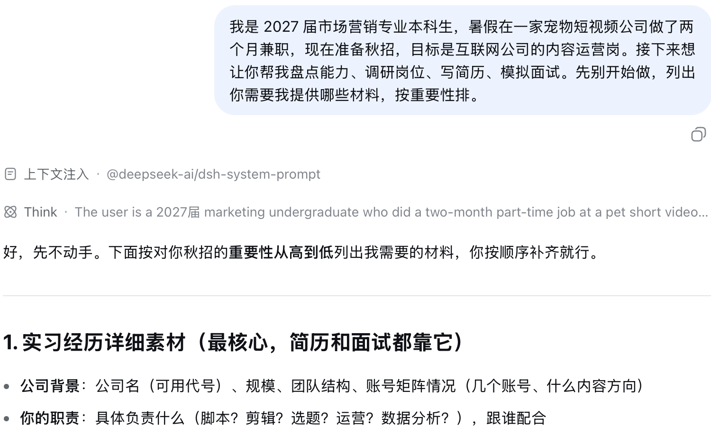{width=92%}

不用照着清单一次写完长篇自传。手里已有的笔记、项目总结和作品可以直接放进工作区，零散信息再通过聊天补充。

从本章配套材料中取得 [`parttime-notes.md`](assets/chapter8/materials/parttime-notes.md)，把它放进 `job-hunt` 工作区。这份笔记按周记录了八周兼职经历，既有脚本和视频的具体数据，也记下了两次直播的经过。校园经历较短，直接在对话里补充。

```text
我已经把兼职期间的记录放在工作区，文件名是 parttime-notes.md。

再补充一些情况。

我在校学生会宣传部做过两年，主要参与公众号选题和文案修改，大二时负责安排十几个人的值班和每周选题会。任职期间公众号粉丝从约 1.2 万涨到 2.4 万，这是团队共同完成的。

课程项目做过一次大学生咖啡消费调研，我是 5 人小组的组长。最后回收了 412 份有效问卷，还做了 15 次访谈。我主要负责问卷修改、部分访谈、SPSS 分析和汇报材料，项目成绩 94 分。

另外参加过校内新媒体创意大赛，4 人组队获得一等奖，我负责选题、文案和展示材料。平时会用剪映、Excel，SPSS 能做基础分析。英语六级 512 分。我觉得自己执行力还可以，但公开表达容易紧张。

请读取 parttime-notes.md，结合这些补充信息分析我的个人能力，并保存为“能力档案.md”。请分清个人工作和团队成果，证据不足的内容列为待补充。
```

篇幅较长、后面还要反复查的材料留在工作区。校园经历这类短信息直接发在对话里。dsh 会把两处材料一起写进 `能力档案.md`。

### 打开文件核对事实

`能力档案.md` 生成后，先查每个数字的来路和成果归属。措辞是否顺眼可以稍后再看。

初版有两处明显问题。它用“写了 14 条脚本，发布 9 条”算出了 64% 的过稿率，可材料没有说明其余 5 条为什么没有发布，这个比例无法成立。它还把一条视频的播放表现和账号增长放得太近，个人贡献与团队结果没有分清。

发现这类问题时，直接指出事实边界，让 dsh 覆盖原文件。

```text
请修正“能力档案.md”。14 条脚本、9 条发布不能写成过稿率；爆款发布后近万涨粉属于账号数据；账号整体增长属于团队成果。同步修正总览、分项和成果清单，覆盖原文件。
```

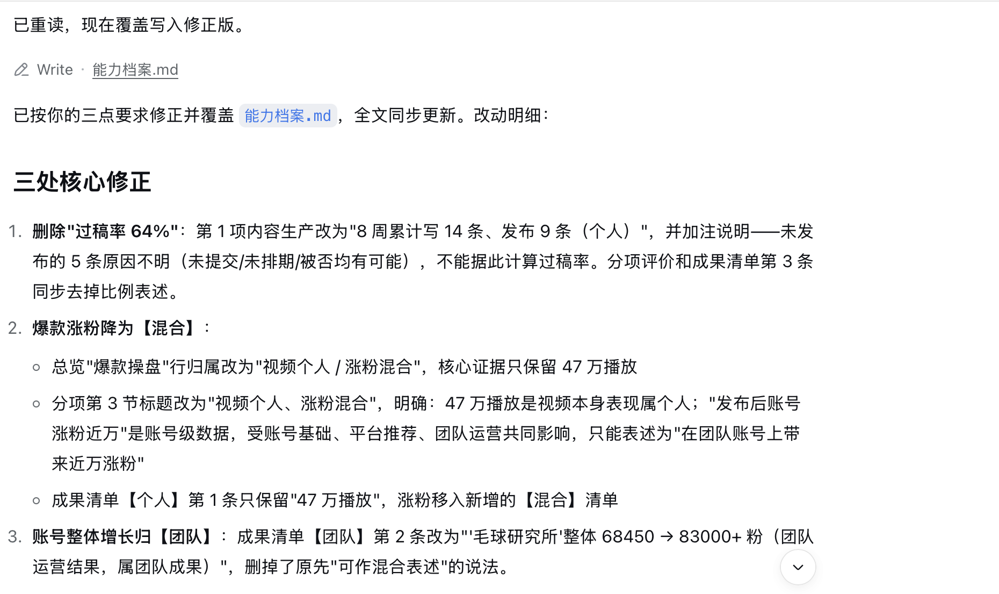{width=92%}

修正后，能力档案写成“个人负责的视频播放 47 万”。发布后的近万涨粉仍是账号数据，账号整体从 68450 增至 83000 多则是团队结果。后面写简历和做模拟面试时，也按这个归属来写。

## 分析就业市场 {#sec-8-2}

能力档案整理完，暂时不要写简历。目标岗位还没查，内容只能凭感觉取舍。先把城市和岗位范围说清，再让 dsh 分头搜索。

### 用四个子 Agent 分头调研

继续在当前工作区发送下面的要求。

```text
先进入岗位调研，待补充材料暂时不补。

我想投北京、上海、杭州、深圳的内容运营或新媒体运营校招岗，优先互联网大厂、内容平台和电商平台，不考虑主播、销售和纯投放岗位。

请用 4 个子 Agent 分头调研真实 JD、薪资范围、近一年的技能要求变化和 2027 届校招时间。目标收集 10 份可以核验的 JD，每份记录公司类型、城市、岗位要求、来源网址、发布日期和采集日期。页面打不开或日期不明就如实标注；不足 10 份时写明实际数量和原因，不要补造。最后汇总为“岗位调研.md”，并在文末保留 JD 原文要点。
```

这四项任务互不依赖，适合并行处理。运行时可以看到四个子 Agent 分别查找不同地区的 JD、薪资与技能变化，以及校招时间线。

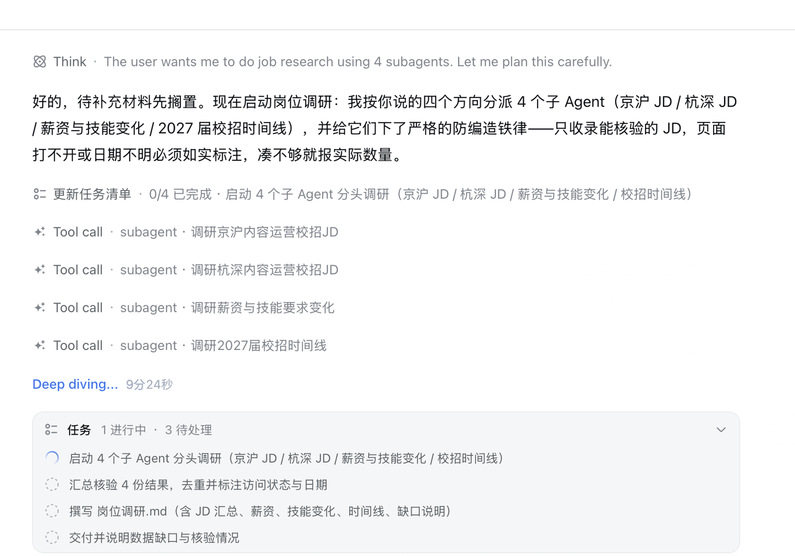{width=92%}

每个子 Agent 都会留下原始报告，主 Agent 再把它们合并成 `岗位调研.md`。原始报告保留搜索过程和来源，后面抽查某条结论时还能回来看。

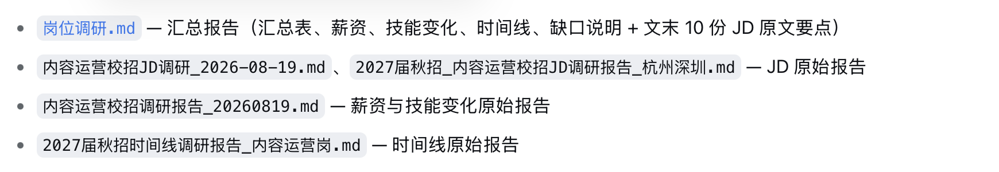{width=92%}

### 先确认样本口径

岗位网页会不断更新，你得到的结果可能与本章不同。2026 年 8 月 19 日这次调研保留了 10 份样本，其中有往届岗位，也有已经截止或批次存疑的岗位。这批材料只能用来观察要求出现的频率，不能写成“目前有 10 个岗位可以投”。网页打不开或日期不明，都要在文件中照实记录。

10 份样本中只有 2 份把 AI 工具列为加分项或优先项，因此这次只能写“部分岗位提到 AI 工具”，不能写成普遍门槛。

### 比较岗位要求和个人证据

接着把岗位要求和现有证据放到一张表里。

```text
读取“能力档案.md”和“岗位调研.md”，生成“差距表.md”。

表格包含四列，分别是岗位要求、现有证据、差距、毕业前可以完成的补救动作。

岗位要求只从“岗位调研.md”文末的 10 份 JD 原文要点中统计，写明每项要求在 10 份样本中出现了几次，按出现次数排序。这个样本包含往届、已截止和批次存疑的岗位，只能用于观察岗位要求，不能代表当前全部市场。

现有证据只能引用“能力档案.md”中已经记录的事实，找不到证据就写“无”。团队成果不能改写成个人成果，也不要补充材料里没有的经历。

AI 工具目前只能按部分 JD 中的加分项或优先项处理，不能写成普遍的准入门槛。补救动作要具体、能够实际执行。完成后保存文件并说明样本口径。
```

在这 10 份样本里，数据分析和内容策划各出现 8 次，跨部门协作与平台内容生态各出现 7 次，项目管理出现 6 次。差距表把这些要求和个人证据放在一起，并给出毕业前还能完成的补救动作。

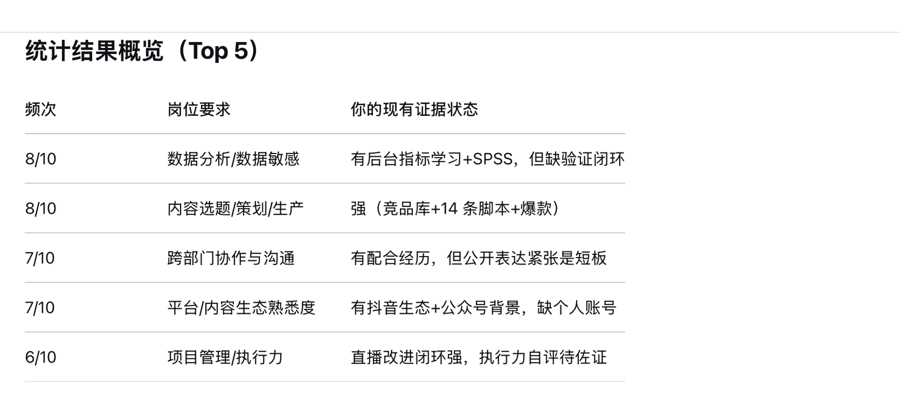{width=92%}

人工复查时，我们在表格后半段发现了“8 周全勤兼职”。原始笔记只证明兼职持续八周，没有全勤记录。这次操作没有回头覆盖 `差距表.md`，后面的简历也没有采用这句话。照着做时，应先删除这句，把证据栏改为“无”，再进入简历阶段。

## 优化个人简历 {#sec-8-3}

差距表汇总了一批岗位的共性。写简历时还要选定一份具体 JD，再从现有经历中挑出与它关系最紧的内容。

### 选择一份具体 JD

```text
结合“能力档案.md”“岗位调研.md”和“差距表.md”，选一份和我经历最匹配的内容运营 JD，保存为“目标JD.md”。优先选择当前可投的岗位，没有合适的就选一份作为简历练习并说明状态。

然后针对这份 JD 写一页中文简历。个人信息先用占位符，只使用能力档案中有证据的经历和数字，分清个人成果和团队成果，不要补造。保存可编辑的“resume-draft.md”，同时导出“resume-draft.pdf”，检查 PDF 没有乱码、截断或多余空白页。
```

dsh 最后选择了快手的媒体号运营实习岗位。它不属于前面设定的校招岗，本章只用它练习对岗改写。2026 年 8 月 19 日采集时，页面仍标记为进行中。如果你只投校招岗，应当另换一份 JD。正式投递前还要重新确认岗位状态和申请条件。

### 先修正事实，再换排版

第一版 PDF 能打开，也只有一页，中文没有乱码。它把两个月兼职写成了实习，加入了未经确认的到岗时间与六个月实习承诺，还把“第 4 周有两条脚本改动较少”概括成“稳定过稿”。版面上的分隔线穿过正文，页面下方也留下大片空白。

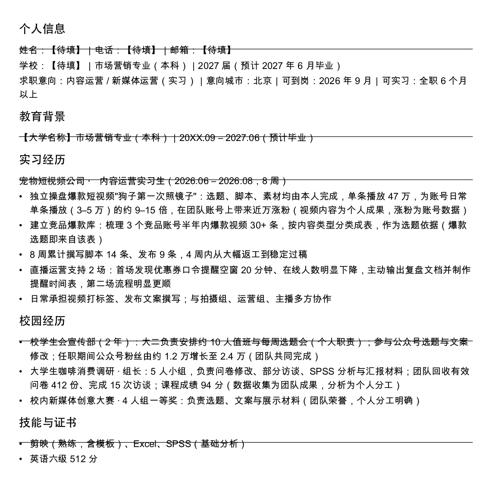{width=82%}

修改时保留初版，新稿另存为 `resume-new.md`，后面还要用它更换模板。

```text
我检查了初版 PDF。请保留初版文件，把优化结果另存为 resume-new.md 和 resume-new.pdf。

重新排成一页 A4 简历，姓名放在顶部，联系方式排成一行，各部分标题样式统一，不要再让分隔线穿过文字。

同时修正几处内容。两个月的经历是兼职，不能写成实习生；删除未经确认的到岗时间和六个月实习承诺；把“稳定过稿”改为“第 4 周有两条脚本改动较少”。其他内容继续严格依据能力档案，不要补造。
```

第二版修正了这些事实，排版仍然简单，姓名还出现了重复。于是我们让 dsh 停用原来的 PDF 脚本，改用 RenderCV 生成三个模板。

```text
现在的简历排版还是不好看，而且姓名重复了。不要继续使用原来的 PDF 生成脚本。请安装并使用 RenderCV，把 resume-new.md 的现有内容套入简历模板，分别使用 classic、moderncv、harvard 三种样式，各生成一份一页 A4 的 PDF，放在 resume-options 文件夹中。使用本机可用的中文字体，姓名只出现一次，不要修改或补充简历内容。完成后列出三份 PDF 文件。
```

本次操作中，Python 3.9 无法安装 RenderCV 2.8，dsh 改用 uv 建立独立的 Python 3.12 环境。你的本机环境可能不同，遇到安装或命令执行确认时，先核对命令和安装位置。安装失败就如实报告原因，不能靠修改扩展名伪造 PDF。

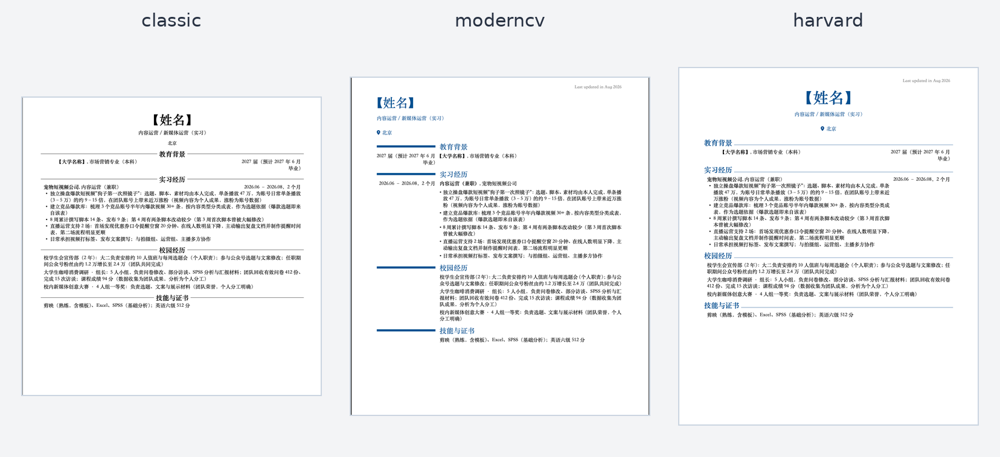{width=98%}

比较三份 PDF 后，我们选择 classic。它是单栏，信息密度适中。中文经历从上到下读起来也顺。选定模板后，再围绕目标 JD 调整内容顺序和措辞。

```text
请读取“目标JD.md”“能力档案.md”和“差距表.md”，基于 classic 版简历做针对目标岗位的优化。

优先展示与岗位最匹配的内容策划、短视频运营、数据分析和协作经历，调整简历顺序和措辞，弱化无关信息。不要增加不存在的经历、修改数字或把团队成果写成个人成果。

同时补回电话和邮箱占位符，删除英文更新时间，把“实习经历”改成“兼职经历”。保留 classic 模板和一页篇幅，输出 resume-final.pdf 及对应源文件，并简要说明针对目标岗位调整了哪些内容。
```

dsh 保留 classic 模板，调整内容顺序，并生成 `resume-final.pdf` 和 `resume-options/resume-final.yaml`。后面模拟面试会读取这份 YAML 文件。如果你的源文件名称不同，记得替换提示词里的路径。

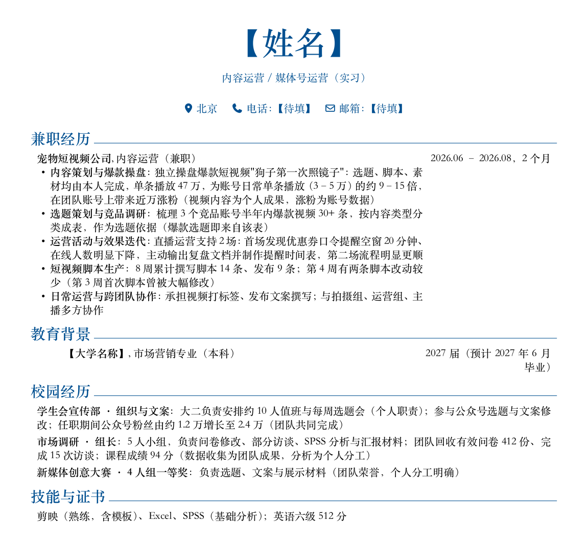{width=82%}

打开这份对岗版 PDF，至少检查下面几件事。

- 文件确实只有一页，页面尺寸为 A4
- 中文没有乱码，正文没有截断
- 电话和邮箱仍是待填写的占位符
- 兼职经历没有被改写成正式实习
- 团队增长没有写成个人增长
- 简历中的数字和能力档案一致
- 素材、直播和涨粉的措辞没有超出原始材料

文件名里的 `final` 只表示本轮简历修改结束。模拟面试还会继续检查里面的说法，这一版暂时不要直接投递。

## 模拟求职面试 {#sec-8-4}

简历写完，马上拿它做模拟面试。先让 dsh 一次列出六个问题，看看会问到哪些内容。正式回答时一次只问一题，追问更容易碰到材料里没有写清的地方。

### 先生成六个问题

生成题单时，我们误写了一个尚未生成的 `resume-audit.md`。dsh 在题单开头标出文件缺失，随后使用目标 JD 和简历源文件生成了六道题。

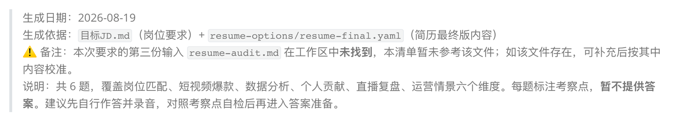{width=92%}

这张图保留的是一次真实失误。dsh 报告文件缺失时，应先核对工作区和文件名，不能跳过警告继续假定文件存在。下面的提示词已经删掉了这个错误依赖。

```text
请读取“目标JD.md”和“resume-options/resume-final.yaml”，根据目标岗位一次性生成 6 个面试问题，覆盖岗位匹配、短视频爆款、数据分析、个人贡献、直播复盘和运营情景题。每题注明考察点，但先不要提供答案，保存为“面试题清单.md”。
```

题单生成后，从中挑三道最值得深挖的问题开始模拟。

```text
现在开始模拟面试。请从这些问题中选择最值得深挖的 3 个，一次只问一个，并根据我的回答最多追问一次。中途不要点评；完成后生成“面试复盘.md”。
```

### 如实回答比背答案更有用

第一题追问 47 万播放视频的素材来源和选题依据。回答说明素材由本人搜集，后续完成了筛选和拼接剪辑，也承认当时没有留下选择“照镜子”方向的具体依据。

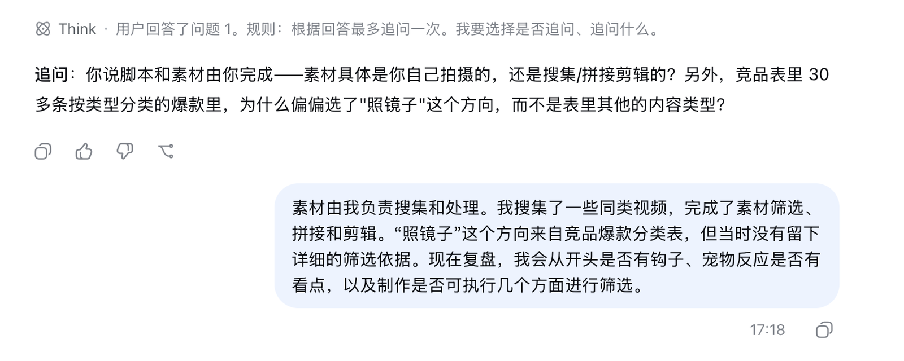{width=92%}

第二题围绕后台数据展开。此前提出过“周四晚上数据更好”的猜想，却没有留下验证结果。继续追问时，回答者说出了数据透视表和几个 Excel 函数，能力档案里却找不到相应的实操记录。现有材料还不足以证明熟练程度。

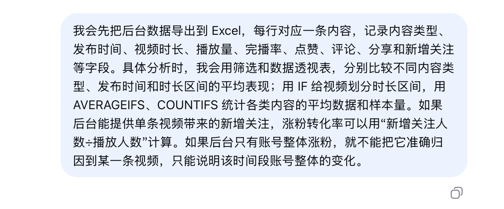{width=86%}

第三题检查两场直播的复盘。第二场“更顺”来自现场观察，没有后台数据支撑，更准确的表述是“现场未观察到长时间提醒空窗”。简历上的一句概括被追问两层，证据够不够就看出来了。

三轮结束后，dsh 把暴露出来的问题写进 `面试复盘.md`。关键数据没有保留，素材来源、直播结果和涨粉口径前后不一，Excel 分析方法也缺少实操记录。

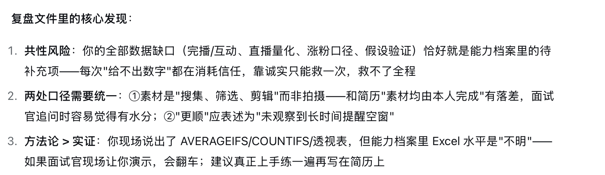{width=92%}

`面试复盘.md` 是这轮模拟的最后一个文件。它指出了素材来源、直播结果和 Excel 熟练度等证据缺口。正式投递前，应按复盘逐句修改简历，再重新导出 PDF。
