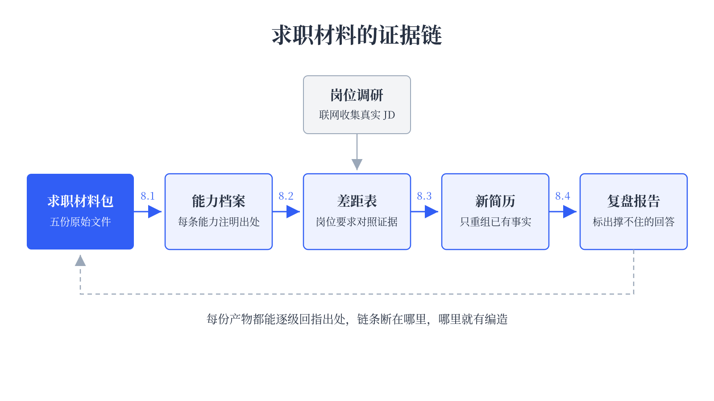

# 让 dsh 帮你找工作 {#ch-8}

## 分析个人能力 {#sec-8-1}

秋招在即，求职材料却往往散落在各处。成绩单在教务系统里，暑假兼职两个月做了什么只记在几篇周记里，简历更是一个字都还没写过。这一节把这些材料收进一个工作区，让 dsh 通读一遍，整理出一份能力档案，每条能力都注明证据出自哪份文件的哪一段。这份档案是全章的底本。

{width=92%}

### 从几句话开始

新建一个空文件夹 `job-hunt`，打开 dsh，单击 **Add workspace** 选中它，新建会话，确认使用 **Standard mode**。

求职的开场往往就是几句话的事。把处境原样告诉 dsh，先不让它动手，让它开一份需求清单。

```text
我是 2027 届市场营销专业本科生，暑假在一家宠物短视频公司做了两个月
兼职，现在准备秋招，目标是互联网公司的内容运营岗。接下来想让你帮我
盘点能力、调研岗位、写简历、模拟面试。先别开始做，列出你需要我提供
哪些材料，按重要性排。
```

<!-- 待实测：dsh 开出的材料清单 -->
<!-- 截图 8-1-01（存为 8-1-01-material-list.png）：dsh 列出它需要的求职材料清单 -->

几句话只够开场。往后的步骤里，能力档案每一条都要注明出处，简历每一句都要有事实支撑，这些规矩决定了 dsh 手里必须有真材料，光凭一句“兼职过”，它能写出来的东西只能靠编。所以接下来照着清单交作业。清单里如果点到目标公司、岗位 JD 这类条目，先放一放，那是 8.2 的活，这一步只交手里现成的记录。

### 准备一套求职材料

书里的演示交出下面五份材料，全部是构造的，人物、公司和所有数据均为虚构，如有雷同纯属巧合。主角李小磊的处境就是开场那几句话，材料是他翻箱倒柜找出来的家底，简历不在其中，他还从来没写过，这正是 8.3 要解决的事。

- `parttime-notes.md`，暑期兼职八周的流水账周记
- `transcript.md`，主要课程成绩
- `project-report.md`，市场调研课程项目的总结
- `activities.md`，学生会、竞赛和证书清单
- `self-notes.md`，投简历前随手写的自我盘点

手里连兼职、实习的经历都没有，也不妨碍照做。学生会、课程项目、竞赛这些校园材料同样是证据源，这套流程只认文件里写了什么，不挑经历的出身。材料越薄，越该早点做出 8.2 那张差距表。

### 把材料交给 dsh

材料不用先在电脑里做成文件，直接粘贴进输入框，让 dsh 替你保存。先发最厚的一份，兼职周记，输入下面的内容。

```text
把下面的内容原样保存为 parttime-notes.md，一个字都不要改。

# 兼职记录（2026 年暑假，拾光文化传媒）

随手记的，想到什么写什么。

## 第 1 周（6.22 - 6.26）

入职。带我的是运营组的陈姐。公司做宠物类短视频账号，最大的号叫“毛球研究所”，6.23 那天看是 68450 粉。这周主要在熟悉发布后台和剪映模板，帮忙给视频打标签、写发布文案。办公室有两只猫，一只很凶。

## 第 2 周

帮陈姐整理选题，把三个竞品账号最近半年的爆款视频都翻了一遍，做了个表格，记了 30 多条，按内容类型分了类。周四下午跟拍摄组去了一家猫咖，帮忙举反光板。

## 第 3 周

第一次写脚本，写了三条，被改得很惨。陈姐说开头 3 秒必须有钩子，我写的太像作文。周五发的那条开罐头的，初稿是我写的，她改了开头。

## 第 4 周

这周过了两条脚本，没怎么大改。学着看后台数据，完播率、点赞比这些。感觉周四晚上发的视频数据要好一点，不确定，先记着。

## 第 5 周

周二那条“狗子第一次照镜子”爆了，播放 47 万，账号平时一条也就 3 万到 5 万。这条的选题、脚本、素材都是我自己弄的，方向是从第 2 周那个竞品表里挑的。号一下涨了小一万粉。陈姐在组会上表扬了。

## 第 6 周

公司搞直播卖宠物零食，我做场控，盯评论区、提醒主播念福袋。中间有 20 分钟没人念优惠券口令，在线人数掉得厉害。下播之后我把流程和出的问题记了一页，发到组群里了。

## 第 7 周

第二场直播。这次提前把口令和福袋的提醒做成时间表，贴在提词器旁边，这场顺多了。平时继续写脚本，到这周一共写了 14 条，发出来 9 条。

## 第 8 周（最后一周）

交接。走的时候“毛球研究所”是 83000 粉出头。选题表和两场直播的复盘都留给了组里。最后一天陈姐请我喝了奶茶。
```

<!-- 待实测：dsh 保存文件的实际过程 -->
<!-- 截图 8-1-02（存为 8-1-02-save-notes.png）：dsh 把粘贴的周记存成 parttime-notes.md，回复末尾带产物标签 -->

这份周记值得多看两眼。第 5 周记着一条独立选题的视频播放 47 万，而账号平时一条只有 3 万到 5 万；第 1 周和第 8 周各记了一次粉丝数，八周从 68450 涨到 83000 出头；第 2 周整理的 30 多条竞品选题表，离职交接时留给了组里。这些数字连本人都没当回事，`self-notes.md` 里还在担心数据能力够不上招聘要求。材料里躺着的和自己意识到的差多远，这一章要处理的就是这个落差。

剩下四份（transcript.md、project-report.md、activities.md、self-notes.md）照同样的办法逐份保存，全文都在随书资源的 `assets/chapter8/materials/` 目录里，复制粘贴即可，换成自己的真实材料也一样。其中 `self-notes.md` 里“审美还行”“PS 算熟练吧”这类自我感觉，等会儿正好用来检验 dsh 分不分得清证据和自我评价。全部存完，发一句“列出工作区里现在的文件”，确认五份都在。

<!-- 待实测：其余材料保存与文件列表 -->
<!-- 截图 8-1-03（存为 8-1-03-files-ready.png）：dsh 列出工作区文件，五份材料齐备 -->

### 让 dsh 通读材料

这一步的提示词要把规矩立在前头。目的是盘点，先不做包装，所以要求每条能力都给出处，有事实支撑的和自我评价分开，没佐证的单独挂起，并且明说禁止美化。在输入框里输入下面的内容。

```text
通读这个工作区里的全部文件，这是一名 2027 届市场营销专业本科生的求职材料。
把它整理成一份能力档案，保存为 能力档案.md，规则如下：

1. 每条能力单独成条，写明判断依据来自哪份文件的哪一段，引用原文关键句；
2. 有具体事实或数字支撑的能力，和只在 self-notes.md 里出现的自我评价，
   分成两个部分，不要混在一起；
3. 全部材料里都找不到佐证的说法，以及材料内部相互矛盾的地方，单独
   列在“存疑”部分，并说明原因；
4. 只做整理和归纳，不要美化，不要替材料补充它没有的内容。
```

<!-- 待实测：dsh 通读材料并生成 能力档案.md 的实际过程与结果，以下描述以实测为准 -->
<!-- 截图 8-1-04（存为 8-1-04-read-materials.png）：发送提示词后，dsh 逐个读取材料文件的消息流，可见一串 Read 工具调用 -->
<!-- 截图 8-1-05（存为 8-1-05-profile-done.png）：dsh 完成整理后的回复，末尾带 能力档案.md 的产物标签 -->
<!-- 截图 8-1-06（存为 8-1-06-profile-evidence.png）：能力档案.md 中有证据支撑的能力条目，可见出处标注 -->
<!-- 截图 8-1-07（存为 8-1-07-profile-doubts.png）：能力档案.md 中自我评价与“存疑”部分 -->

### 核对证据

第一章养成的习惯在这里接着用，别只看聊天回复，去工具调用里核对。挑档案里任意一条能力，点开消息流里对应的 `Read` 调用，回到材料原文对一遍，确认引用的句子真实存在、数字没有被改动。

再重点看存疑部分。`self-notes.md` 里“审美还行，做的推送同学都说好看”，全部材料里找不到任何数据佐证，属于口碑式自评；“PS 算熟练吧”能对上的也只有公众号排版这一件事。这类说法应当被剔进存疑区或降级表述；而有 47 万播放数字撑着的爆款选题、有涨粉记录的公众号运营，应当稳稳站在证据区。档案有没有分对，是判断这次整理质量的关键。

<!-- 待实测：存疑部分的实际内容与核对结果 -->
<!-- 截图 8-1-08（存为 8-1-08-read-verify.png）：展开一条能力对应的 Read 工具调用，与材料原文对照 -->

能力档案立住了，下一节去看市场那一头。

## 分析就业市场 {#sec-8-2}

能力档案回答了手里有什么，这一节回答市场要什么。让 dsh 上网调研内容运营岗的真实招聘要求，汇总成 `岗位调研.md`，再对着能力档案算出差距，产出 `差距表.md`。

### 让多个子 Agent 分头调研

调研范围拆成几个互相独立的问题，正好用第三章写研究报告时的方法，交给多个子 Agent 同时查。任职要求、薪资分布、技能趋势、校招时间线，这几个问题谁也不依赖谁，分头查比串行快，各自的来源也好核对。继续在 `job-hunt` 工作区的会话里输入下面的内容。

```text
我在准备 2027 届校招，目标岗位是内容运营 / 新媒体运营，本科学历。
请同时用 4 个子 Agent 分头上网调研：

1. 主流招聘平台上这个岗位对应届生的任职要求，摘录至少 10 份真实 JD
   的原文要点，注明公司类型和学历要求；
2. 这个岗位在一线和新一线城市的薪资范围，以及大厂、内容平台和
   电商公司各自的招聘情况；
3. 近一年这个岗位技能要求的变化，比如 AI 工具、短视频、直播电商
   相关要求的出现频率；
4. 面向 2027 届的校招渠道和时间线，包括秋招提前批的常见节点。

每个子 Agent 都要记录信息来源的网址和发布时间，只使用能打开的真实
网页，拿不准的信息明确标注。全部返回后合并成 岗位调研.md，重复内容
去重，并把收集到的 JD 原文要点完整保留在文末。
```

一个提醒。招聘网站对自动访问普遍不友好，个别站点可能打不开或要求登录。调研反复卡住就换条路，把自己在招聘 App 里收藏的 JD 逐份复制成文本文件放进工作区，让 dsh 直接读文件做同样的汇总，后面的步骤不受影响。

<!-- 待实测：4 个子 Agent 的实际调研过程与 岗位调研.md 的内容 -->
<!-- 截图 8-2-01（存为 8-2-01-agents-running.png）：4 个子 Agent 并行调研的运行状态 -->
<!-- 截图 8-2-02（存为 8-2-02-agent-detail.png）：展开某个子 Agent 的执行明细，可见搜索和网页访问过程 -->
<!-- 截图 8-2-03（存为 8-2-03-research-md.png）：汇总生成的 岗位调研.md，可见任职要求高频项与来源网址 -->
<!-- 截图 8-2-04（存为 8-2-04-jd-list.png）：岗位调研.md 文末保留的 JD 原文要点 -->

调研回来先抽查来源。挑两条要求，打开记录的网址，确认 JD 真实存在、要点没有被转述走样。这一步过了，材料才有资格进下一张表。

### 产出差距表

差距表是把两份文件对到一起，一边是调研出来的岗位要求，一边是能力档案里有出处的证据。规则同样写死，证据只认能力档案，档案里没有就写“无”，防止 dsh 在对表时顺手替人贴金。

```text
读取 能力档案.md 和 岗位调研.md，对照产出一份 差距表.md。
表格四列：岗位要求、现有证据、差距、毕业前来得及做的补救动作。

岗位要求取调研里出现频率最高的条目，按频率从高到低排；现有证据只允许
引用能力档案里有出处的内容，档案里没有的就如实写“无”；补救动作要具体
到能直接执行，比如把哪段经历整理成带数据的案例、把哪个工具练到能
独立出活，不要写“加强学习”这类空话。
```

<!-- 待实测：差距表实际内容 -->
<!-- 截图 8-2-05（存为 8-2-05-gap-table.png）：生成的 差距表.md，可见四列结构与写着“无”的条目 -->

差距表的要害在“现有证据”这一列。顺着任意一行往回查，应当能从差距表追到能力档案，再从能力档案追到原始材料，这条链断在哪里，哪里就有编造。“无”写得多也不必慌，它们标出的正是补救动作该发力的地方，也是下一节改简历时不许硬凑的地方。

## 优化个人简历 {#sec-8-3}

差距表放在手边，接下来写简历。李小磊到现在还没有简历，第一份也不用自己憋，让 dsh 从能力档案里把它长出来，再对着具体的 JD 优化。红线先立起来，dsh 只许使用材料里已有的事实，一条经历不许编，一个数字不许改，写完还要逐句自查证据。这条红线不能只放在心里，要直接写进提示词。

### 选定目标 JD

简历要对着具体岗位改，泛泛的“帮我优化一下”改不出针对性。先让 dsh 从调研里挑出最值得投的。

```text
从 岗位调研.md 文末保留的 JD 里，挑出与 能力档案.md 重合度最高的 3 份，
逐份说明推荐理由和主要差距，再把最推荐的一份 JD 原文单独保存为
目标JD.md。
```

<!-- 待实测：dsh 推荐的 JD 与理由 -->
<!-- 截图 8-3-01（存为 8-3-01-jd-candidates.png）：dsh 给出的 3 份候选 JD 与推荐理由 -->
<!-- 截图 8-3-02（存为 8-3-02-target-jd.png）：保存下来的 目标JD.md -->

推荐不合意就自己换，把选中的 JD 原文存进 `目标JD.md` 即可，后面的步骤只认这个文件。

### 生成初稿，再对岗优化

初稿先不看 JD，让 dsh 只凭能力档案写，写实是第一位的。提示词里红线占了一半篇幅，允许做的只有把材料里的事实写成“做了什么、怎么做的、结果如何”，禁止的逐条列明。

```text
根据 能力档案.md 写一份简历初稿，保存为 resume-draft.md。规则如下：

1. 只允许使用材料里已有的事实，禁止编造任何经历，禁止修改或拔高
   任何数字；
2. 经历写成“做了什么、怎么做的、结果如何”，结果优先用材料里已有
   的数字说话；
3. 材料撑不住的能力宁可不写，不要用“沟通能力强”这类没有事实支撑
   的套话凑数；
4. 姓名用材料里的，联系方式一栏留空，由本人自己填；
5. 保持单页简历的常规结构，用中文。
```

初稿落地后再对着目标岗位调整，优化动的是顺序和详略，动不得事实。

```text
读取 resume-draft.md 和 目标JD.md，针对这份 JD 优化出投递版，保存为
resume-new.md。只调整顺序、详略和措辞，把 JD 最看重的经历放到前面
写足，关系不大的压缩；JD 里要求、材料里没有的能力，宁可空着，不要
硬凑；不新增任何事实，不改动任何数字。
```

周记里那条 47 万播放的爆款、八周从 68450 涨到 83000 的粉丝数、被组里留用的选题表和直播复盘，写成简历条目该是什么样，等初稿出来逐项核对。数字要原样保留，流水账要被压成有力的条目，JD 不看重的内容要在优化稿里让位。

<!-- 待实测：resume-draft.md 与 resume-new.md 的实际内容 -->
<!-- 截图 8-3-03（存为 8-3-03-resume-draft.png）：生成的简历初稿 resume-draft.md -->
<!-- 截图 8-3-04（存为 8-3-04-optimize-diff.png）：初稿与优化稿的同一段对照，可见顺序和详略的调整 -->
<!-- 截图 8-3-05（存为 8-3-05-resume-new.png）：resume-new.md 全文 -->

### 逐句自查

改完不算完，让 dsh 自己回头查一遍，给每句话找出处。

```text
逐句检查 resume-new.md，在每句话后面标注证据来自工作区哪份文件的
哪一段；标注不出出处的句子直接删掉，并列出删了哪些、为什么删。
```

<!-- 待实测：自查结果与被删句子清单 -->
<!-- 截图 8-3-06（存为 8-3-06-self-check.png）：逐句标注出处的自查结果 -->
<!-- 截图 8-3-07（存为 8-3-07-deleted-lines.png）：被删掉的句子清单（如果有） -->

这一步防的是 AI 改简历最常见的事故，改过头。措辞漂亮但材料撑不住的句子，面试官顺着追问两句就会露馅。

### 导出投递版

自查过关的 `resume-new.md` 还是个 Markdown 文件，投递前要排成一页 PDF。先把简历里留空的联系方式补上再导出，成品才是能直接投出去的。这正好是第四章用过的办公文档能力，一段提示词就够。

```text
把 resume-new.md 排版成一页 A4 简历，导出为 PDF，文件名用
李小磊-内容运营-简历.pdf。版式简洁易读，不加花哨装饰，重点数字保持醒目。
```

<!-- 待实测：排版导出的实际过程与效果 -->
<!-- 截图 8-3-08（存为 8-3-08-resume-pdf.png）：导出的单页 PDF 简历 -->

打开导出的 PDF 检查一遍，确认内容和 `resume-new.md` 一致、没有溢出到第二页。别把露馅留到真面试现场，投出去之前，下一节先在 dsh 这里过一遍。

## 模拟求职面试 {#sec-8-4}

这一节让 dsh 换到桌子对面，当一回面试官。用第二章创造模式的方法建一个面试官预设，进行几轮真实作答的模拟，最后拿一份复盘报告。

### 创建面试官预设

面试官要在整场对话里记住自己的身份和规矩，一段临时提示词容易聊着聊着被带偏，做成预设更稳，也正好复用第二章的方法。在模式下拉框切到创造模式，在 `job-hunt` 工作区新建会话，输入下面的内容。

```text
帮我基于 standard 创建一个新的 agent preset，id 用 interviewer，
显示名叫“面试官”，描述写清楚这是模拟校招面试用的预设。
人设和行为规则如下：

1. 你是一家互联网公司内容运营团队的负责人，正在面试 2027 届校招生，
   语气专业、克制，不闲聊；
2. 面试开始时先读工作区里的 目标JD.md 和 resume-new.md，所有问题
   围绕这两份文件展开；
3. 一次只问一个问题，根据回答追问，追问要扣住简历里的具体经历和
   数字，比如数据怎么统计的、选题怎么想出来的、结果里有多少是
   本人的贡献；
4. 不主动给答案，不在面试中途点评对错；
5. 收到“面试结束”后停止提问，输出一份复盘报告，逐条评价刚才的
   回答，指出哪些答得扎实、哪些暴露了简历撑不住的地方，并给出
   改进建议。
```

<!-- 待实测：预设创建过程与生成的文件位置 -->
<!-- 截图 8-4-01（存为 8-4-01-preset-created.png）：创造模式完成预设创建，报告改动的文件 -->
<!-- 截图 8-4-02（存为 8-4-02-preset-dropdown.png）：模式下拉框里出现“面试官”选项 -->

第二章踩过的坑这里会再遇到一次，预设只对新建的会话生效。建完回到模式下拉框选中“面试官”，再开一个新会话，模拟才作数。

### 进行模拟

新会话里打一句“你好，我准备好了，请开始面试”。

面试官提问之后，像真面试一样凭记忆作答，别翻着材料念。答不上来就如实说答不上来，暴露问题正是模拟的目的，此处丢的分，真面试就不用再丢一遍。答上几轮，输入“面试结束”。

<!-- 待实测：多轮模拟面试的实际对话 -->
<!-- 截图 8-4-03（存为 8-4-03-interview-open.png）：面试官读取 JD 和简历后的开场提问 -->
<!-- 截图 8-4-04（存为 8-4-04-interview-probe.png）：面试官扣住简历数字追问的对话片段 -->
<!-- 截图 8-4-05（存为 8-4-05-interview-rounds.png）：连续几轮问答的完整对话 -->
<!-- 截图 8-4-06（存为 8-4-06-debrief-report.png）：输入“面试结束”后生成的复盘报告 -->

### 对照复盘

复盘报告里被点名“撑不住”的回答，拿去和 8.2 的差距表对照。差距表标的是纸面上的差距，复盘报告标的是被当面问住的地方，两边都出现的条目，就是秋招前最该优先补的。

四节走完，工作区里应当攒下能力档案、差距表、一版句句有出处的简历，还有一份复盘报告。简历投出去，补救动作排进日程。面试官预设留着，每场真面试之前，都值得再来一轮。
