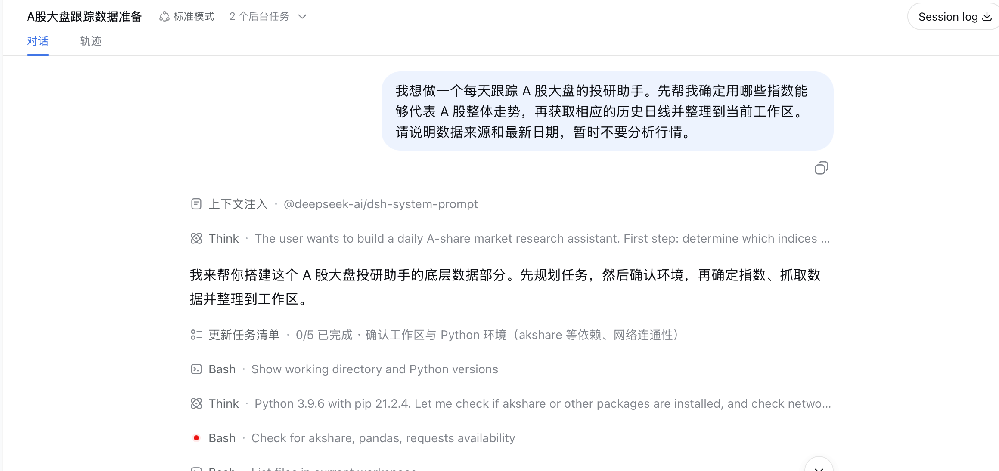
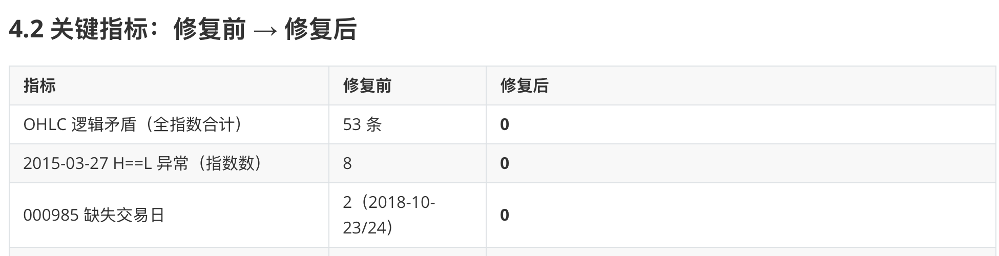
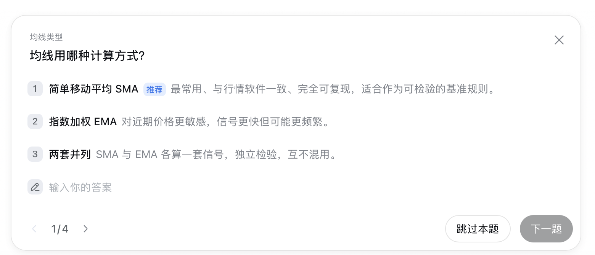
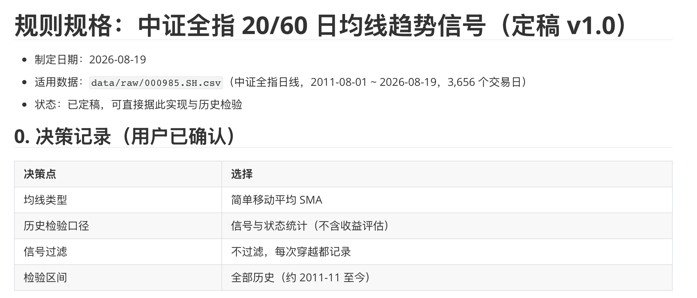
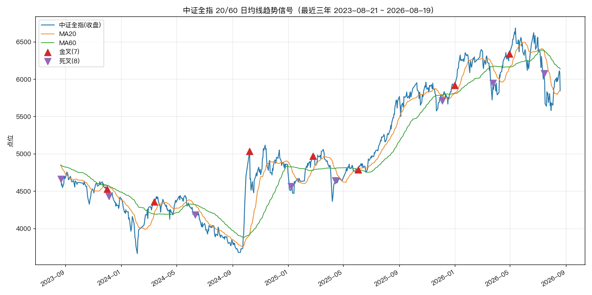
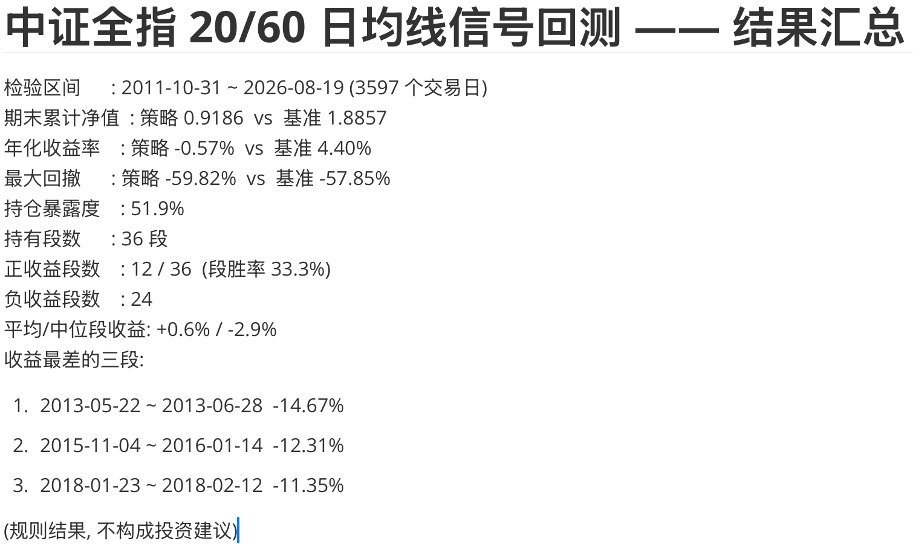
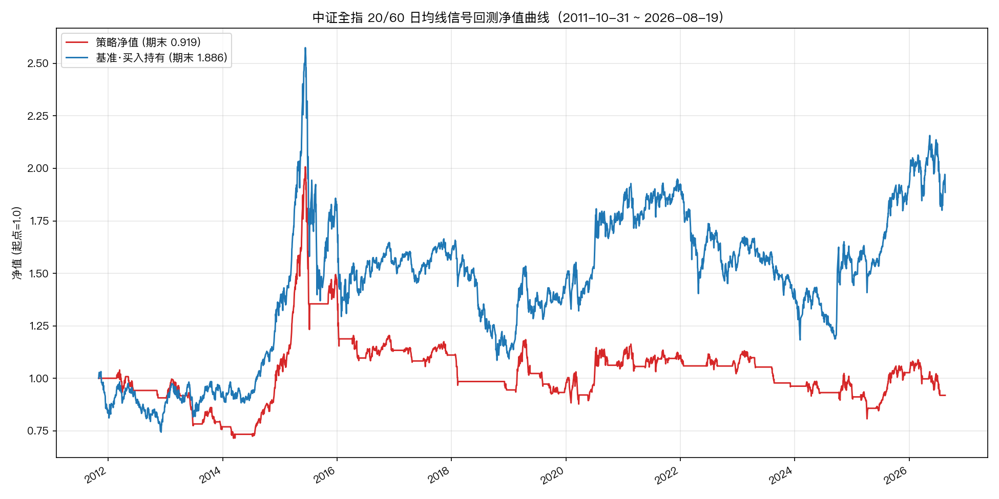
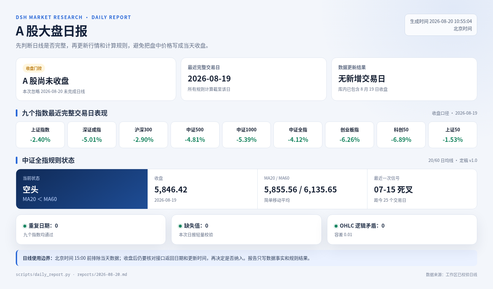
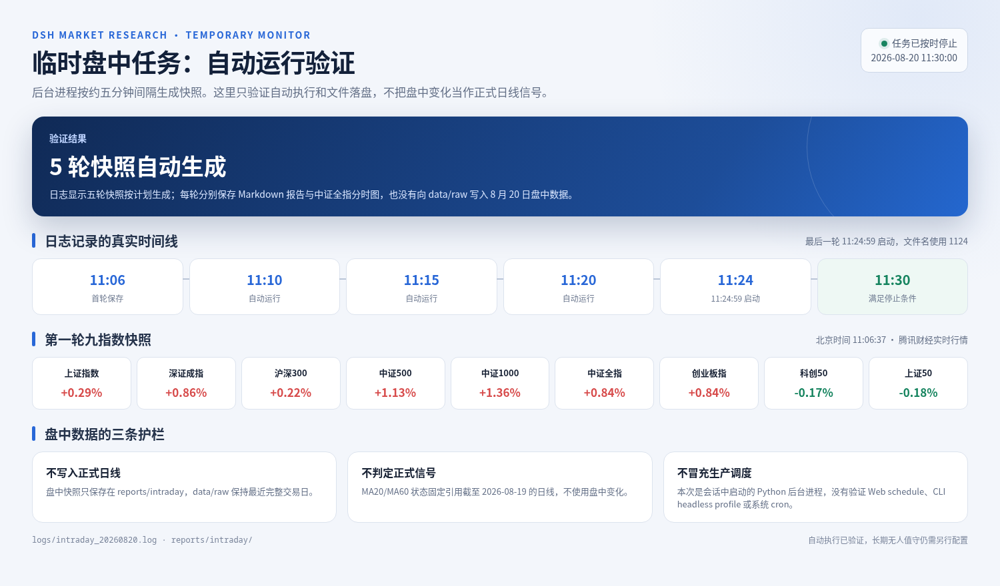

# 用 dsh 构建市场投研助手 {#ch-9}

本章从一句普通的需求开始，让 dsh 整理 A 股市场数据，再把 20 日和 60 日均线写成规则，生成信号、回测和日报。完成这些基础工作后，我们把同一套研究流程用到通富微电和紫金矿业，得到一份带日 K 图、资金流向、板块对照和短期判断的个股报告。

实测使用独立工作区 `a-share-research`，全程采用标准模式。历史数据整理于 2026 年 8 月 19 日，盘中任务运行于 8 月 20 日。工作区记录了 Python 3.9.6，实测材料没有保留 dsh Web 的准确版本号，正文不补写版本。最终产物分布在 `data/`、`signals/`、`backtest/` 和 `reports/`。行情日期、技术指标和回测数字取自现有文件或运行记录，指数说明与公开报道另附来源。

行情接口会变化，历史数据也需要持续复核。文中的短期判断只在给定数据和条件下成立。

## 接入并整理市场行情 {#sec-9-1}

### 用一句普通需求开始

“A 股大盘”并不对应一条唯一的数据序列。上证指数知名度高，但只反映沪市。若要观察整个市场，还要兼顾深市、不同市值层次和主要板块。

新建文件夹 `a-share-research`，将它添加为工作区，再在标准模式下新建会话。第一条消息不用指定安装命令和接口，只需说明目的、交付物与当前边界。

> \textcolor[HTML]{E45C5C}{\large\textbf{提示词内容：}}
>
> 我想做一个每天跟踪 A 股大盘的投研助手。先帮我确定用哪些指数能够代表 A 股整体走势，再获取相应的历史日线并整理到当前工作区。请说明数据来源和最新日期，暂时不要分析行情。

先看图 9-1 左侧的工作区名称、顶部的标准模式，以及右侧的首条消息。这三处信息共同说明了任务从哪里开始。

{width=94%}

dsh 从全市场、沪深市场、市值层次和板块四个角度筛选观察对象，最终留下九个指数。后面的信号规则以中证全指为主，其余指数用于横向观察。为便于书中核对，图 9-2 根据最终 CSV 和复检报告重新排成结果卡，并非 dsh Web 原生页面。

```{=latex}
\begin{figure}[H]
\centering
\includegraphics[width=0.96\textwidth]{assets/chapter9/9-1-02-index-universe.png}
\caption{九个指数及最终历史数据范围}
\end{figure}
```

中证全指是本章的主要观察对象。中证指数公司 2026 年 7 月 31 日发布的[指数资料](https://oss-ch.csindex.com.cn/static/html/csindex/public/uploads/indices/detail/files/zh_CN/000985factsheet.pdf)显示，其样本空间包括上交所、深交所和北交所符合条件的股票与存托凭证。北证 50 因本次接口没有返回历史数据而未单列，万得全 A 属于付费数据，也没有用相似代码代替。

### 让 dsh 处理依赖和接口故障

工作区起初是空的，Python 环境也没有 pandas、requests 和 akshare。dsh 创建虚拟环境并安装依赖。取数时，akshare 的指数映射请求失败，东方财富接口随后多次连接失败。它转而使用能够访问的数据源，并把获取与修补步骤保存成脚本。

本次日线主源是腾讯财经。1990 至 1992 年的上证指数异常段使用同花顺数据替换，四个中证系列指数使用中证指数官网数据补齐或重建。新浪财经只用于近期数据抽查。九份 `data/raw/*.csv` 的字段统一为 `date、open、high、low、close、volume`，`data/combined_close.csv` 保存按日期对齐的收盘价。

当前九份 CSV 合计 44,987 行，最新日期为 2026 年 8 月 19 日。中证全指有 3,656 行。早期日志和元数据仍写着 3,654 行，说明修补数据后没有同步更新这些摘要文件。正文采用当前 CSV 与复检报告的数字，也保留这处差异，提醒读者不要只看旧日志。

### 再做一次只读检查

第一轮取数结束时，dsh 的回复称数据已经通过完整性检查。我们没有直接进入分析，而是继续追问：

> \textcolor[HTML]{E45C5C}{\large\textbf{提示词内容：}}
>
> 帮我检查一下刚获取的行情数据，看看日期和数值有没有重复、缺失或明显异常，并把检查结果保存下来。先不要分析走势。

这条提示漏写了“先报告，不要修改数据”。dsh 在检查后直接修复了文件。处理正式数据时，更稳妥的顺序是先出只读报告，核对问题与来源，再批准修改。文件已经被改动。为了避免继续改变数据，我们随后只整理检查报告，不再批准新的修复操作：

> \textcolor[HTML]{E45C5C}{\large\textbf{提示词内容：}}
>
> 报告里有些历史原因没有注明来源。请重新整理检查报告，只保留数据能够直接证明的结论。需要解释原因的地方补充可核验来源，否则标成“无法核验”。另外把“发现的问题、采取的修复、修复后的复检结果”分开写清楚，不要再修改数据。

检查发现，2015 年 3 月 27 日有八个指数的最低价误填为最高价。中证全指在 2018 年 8 月 3 日至 24 日连续 16 个交易日出现相同收盘值 4666.50，另缺少 2018 年 10 月 23 日和 24 日两条记录。dsh 用同花顺与中证指数官网交叉核对后完成修复。图 9-3 同样是根据 `data/validation_report.md` 整理的核对卡，集中展示四项主要异常在修复前后的变化。

{width=96%}

复检后，OHLC 逻辑矛盾从 53 条降为 0，2015 年 3 月 27 日的八处异常降为 0，中证全指缺少的两条记录也已补齐。主规则所用的中证全指通过了复检。

深证成指的早期数据仍有边界问题。其[官方资料](https://www.cnindex.com.cn/docs/jj_399001.pdf)给出的基日是 1994 年 7 月 20 日，本次来源却提供了 1991 年至基日前的延伸记录。文件中可以数出 18 个日期差异、45 条周六记录和 54 行 OHLC 全等记录，但无法由数据本身解释生成方式，复检报告因此标为“无法核验”。后面的主规则从 2011 年的中证全指开始，不使用这段早期记录。

## 把分析方法变成信号规则 {#sec-9-2}

行情准备好以后，先选一条容易复核的方法。本章用中证全指的 20 日和 60 日均线观察趋势。原始想法只有“上穿”和“下穿”，还缺均线类型、窗口边界、等号处理与检验区间。把这些选择留给代码，会让规则难以复现。

> \textcolor[HTML]{E45C5C}{\large\textbf{提示词内容：}}
>
> 接下来以中证全指作为主要观察对象。我想用 20 日和 60 日均线判断趋势，短期均线上穿长期均线记为向上信号，下穿记为向下信号。先不要写代码，帮我把这条想法变成可以历史检验的明确规则。如果还有适合日线数据的辅助分析方法，也列出来供我选择，但不要直接混进这条规则。有需要我决定的细节直接问我。

dsh 随后用界面询问均线类型、统计口径、是否过滤信号和历史区间。图 9-4 显示第一项问题。不同的均线类型会得到不同的信号日期，这一步需要用户自己选择。

{width=86%}

本次选择 SMA、不过滤穿越、使用全部历史，并先统计信号和状态。dsh 将规则保存到 `docs/ma20_60_trend_rule.md`。图 9-5 根据该文件整理，便于集中核对公式与四项决定。

{width=96%}

规则的三个边界尤其重要。MA60 需要 60 个交易日，第 60 日只确定初始状态。MA20 与 MA60 相等时不算穿越。金叉要求前一日 `MA20 <= MA60` 且当日 `MA20 > MA60`，死叉反向判断。辅助指标只列作候选，没有混进主规则。

规则文件的 R9 曾预写“将来按 T+1 开盘执行”，后面的回测实际采用 T+1 收盘。信号日期不受影响，成交价假设却不一致。现有实测没有回头修改规则文件，下面的结果统一以回测报告中的 T+1 收盘口径为准。读者复现时，应把信号定义与成交假设分开保存。

### 生成信号清单和图

规则定稿后，再让 dsh 编码：

> \textcolor[HTML]{E45C5C}{\large\textbf{提示词内容：}}
>
> 就按刚才定下的主规则实现，先不加入其他辅助指标。生成全部历史信号清单，再画一张最近三年的走势图，标出中证全指、MA20、MA60 和信号点，保存到“signals”目录。完成后告诉我信号总数、当前状态和最近五次信号。只描述规则结果，不给投资建议。

`scripts/signal_ma20_60.py` 生成 `signals/signal_history.csv`、`signals/summary.txt` 和最近三年的信号图。检验区间为 2011 年 10 月 31 日至 2026 年 8 月 19 日，共 3,597 个交易日，产生 72 个信号，金叉与死叉各 36 次。最近三年的图中有 7 个金叉和 8 个死叉。

{width=96%}

三角形只标出均线穿越。均线存在滞后，靠得很近时还可能连续反转。图看起来“抓住了趋势”，不等于规则可以盈利，下一步必须用统一口径检验。

## 用历史数据检验信号 {#sec-9-3}

本次回测只做多头。金叉后的次日收盘进入，死叉后的次日收盘退出，其余时间空仓，不计成本和滑点。发送的原始提示词如下：

> \textcolor[HTML]{E45C5C}{\large\textbf{提示词内容：}}
>
> 现在用历史数据检验这套信号。向上信号后从次日收盘开始模拟持有，向下信号后从次日收盘结束，其他时间空仓，不计成本和滑点。请和同期持续跟踪中证全指比较，统计累计净值、上涨段占比和最大回撤，生成回测报告和净值曲线，保存到“backtest”目录，并说明结果的局限。

第一次报告把“上涨段占比”算成持仓期间上涨交易日的比例。这里需要的是完整持有区间中，收益为正的区间占比。一个词的歧义足以改变指标含义，因此立即补发：

> \textcolor[HTML]{E45C5C}{\large\textbf{提示词内容：}}
>
> 我说的“上涨段占比”是每个完整持有区间收益为正的比例，不是持仓期间上涨交易日的比例。请按这个口径补算持有段数、正收益段数和占比，并列出收益最差的三段，更新报告和结果汇总。其他回测假设保持不变。

图 9-7 是根据修正后的 `backtest/backtest_report.md` 与 `results_summary.md` 整理的结果卡。36 个完整持有区间中，只有 12 个取得正收益，段胜率为 33.3%。策略期末净值为 0.9186，年化收益率为 -0.57%，最大回撤为 -59.82%。同期持续持有的期末净值为 1.8857，年化收益率为 4.40%，最大回撤为 -57.85%。

{width=86%}

净值曲线更直观。红线只在规则处于多头状态时持有，空仓期间保持水平，蓝线持续跟踪指数。样本末端，策略净值低于起点，也落后于基准。

{width=96%}

这组结果说明，规则清楚、代码可运行，策略仍可能表现很差。回测未计交易成本和滑点，空仓收益按 0 计算。样本只覆盖一个指数、一组参数和 36 个完整持有段，也没有进行样本外检验。中证全指本身无法直接交易，历史结果不能外推到未来。

## 定时监控并生成分析报告 {#sec-9-4}

### 先把日报的数据边界守住

前三节已经留下数据、规则与检验结果。接下来把每日动作固化为 `scripts/daily_report.py`，由它更新历史日线、汇总九个指数，再计算中证全指的 MA20、MA60、状态与最近信号。本节最后会用会话中的后台进程做一次五分钟间隔测试，核对报告能否连续生成。

> \textcolor[HTML]{E45C5C}{\large\textbf{提示词内容：}}
>
> 把每天的例行动作固定成“daily_report.py”：更新现有行情，汇总九个指数的最新表现，再按已经确定的规则计算中证全指的 MA20、MA60 和当前信号状态，在“reports”目录生成当天的分析报告。先手动运行一次，把报告全文给我看。没有新交易日就如实说明，只写数据事实和规则结果，不给操作建议。

第一次手动运行发生在 8 月 19 日晚，报告正常采用当天收盘。8 月 20 日 10:42 再运行时，接口已返回盘中数值，脚本却把它写入日线文件并称作“收盘”。同一天连续运行，数值还会继续变化。若不清理，这些盘中记录会进入均线和回测。

> \textcolor[HTML]{E45C5C}{\large\textbf{提示词内容：}}
>
> 现在这份报告把盘中价当成了收盘价。请按北京时间判断，收盘前运行时忽略当天尚未完成的日线，只使用最近一个完整交易日。收盘后才更新当天数据。清理刚写入的 2026-08-20 盘中记录，恢复相关数据和汇总文件，并撤销刚才对“fetch_index_daily.py”的改动。然后重新运行日报，生成时间注明北京时间。

dsh 删除九份 CSV 中的 8 月 20 日盘中记录并重跑日报。图 9-9 根据修正后的 `reports/2026-08-20.md` 整理。北京时间 10:55，报告明确写出当天尚未收盘，计算仍截止 8 月 19 日。

{width=88%}

中证全指在 8 月 19 日收于 5846.42，MA20 为 5855.56，MA60 为 6135.65，规则状态为空头。15:00 前排除当天记录解决了本次污染。收盘后仍要核对接口返回日期和更新时间，不能仅凭钟点认定数据已经稳定。

### 验证一次临时定时监控

日报只使用完整日线。为了确认盘中读取不会改写这些文件，我们先做一次只读刷新。下面是实测时发送的原始提示词：

> \textcolor[HTML]{E45C5C}{\large\textbf{提示词内容：}}
>
> 刷新一下今天 A 股大盘的盘中行情，告诉我九个指数目前的涨跌情况，并画一张中证全指今天的分时图保存下来。注明北京时间和数据来源。

dsh 返回九个指数的实时快照，并保存中证全指分时图。结果说明本次查询没有写入 `data/raw/`，盘中变化也没有判定为正式日线信号。随后启动一个有明确结束时间的后台进程：

> \textcolor[HTML]{E45C5C}{\large\textbf{提示词内容：}}
>
> 请创建一个临时盯盘任务：从现在起到今天 11:30，每隔 5 分钟通过 headless 模式刷新九个指数的盘中行情，更新中证全指分时图，并生成一份带北京时间的简短分析报告。每次结果分别保存到“reports/intraday”，不要写入日线数据，也不要把盘中变化判定为正式日线信号。11:30 后停止运行，并告诉我任务配置、日志位置和清理方法。

脚本 `scripts/intraday_monitor.py` 使用纯 API 请求和 Matplotlib 的 Agg 后端运行。日志显示五轮快照按计划生成，时间分别为 11:06、11:10、11:15、11:20 和 11:24，11:30 到达停止条件。图 9-10 根据快照文件和日志整理，只保留时间线与关键边界。

{width=88%}

dsh 把提示词中的 headless 实现为不打开浏览器窗口的 Python 进程，并用 Matplotlib 的无界面后端绘图。它没有调用 dsh Web 的 schedule、dsh CLI 的 headless profile，也没有配置系统 cron。五轮文件证明这个后台进程能够连续运行并按时停止。长期无人值守仍需另测调度、失败重试和告警。

### 把市场监控延伸为个股分析

只列九个指数，适合验证数据流程，却很难回答读者最关心的“这些信息怎样用于具体研究”。因此保留前面的指数基准，再把两只不同板块的股票放进同一份报告：

> \textcolor[HTML]{E45C5C}{\large\textbf{提示词内容：}}
>
> 前面的指数分析保留。现在比较通富微电（002156）和紫金矿业（601899）：直接查询两只股票近一年的日 K 行情、成交量和资金流向，结合所属板块走势以及可核验的近期公告和新闻，生成一份近期走势对比报告。注明数据来源、统计口径和北京时间。

dsh 先生成 `reports/stock_compare_002156_601899_20260820.md`，补充指标后另存为 `stock_compare_002156_601899_20260820_v2.md`。第二版加入大盘、行业指数、ETF、5/20/60/120 日涨跌、MA20/MA60、MACD、RSI、ATR 和成交量变化。个股日 K 与成交额来自腾讯财经，资金流采用新浪财经口径，行业指数来自中证指数官网，公告转载和新闻逐条保留链接。行情与指标计算截止到 2026 年 8 月 19 日收盘，不含 8 月 20 日盘中数据。公开信息检索截止到 8 月 20 日报告生成时。

原报告信息较多，Markdown 截图不利于印刷阅读。图 9-11 和图 9-12 把第二版报告中的数据与判断重新排成两张结果卡。图 9-11 先给判断，再列趋势、板块、资金、量能与风险。图 9-12 展示两只股票的日 K 和均线位置。

```{=latex}
\begin{figure}[H]
\centering
\includegraphics[width=0.96\textwidth]{assets/chapter9/9-4-03-stock-analysis-overview-v4.png}
\caption{两只股票的规则状态、短期判断及改变条件}
\end{figure}
```

结果卡对通富微电给出“短期反弹，波动较大”的预测。近 5 日涨幅转正，MACD 柱也开始改善，业绩预增和 AMD 合作则提供了消息面的支撑。不过，它的 20/60 日均线仍为空头，ATR 占收盘价 8.4%，这次回升还不能算作上涨趋势。若价格放量站上 MA60 的 67.05，且 20/60 日均线重新形成金叉，预测再改为转强。

紫金矿业的结果卡给出“短期上涨，多头延续”的预测。其 20/60 日均线保持多头，收盘价仍在 MA60 和 MA120 上方，有色指数、ETF 与近 20 日资金的方向也偏强。接下来可观察价格回踩 MA20 的 33.04 时，成交量是否随之回升。若价格跌破近 20 日低点 30.97 或 MA60 的 30.02，这一判断失效。

```{=latex}
\begin{figure}[H]
\centering
\includegraphics[width=0.92\textwidth]{assets/chapter9/9-4-04-stock-analysis-charts-v4.png}
\caption{两只股票最近约 120 个交易日的日 K 与均线}
\end{figure}
```

这些判断的观察窗口为报告生成后的 5 至 20 个交易日。每个交易日结束后都要重新取数、复算指标，并核对最新公告。到这里，工作区已经能从指数监控和规则检验生成个股研究报告。这套原型用于整理研究线索，不提供交易操作建议。
