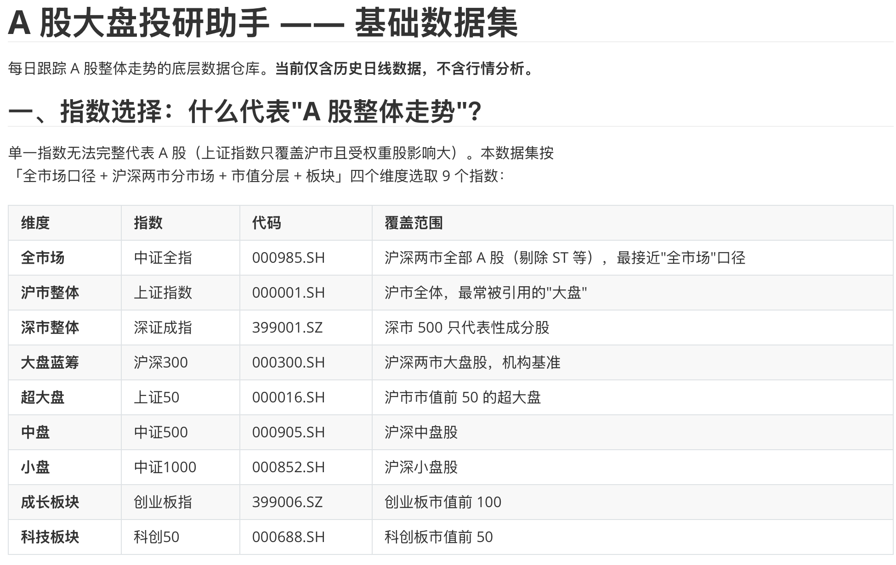
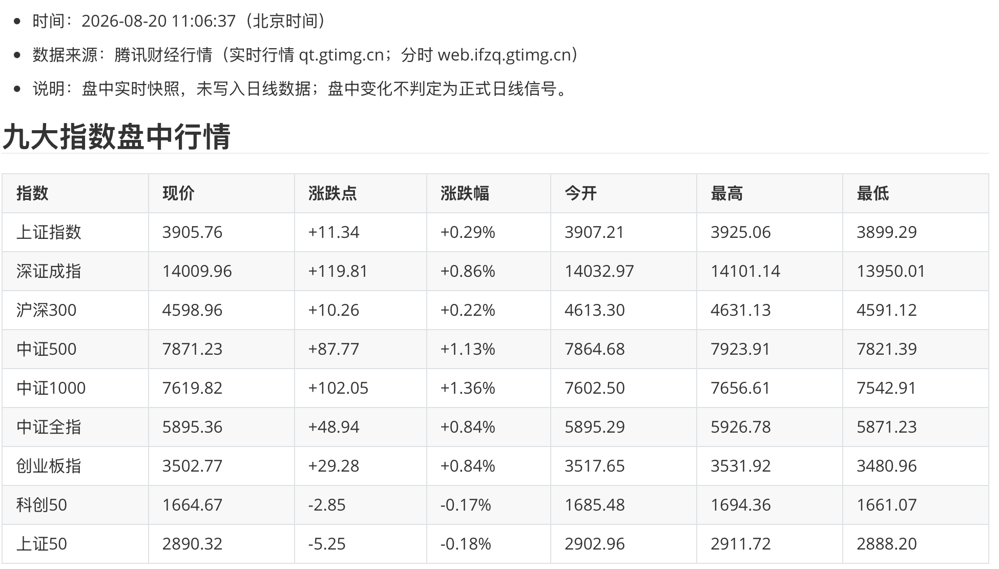

# 用 dsh 构建市场投研助手 {#ch-9}

本章演示如何用 dsh 搭建一个可以手动每日运行、也能做临时定时监控的 A 股市场投研原型。我们先整理九个指数的历史日线，再把 20 日和 60 日均线写成明确规则，用历史数据检验这条规则。最后，dsh 会生成每日市场报告，并启动一次有停止时间的盘中监控。

本次实测在 `a-share-research` 独立工作区内进行，全程使用标准模式。历史数据整理于 2026 年 8 月 19 日，盘中任务运行于 8 月 20 日。正文中的日期和数字都能在工作区文件或运行日志中找到。

这里讨论的是研究流程。行情来自公开接口，接口可能改版或中断；历史回测也不能说明未来表现。文中的信号只表示规则触发，不构成投资建议。

## 接入并整理市场行情 {#sec-9-1}

### 用一句普通需求开始

“A 股大盘”只是日常说法，无法直接下载成一条数据序列。上证指数知名度高，却只覆盖沪市；只看这一条，无法比较沪深两市、不同板块和市值层次的差异。本章先让 dsh 决定观察范围，再取数据，暂不做走势判断。

新建文件夹 `a-share-research`，把它添加为工作区，在标准模式下新开会话。第一条消息不必写安装命令或指定数据接口，只说清目的、交付物和暂时不做什么。

```text
我想做一个每天跟踪 A 股大盘的投研助手。先帮我确定用哪些指数能够代表 A 股整体走势，再获取相应的历史日线并整理到当前工作区。请说明数据来源和最新日期，暂时不要分析行情。
```

图 9-1 可以确认工作区和标准模式，第一条消息也没有预先指定数据接口。dsh 随后检查 Python 环境与已有依赖，再规划取数任务。

{width=94%}

dsh 从四个角度选择观察对象：全市场、沪深两市、市值层次和板块，最后保留中证全指、上证指数、深证成指、沪深 300、上证 50、中证 500、中证 1000、创业板指和科创 50。后面的信号规则以中证全指为主，其余八个指数用于日报中的横向观察。

{width=96%}

图 9-2 是 dsh 当时的初步分类，表中的“市值前 50”“市值前 100”等说法只是便于选择的简称，不能代替各指数的编制方案。其中，“中证全指覆盖沪深两市全部 A 股”已经不准确。中证指数公司 2026 年 4 月 30 日的[指数资料](https://oss-ch.csindex.com.cn/static/html/csindex/public/uploads/indices/detail/files/zh_CN/000985factsheet.pdf)写明，样本空间包括上交所、深交所和北交所符合条件的股票与存托凭证。本章仍用中证全指观察广泛市场表现，涉及样本范围时以指数公司当期文件为准。

指数选得多，也要逐项核对。北证 50 因本次所用接口没有返回历史数据而未单列，万得全 A 属于付费数据，也没有用一个相似代码代替。书中只采用这次实际得到的九个指数。

第一条提示词用于让 dsh 提出观察范围，不能保证每次都得到同一组接口和指数。确认方案后，应把指数名称、代码和字段写进下一条消息，并要求 dsh 先报告异常，得到批准后再修数据。本次实测没有提前限制修复权限，后面因此出现了一次未经单独确认的数据修改。

### 让 dsh 处理环境和接口故障

工作区一开始是空的，系统 Python 版本为 3.9.6，也没有 pandas、requests 和 akshare。dsh 创建虚拟环境并安装依赖。取数时，akshare 的指数映射请求失败，东方财富接口也多次出现连接问题。dsh 随后改用能够访问的数据源，并保存了可重复执行的脚本。

本次使用的数据源如下。

- 主源是腾讯财经历史行情接口，按自然年分页取数。
- 1990 至 1992 年的上证指数异常段用同花顺数据替换，深证成指的早期记录也由同花顺补充。
- 沪深 300、中证 500、中证 1000 和中证全指使用中证指数官网数据补齐或重建。
- 新浪财经只用于最近数据的交叉抽查。

取数和早期修补记录写进 `README.md`、`data/fetch_log.json` 和修补脚本。最后生成九份 `data/raw/*.csv`，字段统一为 `date、open、high、low、close、volume`，成交量单位统一为手；`data/combined_close.csv` 则把九个指数的收盘价按日期对齐。

四个中证系列指数改用官网数据重建后，`README.md`、`data/fetch_log.json` 和 `data/index_meta.csv` 没有同步更新，其中仍把中证全指写成 3,654 行。当前 CSV 与复检报告均为 3,656 行，九份文件合计 44,987 行，最新日期为 2026 年 8 月 19 日。下面统一采用当前 CSV 和复检报告的数字。

- 上证指数 `000001.SH`：1990-12-19 起，共 8,707 行；深证成指 `399001.SZ`：1991-04-03 起，共 8,662 行。
- 沪深 300 `000300.SH`：2004-12-20 起，共 5,263 行；中证 500 `000905.SH`：2007-01-04 起，共 4,770 行。
- 中证 1000 `000852.SH`：2014-10-08 起，共 2,887 行；中证全指 `000985.SH`：2011-08-01 起，共 3,656 行。
- 创业板指 `399006.SZ`：2010-06-02 起，共 3,938 行；科创 50 `000688.SH`：2019-12-31 起，共 1,608 行。
- 上证 50 `000016.SH`：2004-01-02 起，共 5,496 行。

### 再次检查数据

第一轮取数结束时，dsh 曾说数据已经通过完整性检查。这个结论下得太早。我们继续发了一条很短的检查要求，让它把日期、数值和 OHLC 关系逐项写进报告。这里漏写了“先报告，不要修改数据”。

```text
帮我检查一下刚获取的行情数据，看看日期和数值有没有重复、缺失或明显异常，并把检查结果保存下来。先不要分析走势。
```

这次 dsh 检查后直接修了数据。这个过程不宜照搬：处理自己的行情文件时，应当先生成只读检查报告，核对修复来源和范围，再单独批准修改。

检查发现了几组问题。2015 年 3 月 27 日，八个指数的 low 字段与 high 字段相同，且与交叉来源不符；中证全指在 2018 年 8 月 3 日至 24 日连续 16 个交易日出现同一个收盘值 4666.50；2018 年 10 月 23 日和 24 日还少了两条记录。dsh 用同花顺和中证指数官网交叉核对后修复数据，并把四个中证系列指数改用官网历史数据重建。

修复动作已经发生，接下来停止写入数据，只整理问题、修复动作和复检依据。我们补发下面这条要求。

```text
报告里有些历史原因没有注明来源。请重新整理检查报告，只保留数据能够直接证明的结论；需要解释原因的地方补充可核验来源，否则标成“无法核验”。把“发现的问题、采取的修复、修复后的复检结果”分开写清楚，不要再修改数据。
```

复检后，OHLC 逻辑矛盾从 53 条降为 0，2015 年 3 月 27 日的八处高低价异常降为 0，中证全指缺少的两条记录也已经补齐。图中只截取了这三项指标，完整细节保存在 `data/validation_report.md` 和 `data/validation_results.json`。

{width=96%}

复检仍有解释不了的记录。[深证成指官方资料](https://www.cnindex.com.cn/docs/jj_399001.pdf)给出的基日是 1994 年 7 月 20 日，本次数据源却提供了 1991 年至 1994 年 7 月 19 日的延伸数据。以同期上证指数日期集作参照，这段深证数据少了 18 个日期，同时包含 45 条周六记录和 54 行 OHLC 全等记录。这些现象可以从文件中直接数出，却不能证明当时的深市交易安排，也无法说明延伸数据怎样生成。复核报告把原因标成“无法核验”，没有继续修改。后面的主规则使用 2011 年开始的中证全指，不依赖这段早期数据。

## 把分析方法变成信号规则 {#sec-9-2}

行情文件整理好以后，先选一条简单方法。这里用中证全指的 20 日和 60 日均线观察趋势。原始想法只有一句话：短期均线上穿长期均线记为向上信号，下穿记为向下信号。它还缺少均线类型、窗口边界、等号处理和检验范围，直接写代码会把这些未说明的选择藏进实现里。

继续在同一会话里发送：

```text
接下来以中证全指作为主要观察对象。我想用 20 日和 60 日均线判断趋势，短期均线上穿长期均线记为向上信号，下穿记为向下信号。先不要写代码，帮我把这条想法变成可以历史检验的明确规则。如果还有适合日线数据的辅助分析方法，也列出来供我选择，但不要直接混进这条规则。有需要我决定的细节直接问我。
```

dsh 接着在界面里提出四个问题。第一题让用户在 SMA、EMA 和两套并行之间选择，其余三题确认统计口径、是否过滤信号和历史区间。这样的选择会改变信号日期和数量，应在运行前留下一份决定记录。

{width=86%}

本次选择是简单移动平均 SMA、不过滤任何穿越、使用全部历史，先统计信号和状态，不在规则定义阶段计算收益。dsh 把选择和规则保存为 `docs/ma20_60_trend_rule.md`。图中能够看到规则适用的数据范围和四项决定。

{width=96%}

规则定稿后，关键条款可以压缩成下面五条。

1. MA20 是当日及之前 19 个交易日收盘价的算术平均，MA60 同理。
2. 前 59 个交易日没有完整 MA60，不产生信号；第 60 个交易日只记录初始状态。
3. 当日 MA20 大于 MA60，且前一日 MA20 小于或等于 MA60，记为金叉。
4. 当日 MA20 小于 MA60，且前一日 MA20 大于或等于 MA60，记为死叉。
5. 两条均线相等时不记穿越，保持此前状态。

辅助方法只被列作候选，没有混入这条规则。后面的结果因此只对应 20/60 日均线。

规则文件的 R9 还预写了“将来采用交易口径时按 T+1 开盘执行”，实际回测后来选择了 T+1 收盘。信号日期没有因此改变，执行价却属于另一套假设。这次工作区没有回头覆盖 R9，下面的数字以回测报告记录的 T+1 收盘口径为准。这是现有产物的一处未同步，自己复现时应在回测前发送下面的修正要求。

```text
请修正 docs/ma20_60_trend_rule.md：规则文件只定义信号日期，删除 R9 中预设的 T+1 开盘执行价。成交时点和价格另写在回测报告的假设部分，后续按我确认的口径执行。其他规则不变。
```

### 生成信号清单和图

规则文件落地后，再让 dsh 编码。提示词保持简短，文件名和交付结果说清即可。

```text
就按刚才定下的主规则实现，先不加入其他辅助指标。生成全部历史信号清单，再画一张最近三年的走势图，标出中证全指、MA20、MA60 和信号点，保存到 signals 目录。完成后告诉我信号总数、当前状态和最近五次信号。只描述规则结果，不给投资建议。
```

脚本 `scripts/signal_ma20_60.py` 生成了 `signals/signal_history.csv`、`signals/summary.txt` 和最近三年信号图。检验区间从 2011 年 10 月 31 日到 2026 年 8 月 19 日，共 3,597 个交易日，得到 72 个信号，其中金叉和死叉各 36 次。最近三年的图中有 7 个金叉和 8 个死叉。

{width=96%}

图上的三角形只是穿越发生的位置。价格快速反向时，移动平均线会滞后；均线靠近时，也可能在较短间隔内反复穿越。看到信号点落在一段上涨或下跌附近，还不能判断规则是否有效，收益和风险要用下一节的统一口径计算。

## 用历史数据检验信号 {#sec-9-3}

信号日期已经固定，回测还需要单独定义成交时点和比较基准。本次只做多头：金叉后的次日收盘进入，死叉后的次日收盘退出；空仓收益设为 0，不计交易成本和滑点。策略与同期持续持有中证全指都从第一个完整 MA60 交易日开始，初始净值统一设为 1。

```text
现在用历史数据检验这套信号。评估从第一个完整 MA60 交易日开始，策略和同期持续持有中证全指的基准净值都设为 1。

策略只做多头。向上信号后从次日收盘开始模拟持有，向下信号后从次日收盘结束，其余时间空仓，空仓收益为 0，不计成本和滑点。请统计期末净值、年化收益率、上涨段占比和最大回撤，生成回测报告及净值曲线，保存到 backtest 目录，并说明结果的局限。
```

第一次报告把“上涨段占比”算成了持仓期间上涨交易日的比例。这个定义与我们要看的完整持有区间胜率不同。模糊指标会给出精确数字，却可能答非所问，因此要马上纠正口径。

```text
请把“上涨段占比”改成每个完整持有区间收益为正的比例。此前按持仓期间上涨交易日比例算出的数字作废。补算持有段数、正收益段数和占比，并列出收益最差的三段，更新报告和结果汇总。其他回测假设保持不变。
```

修正后的结果并不好看。36 个完整持有区间中只有 12 个取得正收益，段胜率为 33.3%。策略期末净值是 0.9186，年化收益率为 -0.57%，最大回撤为 -59.82%；同期持续持有的期末净值是 1.8857，年化收益率为 4.40%，最大回撤为 -57.85%。这套参数在本次样本里没有跑赢基准，回撤也没有改善。

{width=82%}

净值曲线把差距显示得更清楚。红线只在多头状态持有，空仓时保持水平；蓝线持续跟踪指数。2016 年以后，策略净值大部分时间在 1 附近徘徊，到样本末端低于起点，而基准仍高于起点。

{width=96%}

报告还列出收益最差的三段：2013 年 5 月 22 日至 6 月 28 日为 -14.67%，2015 年 11 月 4 日至 2016 年 1 月 14 日为 -12.31%，2018 年 1 月 23 日至 2 月 12 日为 -11.35%。这里只能确认价格与均线在这些区间给出了亏损持有段；没有补充来源时，不用宏观事件解释亏损原因。

这份回测有六项边界，需要和结果放在一起读。

- 中证全指是一条指数序列，报告中的净值不能直接兑现。使用 ETF 等工具跟踪时，还会出现跟踪误差和流动性限制。
- 回测没有计入交易费用、滑点和冲击成本，实际成本取决于所用工具。正成本会继续压低策略净收益。
- 信号在收盘后确认，次日收盘才执行，包含一个交易日的滞后。
- 空仓资金收益按 0 处理，也没有止损、仓位控制等风控规则。
- 样本只有一个指数、一组参数和 36 个完整持有段，没有做样本外检验或参数稳健性检查。
- 历史数据经过多源修补，早期回测段仍有数据口径限制；历史表现不能外推到未来。

## 定时监控并生成分析报告 {#sec-9-4}

前三节留下了数据、规则和检验结果。接下来把每日重复动作固化为 `scripts/daily_report.py`：更新九个指数的历史日线，汇总最新表现，再计算中证全指的 MA20、MA60、当前状态和最近信号，报告写入 `reports/`。

```text
把每天的例行动作固定成 daily_report.py：更新现有行情，汇总九个指数的最新表现，再按已经确定的规则计算中证全指的 MA20、MA60 和当前信号状态，在 reports 目录生成当天的分析报告。先手动运行一次，把报告全文给我看。没有新交易日就如实说明，只写数据事实和规则结果，不给操作建议。
```

### 先修正盘中数据边界

第一次手动运行发生在 2026 年 8 月 19 日晚，报告正常使用当天收盘。第二天 10:42 再运行时，接口已经返回 8 月 20 日的盘中数值，脚本却把它写进日线文件并标成“收盘”。同一天内多次运行，数值还会随盘中行情变化。这是会污染均线和回测的错误，必须在设置定时任务前处理。

```text
现在这份报告把盘中价当成了收盘价。请按北京时间判断，收盘前运行时忽略当天尚未完成的日线，只使用最近一个完整交易日；收盘后才更新当天数据。清理刚写入的 2026-08-20 盘中记录，恢复相关数据和汇总文件，然后重新运行日报，生成时间注明北京时间。
```

dsh 删除了九份 CSV 中误写入的 8 月 20 日记录，并修改日报脚本。北京时间 15:00 前运行时，请求窗口截止到前一天；15:00 后才允许请求当天数据。10:55 重跑后，报告明确写出 A 股尚未收盘，最新完整交易日仍是 8 月 19 日，本次没有新增交易日。

{width=82%}

修正后的 `reports/2026-08-20.md` 汇总了九个指数截至 8 月 19 日的收盘和涨跌幅。中证全指收盘为 5846.42，MA20 为 5855.56，MA60 为 6135.65，规则状态为空头，最近一次信号是 2026 年 7 月 15 日死叉，距报告所用数据 25 个交易日。报告只写数据事实和规则结果。

15:00 这个边界挡住了本次盘中数据污染，却不能证明上游接口已经完成日线更新。长期运行时，还要检查接口返回的交易日期，并给收盘后的数据更新留出延迟时间。

### 先手动刷新，再启动临时进程

日报使用完整日线，盘中观察则走另一条只读路径。启动临时进程前，先发一条手动刷新要求。

```text
先手动查询一次九个指数的盘中行情和中证全指分时数据，保存一张分时图。这里只读取实时接口，不要写入日线文件，也不要据此生成正式日线信号。完成后报告数据时间和文件路径。
```

11:01 的查询确认实时接口与分钟接口都能返回结果，11:02 的分时图保存到 `reports/intraday_000985_20260820.png`，九份日线 CSV 的最新日期仍是 8 月 19 日。满足这三个条件后，再启动临时进程。

手动刷新通过后，让 dsh 写出并启动一个有明确停止时间的临时监控进程。下面保留本次实测使用的 11:30；照着操作时，要把它换成北京时间的未来时刻，并至少留出两轮刷新时间。

```text
请创建一个临时盯盘任务：从现在起到今天 11:30，每隔 5 分钟刷新九个指数的盘中行情，更新中证全指分时图，并生成一份带北京时间的简短分析报告。每次结果分别保存到 reports/intraday，不要写入日线数据，也不要把盘中变化判定为正式日线信号。11:30 后停止运行，并告诉我任务配置、日志位置和清理方法。
```

dsh 写出 `scripts/intraday_monitor.py`，用纯 API 请求和 Matplotlib 的无界面绘图后端运行。11:06 的第一轮报告记录了北京时间、数据源和九个指数的盘中数值，也明确写出盘中变化不进入正式日线信号。

{width=96%}

这项任务随后在没有手动刷新的情况下继续运行。第一轮在 11:06 启动，脚本随后对齐到整五分钟，日志记录了 11:10、11:15、11:20 和 11:24 四轮。最后一轮在 11:24:59 启动，文件名因此使用 `1124`；11:30:00 到达停止条件。每轮各保存一份 Markdown 报告和一张分时图，九份日线 CSV 的最新日期仍是 8 月 19 日。

这里的“无界面”指 Python 脚本直接请求接口并用 Agg 后端绘图。它是在 dsh 会话中启动的后台进程，没有验证 dsh CLI 的 headless profile、Web schedule 插件或系统 cron。`reports/intraday/` 中的五轮快照和日志里的 11:30 停止记录，只证明这段临时进程连续运行了约 24 分钟。进程到点后自行退出，没有留下长期调度；日报目前也要手动启动。长期无人值守还要另行测试系统调度、失败重试和日志告警。
