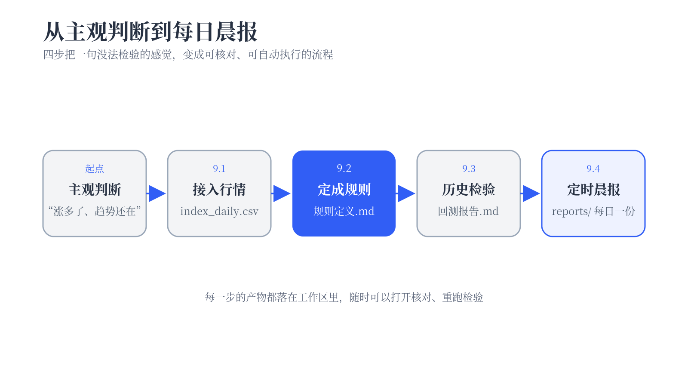
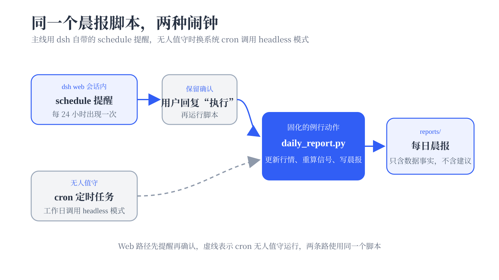

# 用 dsh 构建市场投研助手 {#ch-9}

<!-- 本稿 dsh 回复、行情数字、回测统计均未实测，占位处以「待实测」注释标出，实操后逐项回填，回填前不得视为定稿。 -->

这一章给 dsh 一连串任务，搭出一个盯着上证指数的投研助手。它会更新行情，按一条事先定好的规则判断信号状态，再把结果写成晨报。Web 端负责到点提醒，确认后运行；需要无人值守时，再交给系统定时任务调用 headless 模式。做完之后，工作区里会留下一份可持续更新的行情底库、一份历史信号清单、一份回测报告，以及可以重复生成晨报的脚本。

{width=92%}

先把定位说清楚。全章用的都是公开数据和一条公开了几十年的经典方法，跟踪对象只有上证指数这一个大盘指数，不涉及任何个股。这一章教的是把主观判断变成可检验规则的流程，产出的是数据分析练习，不构成投资建议，回测一节的末尾还会专门交代这件事。

## 接入并整理市场行情 {#sec-9-1}

一切从数据开始。跟踪对象选上证指数，理由很直接，“A 股”是几千只股票的统称，本身不是一个能直接盯的序列，盯 A 股整体只能盯一个代表它的指数，而上证指数就是新闻和闲聊里那个“大盘”，涨到哪儿跌到哪儿，人人有数。这一节让 dsh 把它的全部历史日线取到本地，落成一份 CSV，再让它对数据做一次体检。后面三节的所有结论都压在这份数据上，这一步宁可多花几分钟。

单击左侧 **Workspaces** 旁的 **Add workspace**，新建一个名为 `a-share-research` 的文件夹作为工作区，本章所有产物都会落在这里。选中它，新开一个会话，确认使用 **Standard mode**。

数据源用 akshare。这是一个开源的 Python 财经数据接口库，取指数日线这类公开数据不需要注册，也不需要密钥。它对同一份数据往往提供多个来源的接口，写作本章时实测下来，新浪来源的 `stock_zh_index_daily` 取指数日线最稳当，提示词里直接点名，免得 dsh 在不稳的接口上反复碰壁。

在输入框里输入下面的内容。

```text
这个工作区用来搭一个跟踪上证指数的投研助手，第一步先准备行情数据。

安装 akshare（需要的话自己创建 Python 虚拟环境），用它的
stock_zh_index_daily 接口取上证指数（代码 sh000001）的全部历史日线，
保存为 data/index_daily.csv。

把可重复执行的取数代码保存为 scripts/fetch_index.py，并把实际使用的
akshare 版本、数据接口、执行时间和数据来源写入 data/source.md。

完成后汇报数据的起止日期、总行数、每个字段的含义，以及最新一个交易日
的日期和收盘价。先不要做任何分析。
```

<!-- 待实测，确认 dsh 的实际执行路径后补写本段，预期动作是创建虚拟环境、安装 akshare、写取数脚本、执行并汇报，若首次因环境问题报错，如实记录它的排错过程。 -->

<!-- 截图待拍，dsh 执行取数任务的过程，消息流里能看到建环境、写脚本、运行脚本的工具调用。
图片待回填 assets/chapter9/9-1-01-fetch-running.png ｜ 说明文字 dsh 安装 akshare 并取数的执行过程 ｜ width=82% -->

<!-- 截图待拍，dsh 汇报数据概况的回复，含起止日期、总行数、字段含义、最新交易日收盘价。
图片待回填 assets/chapter9/9-1-02-data-summary.png ｜ 说明文字 dsh 汇报上证指数日线数据概况 ｜ width=82% -->

别急着进下一步，先核对两件事。打开工作区里的 `data/index_daily.csv`，看行数和字段跟 dsh 的汇报对不对得上；再拿最新一个交易日的收盘价跟公开行情页对一下，记下页面网址和核对时间。两边一致，只能说明最新记录和文件概况对得上，历史数据有没有缺行还要继续检查。

数据到手，还不知道它干不干净。停牌、假期、接口偶发的丢行，都会在日线序列里留下痕迹，这些毛病攒到回测那一步才暴露就很难查了，让 dsh 现在检查。

```text
对 data/index_daily.csv 做一次数据检查，逐项确认，日期有没有重复或乱序、
数值字段有没有缺失或明显异常、相邻交易日之间有没有可疑的大缺口，注意
区分节假日的正常空档和真正的数据缺口。

另找一份覆盖数据日期范围、并且更新到当前日期的中国内地股市交易日历，
记录日历来源和获取日期，再用它核对 CSV 是否缺少本应开市的日期。若只能
找到已经停止更新的日历，就把超出覆盖范围的日期标成“无法判断”，不要
仅凭星期一到星期五推断交易日。

把检查过程、日历来源和每一项结论写成 data/数据检查.md。不要修改数据，
只汇报。
```

<!-- 待实测，数据检查的实际结论，按实际结果修订下方读法说明。 -->

<!-- 截图待拍，dsh 汇报数据检查结论的回复。
图片待回填 assets/chapter9/9-1-03-data-check.png ｜ 说明文字 dsh 汇报数据检查结论 ｜ width=82% -->

周末和休市日没有行情，日期序列里的这些空档是正常的。工作日也可能因节假日休市，单看星期几分不出来，所以检查结果必须说明交易日历来自哪里、覆盖到哪一天。超出日历覆盖范围的部分暂时留作待核对，不能写成已经通过。

## 把分析方法变成信号规则 {#sec-9-2}

看行情的人多少都有一套自己的说法，“涨多了”“该调整了”“趋势还在”。这些说法的毛病在于没法检验，同一句“趋势还在”，十个人有十种理解，事后对了错了都无从算起。这一节做一件事，把一条大家都讲得清的经典方法逼成精确规则，让它变成可以拿历史数据检验的东西。

方法选双均线。短期均线代表最近一段时间的价格重心，长期均线代表更长时间的重心。这套方法的讲法是，短期均线从下方穿到上方，代表近期价格相对走强，反过来穿下去，代表走弱。这个讲法到底灵不灵，是下一节要检验的事，此处先不背书。选它是因为它用了几十年，没有任何秘密，参数全摆在明面上，正适合拿来演示从感觉到规则的过程。

第一步先不让 dsh 写代码。继续在上一节的会话里，让它把这个还带着模糊处的想法复述成精确定义。

```text
接下来把一条经典的双均线方法变成可以检验的规则。原始想法是，短期均线
上穿长期均线说明市场转强，下穿说明转弱，短期用 20 日，长期用 60 日。

先不要写代码。把这个想法复述成一条精确的规则，说清楚均线用哪个价格、
按什么方式计算，"上穿"和"下穿"的确切判定条件是什么，信号记在哪一天。
我没说清楚、需要我拍板的地方，列出来问我。
```

<!-- 待实测，dsh 的复述与追问内容。 -->

<!-- 截图待拍，dsh 把双均线想法复述成精确规则的回复，最好能看到它主动列出的待确认点。
图片待回填 assets/chapter9/9-2-01-rule-restate.png ｜ 说明文字 dsh 把想法复述成精确规则 ｜ width=82% -->

这份复述值得逐条读。均线用收盘价还是典型价、窗口含不含当日、两线恰好相等算不算穿越、信号算在穿越当天还是第二天，每一条都会改变后面的回测结果。原来那句“短均线上穿长均线”里藏着这么多没说死的地方，这正是感觉和规则之间的差距。有分歧就回复 dsh 修改定义，直到这条规则精确到任何人拿着它，都能在同一份数据上标出同一批信号。

规则定了，让 dsh 实现。

```text
按刚才确认的规则实现。先把最终确认的规则定义完整写成 signals/规则定义.md，
后面的每一步都以这份文件为准。

然后计算 20 日和 60 日均线，在全部历史数据上标出所有向上信号和向下信号，
生成一份信号清单，包含日期、信号方向、当天收盘价，保存为
signals/信号清单.csv。清单还要保留当天的 20 日和 60 日均线值，方便
逐条复核，并汇报信号总数和最近五条信号。

再画一张最近三年的走势图，包含收盘价、两条均线和全部信号点的标记，
保存为 signals/近三年信号图.png。

这些信号只是规则的触发记录，下一步要拿历史数据检验，所有输出里都不要
出现买卖建议的措辞。
```

<!-- 待实测，信号总数、清单形态、图的实际样子。 -->

<!-- 截图待拍，dsh 汇报信号清单的回复，能看到信号总数和最近几条信号。
图片待回填 assets/chapter9/9-2-02-signals-list.png ｜ 说明文字 全部历史信号清单生成完毕 ｜ width=82% -->

<!-- 截图待拍，signals/近三年信号图.png 成品，可直接把产物图片复制进 assets 使用。
图片待回填 assets/chapter9/9-2-03-signal-chart.png ｜ 说明文字 最近三年的价格、均线与信号标记 ｜ width=86% -->

打开信号图看一眼。<!-- 待实测，按实际图形补写一两句读图说明，例如信号点是否落在肉眼可见的转折附近、震荡期有没有密集的假信号。 -->顺手把信号清单的用词核一遍，里面应当只有“向上信号”和“向下信号”，出现任何买卖字样，就让 dsh 照着提示词里那条纪律改掉。这些信号是规则的触发记录，是下一节的统计对象，规则本身靠不靠得住，此刻还没有任何证据。

## 用历史数据检验信号 {#sec-9-3}

规则写清楚了，它在历史上到底表现如何还不知道。回测回答的就是这个问题，假设过去这些年每一次信号都照规则执行，结果会怎样，最好的时候怎样，最差的时候又怎样。继续在同一个会话里做。

规则本身简单，回测结果却很受执行细节影响。本章把执行价统一定为信号次日的收盘价。均线要等到信号当天收盘后才能确认，若按当天收盘价成交，就用到了当时还不能执行的信息。次日开盘价也可以作为另一种口径，这里选次日收盘价，只为让全章使用同一条可复核的规则。回测还需要一条同期持有基准。策略净值和基准放在一起，才能看出这条规则有没有带来不同结果。

```text
对 signals/信号清单.csv 做一次历史回测，信号定义以 signals/规则定义.md
为准，行情数据用 data/index_daily.csv，回测规则如下。

只做一个方向，出现向上信号后，从信号次日的收盘价开始计入持有，直到
向下信号出现后的次日收盘价结束，其余时间空仓。不考虑交易成本和滑点，
每段持有都用全部资金模拟，资金在各段之间连续滚动。

以 60 日均线第一次有完整窗口的日期作为评估起点，策略和基准都在这一天
把净值设为 1，并使用完全相同的截止日期。策略在第一个向上信号出现前
保持空仓，空仓期净值不变。若截止日仍在持有，用最后一个收盘价计算期末
净值，并在报告里标注这是一段尚未出现退出信号的持有。

统计以下内容，持有段数、每段的涨跌幅、上涨段占比、全程累计净值、最大
回撤，并和同期从头持有到尾的基准做对比。把统计结果和一张净值对比图
整理成 backtest/回测报告.md，图片保存在 backtest/ 目录下。

报告结尾单独加一节，列出这条规则表现最差的两三个时间段，说明当时的
行情是什么样子。只根据价格和均线数据描述行情形态；若要解释宏观或政策
原因，必须补充可核对的来源，否则不要猜原因。
```

<!-- 待实测，回测统计结果，全部数字以实跑为准。 -->

<!-- 截图待拍，dsh 完成回测后的汇报，能看到持有段数、上涨段占比、累计净值、最大回撤等关键数字。
图片待回填 assets/chapter9/9-3-01-backtest-report.png ｜ 说明文字 dsh 汇报回测统计结果 ｜ width=82% -->

<!-- 截图待拍，backtest/ 下的净值对比图成品，可直接把产物图片复制进 assets 使用。
图片待回填 assets/chapter9/9-3-02-equity-curve.png ｜ 说明文字 双均线规则与基准的净值对比 ｜ width=86% -->

<!-- 待实测，拿到真实统计后补写两三段解读。解读必须同时覆盖规则占优的时段和失灵的时段，禁止只挑好看的数字。 -->

报告末尾那几个最差时段值得单独看。<!-- 待实测，结合真实报告补写，预期是震荡行情里两条均线反复缠绕，产生一串买高卖低的假信号。 -->一条规则的价值判断离不开它的失灵样本，只展示顺风局的回测，等于什么都没检验。

最后把限制写清楚。**本章全部统计都来自公开历史数据，历史表现不代表未来。回测没有计入交易成本和滑点，在其他条件相同的情况下，计入这些成本通常会降低收益。双均线在这里只是一个教学例子，用来演示方法如何变成规则、规则如何被数据检验。这一章教的是流程，不构成投资建议，任何真实的交易决定都请独立判断、自担后果。**

## 定时监控并生成分析报告 {#sec-9-4}

前三节的每一步都是人发出任务，dsh 接着执行。最后要把“生成晨报”固定成可重复运行的脚本，再安排触发时间。dsh 自带的 schedule 插件适合在 Web 会话里到点提醒，真正无人值守的执行放在本节末尾，用系统 cron 调用 headless 模式。schedule 随安装包一起装在本地，只是默认没有接进 Web 界面的插件链。用第 2.3 节学过的补丁层把它接上，一小段配置就够。

### 挂载 schedule 插件

打开 `$DSH_HOME/profiles/web/cordis.patch.yml`，在文件末尾追加下面的内容。

```yaml
- insert:
    - id: schedule
      name: '@deepseek-ai/dsh-schedule'
```

保存后重启 dsh。跟第 2 章那次装插件相比这里少一步，schedule 的插件包本来就随 dsh 装好了，不需要执行任何安装命令，接进插件链就是全部。插件只监听加载后创建的 live 根 Agent，不会回头扫描加载时已经在运行的 Agent。为免混淆，回到 `a-share-research` 工作区后新开一个会话，再输入下面的内容。

```text
列出当前所有定时提醒。
```

<!-- 待实测，schedule_list 在界面上的实际形态。 -->

<!-- 截图待拍，dsh 调用 schedule_list 返回空清单的回复，证明定时工具已经挂载。
图片待回填 assets/chapter9/9-4-01-schedule-list.png ｜ 说明文字 schedule 插件挂载成功，定时提醒清单为空 ｜ width=82% -->

消息流里出现名为 `schedule_list` 的工具调用，返回一份空清单，说明定时能力已经就位。

### 把晨报动作固化成脚本

到点之后让 dsh 干什么，得先固化下来。零散的口头任务每次执行都可能走样，而且这是一个新会话，9.2 那轮对话里的规则它并不知道，好在规则已经落成了文件。先让它把晨报动作写成脚本，手动演练一次，看着产物没问题再交给定时器。

```text
把每天早上的例行动作固化成一个脚本 daily_report.py，执行三件事，用
akshare 把 data/index_daily.csv 增量更新到最新交易日，按
signals/规则定义.md 里确认过的双均线规则重算最新的信号状态，在
reports/ 下生成一份以运行日期命名的晨报。更新时按日期去重并保持升序，
不要覆盖已有历史记录。

晨报只陈述数据事实，包含最新收盘价和当日涨跌幅、20 日和 60 日均线的
当前数值、当前处于向上还是向下信号区间、距离上一次信号过去了多少个
交易日，并写明行情数据实际更新到哪一天。当天没有新增行情时如实说明，
不写任何操作建议。

写完手动执行一次，把生成的晨报全文给我看。
```

<!-- 待实测，脚本实现与第一份晨报的实际内容。 -->

<!-- 截图待拍，手动演练生成的第一份晨报全文。
图片待回填 assets/chapter9/9-4-02-first-report.png ｜ 说明文字 手动演练生成的第一份晨报 ｜ width=82% -->

拿到晨报先读一遍，除了核对数字，还要核用词，里面只该有最新收盘、均线位置、信号状态这类数据事实，发现任何建议式措辞，就让 dsh 回去改脚本。这条边界要靠脚本守住，往后每天的报告都是它生成的。

### 建立定时提醒

演练通过，建定时提醒。schedule 允许的最短固定间隔是 5 分钟，正好先建一个演示用的短间隔提醒，当场看一次触发，再换成正式的每日提醒。

```text
建一个演示用的定时提醒，每 5 分钟一次，提醒内容是“晨报时间到了，
请提醒我确认是否执行 daily_report.py”。建好后告诉我这条提醒的编号。
```

等上 5 分钟，别关页面。schedule 会把到期内容作为提醒呈现在原会话里，不保证把提醒文本当成一条新的执行指令。看到提醒后回复“执行”，再让 dsh 运行脚本并汇报晨报要点。<!-- 待实测，提醒在 Web 消息流里的实际表现，以及回复“执行”后的运行过程。 -->

<!-- 截图待拍，5 分钟后会话出现提醒，用户回复“执行”后 dsh 运行脚本并汇报晨报要点。
图片待回填 assets/chapter9/9-4-03-reminder-fired.png ｜ 说明文字 定时提醒触发并经确认后执行晨报任务 ｜ width=84% -->

亲眼看到触发之后，把演示提醒换成正式的。固定间隔按创建时刻对齐，每 24 小时的提醒想固定在早上出现，就在早上建它。

```text
把刚才的演示提醒删掉，重新建一个每 24 小时触发一次的提醒，提醒内容是
“晨报时间到了，请提醒我确认是否执行 daily_report.py”。
```

<!-- 截图待拍，演示提醒删除、每日提醒创建成功的回复。
图片待回填 assets/chapter9/9-4-04-daily-created.png ｜ 说明文字 每日晨报提醒创建完成 ｜ width=82% -->

### 无人值守的替代路径

有一条限制必须说明白。schedule 的提醒只在原会话处于 live 状态时准点触发，电脑关机或者进程退出，到点不会有任何动静。下次启动 dsh 并恢复这个会话时，周期提醒只补上错过的最新一次，更早的积压不会回放。它负责提醒，也保留一次人工确认。想要真正的无人值守，换系统自带的 cron 来触发，用 dsh 的 headless 模式单任务执行，跑完即退。

```sh
30 8 * * 1-5 cd <工作区绝对路径> && <npx绝对路径> -y @deepseek-ai/dsh@<实测版本> --profile headless "执行 daily_report.py，把生成的晨报全文打印出来" >> <日志绝对路径> 2>&1
```

<!-- 已实测（写作机 2026-08-18），headless 在工作区目录执行 daily_report.py 并打印晨报全文，退出码 0，crontab 这段可定稿；留痕见 dsh-work/第九章/实测记录/step10-cron兜底.log。 -->

这行 crontab 的意思是每个周一到周五早上八点半，进入工作区目录，让 dsh 执行一次晨报任务，输出追加到日志文件里。尖括号里的三处内容都要替换。`npx` 的绝对路径可以用 `which npx` 查询，dsh 版本使用本章实测的版本，避免定时运行时突然换到新版本。cron 的 `1-5` 只表示工作日，遇到法定休市日照样会运行，`daily_report.py` 必须根据实际数据日期说明当天有没有新行情。schedule 的固定 24 小时间隔则会在周末继续提醒。headless 模式没有界面，适合服务器或者常开的机器；桌面机常开 dsh Web 时用 schedule 提醒，确认后再跑，无人值守的机器用 cron。

{width=90%}

到这里，投研助手齐了。行情底库、信号规则、回测报告和晨报脚本都落在这一个工作区里，Web 提醒与无人值守任务各有一条可选路径。把跟踪对象换成别的指数，或者换一条公开透明的分析方法时，数据字段、规则定义和回测边界都要重新核对，不能只替换名称。
