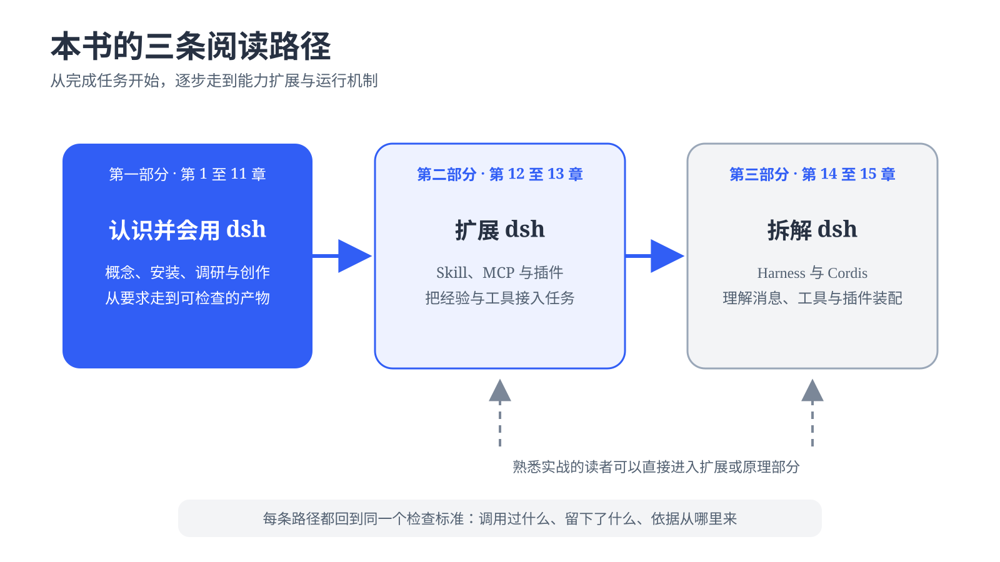

# 导言 {.unnumbered #content-intro}

很多人第一次接触 Agent，会先盯着最后那段回答看。回答写得顺，似乎任务就完成了。真正拿它处理工作，很快会遇到另一套问题：资料从哪里来，工具有没有运行，文件写到了哪里，结果出错后怎样继续，换一次会话还能不能复用这次经验。这些过程决定了 AI 最后交出来的是一段文字，还是一份可以接着使用的成果。

DeepSeek Harness（简称 dsh）提供了一个观察这些过程的机会。它在本地运行，能接入模型、工具和文件系统，也会留下会话与执行记录。读者可以看到 Agent 怎样领取任务、调用能力、处理失败并交付文件。对于想进一步改造系统的人，dsh 的插件结构又把 Skill、MCP、工具、模型适配器和运行流程放在同一张可以拆装的图里。

这本书因此从真实任务出发。书中的操作步骤和截图来自实际运行结果，命令、界面状态与最终文件都可以逐步核对。我们会做调研、办公、飞书协作、内容制作、求职辅助、市场投研和代码审查，也会写插件、观察 Agent 反复评测自己的作品，最后进入源码，弄清 Harness 与 Cordis 怎样支撑前面的动作。

本书主要写给希望用 AI 完成实际工作的普通读者。你不需要先懂 Agent 架构，可以从安装开始照着做。熟悉开发的读者也能把它当作 dsh 的实践地图，先找扩展点和运行机制，再回到案例里看这些机制怎样落到一次完整任务中。

## 从哪里开始读 {.unnumbered #content-reading-path}

**全书沿着“先认识并会用、再扩展、最后拆解”的顺序展开。** 第一部分“玩转 dsh”先用第 1 章说明 Agent、Harness、dsh 与 Alive Harness 的关系。第 2 章开始安装 dsh、接入模型并完成第一个任务，后面逐步进入调研、办公、创作与协作实战。这里关心任务怎样落地，要求如何表达，工具如何调用，产物存在哪里，结果出了偏差又该从哪里查起。

{width=92%}

第二部分“扩展 dsh”介绍 Skill、MCP 和社区插件，带你写出自己的插件，并观察 Agent 怎样通过反复评测改进能力。已经熟悉 Agent 工具的读者，可以从这一部分开始，把现成能力换成自己的流程。第三部分“拆解 dsh”回到系统内部，讲清 Harness 怎样组织消息、上下文、工具与执行过程，以及 Cordis 怎样把组件装成一个能够运行和变化的整体。

阅读时不妨保留一个习惯：**不要只看 Agent 最后说了什么，还要看它调用过什么、留下了什么，依据从哪里来。** 后面的章节会尽量把过程摆在明处。你可以从头实践，也可以先挑一个眼下用得上的案例。检查标准始终一样，AI 要把事情做完，做过的事也要经得起回看。
