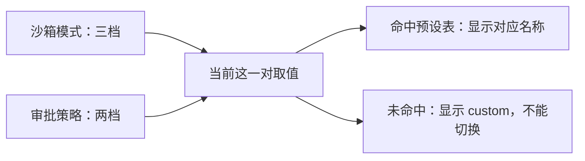

# dsh 的安全边界 {#ch-10}

从第 1 章开始，输入框旁边一直挂着一个写着“Workspace Write”的下拉框，偶尔会跳出一个权限确认弹窗。8.3 把它放过去了，说裁决站在执行之前，具体怎么裁留到这里。这一章把这个下拉框整个拆开，两个旋钮各自管什么，边界划在哪儿，以及一件更要紧的事，当 DSH 拿不准的时候它会怎么做。

## 沙箱模式：文件效果的硬边界 {#sec-10-1}

第一个旋钮叫沙箱模式，三档，`read-only`、`workspace-write`、`danger-full-access`。

它的定义范围窄得出乎意料，**只管文件系统效果**（`docs/subsystems/sandbox.zh.md` 第 11 行）。`read-only` 要求后端拒绝一切写入，但仍然会放行 `/dev/null` 这类 shell 跑起来就必须有的接收器，不然一条最普通的命令都执行不了；`workspace-write` 在此之上允许写工作区根目录，外加后端自己承诺的一块临时区域；`danger-full-access` 绕过隔离。

第三档的实现方式值得单独说一句，它不是“把沙箱调到最松”，而是**根本不进沙箱**。只有前两档会被送给提供方，`danger-full-access` 的消费方直接 spawn 原始的 argv，压根不调用 `ctx.sandbox`（同文第 23 行）。所以这一档不存在“沙箱漏了”这种说法，它本来就没在场。

策略是**按每次调用解析并携带**的，不是固定在提供方身上。这个设计带来一个不太直观但很实用的性质，同一时刻两个消费方可以在不同的边界下运行，比如 bash 跑在只读模式下，同时一个受限的子 agent 需要它自己的状态目录可写。模型申请提权、你点了同意之后的那次重试，在这套模型里是一次全新的调用，带着一份更宽的策略，而不是把提供方的状态改了。工作区根目录从调用会话那个不可变的 cwd 派生，先按文件系统语义规范化，再做词法规范化，所以一个路径里带着 `symlink/..` 的 cwd，标识的是进程真正会落脚的那个目录。

后端是分平台的，Linux 上是 bwrap 或 Landlock，macOS 上是 Seatbelt，Windows 上是 ACL 受限令牌。DSH 不假装它们一样强。后端要如实报告这次隔离的完整性，`full` 表示这个模式承诺的文件效果全都管住了，`partial` 表示活跃的后端或者偏旧的内核 ABI 只管住了其中一部分，要求绝对边界的调用方不许把 `partial` 当 `full` 用（同文第 30 行）。当前已知会落进 `partial` 的情形有两类，偏旧的 Landlock ABI，以及 Windows ACL runner 在 Everyone 和硬链接上的边界。

这不只是纸面上的可能。写这一章用的这台 Linux 机器就在这一档，随便让 DSH 跑一条 bash 命令，展开轨迹看那次调用的原始返回，末尾跟着一行 `landlock-run: partial enforcement (older Landlock ABI)`，它在明说这次隔离打了折扣。装了 bubblewrap 的机器上 DSH 会优先挑它，那条线是 `full`，这行提示就不会出现。

还有一个容易被忽略的细节。一条命令跑失败了，可能是隔离生效把它拦下来了，也可能是沙箱 runner 自己在执行之前就崩了，这两件事的含义完全相反。DSH 要求消费方先判后者，把它当成基础设施故障上报，而不是当成任务失败（同文第 118 行）。判断依据也不含糊，每个后端报告自己的**拒绝方言**，bwrap 的只读绑定产生 EROFS 那套文本，Landlock 产生 EACCES，Seatbelt 产生 EPERM，消费方只拿本次选中的后端的方言去匹配，而不是拿一个跨后端的并集，因为并集会声称某个后端根本不会产生的拒绝。

最后把边界划清楚。沙箱模式管文件效果，**网络和进程可见性不在它的定义范围内**。把权限调成只读，能挡住 DSH 改你的文件，挡不住它把已经合法读到的内容通过网络发出去。这一层机制本来就不负责这件事，换哪个预设都一样。真在意这一点的场景，得靠机器本身的网络策略去管，指望这个下拉框是指望错了地方。

**亲手验证**，在 `dsh --profile web --dump-config` 的输出里找 `- id: sandbox-policy`，它的 `config` 里有两行，`mode` 写着 `!!js process.env.DSH_PERMISSION_MODE ?? 'workspace-write'`，`workspaceRoot` 写着 `!!js process.cwd()`。这两行把本节两个最重要的事实摆在明面上，默认模式是工作区可写、可以由环境变量顶掉，而工作区边界就是你启动 DSH 时所在的那个目录。再让 DSH 随便跑一条 bash 命令，展开轨迹看原始返回的末尾，如果出现 `partial enforcement` 那行提示，说明你这台机器上的隔离也打了折扣。

## 审批策略与权限预设 {#sec-10-2}

第二个旋钮叫审批策略，只有两档，`ask` 和 `never`。

它回答的是另一个问题。沙箱管的是“这个进程能碰到哪些文件”，审批管的是“这一个具体操作要不要放行”。后者的结果是一个闭合的四值，`allowed-once`、`rejected`、`cancelled`、`unavailable`，调用方只认第一个，其余三个一律按拒绝处理（`docs/subsystems/approval.zh.md` 第 21 行）。名字里的 `once` 是字面意思，一次批准只授权被问的那一个操作，下次再来还得再问。

两档策略的区别在于交互式应答者跑起来之前发生了什么。`ask` 把问题委托给组装好的应答者链，链上一个应答者都没有的时候，问题会一路落到那个 fail-closed 的 `unavailable`；`never` 更干脆，一次都不问任何人，每个请求确定性地返回 `rejected`，连应答者都不分发。文档给 `never` 的定位是严格的无人值守姿态，CI 和自动化任务用的就是它。

生效的策略值不是一个内存里的开关，是**会话日志里最后一条 `approval/policy` 事件**，没有这条就回退到服务配置。写入路径只有一条 `setApprovalPolicy()`，所以任何一次改动都能从日志重建出来。这正是 8.2 那条铁律在权限这一侧的落地，你什么时候把权限放宽了、什么时候又收回去，是一件可以事后回放核对的事，而不是一个说不清的界面状态。

两种策略还会把自己当前的完整含义贡献进那份运行时上下文快照。审批状态一变，DSH 在保留的历史后面追加一份新的完整快照，而**不是回头改写请求头里的系统提示词**（同文第 49 行）。8.4 讲缓存的时候说过，前缀一动其后全废，权限这种随时可能改的状态如果写在系统提示词里，每改一次就把整段缓存作废一次。追加一条新的、带来源标注的用户消息，模型照样看得见当前权限，缓存前缀却纹丝不动。

审批请求本身还有一处克制的设计。它带着 agent、工具名和这次调用的 `callId`，唯独**不带工具参数**。原因是应答者可以凭 `callId` 把确认框直接挂到界面上那次已经流式输出的工具调用上，而不必再渲染一份可能跟真实参数对不上的副本（同文第 53 行）。你点“允许”的时候，看的就是它真要执行的那一次，中间没有第二份数据。

现在把两个旋钮合起来。界面上那个下拉框其实是一层薄薄的**权限预设**，把沙箱模式和审批策略捆成具名的一档。随包发的三档在配置里写得明明白白。

```yaml
presets:
  read-only:
    sandbox: read-only
    approval: ask
  workspace-write:
    sandbox: workspace-write
    approval: ask
  danger-full-access:
    sandbox: danger-full-access
    approval: never
```



图里最下面那个 `custom` 需要解释一句。它不是第四档，是**派生出来的状态**。DSH 每次都从两个旋钮的实际生效值反推当前属于哪一档，反推不出来就报 `custom`。界面可以把它显示成当前值，但它永远不是一个可以切过去的目标（`docs/subsystems/permission-presets.zh.md` 第 48 行）。什么时候会出现这种状态，比如你在配置里把审批策略单独调成了 `never`，沙箱却还停在 `workspace-write`，这个组合不在随包的三档里，界面就只能如实说一句“自定义”。

还有一件事值得点破，**预设层自己不拥有任何强制执行**。它不是一个凌驾在两个旋钮之上的权限总开关，切一次预设只是记录一次意图，然后通过每个旋钮各自的规范写入路径落下去，真正执行的时候读的仍然是各自那份折叠结果（同文第 5 行）。这跟 9.1 那条“没有特权内核”是同一个脾气，连权限选择器都不给自己开后门。

**亲手验证**，在 `--dump-config` 输出里找 `- id: permission`，能看到上面那张三档表原样躺在配置里，任何一档都可以在你自己的 patch 里改掉或者加一档。再往上找 `- id: approval`，它的 `policy` 是一个表达式，只有当 `DSH_PERMISSION_MODE` 等于 `danger-full-access` 时才是 `never`，其余情况都是 `ask`。两个旋钮的默认值同源于一个环境变量，这就是启动时那一档从哪儿来的答案。

## fail-closed：dsh 的保守默认 {#sec-10-3}

前两节反复撞见同一种处理方式，拿不准的时候答案是“不行”。这套姿态有个名字，fail-closed，出问题时闭合，而不是敞开。它散落在 DSH 各处，值得集中看一遍。

审批那一侧最典型。应答者缺失、不负责这个请求、抛了异常，或者返回了一个不合规的结果，统统归成 `unavailable`，而 `unavailable` 按拒绝处理（`docs/subsystems/approval.zh.md` 第 21 行）。注意这里的分寸，一个坏掉的应答者不会被跳过去找下一个，也不会被当成默认同意，它只会让这次请求变成拒绝。

沙箱那一侧写得更硬。`ctx.sandbox.confine()` 只有两种结局，要么返回一条真能强制隔离的命令，要么抛出 `SANDBOX_UNAVAILABLE`。本机一个能用的隔离后端都找不到的时候，DSH 宁可让这条命令彻底失败，也不会悄悄降级成不隔离照跑，文档给这条规矩的措辞是“静默的无隔离透传永远不合法”（`docs/subsystems/sandbox.zh.md` 第 154 行）。上一节说的 `partial` 也是同一种诚实，管住了一部分就说管住了一部分，不许四舍五入成 `full`。

工具并发也遵循这条。只有工具自己明确声明“我在并发环境下是安全的”（`isConcurrencySafe: true`），调度器才会把它和别的调用并行跑，这个声明缺失、抛错，或者返回值不是严格的 `true`，一律按独占对待，宁可慢一点也不冒险。

配置这一侧则是尽量早地失败。权限预设服务要求下面必须垫着一个真施加隔离的 bash 执行器，如果你把它组合在一个不施加隔离的执行器之上，插件加载的时候就抛异常，而不是等到某次真要拦的时候才发现拦不住（`docs/subsystems/permission-presets.zh.md` 第 44 行）。第 12 章会讲的 agent preset 也是这个路子，一份坏掉的 preset 会被列出来并带上原因，而不是从列表里悄悄跳过，因为跳过的目录仍然占着那个 id，界面上却什么都看不到，你连删都不知道该删什么。

但 fail-closed 不等于凡事都靠拒绝。有一类保守做在了别处，不挡你的路，只是不给不该给的东西。DSH 起子进程时用的是一份洗过的环境变量，名字里带 `KEY`、`PASSWORD`、`SECRET`、`TOKEN` 的一律不往下传，所有 `DSH_*` 开头的也一并去掉，`PATH`、`HOME`、语言环境和代理设置照常保留，子进程里的命令行工具该怎么跑还怎么跑（`packages/subprocess/subprocess/src/index.ts` 的 `scrubbedParentEnv()`，注释里写明了意图，harness 自己的 `DEEPSEEK_API_KEY` 不能隐式漏进被启动的进程）。你确实需要往下传某个凭据的时候，走显式声明那条路，它在洗过之后才合并进去。同一个脾气还体现在临时文件上，spill 文件和临时文件放在权限 0700 的私有目录里，用随机文件名，以独占且仅所有者可访问的方式打开，因为可预测又全局可读的路径会引出符号链接竞态和信息泄露（`docs/defensive-patterns.zh.md` 第 29 行）。

把这些凑在一起看，能看出一条挺一致的产品判断。DSH 在“可能挡了你的正事”和“可能悄悄干了件你没同意的事”之间，一律选前者，并且尽量让被挡的那一下看得见、说得清是哪一层挡的。

**亲手验证**，这个实验只花一次工具调用，效果却很直接。确认你已经在设置里配好了 DeepSeek 的 API Key，然后让 DSH 执行一条命令把自己的环境变量打出来，比如 `printenv | grep -i -E 'key|token|secret'`。它拿到的那份环境里不会有你的 API Key，也不会有 `DSH_` 开头的任何一项，尽管这个 key 此刻确实配着、DSH 自己也正在用它跟模型说话。模型能调 bash，不等于模型能顺着 bash 摸到 harness 的凭据，这条界线是上面那个正则划出来的。
